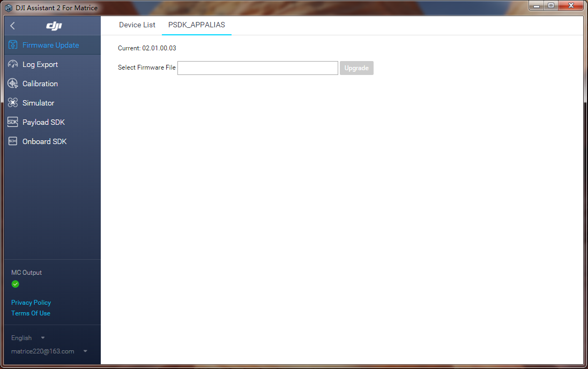
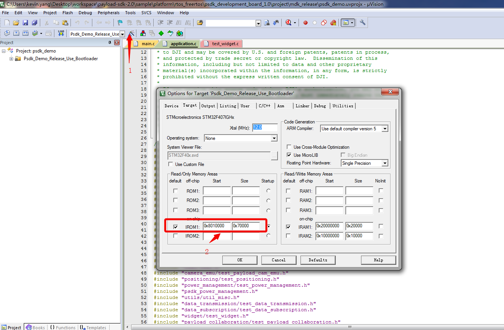

## Overview
Upgrade is the function for upgrading the firmware of the payload. Developers can use the upgrade to facilitate users to select the paylocal firmware file to update the payload by DJI Assistant 2.

> **NOTE** Only Matrice 300 RTK supports user use this function.

## Protocol
Develop with the Upgrade, user should call the interface `PsdkUpgrade_Init` to specify the transmission protocol and other configures.

#### Using FTP 
PSDK supports developers use the FTP to transfer the firmware to payload. Befor using FTP developer need deploy the FTP servers, for details, please refer to  <a href="#1"> Deploy FTP Server </a>.

> **NOTE** 
> * The payload only developed based on the Linux support developer transfer the firmware using the network port by the FTP.
> * When transfer the firmware of the payload, the account is: `psdk_payload_ftp `and the password is` DJi _ # $ 31FTP`.

#### Using DCFTP 
DCFTP, DJI Common File Transfer Protocol, is DJI's file transfer protocol. When using the DCFTP to upgrade the firmware of the payload device, please refer to `T_PsdkUpgradeDcftpFileTransferOpt` and initialize the function when calling the` PsdkUpgrade_Init()`.

> **NOTE**
> * The payload without network port or developed on the RTOS could use this method transfer the firmware;
> * The speed of DCFTP is slow than the FTP because using command signal channel transmit the firmware.


## <p id=1>Deploy FTP Server</p>
The step of deploy the FTP server is as follows:
#### 1. Install FTP Server

1. Download vsftpd [Package]( https://security.appspot.com/downloads/vsftpd-3.0.3.tar.gz)；
2. Install the vsftpd:
   > **NOTE** The full steps of the installation is in the fold `INSTALL`。

   * Use`tar -zxvf vsftpd-*.*.*.tar.gz` uninstall the package
   * Enter the `cd vsftpd-*.*.*/`
   * Install the FTP server is as follows：
   ```c
    make
    su
    cp vsftpd /usr/local/sbin/vsftpd
    cp vsftpd.conf.5 /usr/local/man/man5
    cp vsftpd.8 /usr/local/man/man8
    cp vsftpd.conf /etc
   ```
3. Creat secure_chroot_dir directory:`mkdir /usr/share/empty`

#### 2. Config FTP Server
1. Modify the configuration：
   * Change the `anonymous_enable` to NO, in the `/etc/vsftpd.conf` 
    ```c
     anonymous_enable=NO
    ```
   * Set the configuration:
    ```c
    local_enable=YES
    write_enable=YES
   ```

2. Add the user
* Use command `adduser` and `--home` specified the directory of the user
* Use command `userdel -r` delete the user
* Add the permission：`adduser psdk_payload_ftp --home /upgrade`
* Enter the key:DJi_#$31

#### 3. Run the FTP server
1. Use command `sudo /usr/local/sbin/vsftpd &` run the FTP server
2. Config the starup: add the `/usr/local/sbin/vsftpd &` in the `/etc/rc.local`
3. Check the status of the server use the command 
`ps aux | grep vsftpd`

## Develop The Upload Function 

#### 1. Initialization 
Before using the "Upgrade", please initialize the upload module.

```c
T_PsdkReturnCode PsdkUpgrade_Init(const T_PsdkUpgradeConfig *upgradeConfig);
```

#### 2. Enable The Upgrade
Before using the upgrade, developer must enable the upgrade of the payload after that DJI Assistant 2 will display the upgrade interface of the payload and user could select the firmware to upgrade the payload.

```c
T_PsdkReturnCode PsdkUpgrade_EnableLocalUpgrade(void);
```

#### 3. Workflow
Developer need implement the function of the upgrade according to the structure `T_PsdkUpgradeHandler`, and registers the callback function `PsdkUpgrade_RegHandler()`, after that, user could implement the massage push function`PsdkUpgrade_PushUpgradeState`.

## Using The Upgrade
#### Run The Payload’s Program

Please refer to [Run The Sample](../quickstart/run-the-sample.html) before compiling the payload‘s program with "Upgrade".

###### Adjust The Environment (Linux)
Before using the upgrade, developer need set the payload’s program start's default.

1. Copy the compiled application to the`/usr/local/bin/`;
2. Add the configuration in the `/etc/rc.local`:
   * `chmod 666 /dev/ttyUSB0`
   * `chmod 755 /usr/local/bin/psdk_demo`
   * `/usr/local/bin/psdk_demo &`
  > **NOTE** ttyUSB0 is the serial device connected to the payload, the developer can modify the name according to the actual situation.

 3. Restart the payload and use the command`ps aux | grep psdk_demo` check the status of the program.

###### Adjust The Environment (STM32F4)
If developer want to use the upgrade on the STM32F4, please [burn the bootloader into the development platform](../quickstart/development-environment.html), the directory `STM32F4Platform` could be `psdk_development_board_1.0` or `stm32f4_eval` as below.

1. Burn the Bootloader into the development platform, the project directory is `sample/platform/rtos_freertos/STM32F4Platform/project/mdk_bootloader `
2. Burn the firmware into the development platform, the application firmware directory is `sample/platform/rtos_freertos/STM32F4Platform/project/mdk_release`

> **NOTE**
> * Bootloader is thr program that the MCU is powered on and used to update the firmware and execute the application firmware.
> * Application Firmware: Implement the software function of the payload, and compile the Payload SDK Lib.

#### Compile The Firmware
1. Modify the firmware‘s version     
Modify the firmware's version number in the `sample/api_sample/test_upgrade_common.h`.

> **NOTE** The version number cannot lower than the current version, for example the current firmware version number is V02.01.00.03, the firmwar's version must is V02.01.00.04, show's below.

```c
// firmware version
#define PSDK_TEST_FIRMWARE_VERSION_MAJOR        2
#define PSDK_TEST_FIRMWARE_VERSION_MINOR        1
#define PSDK_TEST_FIRMWARE_VERSION_MODIFY       0
#define PSDK_TEST_FIRMWARE_VERSION_DEBUG        4
```

2. Compile The Firmware

* STM32:The firmware is `psdk_demo.bin` under the directory of the STM32F4’s project
* Linux:The firmware is `psdk_demo` under the directory of the project

3. Modify the firmware's name
After compiling the firmware, developer need modify the name of the firmware.     
The format of the firmware:`Product Name_Vaa.bb.cc.dd.bin`
* Product Name:the name of the payload, or the alias if developer set.
* Vaa.bb.cc.dd:the version of the firmware.

> **NOTE** The number of the firmware must same as defined in the code, otherwise, the upgrade will be fail.

#### Upgrade the firmware by DJI Assistant 2 
Open the DJI Assistant 2 and choose the new firmware upgrade to the payload.

<div>
<div style="text-align: center"><p>Figure 1. Upgrade the firmware by DJI Assistant 2 </p>
</div>
<div style="text-align: center"><p><span>
      </span></p>
</div></div>

## Principle of the upgrade 
#### Linux
User using this function could Upgrade the firmware in the payload by FTP or DCFTP. After replease the firmware, The payload will reload.

> Reference
> * The workflow of the upgrade:`api_sample/upgrade/` 
> * Develop with the upgrade:`platform/linux/manifold2/application/main.c`
> * Upgrade the firmware for payload which developed on Linux:`platform/linux/common/upgrade_platform_opt`

#### STM32 
The payload which developed based on PSDK in the STM32F4 could read the firmware fron the Flash and execute the payload's program, therefor the firmware couldn't be repleased when the program is running, but developer could use Bootloader and upgrade the firmware of the payload。

##### Upgrade process
1. After power the STM32F4, the MCU will be started
2. Running the Bootloader and adjust the status of the update
   * Don't upgrade the firmware:Bootloader Will jump to the area of the application's firmware , and execute the firmware
   * Upgrade the firmware:Bootloader will replace the firmware and jump to the area of the application's firmware , and execute the firmware

> **Reference** 
> * Implement Bootloader:`platform/rtos_freertos/STM32F4Platform/bootloader`
> * Bootloader Project:`platform/rtos_freertos/STM32F4Platform/project/mdk_bootloader`
> * Implement Upgrade:`api_sample/upgrade/`
> * STM32F4 Upgrade:`platform/rtos_freertos/STM32F4Platform/drivers/upgrade_platform_opt_stm32`
> * Initialization:`platform/rtos_freertos/STM32F4Platform/application/application.c`

> **NOTE** The `STM32F4Platform` in the directory is `psdk_development_board_1.0` or `stm32f4_eval`.

##### Modify the addr's area of the flash （Optional）

1. Modify the defined
Modify the defined of the address in `platform/rtos_freertos/STM32F4Platform/drivers/BSP/flash_if.h`
```c
/* End of the Flash address */
#define FLASH_END_ADDRESS                   0x080FFFFF

/* Define the address from where user application will be loaded.
   NOTE the 1st sector 0x08000000-0x08007FFF is reserved for the IAP code */
#define APPLICATION_ADDRESS                 ADDR_FLASH_SECTOR_4
#define APPLICATION_ADDRESS_END             (ADDR_FLASH_SECTOR_8 - 1)

/* Define the user application size */
#define APPLICATION_FLASH_SIZE             (APPLICATION_ADDRESS_END - APPLICATION_ADDRESS + 1)

/* Define the address from where user application will be stored in upgrade mode */
#define APPLICATION_STORE_ADDRESS           ADDR_FLASH_SECTOR_8
#define APPLICATION_STORE_ADDRESS_END       (FLASH_END_ADDRESS)

/* Define the address for param store */
#define APPLICATION_PARAM_STORE_ADDRESS     ADDR_FLASH_SECTOR_2
#define APPLICATION_PARAM_STORE_ADDRESS_END (ADDR_FLASH_SECTOR_4 - 1)
```

Address Assignment Statement
* bootloader：0x08000000～0x08007FFF
* Parameter Store Area：0x08008000～0x0800FFFF
* Application Firmware：0x08010000～0x0807FFFF
* Upgrade Firmware Store Area：0x08080000～0x080FFFFF


2. Configuring The Interrupt Vector
Fill the offset address of the firmware in `platform/rtos_freertos/STM32F4Platform/drivers/CMSIS/Device/Source/system_stm32f4xx.c`.

```c
/*!< Uncomment the following line if you need to relocate your vector Table in
     Internal SRAM. */
/* #define VECT_TAB_SRAM */
#ifdef USE_BOOTLOADER
//attention : this value is equal ( application address - 0x08000000 )
#define VECT_TAB_OFFSET  0x10000
#else
#define VECT_TAB_OFFSET  0x00
#endif
```

3. Modify the configuration 
Modify the configuration of the Bootloader and the firmware and fill the address of the Flash correctly.
* The directory of the Bootloader: `platform/rtos_freertos/STM32F4Platform/project/mdk_bootloader`
* The directory of the firmware: `platform/rtos_freertos/STM32F4Platform/project/mdk_release`

<div>
<div style="text-align: center"><p>Figure2. Modify The Configuration  </p>
</div>
<div style="text-align: center"><p><span>
      </span></p>
</div></div>
