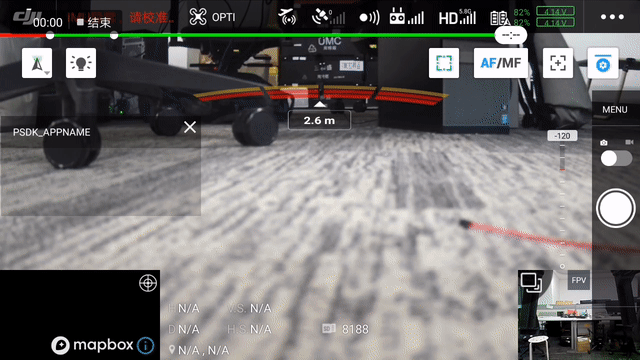

> **NOTE** This article is **Machine-Translated**. If you have any questions about this article, please send an <a href="mailto:dev@dji.com">E-mail </a>to DJI, we will correct it in time. DJI appreciates your support and attention.

## Overview
PSDK provides the function to control the camera-type payload to take photo、video、zoom and focus, after developed the function by themselves, developer should register the function in the specified interfaces of the PSDK, and then, user use DJI Pilot and Mobile APP which developed based on MSDK not only could control the payload but also obtain the information and files from the payload.

* Basic functions: set camera mode, take pictures, record videos, get camera status, SD Card management, video streaming
* Advanced functions: zoom, metering, focus, playback download

## Concepts
#### Camera Mode
Before using the camera function, the user needs to set the mode of the camera-type payload. Different modes specify the different logic that the camera payload must follow.

* Take Photos: User can trigger a camera-type payload to take photos.
* Record Videos: User can trigger a camera-type payload to record vides.
* Playback: User can playback or download the media files which on the payload from the Mobile.
> **NOTE** The camera can only support working on the one mode, that the payload only could record the video and couldn't take photos in the video mode.

#### Photograph mode
* Single: After receiving the command, the camera will take a single photo.
* Burst: After receiving the command, the camera will continuously take a specified number of photos; supports 2/3/5/7/10/14 continuous shooting.
* Interval: The camera takes a specified number of photos at a specified interval.
  * PSDK support the interval is 2/3/5/7/10;
  * Camera-type payload could take 254 photos at maximum, over this value, the camera will take photos continuously.

## Develop the basic functions
According to the development platform and the needs of the application, the developer needs to develop the basic functions by themselves according to the structure`T_PsdkCameraCommonHandlerimplement` in PSDK. After register the function in the specified interface, the user uses DJI Pilot or Mobile APP which developed based on MSDK could control the camera-type payload.

```c 
    // Get the state of the payload.
    s_commonHandler.GetSystemState = GetSystemState; 
    // Develope the function to set the mode of the camera-type payload.
    s_commonHandler.SetMode = SetMode; 
    s_commonHandler.GetMode = GetMode; 
    // Develope the function to start or stop recording.
    s_commonHandler.StartRecordVideo StartRecordVideo =; 
    s_commonHandler.StopRecordVideo = StopRecordVideo; 
    // Develope the function to start or stop taking photos.
    s_commonHandler.StartShootPhoto = StartShootPhoto; 
    s_commonHandler.StopShootPhoto = StopShootPhoto; 
    // Develope the basic function of the camera to take photos.
    s_commonHandler.SetShootPhotoMode = SetShootPhotoMode; 
    s_commonHandler.GetShootPhotoMode = GetShootPhotoMode; 
    s_commonHandler.SetPhotoBurstCount = SetPhotoBurstCount; 
    s_commonHandler.GetPhotoBurstCount = GetPhotoBurstCount;
    s_commonHandler.SetPhotoTimeIntervalSettings = SetPhotoTimeIntervalSettings; 
    s_commonHandler.GetPhotoTimeIntervalSettings = GetPhotoTimeIntervalSettings; 
    // develope SD Card management functions.
    s_commonHandler.GetSDCardState = GetSDCardState; 
    s_commonHandler.FormatSDCard = FormatSDCard;
```

## Initialize basic functions
The developer must initialize and register the camera's basic functions in the payload program.

#### 1. Initialize basic modules of the Camera
Before using the camera functions, the developer must call the interface `PsdkPayloadCamera_Initinitialize` to initialize the camera-type payload.

```c
T_PsdkReturnCode returnCode;

returnCode = PsdkPayloadCamera_Init();
if (returnCode != PSDK_RETURN_CODE_OK) {
    PsdkLogger_UserLogError("payload camera init error:%lld", returnCode);
}
```

#### 2. Register camera basic functions
After develope the basic camera functions, such as set the camera mode, take photos, and record videos, the developer needs to register those functions by `PsdkPayloadCamera_RegCommonHandlerregister` in the payload program.

```c
returnCode = PsdkPayloadCamera_RegCommonHandler(&s_commonHandler);
if (returnCode != PSDK_RETURN_CODE_OK) {
    PsdkLogger_UserLogError("camera register common handler error:%lld", returnCode);
}
```

## Develop with the SD Card Management

> **NOTE**
> * The SD Card on X-Port only supports storing X-Port log, can't store media files, so that the developer needs to develop the SD Card Management function to store media files and register this function in the specified interface. 
> * Please call the system interface to develop the SD Card management functions of the payload.

#### 1. Initialization
After develope and register the SD card management, the developer needs to initialize the module of the SD Card management with the following code.

```
s_cameraSDCardState.isI0nserted = true;
s_cameraSDCardState.totalSpaceInMB = SDCARD_TOTAL_SPACE_IN_MB;
s_cameraSDCardState.remainSpaceInMB = SDCARD_TOTAL_SPACE_IN_MB;
s_cameraSDCardState.availableCaptureCount = SDCARD_TOTAL_SPACE_IN_MB / SDCARD_PER_PHOTO_SPACE_IN_MB;
s_cameraSDCardState.availableRecordingTimeInSeconds = SDCARD_TOTAL_SPACE_IN_MB / SDCARD_PER_SECONDS_RECORD_SPACE_IN_MB;
```

#### 2. Get the current status 
The program of the payload which developed based on PSDK uses the interface `GetSDCardState` to get the status of the SD Card，and user uses DJI Pilot or Mobile APP developed based on MSDK could obtain those statuses either.

```c
// Estimate the number and the length that the space can be used. 
If (s_cameraState.isRecording) { 
    s_cameraState.currentVideoRecordingTimeInSeconds ++; 
    s_cameraSDCardState.remainSpaceInMB = 
                    s_cameraSDCardState.remainSpaceInMB - SDCARD_PER_SECONDS_RECORD_SPACE_IN_MB; IF (s_cameraSDCardState.remainSpaceInMB> SDCARD_TOTAL_SPACE_IN_MB) {         s_cameraSDCardState.remainSpaceInMB = 0 ;         s_cameraSDCardState.isFull = to true ;     } } 

// Get the state of the SD Card which on the payload
T_PsdkReturnCode GetSDCardState (T_PsdkCameraSDCardState * sdCardState)
{
    PsdkLogger_UserLogDebug("get sdcard state");
    memcpy(sdCardState, &s_cameraSDCardState, sizeof(T_PsdkCameraSDCardState));

    return PSDK_RETURN_CODE_OK;
}
```

#### 3. Format the SD Card
The program of the payload which developed based on PSDK use the interface `FormatSDCardinterface` to format the SD Card，and user use DJI Pilot or Mobile APP developed based on MSDK could obtain the format status and format the SD Card, as shown in Figure 1.

```c
static T_PsdkReturnCode FormatSDCard(void)
{
    PsdkLogger_UserLogDebug("format sdcard");
    memset(&s_cameraSDCardState, 0, sizeof(T_PsdkCameraSDCardState));
    s_cameraSDCardState.isInserted = true;
    s_cameraSDCardState.totalSpaceInMB = SDCARD_TOTAL_SPACE_IN_MB;
    s_cameraSDCardState.remainSpaceInMB = SDCARD_TOTAL_SPACE_IN_MB;
    s_cameraSDCardState.availableCaptureCount = SDCARD_TOTAL_SPACE_IN_MB / SDCARD_PER_PHOTO_SPACE_IN_MB;
    s_cameraSDCardState.availableRecordingTimeInSeconds =
        SDCARD_TOTAL_SPACE_IN_MB / SDCARD_PER_SECONDS_RECORD_SPACE_IN_MB;
    return PSDK_RETURN_CODE_OK;
}
```

<div>
<div style="text-align: center"><p>Figure 1 SD Card Management</p>
</div>
<div style="text-align: center"><p><span>
      </span></p>
</div></div>


## Develop with the Set Mode
The program of the payload which developed based on PSDK use the interface `SetMode` and `GetMode` to set the mode of the payload，and user use DJI Pilot or Mobile APP developed based on MSDK could switch the mode of the payload, as shown in Figure 2.

```c
static T_PsdkReturnCode GetSystemState(T_PsdkCameraSystemState *systemState)
{
    PsdkLogger_UserLogDebug("get camera system status info");
    *systemState = s_cameraState;
    return PSDK_RETURN_CODE_OK;
}

static T_PsdkReturnCode SetMode(E_PsdkCameraMode mode)
{
    s_cameraState.cameraMode = mode;
    PsdkLogger_UserLogDebug("set camera mode:%d", mode);
    return PSDK_RETURN_CODE_OK;
}

static T_PsdkReturnCode GetMode(E_PsdkCameraMode *mode)
{
    *mode = s_cameraState.cameraMode;
    PsdkLogger_UserLogDebug("get camera mode:%d", *mode);
    return PSDK_RETURN_CODE_OK;
}
```
<div>
<div style="text-align: center"><p>Figure 2 Set mode  </p>
</div>
<div style="text-align: center"><p><span>
      </span></p>
</div></div>


## Develop with the Shoot Photos

> **NOTE** 
> * Before using this function, the user needs to set the camera mode on the DJI Pilot or Mobile APP which developed based on MSDK.
> * When using the payload developed by PSDK to shoot photos, the shooting status will be returned to the DJI Pilot or mobile APP based on MSDK (to triggering mobile app shooting sounds).

#### 1. Set the camera mode
The program of the payload which developed based on PSDK uses the interface`SetShootPhotoMode` and `GetShootPhotoMode` to set and get the camera's mode. User use Mobile APP developed based on MSDK could set or get the mode of the payload.

```c
static T_PsdkReturnCode SetShootPhotoMode(E_PsdkCameraShootPhotoMode mode)
{
    s_cameraShootPhotoMode = mode;
    PsdkLogger_UserLogDebug("set shoot photo mode:%d", mode);

    return PSDK_RETURN_CODE_OK;
}

static T_PsdkReturnCode GetShootPhotoMode(E_PsdkCameraShootPhotoMode *mode)
{
    *mode = s_cameraShootPhotoMode;
    PsdkLogger_UserLogDebug("get shoot photo mode:%d", *mode);

    return PSDK_RETURN_CODE_OK;
}
```

#### 2. Shot the single photo
The program of the payload which developed based on PSDK uses the interface`StartShootPhoto` and `StopShootPhoto` to take a single photo. To use Mobile APP developed based on MSDK could control the camera-type payload to take a photo.

```c
static T_PsdkReturnCode StartShootPhoto(void)
{
    PsdkLogger_UserLogDebug("start shoot photo");
    s_cameraState.isStoring = true;

    if (s_cameraShootPhotoMode == PSDK_CAMERA_SHOOT_PHOTO_MODE_SINGLE) {
        s_cameraState.shootingState = PSDK_CAMERA_SHOOTING_SINGLE_PHOTO;
    } else if (s_cameraShootPhotoMode == PSDK_CAMERA_SHOOT_PHOTO_MODE_BURST) {
        s_cameraState.shootingState = PSDK_CAMERA_SHOOTING_BURST_PHOTO;
    } else if (s_cameraShootPhotoMode == PSDK_CAMERA_SHOOT_PHOTO_MODE_INTERVAL) {
        s_cameraState.shootingState = PSDK_CAMERA_SHOOTING_INTERVAL_PHOTO;
        s_cameraState.isShootingIntervalStart = true;
        s_cameraState.currentPhotoShootingIntervalTimeInSeconds = s_cameraPhotoTimeIntervalSettings.timeIntervalSeconds;
    }

    return PSDK_RETURN_CODE_OK;
}

static T_PsdkReturnCode StopShootPhoto(void)
{
    PsdkLogger_UserLogDebug("stop shoot photo");
    s_cameraState.shootingState = PSDK_CAMERA_SHOOTING_PHOTO_IDLE;
    s_cameraState.isStoring = false;
    s_cameraState.isShootingIntervalStart = false;

    return PSDK_RETURN_CODE_OK;
}
```

#### 3. Burst in the row
The program of the payload which developed based on PSDK uses the interface`SetPhotoBurstCount` and `GetPhotoBurstCount` to control the camera-type payload burst in the row. To use Mobile APP developed based on MSDK could set the burst number to take photos.

```c
static T_PsdkReturnCode SetPhotoBurstCount(E_PsdkCameraBurstCount burstCount)
{
    s_cameraBurstCount = burstCount;
    PsdkLogger_UserLogDebug("set photo burst count:%d", burstCount);
    return PSDK_RETURN_CODE_OK;
}

static T_PsdkReturnCode GetPhotoBurstCount(E_PsdkCameraBurstCount *burstCount)
{
    *burstCount = s_cameraBurstCount;
    PsdkLogger_UserLogDebug("get photo burst count:%d", *burstCount);

    return PSDK_RETURN_CODE_OK;
}
```

#### 4. Regular Intervals
The program of the payload which developed based on PSDK uses the interface`SetPhotoTimeIntervalSettings` and `GetPhotoTimeIntervalSettings` to control the camera-type payload to take pictures at regular intervals. Users use Mobile APP developed based on MSDK could set the interval to take photos.

```c
static T_PsdkReturnCode SetPhotoTimeIntervalSettings(T_PsdkCameraPhotoTimeIntervalSettings settings)
{
    s_cameraPhotoTimeIntervalSettings.captureCount = settings.captureCount;
    s_cameraPhotoTimeIntervalSettings.timeIntervalSeconds = settings.timeIntervalSeconds;
    PsdkLogger_UserLogDebug("set photo interval settings count:%d seconds:%d", settings.captureCount,
                            settings.timeIntervalSeconds);

    return PSDK_RETURN_CODE_OK;
}

static T_PsdkReturnCode GetPhotoTimeIntervalSettings(T_PsdkCameraPhotoTimeIntervalSettings *settings)
{
    memcpy(settings, &s_cameraPhotoTimeIntervalSettings, sizeof(T_PsdkCameraPhotoTimeIntervalSettings));
    PsdkLogger_UserLogDebug("get photo interval settings count:%d seconds:%d", settings->captureCount,
                            settings->timeIntervalSeconds);

    return PSDK_RETURN_CODE_OK;
}
```

#### 5. Photograph status management
After took the photo on the DJI Pilot or Mobile APP developed based on MSDK, the camera-type payload developed based on PSDK will take the photo, store the photo, and update the status in 1.5s.

##### 1. Confirm the status
It is necessary to obtain the photo status of the payload, after the camera-type payload shoot photos.

```
if (s_cameraState.shootingState != PSDK_CAMERA_SHOOTING_PHOTO_IDLE && photoCnt++ > 150) {
    s_cameraState.isStoring = false;
    s_cameraState.shootingState = PSDK_CAMERA_SHOOTING_PHOTO_IDLE;
    photoCnt = 0;

}
```

##### 2. Store photos 
After shot the photos, the payload would store photos in the SD Card.

* Store photos taken by the payload for single-shot mode

```c
if (s_cameraShootPhotoMode == PSDK_CAMERA_SHOOT_PHOTO_MODE_SINGLE) {
          s_cameraSDCardState.remainSpaceInMB =
              s_cameraSDCardState.remainSpaceInMB - SDCARD_PER_PHOTO_SPACE_IN_MB;
            }
```

* Store photos taken by the payload for burst-shoot mode

```c
if (s_cameraShootPhotoMode == PSDK_CAMERA_SHOOT_PHOTO_MODE_SINGLE) {
    s_cameraSDCardState.remainSpaceInMB =
        s_cameraSDCardState.remainSpaceInMB - SDCARD_PER_PHOTO_SPACE_IN_MB;
} else if (s_cameraShootPhotoMode == PSDK_CAMERA_SHOOT_PHOTO_MODE_BURST) {
    s_cameraSDCardState.remainSpaceInMB =
        s_cameraSDCardState.remainSpaceInMB - SDCARD_PER_PHOTO_SPACE_IN_MB * s_cameraBurstCount;
}
```

* Store photos taken by the payload for interval-shoot mode

```c
if (s_cameraShootPhotoMode == PSDK_CAMERA_SHOOT_PHOTO_MODE_SINGLE) {
      s_cameraSDCardState.remainSpaceInMB =
          s_cameraSDCardState.remainSpaceInMB - SDCARD_PER_PHOTO_SPACE_IN_MB;
  } else if (s_cameraShootPhotoMode == PSDK_CAMERA_SHOOT_PHOTO_MODE_BURST) {
      s_cameraSDCardState.remainSpaceInMB =
          s_cameraSDCardState.remainSpaceInMB - SDCARD_PER_PHOTO_SPACE_IN_MB * s_cameraBurstCount;
  } else if (s_cameraShootPhotoMode == PSDK_CAMERA_SHOOT_PHOTO_MODE_INTERVAL) {
      s_cameraSDCardState.remainSpaceInMB =
          s_cameraSDCardState.remainSpaceInMB - SDCARD_PER_PHOTO_SPACE_IN_MB;
  }
```

##### 3. Check the space
It is recommended to develop the check SD Card storage space function for the camera-type payload which developed based on PSDK.

* Check the storage space of the SD card for single and burst shoot mode

```c
if (s_cameraSDCardState.remainSpaceInMB > SDCARD_TOTAL_SPACE_IN_MB) {
            s_cameraSDCardState.remainSpaceInMB = 0;
            s_cameraSDCardState.isFull = true;
        }
```

* Check the storage space of the SD card for interval shoot mood

```c
if (cnt % 100 == 0) {
    if (s_cameraShootPhotoMode == PSDK_CAMERA_SHOOT_PHOTO_MODE_INTERVAL
        && s_cameraState.isShootingIntervalStart == true) {
        s_cameraState.currentPhotoShootingIntervalTimeInSeconds--;
        if (s_cameraState.currentPhotoShootingIntervalTimeInSeconds == 0) {
            s_cameraState.shootingState = PSDK_CAMERA_SHOOTING_INTERVAL_PHOTO;
            s_cameraState.isStoring = true;
            s_cameraState.currentPhotoShootingIntervalTimeInSeconds
                = s_cameraPhotoTimeIntervalSettings.timeIntervalSeconds;
        }
    } 
}
```

Using the remote control, the user could control the camera-like payload to take the photo, as shown in Figure 3.

<div>
<div style="text-align: center"><p>Figure 3 Take Photos </p>
</div>
<div style="text-align: center"><p><span>
      </span></p>
</div></div>


In single-shot mode, user could take a photo, as shown in Figure 4.
<div>
<div style="text-align: center"><p>Figure 4 Single shot mood </p>
</div>
<div style="text-align: center"><p><span>
      </span></p>
</div></div>

In burst-shoot mode, the user could take photos, as shown in Figure 5.

<div>
<div style="text-align: center"><p> Figure 5 Burst-shoot mode </p>
</div>
<div style="text-align: center"><p><span>
      </span></p>
</div></div>

In interval-shoot mode, user could take photos in the time, as shown in Figure 6.
<div>
<div style="text-align: center"><p>Figure 6 Interval-shoot mode </p>
</div>
<div style="text-align: center"><p><span>
      </span></p>
</div></div>

## Develop with the Record Video 
> **NOTE**
> * The Camera-type payload can't take photos and meter in the record-video.
> * Developers could set the default values ​​of parameters such as ISO, exposure, and focus, etc.
> * Before using the video recording function of the camera-type payload, the user needs to set the camera-type payload mode to the record-video mode.

#### 1. Record Video
The program of the payload which developed based on PSDK uses the interface`StartRecordVideo` and `StopRecordVideo` to record videos. To use Mobile APP developed based on MSDK could control the camera-type payload to record videos.

```c
static T_PsdkReturnCode StartRecordVideo(void)
{
    s_cameraState.isRecording = true;
    PsdkLogger_UserLogDebug("start record video");

    return PSDK_RETURN_CODE_OK;
}

static T_PsdkReturnCode StopRecordVideo(void)
{
    s_cameraState.isRecording = false;
    s_cameraState.currentVideoRecordingTimeInSeconds = 0;
    PsdkLogger_UserLogDebug("stop record video");

    return PSDK_RETURN_CODE_OK;
}
```

### 2. Update the status of the video record 
The program of the payload which developed based on PSDK update the status in 10Hz.

> **NOTE** DJI Pilot and Mobile APP based on MSDK would display the recording time. When the camera stop recording, the time is 0.

```c
if (cnt % 100 == 0) {
    if (s_cameraState.isRecording) {
        s_cameraState.currentVideoRecordingTimeInSeconds++;
        s_cameraSDCardState.remainSpaceInMB =
            s_cameraSDCardState.remainSpaceInMB - SDCARD_PER_SECONDS_RECORD_SPACE_IN_MB;
        if (s_cameraSDCardState.remainSpaceInMB > SDCARD_TOTAL_SPACE_IN_MB) {
            s_cameraSDCardState.remainSpaceInMB = 0;
            s_cameraSDCardState.isFull = true;
        }
    }
}

static T_PsdkReturnCode GetSystemState(T_PsdkCameraSystemState *systemState)
{
    PsdkLogger_UserLogDebug("get camera system status info");
    *systemState = s_cameraState;
    return PSDK_RETURN_CODE_OK;
}
```

Use DJI Pilot or the Mobile APP developed based on MSDK, and the controller, the camera-type payload will record video, as shown in Figure 7.

<div>
<div style="text-align: center"><p>Figure 7 Record video </p>
</div>
<div style="text-align: center"><p><span>
      </span></p>
</div></div>
