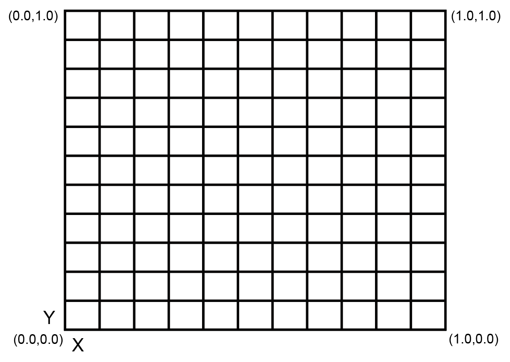

> **NOTE:** This article is **machine-translated**. If you have any questions about this article, please send an <a href="mailto:dev@dji.com">E-mail </a>to DJI, we will correct it in time. DJI appreciates your support and attention.

## Overview
Before develope the focus control for the payload, the developer needs to develop the function by themselves, after registered the function in the specified interfaces of the PSDK, the user uses DJI Pilot and Mobile APP which developed based on MSDK could control the payload to focus and use the focus assistant.

## Concepts
#### Focus Mode
* Auto Focus(AF): In the auto-focus mode, the camera-type payload calculates the focus result according to the image state.
* Manual focus(MF): In the manual-focus mode, the user could obtain a clear image by adjusting the focus ring.

#### Focus Target
  > **NOTE:** In default, the focus point of the camera-type payload is the center of the sensor.

The value of the focus point is the aspect ratio coefficient of the camera screen, as shown in Figure 1.
* Auto Focus: In this mode, developers need to formulate the camera focusing strategy and set the focus point (this point is also called the "target point").
* Manual Focus: In this mode, the user can adjust the focus point by themselves.

<div>
<div style="text-align: center"><p>Figure 1 Focus Target </p>
</div>
<div style="text-align: center"><p><span>
      </span></p>
</div></div>

#### Focus Ring
The camera-type payload with a zoom ring developed based on PSDK call `SetFocusRingValue` to set the value of the focus ring.

The value of the focus ring: 
* the value is 0: it means the focus is infinity and the closest possible focal length.
* the value is not 0: it means the user can set the value of the focus ring.

#### Focus Assistant
In AF and MF modes, the focus assistant uses the digital zoom to extend the user-specified focus area. call the interface `SetFocusAssistantSettings`, the payload could get the status of the focus assistant. 

## Develop the Focus Control function
According to the development platform and the requirements, developer needs to develop the focus control function by themselves refer to the function struct `T_PsdkCameraFocusHandler`, after register the functions to the interface in the PSDK, User use DJI Pilot or Mobile APP developed based on MSDK could control the payload to focus.

```c  
    // Developed the function to set the focus mode.
    s_focusHandler.SetFocusMode = SetFocusMode; 
    s_focusHandler.GetFocusMode = GetFocusMode; 
    // Developed the function to set the focus target.
    s_focusHandler.SetFocusTarget = SetFocusTarget; 
    s_focusHandler.GetFocusTarget = GetFocusTarget; 
    // Developed the function to set the focus assistant.
    s_focusHandler. = SetFocusAssistantSettings SetFocusAssistantSettings; 
    s_focusHandler.GetFocusAssistantSettings = GetFocusAssistantSettings; 
    // implementation the functions to sets the focus ring.
    s_focusHandler.SetFocusRingValue = SetFocusRingValue; 
    s_focusHandler.GetFocusRingValue = GetFocusRingValue; 
    s_focusHandler.GetFocusRingValueUpperBound = GetFocusRingValueUpperBound;
```

## Develop with the Focus Control

#### 1.Register the Focus Control module
After develope the focus control function of the camera-type payload, the developer needs to register the focus control function in the `PsdkPayloadCamera_RegFocusHandler`, so that user use DJI Pilot and Mobile APP developed based on MSDK could control the camera-type payload to focus.

```c
returnCode = PsdkPayloadCamera_RegFocusHandler(&s_focusHandler);
if (returnCode != PSDK_RETURN_CODE_OK) {
    PsdkLogger_UserLogError("camera register adjustable focal point handler error:%lld", returnCode);
    return returnCode;
}
```

#### 2. Set the focus mode
The program of the payload which developed based on PSDK use the interface `SetFocusMode` and `GetFocusMode` to set the focus mode of the payload，and user use DJI Pilot could switch the focus mode of the payload.

```c
static T_PsdkReturnCode SetFocusMode(E_PsdkCameraFocusMode mode)
{
    PsdkLogger_UserLogDebug("set focus mode:%d", mode);
    s_cameraFocusMode = mode;
    return PSDK_RETURN_CODE_OK;
}

static T_PsdkReturnCode GetFocusMode(E_PsdkCameraFocusMode *mode)
{
    *mode = s_cameraFocusMode;
    PsdkLogger_UserLogDebug("get focus mode:%d", *mode);

    return PSDK_RETURN_CODE_OK;
}
```

#### 3. Set the focus target
The program of the payload which developed based on PSDK use the interface `SetFocusTarget` and `GetFocusTarget` to get the focus target of the payload，and user use DJI Pilot or Mobile APP developed based on MSDK could control the payload get the focus target.

```c
static T_PsdkReturnCode SetFocusTarget(T_PsdkCameraFocusTarget target)
{
    PsdkLogger_UserLogDebug("set focus target x:%.2f y:%.2f", target.focusX, target.focusY);
    memcpy(&s_cameraFocusTarget, &target, sizeof(T_PsdkCameraFocusTarget));

    return PSDK_RETURN_CODE_OK;
}

static T_PsdkReturnCode GetFocusTarget(T_PsdkCameraFocusTarget *target)
{
    memcpy(target, &s_cameraFocusTarget, sizeof(T_PsdkCameraFocusTarget));
    PsdkLogger_UserLogDebug("get focus target x:%.2f y:%.2f", s_cameraFocusTarget.focusX, s_cameraFocusTarget.focusY);

    return PSDK_RETURN_CODE_OK;
}
```

#### 4. Set the focus ring
The program of the payload which developed based on PSDK use the interface `SetFocusRingValue`、`GetFocusRingValue` and `GetFocusRingValueUpperBoundan` to set the focus ring of the payload，and user use DJI Pilot or Mobile APP developed based on MSDK could get the value of the focus ring and control the focus ring to the target.

```c
static T_PsdkReturnCode SetFocusRingValue(uint32_t value)
{
    PsdkLogger_UserLogDebug("set focus ring value:%d", value);
    s_cameraFocusRingValue = value;

    return PSDK_RETURN_CODE_OK;
}

static T_PsdkReturnCode GetFocusRingValue(uint32_t *value)
{
    *value = s_cameraFocusRingValue;
    PsdkLogger_UserLogDebug("get focus ring value:%d", *value);

    return PSDK_RETURN_CODE_OK;
}

static T_PsdkReturnCode GetFocusRingValueUpperBound(uint32_t *value)
{
    *value = FOCUS_MAX_RINGVALUE;
    PsdkLogger_UserLogDebug("get focus ring value upper bound:%d", *value);

    return PSDK_RETURN_CODE_OK;
}
```

#### 5. Using the Focus Assistant
The program of the payload which developed based on PSDK uses the interface `SetFocusAssistantSettings` and `GetFocusAssistantSettings` to use the focus assistant of the payload，and user use DJI Pilot or Mobile APP developed based on MSDK could get the status of the focus assistant and control the focus assistant.

```c
static T_PsdkReturnCode SetFocusAssistantSettings(T_PsdkCameraFocusAssistantSettings settings)
  {
      PsdkLogger_UserLogDebug("set focus assistant setting MF:%d AF:%d", settings.isEnabledMF, settings.isEnabledAF);
      memcpy(&s_cameraFocusAssistantSettings, &settings, sizeof(T_PsdkCameraFocusAssistantSettings));

      return PSDK_RETURN_CODE_OK;
  }

  static T_PsdkReturnCode GetFocusAssistantSettings(T_PsdkCameraFocusAssistantSettings *settings)
  {
      memcpy(settings, &s_cameraFocusAssistantSettings, sizeof(T_PsdkCameraFocusAssistantSettings));
      PsdkLogger_UserLogDebug("get focus assistant setting MF:%d AF:%d", settings->isEnabledMF, settings->isEnabledAF);

      return PSDK_RETURN_CODE_OK;
  }
```

After develope the focus function of the camera-type payload, the user uses the DJI Pilot or Mobile APP developed based on MSDK could control the camera-type payload to focus.

>**NOTE:** If the button is yellow, it means the work mode of the camera-type payload is meter, after clicked, the function will switch to the focus.

<div>
<div style="text-align: center"><p>Figure 2  Auto Focus  </p>
</div>
<div style="text-align: center"><p><span>
      </span></p>
</div></div>

<div>
<div style="text-align: center"><p>Figure 3 Manual Focus </p>
</div>
<div style="text-align: center"><p><span>
      </span></p>
</div></div>

