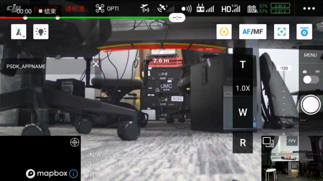

> **NOTE:** This article is **Machine-Translated**. If you have any questions about this article, please send an <a href="mailto:dev@dji.com">E-mail </a>to DJI, we will correct it in time. DJI appreciates your support and attention.

## Overview
Before developing the metering control for the payload, the developer needs to develop the function by themselves, after registered the function in the specified interfaces of the PSDK, the user uses DJI Pilot and Mobile APP which developed based on MSDK could control the payload to metering in the Shot-Mode.

## Meter mode
* Average photometry: According to analysis the overall brightness of the picture, the paylaod calculate the value of the average to adjust the scenes;
* Center-weighted metering:Only measured the middle area of ​​the image sensor;
* Spot metering: measured the "specified point" on the sensor, as shown in Figure 1.
<div>
<div style="text-align: center"><p>Figure 1 Spot metering area  </p>
</div>
<div style="text-align: center"><p><span>
      </span></p>
</div></div>

The sensor is divided into 96 dot areas by 12 columns and 8 rows. The index range of the row is [0,7], the values ​increase from top to bottom; the index range of the column is [0,11], the values ​​increase from left to right.

## Develop The Meter Control
According to the development platform and the requirements, developers need to develop the metering control function by themselves refer to the function struct `T_PsdkCameraExposureMeteringHandler`, after register the functions to the interface in the PSDK, User use DJI Pilot or Mobile APP developed based on MSDK could control the payload to metering.

```c
    // Developed the fuction to set the mode of the camera-type payload.
    s_exposureMeteringHandler.SetMeteringMode = SetMeteringMode;
    s_exposureMeteringHandler.GetMeteringMode = GetMeteringMode;
    // Developed the fuction that control the camera-type payload to metering.
    s_exposureMeteringHandler.SetSpotMeteringTarget = SetSpotMeteringTarget;
    s_exposureMeteringHandler.GetSpotMeteringTarget = GetSpotMeteringTarget;
```

## Develop with the Meter Control
#### 1. Register the Meter control function
After develope the metering control function of the camera-type payload, the developer needs to register the metering control function in the `PsdkPayloadCamera_RegExposureMeteringHandler`, so that user use DJI Pilot and Mobile APP developed based on MSDK could control the camera-type payload to metering, as shown in Figure 2.

```c
    returnCode = PsdkPayloadCamera_RegExposureMeteringHandler(&s_exposureMeteringHandler);
    if (returnCode != PSDK_RETURN_CODE_OK) {
        PsdkLogger_UserLogError("camera register exposure metering handler error:%lld", returnCode);
        return returnCode;
    }
```

### 2. Set the metering mode
The program of the payload which developed based on PSDK use the interface `SetMeteringMode` and `GetMeteringMode` to set the metering mode of the payload，and user use DJI Pilot or Mobile APP developed based on MSDK could switch the metering mode of the payload, as shown in Figure 2 and Figure 3.

```c
    static T_PsdkReturnCode SetMeteringMode(E_PsdkCameraMeteringMode mode)
    {
        PsdkLogger_UserLogDebug("set metering mode:%d", mode);
        s_cameraMeteringMode = mode;

        return PSDK_RETURN_CODE_OK;
    }

    static T_PsdkReturnCode GetMeteringMode(E_PsdkCameraMeteringMode *mode)
    {
        *mode = s_cameraMeteringMode;
        PsdkLogger_UserLogDebug("get metering mode:%d", *mode);

        return PSDK_RETURN_CODE_OK;
    }
```

### 3. Setting the Metering target
The program of the payload which developed based on PSDK uses the interface `SetSpotMeteringTarget` and `GetSpotMeteringTarget` to set the metering target of the payload，and user use DJI Pilot or Mobile APP developed based on MSDK could get the target from the payload.

```c
    static T_PsdkReturnCode SetSpotMeteringTarget(T_PsdkCameraSpotMeteringTarget target)
    {
        PsdkLogger_UserLogDebug("set spot metering area col:%d row:%d", target.col, target.row);
        memcpy(&s_cameraSpotMeteringTarget, &target, sizeof(T_PsdkCameraSpotMeteringTarget));

        return PSDK_RETURN_CODE_OK;
    }

    static T_PsdkReturnCode GetSpotMeteringTarget(T_PsdkCameraSpotMeteringTarget *target)
    {
        memcpy(target, &s_cameraSpotMeteringTarget, sizeof(T_PsdkCameraSpotMeteringTarget));
        PsdkLogger_UserLogDebug("get spot metering area col:%d row:%d", target->col, target->row);

        return PSDK_RETURN_CODE_OK;
    }
```
<div>
<div style="text-align: center"><p>Figure 2 The Metering Function </p>
</div>
<div style="text-align: center"><p><span>
      </span></p>
</div></div>

<div>
<div style="text-align: center"><p>Figure 3 Center-weighted Metering</p>
</div>
<div style="text-align: center"><p><span>
      </span></p>
</div></div>

<div>
<div style="text-align: center"><p>Figure 4 Spot metering </p>
</div>
<div style="text-align: center"><p><span>
      </span></p>
</div></div>

> **NOTE:**  If the button is green, it means the work mode of the camera-type payload is the focus, after clicking, it can be switched to the metering.