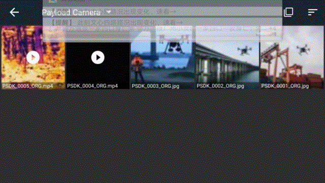
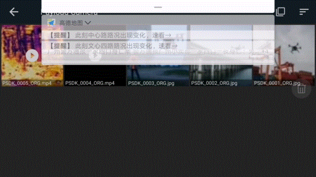

> **NOTE:** This article is **machine-translated**. If you have any questions about this article, please send an <a href="mailto:dev@dji.com">E-mail </a>to DJI, we will correct it in time. DJI appreciates your support and attention.

## Overview
Before developed the playback and download for the payload, the developer needs to develop the function by themselves, after registered the function in the specified interfaces of the PSDK, user use DJI Pilot and Mobile APP which developed based on MSDK could control the payload to playback or download the source files.  

## Media File Management
The camera-type payload developed based on PSDK could delete or download one or more files stored in the SD Card.

#### Preview
The camera-type payload developed based on PSDK allows users to preview the media files in the payload on the DJI Pilot or Mobile APP which developed based on MSDK.
* Static preview, preview single file or file list.
    * Thumbnail, preview the file list
        * Image: the width of the image is recommended to 100 pixels
        * Video: Capture a frame of the video
    * Screenshot, preview a single file 
        * Image: the width of the image is recommended to 600 pixels.
        * Video: Capture a frame of a video.
    * Original files: Please use the download function to obtain the specified media files.
* Dynamic preview (video preview): Play, pause, stop, seek (fast forward, rewind, and progress drag).
    > **NOTE:** The formats that support dynamic preview are MP4, JPG, DNG, and MOV. For details, please refer to ["Video Criterion"](../guide/payload-criterion.html)。

## Develop Playback and Download
According to the development platform and the requirements, developers need to develop the playback and download function by themselves refer to the function struct `T_PsdkCameraMediaDownloadPlaybackHandler`, after register the functions to the interface in the PSDK, User use DJI Pilot or Mobile APP developed based on MSDK could playback and download the files which on the payload.

```c
    // Developed the fuction to get the information of the media file.
    s_psdkCameraMedia.GetMediaFileDir = GetMediaFileDir;
    s_psdkCameraMedia.GetMediaFileOriginInfo = GetMediaFileOriginInfo;
    s_psdkCameraMedia.GetMediaFileOriginData = GetMediaFileOriginData;
    // Developed the fuction to get the thumb nail of the media file.
    s_psdkCameraMedia.CreateMediaFileThumbNail = CreateMediaFileThumbNail;
    s_psdkCameraMedia.GetMediaFileThumbNailInfo = GetMediaFileThumbNailInfo;
    s_psdkCameraMedia.GetMediaFileThumbNailData = GetMediaFileThumbNailData;
    s_psdkCameraMedia.DestroyMediaFileThumbNail = DestroyMediaFileThumbNail;
    // Developed the fuction to get the screen nail of the media file.
    s_psdkCameraMedia.CreateMediaFileScreenNail = CreateMediaFileScreenNail;
    s_psdkCameraMedia.GetMediaFileScreenNailInfo = GetMediaFileScreenNailInfo;
    s_psdkCameraMedia.GetMediaFileScreenNailData = GetMediaFileScreenNailData;
    s_psdkCameraMedia.DestroyMediaFileScreenNail = DestroyMediaFileScreenNail;
    // Developed the fuction to delete the media file.
    s_psdkCameraMedia.DeleteMediaFile = DeleteMediaFile;
    // Developed the fuction to playback the media file.
    s_psdkCameraMedia.SetMediaPlaybackFile = SetMediaPlaybackFile;
    s_psdkCameraMedia.StartMediaPlayback = StartMediaPlayback;
    s_psdkCameraMedia.StopMediaPlayback = StopMediaPlayback;
    s_psdkCameraMedia.PauseMediaPlayback = PauseMediaPlayback;
    s_psdkCameraMedia.SeekMediaPlayback = SeekMediaPlayback;
    s_psdkCameraMedia.GetMediaPlaybackStatus = GetMediaPlaybackStatus;
    // Developed the fuction to download the media file
    s_psdkCameraMedia.StartDownloadNotification = StartDownloadNotification;
    s_psdkCameraMedia.StopDownloadNotification = StopDownloadNotification;
```

## Develop with the Playback and Download

> **NOTE**
> * Please use the [ffmpeg 2.8.15](https://trac.ffmpeg.org/) to operate the media file which is in the payload.
> * The function of the playback and download only support the payload which developed based on Linux.

### 1. Network Configuration
To convenience the user to operate the media file in the payload which developed on Linux, please set the parameters of the network, after that please use the command `ping` and `ifconfig` check the network.

* IP:`192.168.5.3`
* Gate:`192.168.5.1`
* Mask: `255.255.255.0`

> **NOTE:** Use the virtual machine to debug the camera-type payload, the developer should set the mode of the virtual machine's network is bridge mode and enable the function "Replicate physical network connection status".

### 2. Register the playback and download function
> **NOTE:** This function is optional.

```c
  // Resign the function to start the playback.
 static T_PsdkReturnCode StartMediaPlayback(void)
{
    T_PsdkReturnCode psdkStat;

    PsdkLogger_UserLogDebug("start media playback");
    psdkStat = PsdkPlayback_StartPlay(&s_playbackInfo);
    if (psdkStat != PSDK_RETURN_CODE_OK) {
        PsdkLogger_UserLogError("start media playback status error, stat:%lld", psdkStat);
        return psdkStat;
    }

    return psdkStat;}

  // Resign the function to stop the playback.
static T_PsdkReturnCode StopMediaPlayback(void)
{
    T_PsdkReturnCode psdkStat;

    PsdkLogger_UserLogDebug("stop media playback");
    psdkStat = PsdkPlayback_StopPlay(&s_playbackInfo);
    if (psdkStat != PSDK_RETURN_CODE_OK) {
        PsdkLogger_UserLogError("stop media playback error, stat:%lld", psdkStat);
        return psdkStat;
    }

    return psdkStat;
}
  // Resign the function to pause the playback 
static T_PsdkReturnCode PauseMediaPlayback(void)
{
    T_PsdkReturnCode psdkStat;

    PsdkLogger_UserLogDebug("pause media playback");
    psdkStat = PsdkPlayback_PausePlay(&s_playbackInfo);
    if (psdkStat != PSDK_RETURN_CODE_OK) {
        PsdkLogger_UserLogError("pause media playback error, stat:%lld", psdkStat);
        return psdkStat;
    }

    return psdkStat;
}
  // Resign the function to seek the media files on the  playback 
       static T_PsdkReturnCode SeekMediaPlayback(uint32_t playbackPosition)
       {
           T_PsdkReturnCode psdkStat;
       
           PsdkLogger_UserLogDebug("seek media playback:%d", playbackPosition);
           psdkStat = PsdkPlayback_SeekPlay(&s_playbackInfo, playbackPosition);
           if (psdkStat != PSDK_RETURN_CODE_OK) {
               PsdkLogger_UserLogError("seek media playback error, stat:%lld", psdkStat);
               return psdkStat;
           }
       
           return psdkStat;
}
```

### Get the list of the media file 

#### 1. Get the path of the media file
The program of the payload which developed based on PSDK uses the interface `GetMediaFileDir` to get the media files on the payload. User use DJI Pilot or Mobile APP developed based on MSDK could get the media file's path from the payload.

>**NOTE:** The default media file is `camera_media_emu/media_file`, it can be changed.

```c
static T_PsdkReturnCode GetMediaFileDir(char *dirPath)
{
    strcpy(dirPath, PSDK_MEDIA_FILE_PATH);

    return PSDK_RETURN_CODE_OK;
}
```

#### 2. Get the list of the media files
After obtaine the path of the media files, the Mobile APP which developed based on MSDK could send the command to get the information of the media files.
* the payload developed based on PSDK calling the interface to get the information about media files which in the payload, such as file name, path, and size.
* Payload uses the FFmpeg command to get the length, frame rate, etc. 
   
```c
   static T_PsdkReturnCode GetMediaFileOriginInfo(const char *filePath, T_PsdkCameraMediaFileInfo *fileInfo)
   {
       T_PsdkReturnCode psdkStat;
       T_PsdkMediaFileHandle mediaFileHandle;
   
       psdkStat = PsdkMediaFile_CreateHandle(filePath, &mediaFileHandle);
       if (psdkStat != PSDK_RETURN_CODE_OK) {
           PsdkLogger_UserLogError("Media file create handle error stat:%lld", psdkStat);
           return psdkStat;
       }
   
       psdkStat = PsdkMediaFile_GetMediaFileType(mediaFileHandle, &fileInfo->type);
       if (psdkStat != PSDK_RETURN_CODE_OK) {
           PsdkLogger_UserLogError("Media file get type error stat:%lld", psdkStat);
           goto out;
       }
   
       psdkStat = PsdkMediaFile_GetMediaFileAttr(mediaFileHandle, &fileInfo->mediaFileAttr);
       if (psdkStat != PSDK_RETURN_CODE_OK) {
           PsdkLogger_UserLogError("Media file get attr error stat:%lld", psdkStat);
           goto out;
       }
   
       psdkStat = PsdkMediaFile_GetFileSizeOrg(mediaFileHandle, &fileInfo->fileSize);
       if (psdkStat != PSDK_RETURN_CODE_OK) {
           PsdkLogger_UserLogError("Media file get size error stat:%lld", psdkStat);
           goto out;
       }
   
   out:
       psdkStat = PsdkMediaFile_DestroyHandle(mediaFileHandle);
       if (psdkStat != PSDK_RETURN_CODE_OK) {
           PsdkLogger_UserLogError("Media file destroy handle error stat:%lld", psdkStat);
           return psdkStat;
       }
   
       return psdkStat;
   }
```
#### 3.Get the Origin data of the media files
The program of the payload which developed based on PSDK uses the interface `GetMediaFileOriginData` to get the origin media files on the payload. User use DJI Pilot or Mobile APP developed based on MSDK could get the media file's origin data from the payload.

```c
   static T_PsdkReturnCode GetMediaFileOriginData(const char *filePath, uint32_t offset, uint32_t length, uint8_t *data)
   {
       T_PsdkReturnCode psdkStat;
       uint16_t realLen = 0;
       T_PsdkMediaFileHandle mediaFileHandle;
   
       psdkStat = PsdkMediaFile_CreateHandle(filePath, &mediaFileHandle);
       if (psdkStat != PSDK_RETURN_CODE_OK) {
           PsdkLogger_UserLogError("Media file create handle error stat:%lld", psdkStat);
           return psdkStat;
       }
   
       psdkStat = PsdkMediaFile_GetDataOrg(mediaFileHandle, offset, length, data, &realLen);
       if (psdkStat != PSDK_RETURN_CODE_OK) {
           PsdkLogger_UserLogError("Media file get size error stat:%lld", psdkStat);
           return psdkStat;
       }
   
       psdkStat = PsdkMediaFile_DestroyHandle(mediaFileHandle);
       if (psdkStat != PSDK_RETURN_CODE_OK) {
           PsdkLogger_UserLogError("Media file destroy handle error stat:%lld", psdkStat);
           return psdkStat;
       }
   
       return PSDK_RETURN_CODE_OK;
   }
```
>**NOTE** 
> * The function to get the media file list can only obtain the original files and thumbnail.
> * In this function，use only could get the screenshot of media files.
> * The user can get the original file only use the download function.

### Create the Thumb nail 
#### 1. Get the path of the object and create the thumbnail
The program of the payload which developed based on PSDK uses the interface `CreateMediaFileThumbNail` to get the path of the specified media files on the payload. User use DJI Pilot or Mobile APP developed based on MSDK could send the command to the payload to create the thumbnail.

```c
      static T_PsdkReturnCode CreateMediaFileThumbNail(const char *filePath)
       {
           T_PsdkReturnCode psdkStat;       
           psdkStat = PsdkMediaFile_CreateThm(s_mediaFileThumbNailHandle);
           if (psdkStat != PSDK_RETURN_CODE_OK) {
               PsdkLogger_UserLogError("Media file create thumb nail error stat:%lld", psdkStat);
               return psdkStat;
           }
       
           return PSDK_RETURN_CODE_OK;
       }
```

#### 2. Get the information of the thumbnail
The program of the payload which developed based on PSDK uses the interface `GetMediaFileThumbNailInfo` to get the information of the specified media file‘s thumbnail which on the payload. User use DJI Pilot or Mobile APP developed based on MSDK could send the command to obtain the information of the thumbnail which the user specified in the payload.


```c
        static T_PsdkReturnCode GetMediaFileThumbNailInfo(const char *filePath, T_PsdkCameraMediaFileInfo *fileInfo)
       {
           T_PsdkReturnCode psdkStat;
       
           USER_UTIL_UNUSED(filePath);
       
           psdkStat = PsdkMediaFile_GetMediaFileType(s_mediaFileThumbNailHandle, &fileInfo->type);
           if (psdkStat != PSDK_RETURN_CODE_OK) {
               PsdkLogger_UserLogError("Media file get type error stat:%lld", psdkStat);
               return psdkStat;
           }
       
           psdkStat = PsdkMediaFile_GetMediaFileAttr(s_mediaFileThumbNailHandle, &fileInfo->mediaFileAttr);
           if (psdkStat != PSDK_RETURN_CODE_OK) {
               PsdkLogger_UserLogError("Media file get attr error stat:%lld", psdkStat);
               return psdkStat;
           }
       
           psdkStat = PsdkMediaFile_GetFileSizeThm(s_mediaFileThumbNailHandle, &fileInfo->fileSize);
           if (psdkStat != PSDK_RETURN_CODE_OK) {
               PsdkLogger_UserLogError("Media file get size error stat:%lld", psdkStat);
               return psdkStat;
           }
       
           return PSDK_RETURN_CODE_OK;
       }
```

#### 3. Get the thumbnail
The program of the payload which developed based on PSDK uses the interface `GetMediaFileThumbNailData` to get the specified media file's thumbnail which on the payload. User use DJI Pilot or Mobile APP developed based on MSDK could send the command to obtain the thumbnail.

```c
    static T_PsdkReturnCode GetMediaFileThumbNailData(const char *filePath, uint32_t offset, uint32_t length, uint8_t *data)
       {
           T_PsdkReturnCode psdkStat;
           uint16_t realLen = 0;
       
           USER_UTIL_UNUSED(filePath);
       
           psdkStat = PsdkMediaFile_GetDataThm(s_mediaFileThumbNailHandle, offset, length, data, &realLen);
           if (psdkStat != PSDK_RETURN_CODE_OK) {
               PsdkLogger_UserLogError("Media file get data error stat:%lld", psdkStat);
               return psdkStat;
           }
       
           return PSDK_RETURN_CODE_OK;
       }
```

#### 4. Destroy the thumbnail
The program of the payload which developed based on PSDK uses the interface `DestroyMediaFileThumbNail` to destroy the specified media file's thumbnail which on the payload. To use DJI Pilot or Mobile APP developed based on MSDK could send the command to destroy the thumbnail which was generated on the drone.
>**NOTE:** The thumbnail which had created by the user would be stored in the APP such as DJI Pilot.

```c
    static T_PsdkReturnCode DestroyMediaFileThumbNail(const char *filePath)
       {
           T_PsdkReturnCode psdkStat;
       
           USER_UTIL_UNUSED(filePath);
       
           psdkStat = PsdkMediaFile_DestoryThm(s_mediaFileThumbNailHandle);
           if (psdkStat != PSDK_RETURN_CODE_OK) {
               PsdkLogger_UserLogError("Media file destroy thumb nail error stat:%lld", psdkStat);
               return psdkStat;
           }
       
           psdkStat = PsdkMediaFile_DestroyHandle(s_mediaFileThumbNailHandle);
           if (psdkStat != PSDK_RETURN_CODE_OK) {
               PsdkLogger_UserLogError("Media file destroy handle error stat:%lld", psdkStat);
               return psdkStat;
           }
       
           return PSDK_RETURN_CODE_OK;
       }
```

### Create the Screen nail
#### 1. Get the path of the object and create the screen nail
The program of the payload which developed based on PSDK uses the interface `CreateMediaFileScreenNail` to get the path of the specified media files on the payload. User use DJI Pilot or Mobile APP developed based on MSDK could send the command to the payload to create the screen nail.

```c
       static T_PsdkReturnCode CreateMediaFileScreenNail(const char *filePath)
       {
           T_PsdkReturnCode psdkStat;
       
           psdkStat = PsdkMediaFile_CreateHandle(filePath, &s_mediaFileScreenNailHandle);
           if (psdkStat != PSDK_RETURN_CODE_OK) {
               PsdkLogger_UserLogError("Media file create handle error stat:%lld", psdkStat);
               return psdkStat;
           }
       
           psdkStat = PsdkMediaFile_CreateScr(s_mediaFileScreenNailHandle);
           if (psdkStat != PSDK_RETURN_CODE_OK) {
               PsdkLogger_UserLogError("Media file create screen nail error stat:%lld", psdkStat);
               return psdkStat;
           }
       
           return PSDK_RETURN_CODE_OK;
       }
```

#### 2. Get the information of the screen nail
The program of the payload which developed based on PSDK uses the interface `GetMediaFileScreenNailInfo` to get the information of the specified media file‘s screen nail which on the payload. User use DJI Pilot or Mobile APP developed based on MSDK could send the command to obtain the information of the screen nail which the user specified in the payload.

```c
  static T_PsdkReturnCode GetMediaFileScreenNailInfo(const char *filePath, T_PsdkCameraMediaFileInfo *fileInfo)
       {
           T_PsdkReturnCode psdkStat;
           USER_UTIL_UNUSED(filePath);
       
           psdkStat = PsdkMediaFile_GetMediaFileType(s_mediaFileScreenNailHandle, &fileInfo->type);
           if (psdkStat != PSDK_RETURN_CODE_OK) {
               PsdkLogger_UserLogError("Media file get type error stat:%lld", psdkStat);
               return psdkStat;
           }
       
           psdkStat = PsdkMediaFile_GetMediaFileAttr(s_mediaFileScreenNailHandle, &fileInfo->mediaFileAttr);
           if (psdkStat != PSDK_RETURN_CODE_OK) {
               PsdkLogger_UserLogError("Media file get attr error stat:%lld", psdkStat);
               return psdkStat;
           }
       
           psdkStat = PsdkMediaFile_GetFileSizeScr(s_mediaFileScreenNailHandle, &fileInfo->fileSize);
           if (psdkStat != PSDK_RETURN_CODE_OK) {
               PsdkLogger_UserLogError("Media file get size error stat:%lld", psdkStat);
               return psdkStat;
           }
       
           return PSDK_RETURN_CODE_OK;
       }
```

#### 3. Get the screen nail
The program of the payload which developed based on PSDK uses the interface `GetMediaFileScreenNailData` to get the specified media file's screen nail which on the payload. User use DJI Pilot or Mobile APP developed based on MSDK could send the command to obtain the screen nail.

```c
static T_PsdkReturnCode
       GetMediaFileScreenNailData(const char *filePath, uint32_t offset, uint32_t length, uint8_t *data)
       {
           T_PsdkReturnCode psdkStat;
           uint16_t realLen = 0;
       
           USER_UTIL_UNUSED(filePath);
       
           psdkStat = PsdkMediaFile_GetDataScr(s_mediaFileScreenNailHandle, offset, length, data, &realLen);
           if (psdkStat != PSDK_RETURN_CODE_OK) {
               PsdkLogger_UserLogError("Media file get size error stat:%lld", psdkStat);
               return psdkStat;
           }
       
           return PSDK_RETURN_CODE_OK;
       }
       
static T_PsdkReturnCode DestroyMediaFileScreenNail(const char *filePath)
       {
           T_PsdkReturnCode psdkStat;
       
           USER_UTIL_UNUSED(filePath);
       
           psdkStat = PsdkMediaFile_DestroyScr(s_mediaFileScreenNailHandle);
           if (psdkStat != PSDK_RETURN_CODE_OK) {
               PsdkLogger_UserLogError("Media file destroy screen nail error stat:%lld", psdkStat);
               return psdkStat;
           }
       
           psdkStat = PsdkMediaFile_DestroyHandle(s_mediaFileScreenNailHandle);
           if (psdkStat != PSDK_RETURN_CODE_OK) {
               PsdkLogger_UserLogError("Media file destroy handle error stat:%lld", psdkStat);
               return psdkStat;
           }
       
           return PSDK_RETURN_CODE_OK;
       }
```
Using DJI Pilot or a Mobile APP developed based on MSDK can pull the media files in the `/ media_file` directory of the payload and display the name and screen nail of the media file automatically, after clicked, it could display the screen nail of the media file, as shown in Figure 1.
 
<div>
<div style="text-align: center"><p>Figure 1 View the screen nail </p>
</div>
<div style="text-align: center"><p><span>
      </span></p>
</div></div>
  

### Delete the media files in the payload
The program of the payload which developed based on PSDK uses the interface `DeleteMediaFile` to delete the specified media file's screen nail which on the payload. User use DJI Pilot or Mobile APP developed based on MSDK could send the command to delete the screen nail.

```c
static T_PsdkReturnCode DeleteMediaFile(char *filePath)
    {
        T_PsdkReturnCode psdkStat;
    
        psdkStat = PsdkFile_Delete(filePath);
        if (psdkStat != PSDK_RETURN_CODE_OK) {
            PsdkLogger_UserLogError("Media file delete error stat:%lld", psdkStat);
            return psdkStat;
        }
    
        return PSDK_RETURN_CODE_OK;
    }
```
Select the files and click the delete button to delete the media files in the camera-type payload, as shown in Figure 2.
  <div>
<div style="text-align: center"><p> Figure 2 Delete the media files. </p>
</div>
<div style="text-align: center"><p><span>
      </span></p>
</div></div>

### Playback and download
>**NOTE** 
> * Before using PSDK to develop the playback function of the payload, you need to develop the function of obtaining the file list of the payload.
> * Develope the playback function of the payload, the developer must develop the function to obtain the path of the media file, and convert the media file to H.264.

#### 1. Specified the path of the media files
The program of the payload which developed based on PSDK uses the interface `SetMediaPlaybackFile` to get the path of the specified media files on the payload. User use DJI Pilot or Mobile APP developed based on MSDK could set the media file's path to the payload.

```c
  static T_PsdkReturnCode SetMediaPlaybackFile(const char *filePath)
   {
       PsdkLogger_UserLogDebug("set media playback file:%s", filePath);
       T_PsdkReturnCode psdkStat;
   
       psdkStat = PsdkPlayback_StopPlay(&s_playbackInfo);
       if (psdkStat != PSDK_RETURN_CODE_OK) {
           return psdkStat;
       }
   
       psdkStat = PsdkPlayback_SetPlayFile(&s_playbackInfo, filePath, 0);
       if (psdkStat != PSDK_RETURN_CODE_OK) {
           return psdkStat;
       }
   
       psdkStat = PsdkPlayback_StartPlay(&s_playbackInfo);
       if (psdkStat != PSDK_RETURN_CODE_OK) {
           return psdkStat;
       }
   
       return PSDK_RETURN_CODE_OK;
   }
   ```

#### 2. Convert the format   
The program of the payload which developed based on PSDK uses the interface `PsdkPlayback_VideoFileTranscode` convert the file which on the payload to H.264 and get the information of the H.264 file such as frame rate and frame, etc.

```c
      psdkStat = PsdkPlayback_VideoFileTranscode(videoFilePath, "h264", transcodedFilePath,
                                                        PSDK_MEDIA_FILE_PATH_LEN_MAX);
             if (psdkStat != PSDK_RETURN_CODE_OK) {
                 PsdkLogger_UserLogError("transcode video file error: %lld.", psdkStat);
                 continue;
             }
             psdkStat = PsdkPlayback_VideoFileTranscode(videoFilePath, "h264", transcodedFilePath,
                                                        PSDK_MEDIA_FILE_PATH_LEN_MAX);
             if (psdkStat != PSDK_RETURN_CODE_OK) {
                 PsdkLogger_UserLogError("transcode video file error: %lld.", psdkStat);
                 continue;
             }
     
             psdkStat = PsdkPlayback_GetFrameRateOfVideoFile(transcodedFilePath, &frameRate);
             if (psdkStat != PSDK_RETURN_CODE_OK) {
                 PsdkLogger_UserLogError("get frame rate of video error: %lld.", psdkStat);
                 continue;
             }
     
             psdkStat = PsdkPlayback_GetFrameInfoOfVideoFile(transcodedFilePath, frameInfo, VIDEO_FRAME_MAX_COUNT,
                                                             &frameCount);
             if (psdkStat != PSDK_RETURN_CODE_OK) {
                 PsdkLogger_UserLogError("get frame info of video error: %lld.", psdkStat);
                 continue;
             }
     
             psdkStat = PsdkPlayback_GetFrameNumberByTime(frameInfo, frameCount, &frameNumber,
                                                          startTimeMs);
             if (psdkStat != PSDK_RETURN_CODE_OK) {
                 PsdkLogger_UserLogError("get start frame number error: %lld.", psdkStat);
                 continue;
             }
```

#### 3. Sent the H.264 files
The program of the payload which developed based on PSDK uses the interface `PsdkPayloadCamera_SendVideoStream` to sent the H.264 files according to the information such as frame rate, etc.
>**NOTE:** The step and the method of the video stream please refer to [Video Stream Transmission](./video-stream-transmission.html).

```c
    while (dataLength - lengthOfDataHaveBeenSent) {
                 lengthOfDataToBeSent = USER_UTIL_MIN(DATA_SEND_FROM_VIDEO_STREAM_MAX_LEN,
                                                      dataLength - lengthOfDataHaveBeenSent);
                 psdkStat = PsdkPayloadCamera_SendVideoStream((const uint8_t *) dataBuffer + lengthOfDataHaveBeenSent,
                                                              lengthOfDataToBeSent);
                 if (psdkStat != PSDK_RETURN_CODE_OK) {
                     PsdkLogger_UserLogError("send video stream error: %lld.", psdkStat);
                     goto free;
                 }
                 lengthOfDataHaveBeenSent += lengthOfDataToBeSent;
}
```

#### 4. Get the status of the video stream
The program of the payload which developed based on PSDK uses the interface `GetMediaPlaybackStatus` to get the status of the video stream which is sending by the payload. To use DJI Pilot or Mobile APP developed based on MSDK could get the information of the video stream.

```c
   static T_PsdkReturnCode GetMediaPlaybackStatus(T_PsdkCameraPlaybackStatus *status)
   {
       T_PsdkReturnCode psdkStat;
   
       psdkStat = PsdkPlayback_GetPlaybackStatus(&s_playbackInfo, status);
       if (psdkStat != PSDK_RETURN_CODE_OK) {
           PsdkLogger_UserLogError("get playback status error, stat:%lld", psdkStat);
           return psdkStat;
       }
   
       status->videoPlayProcess = (uint8_t) (((float) s_playbackInfo.playPosMs / (float) s_playbackInfo.videoLengthMs) *
                                             100);
   
       PsdkLogger_UserLogDebug("get media playback status %d %d %d %d", status->videoPlayProcess, status->playPosMs,
                               status->videoLengthMs, status->playbackMode);
   
       return PSDK_RETURN_CODE_OK;
   }
```

In the media list that on the DJI Pilot or Mobile APP based on MSDK, the user click the video file will playback the video. Use the buttons and progress bar could control the video or adjust the video playback progress, as shown in Figure 3, select the specified file and click the download button could download the media file which in the camera payload, as shown in Figure 4.

 <div>
<div style="text-align: center"><p> Figure 3 Play The video file </p>
</div>
<div style="text-align: center"><p><span>
      </span></p>
</div></div>
<div>
<div style="text-align: center"><p>Figure 4 Download the media files.
 </p>
</div>
<div style="text-align: center"><p><span>
      </span></p>
</div></div>

> **NOTE:** The download speed of media files is about 300KB/s. The actual download speed is affected by the working environment.