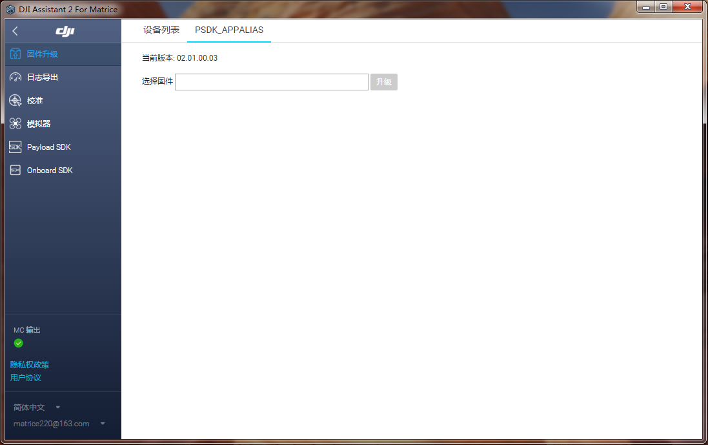

## 概述
本地升级是一个用于升级负载设备固件的功能，开发者使用本地升级功能，能够方便用户通过DJI Assistant 2 选择本地固件文件更新负载设备的固件。

> **说明：** 仅Matrice 300 RTK 支持PSDK 本地升级功能。


## 固件传输协议
开发在开发本地升级功能时，可调用接口`PsdkUpgrade_Init`指定传输协议并配置传输设置信息。

#### 使用FTP 协议      
PSDK 支持开发者使用FTP 协议传输所需升级的固件，开发者使用FTP 协议传输固件时，需为负载设备部署相应的FTP 服务器，详情请参见<a href="#1">部署FTP 服务器</a>。

> **说明** 
> * 仅基于Linux 平台开发的负载设备支持开发者通过网口使用FTP 协议传输所需升级的固件。
> * 使用FTP 协议传输负载设备固件时的用户账号为：`psdk_payload_ftp` 密码为：`DJi_#$31FTP`

#### 使用DCFTP 协议     
DCFTP，DJI Common File Transfer Protocol，是DJI 独有的文件传输协议，开发者通过调用指定的接口，即可获得所需的文件。
使用DCFTP 协议升级负载设备的固件时，请参考`T_PsdkUpgradeDcftpFileTransferOpt`，了解获取固件的方法，并在调用`PsdkUpgrade_Init()`接口时初始化该结构体。

> **说明** 
> * 使用RTOS 或没有网口的负载设备可使用该方式传输固件;
> * 由于该方式使用命令信号传输通道传输固件，传输速度较慢。

## <p id=1>部署FTP 服务器</p>
为方便开发者使用FTP 协议传输负载设备所需使用的固件，请按照如下步骤使用vsftpd 部署FTP 服务器。
#### 1. 安装FTP 服务器

1. 下载 [vsftpd]( https://security.appspot.com/downloads/vsftpd-3.0.3.tar.gz)；
2. 安装vsftpd 服务器安装包：
   > **说明：** 如需查询完整的安装方法，请参考目录中的INSTALL文件安装vsftpd。

   * 使用`tar -zxvf vsftpd-*.*.*.tar.gz`命令解压安装包
   * 进入`cd vsftpd-*.*.*/`目录
   * 按照如下顺序安装FTP 服务器：
   ```c
    make
    su
    cp vsftpd /usr/local/sbin/vsftpd
    cp vsftpd.conf.5 /usr/local/man/man5
    cp vsftpd.8 /usr/local/man/man8
    cp vsftpd.conf /etc
   ```
3. 创建secure_chroot_dir 目录：`mkdir /usr/share/empty`

#### 2. 配置FTP 服务器
1. 修改配置项：
   * 在`/etc/vsftpd.conf` 文件中，将anonymous_enable改为NO
    ```c
     anonymous_enable=NO
    ```
   * 设置如下配置项：
    ```c
    local_enable=YES
    write_enable=YES
   ```

2. 增加用户
* 使用`adduser` 命令，通过`--home` 指定用户目录
* 使用`userdel -r` 命令删除用户
* 增加升级负载设备固件的用户权限：`adduser psdk_payload_ftp --home /upgrade`
* 根据提示信息输入密码：DJi_#$31

#### 3. 运行FTP 服务器
1. 使用`sudo /usr/local/sbin/vsftpd &` 命令运行FTP 服务器
2. 配置启动项：在`/etc/rc.local` 中加入`/usr/local/sbin/vsftpd &`
3. 使用命令`ps aux | grep vsftpd` 检查FTP 服务的运行状态

## 实现本地升级功能

#### 1. 本地升级模块初始化
在使用本地升级功能前，请先初始化升级模块，并指定升级固件时所使用的传输协议。

```c
T_PsdkReturnCode PsdkUpgrade_Init(const T_PsdkUpgradeConfig *upgradeConfig);
```
#### 2. 开启本地升级功能
用户在使用本地升级功能前，需是使能本地升级功能，使能本地升级功能后，DJI Assistant 2 将会显示负载设备的升级界面，用户可选择所需的固件文件升级负载设备。
```c
T_PsdkReturnCode PsdkUpgrade_EnableLocalUpgrade(void);
```
#### 3. 升级流程
开发者根据结构体`T_PsdkUpgradeHandler`实现负载设备本地升级的函数，并通过`PsdkUpgrade_RegHandler()`接口注册负载设备本地升级的回调函数；通过函数`PsdkUpgrade_PushUpgradeState()`推送负载设备升级状态。

## 使用本地升级功能
#### 运行具有升级功能的程序
请在使用“本地升级“功能，参考[运行示例代码](../quickstart/run-the-sample.html)，编译出当前支持本地升级功能的程序。

###### Linux 平台运行环境调整
为使用升级功能，需要将程序设置为默认启动，请参考如下步骤：
1. 将编译生成的应用程序拷贝到`/usr/local/bin/`目录下；
2. 在`/etc/rc.local`中的增加以下配置项：
   * `chmod 666 /dev/ttyUSB0`
   * `chmod 755 /usr/local/bin/psdk_demo`
   * `/usr/local/bin/psdk_demo &`
   > **说明：** ttyUSB0 为连接负载设备的串口设备，开发者可根据实际的情况修改该名称
3. 重启负载设备，通过终端命令`ps aux | grep psdk_demo` 检查程序是否正常运行

###### STM32F4 平台运行环境调整
如需在STM32F4 平台上使用本地升级功能，开发者需先[将Bootloader 烧录到开发平台中](../quickstart/development-environment.html)，再烧录负载设备的固件，如下目录中的`STM32F4Platform`可为`psdk_development_board_1.0`（使用负载设备开发板）或`stm32f4_eval`（使用STM32 开发板）。

1. 将Bootloader 烧录到单片机中,Bootloader工程目录为：
 * sample/platform/rtos_freertos/STM32F4Platform/project/mdk_bootloader 
2. 将应用固件烧录到单片机中，应用固件目录为：
 * sample/platform/rtos_freertos/STM32F4Platform/project/mdk_release

> **说明**
> * Bootloader 是MCU 上电运行的程序，用于更新应用固件并执行应用固件。
> * 应用固件：实现负载设备的软件功能，编译Payload SDK Lib。

#### 编译固件
1. 修改固件版本号      
在`sample/api_sample/test_upgrade_common.h`文件中修改固件的版本号。
> **说明：** 修改版本号时，版本号不可低于当前版本，即负载设备当前使用的固件版本号为V02.01.00.03 时，请将版本号改为V02.01.00.04，如下示例所示。

```c
// firmware version
#define PSDK_TEST_FIRMWARE_VERSION_MAJOR        2
#define PSDK_TEST_FIRMWARE_VERSION_MINOR        1
#define PSDK_TEST_FIRMWARE_VERSION_MODIFY       0
#define PSDK_TEST_FIRMWARE_VERSION_DEBUG        4
```
2. 编译文件
编译负载设备所需升级的固件文件:
* STM32：负载设备的固件为STM32F4 工程目录下的`psdk_demo.bin`文件
* Linux: 负载设备的固件为编译后的`psdk_demo`程序文件

3. 修改固件文件名    
重新编译固件文件后，需修改编译后的固件的名称，如`PSDK_APPALIAS_V02.01.00.04.bin`。
文件名称格式：`Product Name_Vaa.bb.cc.dd.bin`
* Product Name：负载产品名（若开发者设置了负载别名，该名称则为负载别名）
* Vaa.bb.cc.dd：为负载四位版本号

> **说明：** 固件文件名称中的版本号需和代码中定义版本号一致，否则负载设备可能会升级失败。

#### 使用DJI Assistant 2 升级固件
打开DJI Assistant 2选择编译生成的固件升级文件（PSDK_APPALIAS_V02.01.00.04.bin），进行固件升级。
<div>
<div style="text-align: center"><p>图1. 使用DJI Assistant 2 升级负载设备的固件 </p>
</div>
<div style="text-align: center"><p><span>
      </span></p>
</div></div>

## Sample 升级原理介绍
#### Linux 程序文件升级原理
利用升级功能可以获取到需要更新的固件文件（通过FTP或DCFTP协议），将固件文件替换掉原先运行的程序文件，系统重启后完成固件升级。
> 相关参考
> * 负载设备升级流程：`api_sample/upgrade/` 
> * 使用本地升级功能：`platform/linux/manifold2/application/main.c`
> * 为在Linux 平台上开发的负载设备升级固件：`platform/linux/common/upgrade_platform_opt`

#### STM32F4单片机程序升级原理
使用STM32F4 开发的负载设备从Flash 中直接读取固件文件并运行负载设备程序，因此开发者需先烧录Bootloader 再烧录应用固件，烧录Bootloader 的步骤请参见[运行示例代码](../quickstart/run-the-sample.html)。   

##### STM32F4 固件升级流程
1. STM32F4 平台上电后，将启动MCU
2. 运行Bootloader 并判断升级状态：
   * 若无需升级固件，Bootloader 将跳转至应用固件区，并运行应用固件
   * 若需升级负载设备的固件，Bootloader 将在替换固件文件后，跳转至应用固件区，并运行应用固件

> **相关参考**
> * 实现Bootloader：`platform/rtos_freertos/STM32F4Platform/bootloader`
> * Bootloader工程目录：`platform/rtos_freertos/STM32F4Platform/project/mdk_bootloader`
> * 实现升级功能：`api_sample/upgrade/`
> * STM32F4 升级：`platform/rtos_freertos/STM32F4Platform/drivers/upgrade_platform_opt_stm32`
> * 初始化升级功能：`platform/rtos_freertos/STM32F4Platform/application/application.c`

> **说明：** 如上目录中的`STM32F4Platform`可为`psdk_development_board_1.0`或`stm32f4_eval`。

##### 修改Flash 地址空间（可选）
1. 修改地址定义：
修改`platform/rtos_freertos/STM32F4Platform/drivers/BSP/flash_if.h` 文件中的地址定义
```c
/* End of the Flash address */
#define FLASH_END_ADDRESS                   0x080FFFFF

/* Define the address from where user application will be loaded.
   NOTE the 1st sector 0x08000000-0x08007FFF is reserved for the IAP code */
#define APPLICATION_ADDRESS                 ADDR_FLASH_SECTOR_4
#define APPLICATION_ADDRESS_END             (ADDR_FLASH_SECTOR_8 - 1)

/* Define the user application size */
#define APPLICATION_FLASH_SIZE             (APPLICATION_ADDRESS_END - APPLICATION_ADDRESS + 1)

/* Define the address from where user application will be stored in upgrade mode */
#define APPLICATION_STORE_ADDRESS           ADDR_FLASH_SECTOR_8
#define APPLICATION_STORE_ADDRESS_END       (FLASH_END_ADDRESS)

/* Define the address for param store */
#define APPLICATION_PARAM_STORE_ADDRESS     ADDR_FLASH_SECTOR_2
#define APPLICATION_PARAM_STORE_ADDRESS_END (ADDR_FLASH_SECTOR_4 - 1)
```

地址分配声明： 
* bootloader：0x08000000～0x08007FFF
* Parameter Store Area：0x08008000～0x0800FFFF
* Application Firmware：0x08010000～0x0807FFFF
* Upgrade Firmware Store Area：0x08080000～0x080FFFFF


2. 配置中断向量
在`platform/rtos_freertos/STM32F4Platform/drivers/CMSIS/Device/Source/system_stm32f4xx.c` 文件中，填写应用固件的偏移地址

```c
/*!< Uncomment the following line if you need to relocate your vector Table in
     Internal SRAM. */
/* #define VECT_TAB_SRAM */
#ifdef USE_BOOTLOADER
//attention : this value is equal ( application address - 0x08000000 )
#define VECT_TAB_OFFSET  0x10000
#else
#define VECT_TAB_OFFSET  0x00
#endif
```

3. 修改工程配置信息
修改Bootloader 和应用固件中的工程配置信息，并填写正确的Flash 地址。
* Bootloader工程目录：`platform/rtos_freertos/STM32F4Platform/project/mdk_bootloader`
* 应用固件工程目录：`platform/rtos_freertos/STM32F4Platform/project/mdk_release`

<div>
<div style="text-align: center"><p>图2. 修改工程配置信息 </p>
</div>
<div style="text-align: center"><p><span>
      </span></p>
</div></div>
