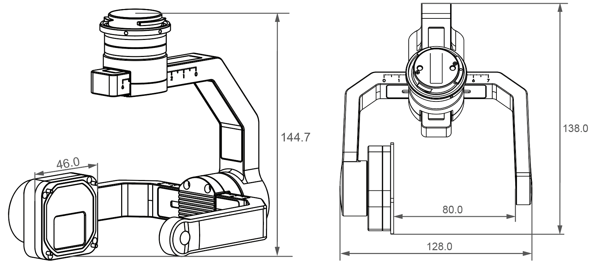

为确保无人机在搭载负载设备执行飞行任务时的安全，请在使用PSDK 开发负载设备时，遵循DJI 的负载设备开发标准。

> **注意** 
> * X-Port 和SkyPort V2 仅支持使用**PSDK V2.x.x**；
> * SkyPort 仅支持使用**PSDK V1.x.x** ；
> * DJI 已于 **2020年 2月 1日**停止对**PSDK V1.x.x** 和SkyPort 的开发，建议使用**X-Port** 或**SkyPort V2** 在**PSDK V2.x.x** 的基础上开发负载设备。

> **本文所指** 
> * “移动端APP” 为使用MSDK 开发的移动端APP 或DJI Pilot。
> * “负载设备” 为使用PSDK 开发的负载设备。
> * “机载计算机” 为运行了基于OSDK 开发的无人机控制程序的计算设备，如Manifold。

## 硬件标准
> **注意**
> * **禁止**将无人机或硬件平台的引脚短路。
> * **禁止**将无人机连接到电源输出系统或向飞机输入电流。

##### 使用 M300 RTK 
> **说明：** DJI M300 RTK 支持挂载使用<b>X-Port、SkyPort V2 和SkyPort </b> 开发的负载设备。
<table>
<thead>
<tr>
  <th>接口引脚</th> 
  <th>硬件平台</th> 
  <th>指标要求</th>
 </tr>
</thead>
 <tbody>
<tr>
  <td rowspan="3">普通功率输出</td>
  <td>X-Port</td>
  <td>13.6V / 2A</td>
 </tr>
 <tr>
  <td>SkyPort V2</td>
  <td>13.6V / 4A</td>
 </tr>
 <tr>
  <td>SkyPort</td>
  <td>13.6V / 4A</td>
 </tr>
 <tr>
  <td rowspan="2">高功率输出</td>
  <td>X-Port</td>
  <td>17V / 2.5A</td>
 </tr>
 <tr>
  <td>SkyPort V2</td>
  <td>17V / 4A</td>
 </tr>
  <tr>
  <td>高功率申请</td>
  <td>X-Port SkyPort V2</td>
  <td>0～3.3V</td>
 </tr>
 <tr>
  <td>PPS 引脚电压</td>
   <td rowspan="4">X-Port 
    SkyPort V2 
    SkyPort</td>
  <td>≤3.3V</td>  
 </tr>
 <tr>
  <td>UART 引脚</td>
  <td>须遵循3.3V TTL 协议</td>
 </tr>
 <tr>
  <td>LAN 接口</td>
  <td>须遵循LAN IEEE802.3 协议</td>
 </tr>
 <tr>
  <td>CAN 接口引脚</td>
  <td>须遵循CAN 协议</td>
 </tr>
</tbody>
</table>

##### 使用 M200 V2 Series

<table>
<thead>
<tr>
  <th>接口引脚</th>
  <th>硬件平台</th>
  <th>指标要求</th>
 </tr>
</thead>
 <tbody>
 <tr>
  <td rowspan="3">普通功率输出</td>
  <td>X-Port</td>
  <td>13.6V / 2A</td>
 </tr>
 <tr>
  <td>SkyPort V2</td>
  <td>13.6V / 4A</td>
 </tr>
 <tr>
  <td>SkyPort</td>
  <td>13.6V / 4A</td>
 </tr>
 <tr>
  <td rowspan="2">高功率输出</td>
  <td>X-Port</td>
  <td>17V / 2.5A</td>
 </tr>
 <tr>
  <td>SkyPort V2</td>
  <td>17V / 4A</td>
 </tr>
  <tr>
  <td>高功率申请</td>
  <td>X-Port SkyPort V2</td>
  <td>0～3.3V</td>
 </tr>
 <tr>
  <td>PPS 引脚电压</td>
  <td rowspan="3">X-Port 
    SkyPort V2 
    SkyPort</td>
  <td>≤3.3V</td>
 </tr>
 <tr>
  <td>UART引脚</td>
  <td>须遵循3.3V TTL 协议</td>
 </tr>
 <tr>
  <td>LAN接口</td>
  <td>须遵循LAN IEEE802.3 协议</td>
 </tr>
 <tr>
  <td>CAN接口引脚</td>
  <td>SkyPort</td>
  <td>须遵循CAN 协议</td>
 </tr>
</tbody>
</table>

##### 使用 M200 Series
> **说明：** DJI M200 Series 仅支持挂载使用<b>SkyPort</b> 开发的负载设备。
<table>
<thead>
<tr>
  <th>接口引脚</th>
  <th>指标要求</th>
 </tr>
</thead>
 <tbody>
 <tr>
  <td >普通功率输出</td>
  <td>12.7V / 4A</td>
 </tr>
 <tr>
  <td>PPS 引脚电压</td>
  <td>≤3.3V</td>
 </tr>
 <tr>
  <td>UART引脚</td>
  <td>须遵循3.3V TTL 协议</td>
 </tr>
 <tr>
  <td>LAN接口</td>
  <td>须遵循LAN IEEE802.3 协议</td>
 </tr>
 <tr>
  <td>CAN接口引脚</td>
  <td>须遵循CAN 协议</td>
 </tr>
</tbody>
</table>

## 电磁与声光噪声干扰
<table>
<thead>
 <tr>
      <th>干扰项</th>
      <th>M200 和M200 V2</th>
      <th>M300 RTK</th>
    </tr>
</thead>
<tbody>
    <tr>
      <td>光源闪烁</td>
      <td colspan="2" style="text-align: center">光源闪烁频率不可处于0.2～50Hz</td>
    </tr>
    <tr>
      <td>光波发射</td>
      <td colspan="2" style="text-align: center">规避波长：600～700nm</td>
    </tr>
    <tr>
      <td>磁场</td>
      <td colspan="2" style="text-align: center">• 禁止负载设备携带强磁性物质 • 禁止产生高强度交变磁场</td>
    </tr>
    <tr>
      <td rowspan="2">电磁波噪声</td>
      <td colspan="2" style="text-align: center">• 规避频段：1～1.7GHz；2.3～2.6GHz；5.7～5.9GHz • 等效全向辐射功率（EIRP）须小于1W</td>
    </tr>
    <tr>
      <td>• 规避频段：1～1.7GHz；2.4～2.5GHz；5.8～5.9GHz • 等效全向辐射功率（EIRP）须小于1W</td>
      <td>\</td>
      <tr>
      <td>声波噪声</td> 
      <td>规避频段：35～45KHz</td>
      <td>\</td>
    </tr>
    </tr>
</tbody>
</table>

## 结构标准
> **说明**
> * 为避免搭载在无人机上的负载设备受无人机飞行惯性的影响，撞击电池仓和桨叶，损毁无人机或负载设备，请合理地设计负载设备的尺寸。
> * 为避免负载设备影响无人机的转动惯量，请尽量缩小负载设备的尺寸。  

#### 挂载说明
 * M200 和M200 V2 系列无人机
当单个负载设备的重量在**600～1200g** 时，为避免损坏减震球，请使用双云台承载负载设备的重量。请确保负载设备的重心在**双云台接口连线中心的垂线上**。
 * M300 RTK 
挂载在M300 RTK 上的负载设备总重量，不可超过无人机最大载重2.7Kg；使用云台支架时，单个云台接口可搭载的负载设备重量应小于850g。

#### 通用结构标准

<table id="PSDK technical integration notes">
  <thead>
    <tr>
      <th width="100">结构参数</th>
      <th width="400">M200 和M200 V2</th>
      <th>M300 RTK </th>
    </tr>
  </thead>
  <tbody>
  <tr>
      <td>结构干涉</td>
      <td colspan=2 style="text-align: center">在无人机执行飞行任务时，<b>禁止</b>负载设备碰撞到无人机上的各个部件</td>
    </tr>
    <tr>
      <td>振动</td>
      <td colspan="2" style="text-align: center">无人机开机后，在静止状态下，负载设备<b>不可产生影响IMU的振动</b>（在DJI Pilot 或移动端APP 上可查看IMU 状态）</td>
    </tr>
      <tr>
      <td>外壳温度</td>
      <td colspan=2 style="text-align: center">≤70℃</td>
    </tr>
    <tr>
      <td>重量</td>
      <td>不可超过无人机最大负载重量：1.2Kg </td>
      <td> 不可超过无人机最大负载重量：2.7Kg； 使用云台支架时，单个云台可挂载的负载设备重量不得超过850g </td>
    </tr>
    <tr>
      <td>重心</td>
      <td>负载设备的重量小于600g 时，负载设备的重心应在<b>云台口中心的垂直线上</b>；若负载设备的重量在600g～1200g 间，负载设备的重心应在<b>双云台接口连线的中心垂线上</b></td>
      <td>使用云台支架挂载负载设备，负载设备的重心需处于云台接口中心的垂线上</td>
    </tr>
     <tr>
      <td>运动轨迹</td>
      <td>负载设备的运动轨迹不可遮盖<b>传感器和通风孔</b>： 1. 前视视觉传感器的视场角：75° × 60°（水平×竖直）； 2. 下视视觉传感器的视场角为75° × 60°（横向×纵向）； 3. 距超声波传感器10cm 的范围内，传感器的感应范围为100°，10cm外的感应范围为70°； 4.距红外传感器15cm 的范围内，红外传感器的感应范围为60°，15cm外的感应范围为20°； 5.距无人机机身前部与尾部10 cm 的范围为进风口和出风口。</td>
      <td>负载设备的运动轨迹不可遮盖<b>传感器和通风孔</b>  1. 前视与后视视觉传感器的视场角为70° × 56°（水平*竖直）； 2. 上视视觉传感器的视场角为64° × 79°（横向 × 纵向）； 3. 下视视觉传感器的视场角为56° × 70°（横向 × 纵向）； 4. 左视与右视视觉传感器的视场角为79° × 64°（水平 × 竖直）； 5. 六向红外传感器的视场角为30°； 6. 距无人机机身底部与顶部5cm 的范围为进风口和出风口。</td>
    </tr>
   </tbody>
</table>

#### X-Port 负载结构标准
##### X-Port 标准云台结构
X-Port 标准云台的结构如 图1. X-Port 标准云台 所示：

图1. X-Port 标准云台（单位：mm）

      

##### X-Port 负载结构
在设计负载设备的结构前，请根据实际的使用需要选择起落架；若负载设备的尺寸囿于原始脚架的高度限制，请选择选择购置加长起落架。

<table>
<thead>
<tr>
  <th>云台类型</th>
  <th>俯仰轴转动限制（怠速）</th>
  <th>脚架类型</th>
  <th>X-Port 负载结构限制</th>
 </tr>
</thead>
 <tbody>
 <tr>
  <td rowspan="4">单云台</td>
  <td rowspan="2">限制</td>
  <td>原始起落架</td>
  <td>负载设备下表面垂直于俯仰轴的距离不超过54mm</td>
 </tr>
 <tr>
  <td>加长起落架</td>
  <td>负载设备下表面垂直于俯仰轴的距离不超过72mm</td>
 </tr>
 <tr>
  <td rowspan="2">不限制</td>
  <td>原始起落架</td>
  <td>负载设备在以质心为球心，直径为118mm 的球内</td>
 </tr>
  <tr>
  <td>加长起落架</td>
  <td>负载设备在以质心为球心，直径为154mm 的球内</td>
 </tr>
 <tr>
  <td rowspan="4">双云台</td>
  <td rowspan="2">限制</td>
  <td>原始起落架</td>
  <td>负载设备下表面垂直于俯仰轴的距离不超过45mm</td>
 </tr>
 <tr>
  <td>加长起落架</td>
  <td>负载设备下表面垂直于俯仰轴的距离不超过63mm</td>
 </tr>
 <tr>
  <td rowspan="2">不限制</td>
  <td>原始起落架</td>
  <td>负载设备在以质心为球心，直径为100mm 的球内</td>
 </tr>
  <tr>
  <td>加长起落架</td>
  <td>负载设备在以质心为球心，直径为136mm 的球内</td>
 </tr>
</tbody>
</table>

使用X-Port 开发的负载设备需符合如下要求：    
* X-Port 轴臂的宽度为**80mm**，为确保负载设备能够正常转动，负载设备的宽度**不可**超出该轴距；    
* 负载设备的重量**不可**超过 **450g**，超出该质量的负载设备可能会损坏云台支架或减震球；    
* 普通负载设备的质心需要在安装结构的轴心线上，负载设备上扬45° 时，不可影响X-Port 的正常转动；请确保可变焦的负载设备在最大变焦倍数时，负载设备的质心在安装轴的**轴线**上；
* 无人机在静置状态下，若负载设备可能会触碰到地面，建议使用**加长起落架**；    
* 请确保安装负载设备的接口与X-Port 主轴臂的防水垫圈**完全贴合**；   
* 推荐负载设备使用铝合金材质的外壳，不建议使用**塑料材质**的外壳或**碳纤维材质**的外壳。    

## 数据传输
##### 使用M200 V2 Series 或M300 RTK

<table>
<thead>
    <tr>
      <th>通道类型</th>
      <th>传输方向</th>
      <th>速率限制</th>
    </tr>
  </thead>
<tbody>
 <tr>
    <td rowspan="4">命令通道</td>
    <td rowspan="1">移动端APP ➟ 负载设备</td>
    <td rowspan="4">≤4096B/s</td>
    </tr>
     <tr>
      <td>负载设备 ➟ 移动端APP </td>
    </tr>
    <tr>
      <td>机载计算机 ➟ 负载设备</td>
    </tr>
    <tr>
      <td>负载设备 ➟ 机载计算机</td>
    </tr>
    <tr>
      <td>高速数据传输通道</td>
      <td>负载设备 ➟ 移动端APP</td>
      <td>单云台：≤ 8192Kbps 多云台：每个云台的传输速率≤ 4096Kbps</td>
    </tr>
</tbody>    
</table>

##### 使用M200 Series

> **说明：** DJI M200 Series 仅支持使用<b>SkyPort</b> 开发的负载设备与移动端APP 间传输数据信息。
<table>
<thead>
    <tr>
      <th>通道类型</th>
      <th>传输方向</th>
      <th>速率限制</th>
    </tr>
  </thead>
<tbody>
 <tr>
       <td rowspan="2">命令通道</td>
      <td>移动端APP ➟ 负载设备</td>
      <td>≤500B/s</td>
    </tr>
    <tr>
      <td>负载设备 ➟ 移动端APP</td>
      <td>≤3072B/s</td>
    </tr>
    <tr>
      <td>高速数据传输通道</td>
      <td>负载设备 ➟ 移动端APP</td>
      <td>单云台：≤8192Kbps 双云台：每个云台的传输速率≤4096Kbps</td>
    </tr>
</tbody>    
</table>

## 视频标准
使用PSDK 开发的**相机类**负载设备，**必须**使用**H.264 编码标准**。

1. 视频分辨率最大不超过**1920 × 1080**；
2. 帧率最大不超过**30fps**，最大码率不超过**8Mbps**；
3. 推荐视频长宽比为4：3（使用DJI CrystalSky时，画面可占满屏幕）。

> **注意：** 使用H.264 编码标准时，GOP 编码结构必须选用Period I（帧内编码帧，每隔1 秒将插入1 个IDR 帧，确保图像数据丢失时可被恢复）。

基于PSDK 开发的**相机类**负载设备，在使用**H.264 编码标准**时，需注意如下关键配置信息：       
<table id="表1.Topic information table">
  <thead>
    <tr>
      <th>关键项</th>
      <th>H.264 标准项</th>
      <th>取值</th>
    </tr>
  </thead>
  <tbody>
 <tr>
      <td>档次 </td>
      <td> Level Number</td>
      <td> ＜5.1 </td>
</tr>
<tr>
      <td>profile_idc</td>
      <td>7.3.2.1.1</td>
      <td> Baseline=66，Main=77，High=100 </td>
</tr>
<tr>
      <td>YUV420 格式 </td>
      <td>7.3.2.1.1</td>
      <td>chroma_format_idc=1 </td>
</tr>
<tr>
      <td>8Bit 视频 </td>
      <td>7.3.2.1.1</td>
      <td>bit_depth_luma_minus8=0 bit_depth_chroma_minus8=0 </td>
</tr>
<tr>
      <td>不允许编码器自定义 Scaling Matrix </td>
      <td> 7.3.2.1.1 7.3.2.2 </td>
      <td>seq_scaling_matrix_present_flag=0  
      pic_scaling_matrix_present_flag=0 </td>
</tr>
<tr>
      <td>仅支持帧格式编码，不支持场编码 </td>
      <td>7.3.2.1.1 </td>
      <td>frames_mbs_only_flag=1</td>
</tr>
<tr>
      <td>仅允许 P 帧和 I 帧，且P 帧有单个参考帧 </td>
      <td>7.3.3   7.3.2.2   7.3.3 </td>
      <td> slice_type = 0 或 2  num_ref_idx_l0_default_active_minus1=0   num_ref_idx_active_override_flag=0</td>
</tr>
<tr>
      <td>不支持多Slice Group </td>
      <td>7.3.2.2 </td>
      <td>num_slice_groups_minus1=0 </td>
</tr>
</tbody>
</table>

> **相关参考：** <a href="https://www.itu.int/rec/T-REC-H.264-201906-I/en">H.264 协议标准</a>

