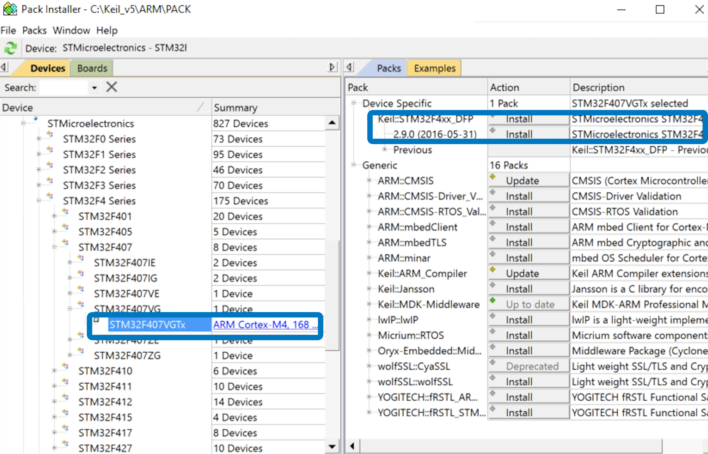

## 获取基础软件

* [DJI Assistant 2](https://www.dji.com/cn/downloads)
* [DJI Pilot](https://www.dji.com/cn/downloads)
* [Payload SDK 软件开发工具包](https://developer.dji.com/user)
* [Mobile SDK 软件开发工具包](https://developer.dji.com/user)  （可选）

## 配置RTOS 开发环境
* 安装[Keil MDK](http://www2.keil.com/mdk5/)和相关开发工具
    * C Compiler:  Armcc.exe V5.06 update 6 (build 750)
    * Assembler:              Armasm.exe V5.06 update 6 (build 750)
    * Linker/Locator:         ArmLink.exe V5.06 update 6 (build 750)
    * Library Manager:        ArmAr.exe V5.06 update 6 (build 750)
    * Hex Converter:          FromElf.exe V5.06 update 6 (build 750)

* 使用Keil软件    
**激活Keil MDK 软件**后，使用Keil Pack Installer 或<a href="http://www.keil.com/dd2/Pack/" target="_blank">手动下载</a>最新的STM32F4xx_DFP.2.x.x 驱动包，如 图1.安装Pack 包 所示。

图1.安装Pack 包

      

## 配置Linux 开发环境
使用Linux 开发环境时，请安装如下开发工具：

* C编译器： GCC 5.4.0/5.5.0 版本
* CMake：2.8 及以上版本
* ffmpeg：4.1.3 及以上版本  （可选）