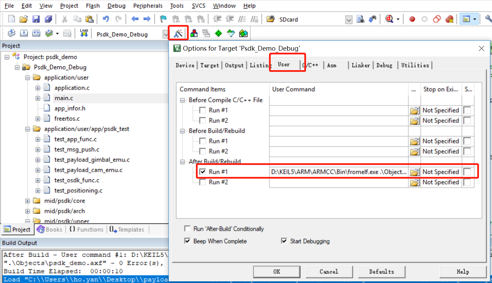

为方便您快速解决所遇到的问题，建议您先在<a href="https://bbs.dji.com/forum-79-1.html?from=developer">DJI 技术支持社区</a>中寻找解决问题的方法；若您的问题无法解决或有其他咨询事项，请使用<a href="https://formcrafts.com/a/dji-developer-feedback-cn">问题反馈</a>表单反馈问题，或向DJI SDK 团队发送<a href="mailto:dev@dji.com">邮件</a>，DJI 感谢您的支持和关注。

> **注意：** DJI 已于 2020年 2月 1日停止对PSDK V1.5.x 和SkyPort 的开发，建议使[X-Port](https://store.dji.com/cn/product/dji-x-port) 或SkyPort V2 在PSDK V2.x.x 的基础上开发负载设备。

## SkyPort 常见问题
#### SkyPort 同轴线端口接插座型号的什么
DF56C-40S-0.3V

#### SkyPort绑定应用程序时提示“固件异常”
请检查DJI Assistant 2 的版本（2.0.8 及以上），否则请将DJI Assistant 2 升级到最新版本。

#### 如何更改SkyPort 的固件 ？
如需更改SkyPort 的固件版本，请修改PSDK 示例代码`app_info.h`文件中的版本号。
指定版本号后，用户将无法使用SkyPort 最新的固件。

#### SkyPort绑定应用程序时，提示“开发者账号非法”
* 请确认登录DJI Assistant 2 、申请负载设备APP 和负载设备控制程序（app_info.h文件）中的账号为同一开发者账号。
* 请确认已正确地将APP名称、APP ID及APP KEY 等信息填写到 app_info.h文件中。

#### DJI Assistant 2 无法获取负载设备的信息
请按下述步骤确认负载设备的状态：
1. 请确认已成功将负载设备控制程序写入或烧入开发板；
2. 请确认开发板的工作模式为串口模式（正常时，三颗蓝灯全亮，否则请点按KEY2）；
3. 请将DJI Assistant 2 设置为串口模式；
4. 请在SKYPORT 设置页面下方，选择UART 接口（波特率为115200）。

> **说明**
* 如需获取负载设备推送的信息，请打开“信息推送”开关。
* 如需获取无人机电池的信息，除在“信息推送”中打开推送电池信息的开关外，还需调用`batteryInfoMsgCallBack()` 接口获取无人机电池的信息。

## 编译问题
#### 使用Keil MDK 编译示例代码时无法生成.bin文件 
* 故障原因：未指定示例代码的位置。
* 解决方法：请在Keil MDK 中指定需编译的示例代码的位置，默认路径为`C:\Keil_v5\ARM\ARMCC\Bin\fromelf.exe.\Objects\psdk_demo.axf --bin --output .\psdk_demo.bin`，如图3. 指定示例代码的位置 所示。

<div>
<div style="text-align: center"><p>图3. 指定示例代码的位置</p>
</div>
<div style="text-align: center"><p><span>
      </span></p>
</div></div>

## 常见接口问题
#### gpsInfoMsg与gpsRawDataMsg的区别是什么？
* `gpsInfoMsg`：该接口用于获取无人机GPS 融合数据，即由GPS、GLONASS、BeiDou、Galileo四个GNSS 数据处理后的数据（弧度制），该接口最多可推送小数点后16位。
* `gpsRawDataMsg`：该接口用于获取GPS 原始数据。

#### 如何使用PSDK 1.5.x 中打印日志的接口
请使用UART 1 接口，调用`void LOG_Init(void)`接口：
```c
void LOG_Init(void)
{
    UART_Init(UART_NUM_1, 460800);
    isLogInit=1;
}
```
在调试负载设备时，请确保终端工具的波特率为460800，否则，日志中的内容可能是乱码。

#### 如何获取负载设备的调试信息
请在头文件`app_config.h`中将`APPLICATION_TEST`设置为TRUE。

#### 如何启用文本输入框功能
请在test_app_func.c 文件中将`textInputBoxDisplayControlFlag` 的值为`PSDK_APPFUNC_TEXT_INPUT_BOX_DISPLAY` .

#### 如何获取负载设备的状态？
请使用`T_UavStateMsg`中的`E_Constants_Psdk_Motor_State`和`E_Constants_Psdk_Land_State`获取无人机电机和降落的状态


