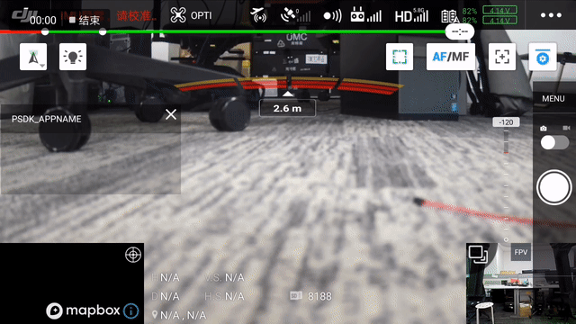

## 概述
为满足开发者对相机类负载设备的控制需求，PSDK 提供了**控制**相机执行拍照、录像、变焦及对焦等功能的接口，开发者需**先实现**相机拍照、录像以及测光等功能，再通过注册PSDK 相机类的接口，开发出功能完善的相机类负载设备；通过使用DJI Pilot 以及基于MSDK 开发的移动端APP，用户能够控制使用PSDK 开发的相机类负载设备执行指定的动作，获取负载设备中的信息和资源。

* 基础功能：设置相机模式、拍照、录像、获取相机状态、SD 卡管理、视频流传输
* 高级功能：变焦、测光、对焦、回放下载

## 基础概念
#### 相机模式
使用相机类功能前，需要先设置相机类负载设备的模式，不同的模式指定了相机类负载设备在执行某个任务时的工作逻辑。

* 拍照：在该模式下，用户能够触发相机类负载设备拍摄照片。
* 录像：在该模式下，用户能够触发相机类负载设备录制影像。
* 视频回放：在该模式下，用户可以在移动端APP 上播放或下载负载设备上的媒体文件。

>**注意：** 相机只能在一种模式中执行相应的操作，如在录像模式下**仅能录像无法拍照**。

#### 拍照模式
使用PSDK 开发的相机类负载设备支持以下拍照模式：

* 单拍：下发拍照命令后，相机拍摄单张照片。  
* 连拍：下发拍照命令后，相机将连续拍摄指定数量的照片；当前支持2/3/5/7/10/14张连拍。
* 定时拍照：下发拍照命令时，相机按照指定的时间间隔，拍摄指定数量的照片。
    * 当前支持2/3/5/7/10秒时间间隔；
    * 当前最大支持指定拍摄254 张照片，当拍照张数为255的时候，相机将不间断地拍摄照片。

## 实现相机类基础功能
请开发者根据选用的**开发平台**以及行业应用实际的使用需求，按照PSDK 中的结构体`T_PsdkCameraCommonHandler`构造实现相机类负载设备设置相机模式、拍照和录像等功能的函数，将相机功能的函数注册到PSDK 中指定的接口后，用户通过使用DJI Pilot 或基于MSDK 开发的移动端APP 能够控制基于PSDK 开发的相机类负载设备执行相应的动作。     

```c
    // 获取负载设备系统当前的状态
    s_commonHandler.GetSystemState = GetSystemState;
    // 实现设置相机类负载设备模式的功能
    s_commonHandler.SetMode = SetMode;
    s_commonHandler.GetMode = GetMode;
    // 实现开始或停止录像的功能
    s_commonHandler.StartRecordVideo = StartRecordVideo;
    s_commonHandler.StopRecordVideo = StopRecordVideo;
    // 实现开始或停止拍照的功能
    s_commonHandler.StartShootPhoto = StartShootPhoto;
    s_commonHandler.StopShootPhoto = StopShootPhoto;
    // 实现设置相机类负载设备的拍照功能
    s_commonHandler.SetShootPhotoMode = SetShootPhotoMode;
    s_commonHandler.GetShootPhotoMode = GetShootPhotoMode;
    s_commonHandler.SetPhotoBurstCount = SetPhotoBurstCount;
    s_commonHandler.GetPhotoBurstCount = GetPhotoBurstCount;
    s_commonHandler.SetPhotoTimeIntervalSettings = SetPhotoTimeIntervalSettings;
    s_commonHandler.GetPhotoTimeIntervalSettings = GetPhotoTimeIntervalSettings;
    // 实现SD 卡管理功能
    s_commonHandler.GetSDCardState = GetSDCardState;
    s_commonHandler.FormatSDCard = FormatSDCard;
```

## 基础功能初始化
使用PSDK 开发负载设备的相机功能时，必须要初始化相机模块并注册相机类的功能。

#### 1. 相机类功能模块初始化
在使用相机类功能前，必须先调用接口`PsdkPayloadCamera_Init`初始化相机类负载设备，确保相机类负载设备可正常工作。

```c
    T_PsdkReturnCode returnCode;

    returnCode = PsdkPayloadCamera_Init();
    if (returnCode != PSDK_RETURN_CODE_OK) {
        PsdkLogger_UserLogError("payload camera init error:%lld", returnCode);
    }
```

#### 2. 注册相机类基础功能
开发者**实现**相机类负载设备设置相机模式、拍照和录像等功能后，需要通过`PsdkPayloadCamera_RegCommonHandler`注册相机类基础功能。

```c
    returnCode = PsdkPayloadCamera_RegCommonHandler(&s_commonHandler);
    if (returnCode != PSDK_RETURN_CODE_OK) {
        PsdkLogger_UserLogError("camera register common handler error:%lld", returnCode);
    }
```

## 使用SD 卡管理功能

>**说明** 
> * 使用X-Port 开发的相机类负载设备需要实现存储媒体文件的功能并将该功能注册到PSDK 指定的接口中。X-Port 上的存储卡仅支持存放X-Port 日志信息，无法存储负载设备产生的媒体文件;
> * 本教程以**模拟**SD 卡管理功能为例，介绍使用PSDK SD 卡管理功能的使用方法，如需开发具有SD 卡管理功能的负载设备，请调用负载设备系统的接口实现SD 卡管理功能。

#### 1. SD 卡模块初始化          
使用SD 卡管理功能，需要开发者先开发并注册操作SD 卡功能的函数，通过初始化SD 卡管理模块，获取SD 卡的状态信息。

```c
    s_cameraSDCardState.isI0nserted = true;
    s_cameraSDCardState.totalSpaceInMB = SDCARD_TOTAL_SPACE_IN_MB;
    s_cameraSDCardState.remainSpaceInMB = SDCARD_TOTAL_SPACE_IN_MB;
    s_cameraSDCardState.availableCaptureCount = SDCARD_TOTAL_SPACE_IN_MB / SDCARD_PER_PHOTO_SPACE_IN_MB;
    s_cameraSDCardState.availableRecordingTimeInSeconds = SDCARD_TOTAL_SPACE_IN_MB / SDCARD_PER_SECONDS_RECORD_SPACE_IN_MB;
```

#### 2. 获取SD 卡的当前状态  
基于PSDK 开发的负载设备控制程序调用`GetSDCardState`接口能够获取负载设备上SD 卡当前的状态，用户使用DJI Pilot 以及基于MSDK 开发的APP 能够查看负载设备中SD 卡的状态信息。  

```c
    // 预估可拍照张数和可录像时长的功能。
    if (s_cameraState.isRecording) {
        s_cameraState.currentVideoRecordingTimeInSeconds++;
        s_cameraSDCardState.remainSpaceInMB =
                        s_cameraSDCardState.remainSpaceInMB - SDCARD_PER_SECONDS_RECORD_SPACE_IN_MB;
        if (s_cameraSDCardState.remainSpaceInMB > SDCARD_TOTAL_SPACE_IN_MB) {
            s_cameraSDCardState.remainSpaceInMB = 0;
            s_cameraSDCardState.isFull = true;
        }
    }
    // 获取SD 卡的状态
    static T_PsdkReturnCode GetSDCardState(T_PsdkCameraSDCardState *sdCardState)
    {
        PsdkLogger_UserLogDebug("get sdcard state");
        memcpy(sdCardState, &s_cameraSDCardState, sizeof(T_PsdkCameraSDCardState));

        return PSDK_RETURN_CODE_OK;
    }
```

#### 3. 使用SD 卡格式化功能
基于PSDK 开发的负载设备控制程序调用`FormatSDCard`接口能够控制负载设备执行SD 卡格式化，用户使用DJI Pilot 以及基于MSDK 开发的APP 可获取负载设备中SD 卡的状态信息并控制负载设备执行SD 卡格式化功能，如 图1. SD 卡管理功能 所示。

```c
    static T_PsdkReturnCode FormatSDCard(void)
    {
        PsdkLogger_UserLogDebug("format sdcard");
        memset(&s_cameraSDCardState, 0, sizeof(T_PsdkCameraSDCardState));
        s_cameraSDCardState.isInserted = true;
        s_cameraSDCardState.totalSpaceInMB = SDCARD_TOTAL_SPACE_IN_MB;
        s_cameraSDCardState.remainSpaceInMB = SDCARD_TOTAL_SPACE_IN_MB;
        s_cameraSDCardState.availableCaptureCount = SDCARD_TOTAL_SPACE_IN_MB / SDCARD_PER_PHOTO_SPACE_IN_MB;
        s_cameraSDCardState.availableRecordingTimeInSeconds =
            SDCARD_TOTAL_SPACE_IN_MB / SDCARD_PER_SECONDS_RECORD_SPACE_IN_MB;
        return PSDK_RETURN_CODE_OK;
    }
```
       
<div>
<div style="text-align: center"><p>图1. SD 卡管理功能  </p>
</div>
<div style="text-align: center"><p><span>
      </span></p>
</div></div>

## 使用模式设置功能
基于PSDK 开发的负载设备控制程序调用`SetMode`和`GetMode`接口能够设置相机的模式，用户使用DJI Pilot 能够切换相机类负载设备的工作模式，如 图2. 设置相机模式 所示。

```c
    static T_PsdkReturnCode GetSystemState(T_PsdkCameraSystemState *systemState)
    {
        PsdkLogger_UserLogDebug("get camera system status info");
        *systemState = s_cameraState;
        return PSDK_RETURN_CODE_OK;
    }

    static T_PsdkReturnCode SetMode(E_PsdkCameraMode mode)
    {
        s_cameraState.cameraMode = mode;
        PsdkLogger_UserLogDebug("set camera mode:%d", mode);
        return PSDK_RETURN_CODE_OK;
    }

    static T_PsdkReturnCode GetMode(E_PsdkCameraMode *mode)
    {
        *mode = s_cameraState.cameraMode;
        PsdkLogger_UserLogDebug("get camera mode:%d", *mode);
        return PSDK_RETURN_CODE_OK;
    }
```
<div>
<div style="text-align: center"><p>图2. 设置相机类负载设备的模式 </p>
</div>
<div style="text-align: center"><p><span>
      </span></p>
</div></div>

## 使用拍照功能
>**说明：** 使用拍照功能前，用户需要在DJI Pilot 或基于MSDK 开发的移动端APP 上将相机类负载设备的工作模式设置为拍照模式。   

#### 1. 设置相机类负载设备的拍照模式
基于PSDK 开发的负载设备控制程序调用`SetShootPhotoMode`和`GetShootPhotoMode`接口能够设置并获取相机类负载设备的模式，用户使用DJI Pilot 以及基于MSDK 开发的移动端APP 可设置并获取相机类负载设备的拍照模式。     

```c
static T_PsdkReturnCode SetShootPhotoMode(E_PsdkCameraShootPhotoMode mode)
{
    s_cameraShootPhotoMode = mode;
    PsdkLogger_UserLogDebug("set shoot photo mode:%d", mode);

    return PSDK_RETURN_CODE_OK;
}

static T_PsdkReturnCode GetShootPhotoMode(E_PsdkCameraShootPhotoMode *mode)
{
    *mode = s_cameraShootPhotoMode;
    PsdkLogger_UserLogDebug("get shoot photo mode:%d", *mode);

    return PSDK_RETURN_CODE_OK;
}
```

#### 2. 控制相机单拍
基于PSDK 开发的负载设备控制程序调用`StartShootPhoto`和`StopShootPhoto`接口控制相机类负载设备拍摄单张照片，用户使用DJI Pilot 以及基于MSDK 开发的移动端APP 可控制相机类负载设备拍摄单张照片。

```c
    static T_PsdkReturnCode StartShootPhoto(void)
    {
        PsdkLogger_UserLogDebug("start shoot photo");
        s_cameraState.isStoring = true;

        if (s_cameraShootPhotoMode == PSDK_CAMERA_SHOOT_PHOTO_MODE_SINGLE) {
            s_cameraState.shootingState = PSDK_CAMERA_SHOOTING_SINGLE_PHOTO;
        } else if (s_cameraShootPhotoMode == PSDK_CAMERA_SHOOT_PHOTO_MODE_BURST) {
            s_cameraState.shootingState = PSDK_CAMERA_SHOOTING_BURST_PHOTO;
        } else if (s_cameraShootPhotoMode == PSDK_CAMERA_SHOOT_PHOTO_MODE_INTERVAL) {
            s_cameraState.shootingState = PSDK_CAMERA_SHOOTING_INTERVAL_PHOTO;
            s_cameraState.isShootingIntervalStart = true;
            s_cameraState.currentPhotoShootingIntervalTimeInSeconds = s_cameraPhotoTimeIntervalSettings.timeIntervalSeconds;
        }

        return PSDK_RETURN_CODE_OK;
    }

    static T_PsdkReturnCode StopShootPhoto(void)
    {
        PsdkLogger_UserLogDebug("stop shoot photo");
        s_cameraState.shootingState = PSDK_CAMERA_SHOOTING_PHOTO_IDLE;
        s_cameraState.isStoring = false;
        s_cameraState.isShootingIntervalStart = false;

        return PSDK_RETURN_CODE_OK;
    }
```

#### 3. 控制相机连拍
基于PSDK 开发的负载设备控制程序调用`SetPhotoBurstCount`和`GetPhotoBurstCount`接口控制相机类负载设备连拍，用户使用DJI Pilot 以及基于MSDK 开发的移动端APP 可设置相机类负载设备的连拍张数，控制相机类负载设备拍摄指定数量的照片。

```c
    static T_PsdkReturnCode SetPhotoBurstCount(E_PsdkCameraBurstCount burstCount)
    {
        s_cameraBurstCount = burstCount;
        PsdkLogger_UserLogDebug("set photo burst count:%d", burstCount);
        return PSDK_RETURN_CODE_OK;
    }

    static T_PsdkReturnCode GetPhotoBurstCount(E_PsdkCameraBurstCount *burstCount)
    {
        *burstCount = s_cameraBurstCount;
        PsdkLogger_UserLogDebug("get photo burst count:%d", *burstCount);

        return PSDK_RETURN_CODE_OK;
    }
```

#### 4. 控制相机定时拍照
基于PSDK 开发的负载设备控制程序调用`SetPhotoTimeIntervalSettings`和`GetPhotoTimeIntervalSettings`接口控制相机类负载设备定时拍照，用户使用DJI Pilot 以及基于MSDK 开发的移动端APP 可设置相机类负载设备的拍照间隔，控制相机类负载设备按照指定的时间间隔拍摄照片。

```c
    static T_PsdkReturnCode SetPhotoTimeIntervalSettings(T_PsdkCameraPhotoTimeIntervalSettings settings)
    {
        s_cameraPhotoTimeIntervalSettings.captureCount = settings.captureCount;
        s_cameraPhotoTimeIntervalSettings.timeIntervalSeconds = settings.timeIntervalSeconds;
        PsdkLogger_UserLogDebug("set photo interval settings count:%d seconds:%d", settings.captureCount,
                                settings.timeIntervalSeconds);

        return PSDK_RETURN_CODE_OK;
    }

    static T_PsdkReturnCode GetPhotoTimeIntervalSettings(T_PsdkCameraPhotoTimeIntervalSettings *settings)
    {
        memcpy(settings, &s_cameraPhotoTimeIntervalSettings, sizeof(T_PsdkCameraPhotoTimeIntervalSettings));
        PsdkLogger_UserLogDebug("get photo interval settings count:%d seconds:%d", settings->captureCount,
                                settings->timeIntervalSeconds);

        return PSDK_RETURN_CODE_OK;
    }
```

### 5. 拍照状态管理
在DJI Pilot 以及使用MSDK 开发的移动端APP 中点击“拍照”按钮后，使用PSDK 开发的相机类负载设备在指定的时间内（如1.5s）在线程中执行拍照、照片存储和内存状态更新的操作。

#### 1. 确认拍照状态   
使用PSDK 开发的相机类负载设备在执行完拍照动作后，需要获取负载设备的拍照状态。

```c
if (s_cameraState.shootingState != PSDK_CAMERA_SHOOTING_PHOTO_IDLE && photoCnt++ > 150) {
    s_cameraState.isStoring = false;
    s_cameraState.shootingState = PSDK_CAMERA_SHOOTING_PHOTO_IDLE;
    photoCnt = 0;

}
```

#### 2. 存储照片  
相机类负载设备在执行完拍照后，使用PSDK 开发的相机类负载设备将相机拍摄的照片存储在**相机类负载设备上**的内存卡中。

* 存储单拍模式下相机类负载设备拍摄的照片
 
```c
  if (s_cameraShootPhotoMode == PSDK_CAMERA_SHOOT_PHOTO_MODE_SINGLE) {
            s_cameraSDCardState.remainSpaceInMB =
                s_cameraSDCardState.remainSpaceInMB - SDCARD_PER_PHOTO_SPACE_IN_MB;
              }
```

* 存储连拍模式下相机类负载设备拍摄的照片     

```c
if (s_cameraShootPhotoMode == PSDK_CAMERA_SHOOT_PHOTO_MODE_SINGLE) {
    s_cameraSDCardState.remainSpaceInMB =
        s_cameraSDCardState.remainSpaceInMB - SDCARD_PER_PHOTO_SPACE_IN_MB;
} else if (s_cameraShootPhotoMode == PSDK_CAMERA_SHOOT_PHOTO_MODE_BURST) {
    s_cameraSDCardState.remainSpaceInMB =
        s_cameraSDCardState.remainSpaceInMB - SDCARD_PER_PHOTO_SPACE_IN_MB * s_cameraBurstCount;
}
```

* 存储定时拍照模式下相机类负载设备拍摄的照片

```c
if (s_cameraShootPhotoMode == PSDK_CAMERA_SHOOT_PHOTO_MODE_SINGLE) {
      s_cameraSDCardState.remainSpaceInMB =
          s_cameraSDCardState.remainSpaceInMB - SDCARD_PER_PHOTO_SPACE_IN_MB;
  } else if (s_cameraShootPhotoMode == PSDK_CAMERA_SHOOT_PHOTO_MODE_BURST) {
      s_cameraSDCardState.remainSpaceInMB =
          s_cameraSDCardState.remainSpaceInMB - SDCARD_PER_PHOTO_SPACE_IN_MB * s_cameraBurstCount;
  } else if (s_cameraShootPhotoMode == PSDK_CAMERA_SHOOT_PHOTO_MODE_INTERVAL) {
      s_cameraSDCardState.remainSpaceInMB =
          s_cameraSDCardState.remainSpaceInMB - SDCARD_PER_PHOTO_SPACE_IN_MB;
  }

```

#### 3. 检查存储空间  
为确保相机类负载设备中的SD 卡在相机类负载设备执行拍照动作后，有充足的存储空间存储照片或视频，建议在使用PSDK 开发的相机类负载设备中添加检查SD 卡存储空间的功能。

* 检查相机类负载设备执行单拍和连拍后SD 卡剩余的存储空间。

```c
if (s_cameraSDCardState.remainSpaceInMB > SDCARD_TOTAL_SPACE_IN_MB) {
            s_cameraSDCardState.remainSpaceInMB = 0;
            s_cameraSDCardState.isFull = true;
        }
```

* 检查相机类负载设备执行定时拍照后SD 卡剩余的存储空间

```c
    if (cnt % 100 == 0) {
        if (s_cameraShootPhotoMode == PSDK_CAMERA_SHOOT_PHOTO_MODE_INTERVAL
            && s_cameraState.isShootingIntervalStart == true) {
            s_cameraState.currentPhotoShootingIntervalTimeInSeconds--;
            if (s_cameraState.currentPhotoShootingIntervalTimeInSeconds == 0) {
                s_cameraState.shootingState = PSDK_CAMERA_SHOOTING_INTERVAL_PHOTO;
                s_cameraState.isStoring = true;
                s_cameraState.currentPhotoShootingIntervalTimeInSeconds
                    = s_cameraPhotoTimeIntervalSettings.timeIntervalSeconds;
            }
        }
    }
```
使用遥控器可以控制相机类负载设备执行拍照动作，如 图3.拍照 所示。  

<div>
<div style="text-align: center"><p>图3.拍照 </p>
</div>
<div style="text-align: center"><p><span>
      </span></p>
</div></div>

在单拍模式下，可执行拍照动作，如 图4.单拍 所示。   
<div>
<div style="text-align: center"><p>图4.单拍  </p>
</div>
<div style="text-align: center"><p><span>
      </span></p>
</div></div>

在连拍模式下，设置相机类负载设备的连拍张数后，相机类负载设备即可执行连拍动作，如 图5.连拍 所示。  
<div>
<div style="text-align: center"><p>图5.连拍  </p>
</div>
<div style="text-align: center"><p><span>
      </span></p>
</div></div>

在定时拍照模式下，设置相机类负载设备拍照的间隔时间，相机类负载设备可执行定时拍照动作，如 图6.定时拍照 所示。  
<div>
<div style="text-align: center"><p>图6.定时拍照 </p>
</div>
<div style="text-align: center"><p><span>
      </span></p>
</div></div>

## 使用录像功能

> **说明** 
> * 相机类负载设备在录像的过程中无法拍照和测光；
> * 开发者可根据用户的使用需要，设置相机类负载设备录像时如ISO、曝光以及对焦等参数的默认值；
> * 使用相机类负载设备的录像功能前，用户需要在DJI Pilot 或基于MSDK 开发的移动端APP 上将相机类负载设备的模式设置为录像模式。   

#### 1. 控制相机录像
基于PSDK 开发的负载设备控制程序调用`StartRecordVideo`和`StopRecordVideo`接口控制相机类负载设备录像，用户使用DJI Pilot 以及基于MSDK 开发的移动端APP 可控制相机类负载设备录像。

```c
    static T_PsdkReturnCode StartRecordVideo(void)
    {
        s_cameraState.isRecording = true;
        PsdkLogger_UserLogDebug("start record video");

        return PSDK_RETURN_CODE_OK;
    }

    static T_PsdkReturnCode StopRecordVideo(void)
    {
        s_cameraState.isRecording = false;
        s_cameraState.currentVideoRecordingTimeInSeconds = 0;
        PsdkLogger_UserLogDebug("stop record video");

        return PSDK_RETURN_CODE_OK;
    }
```

#### 2. 录像状态更新   
使用PSDK 开发的相机类负载设备控制程序，默认以10Hz 的频率更新相机的状态。    

> **说明：** 相机开始录像后，DJI Pilot 及基于MSDK 开发的移动端APP 会显示当前正在录像的时间，相机停止录像时，该时间将归0。

```c
    if (cnt % 100 == 0) {
        if (s_cameraState.isRecording) {
            s_cameraState.currentVideoRecordingTimeInSeconds++;
            s_cameraSDCardState.remainSpaceInMB =
                s_cameraSDCardState.remainSpaceInMB - SDCARD_PER_SECONDS_RECORD_SPACE_IN_MB;
            if (s_cameraSDCardState.remainSpaceInMB > SDCARD_TOTAL_SPACE_IN_MB) {
                s_cameraSDCardState.remainSpaceInMB = 0;
                s_cameraSDCardState.isFull = true;
            }
        }
    }

    static T_PsdkReturnCode GetSystemState(T_PsdkCameraSystemState *systemState)
    {
        PsdkLogger_UserLogDebug("get camera system status info");
        *systemState = s_cameraState;
        return PSDK_RETURN_CODE_OK;
    }
```

在DJI Pilot 或基于MSDK 开发的移动端APP 上向负载设备发送录像指令后（也可通过遥控器向负载设备发送录像指令），相机类负载设备根据用户发送的指令控制负载设备录像，如 图7.相机录像 所示。

<div>
<div style="text-align: center"><p>图7.相机录像 </p>
</div>
<div style="text-align: center"><p><span>
      </span></p>
</div></div>