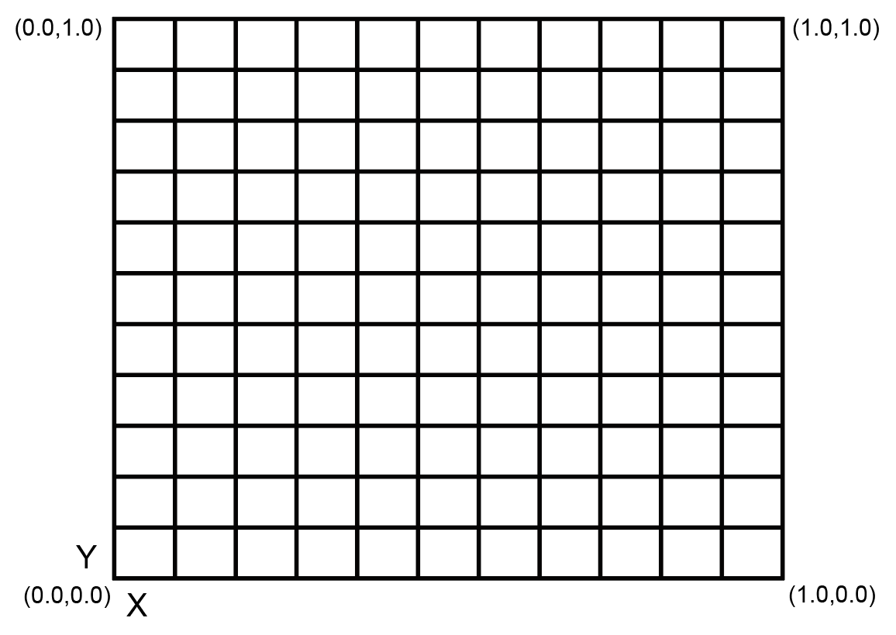

## 概述
使用PSDK 提供的对焦控制功能，需要开发者**先实现**相机类负载设备的对焦功能，再将对焦功能的函数注册到PSDK 指定的接口中，用户通过使用DJI Pilot、基于MSDK 开发的移动端APP 及遥控器上的拍照按钮，能够控制使用PSDK 开发的相机类负载设备自动对焦或手动对焦，使用对焦助手查看当前相机类负载设备的对焦质量。 

## 基础概念
#### 对焦模式
* 自动对焦：Auto Focus，简称AF。在自动对焦模式下，相机类负载设备根据光电传感器获取的影像状态（漫发射），计算出对焦结果实现对焦功能，获取清晰的影像。
* 手动对焦：Manual Focus，简称MF。在手动对焦模式下，用户通过调节对焦环能够获得清晰的影像。

#### 对焦点
>**说明：** 相机类负载设备的对焦点默认为传感器的中心位置。

在控制相机类负载设备对焦，需要先设置对焦点，该对焦点的值为当前对焦点在相机画面中的横纵比系数，如 图1.对焦点 所示。 
* 在自动对焦模式下，开发者需要制定相机对焦的策略，设置对焦点（该对焦点也称“目标点”）。  
* 在手动对焦模式下，用户可根据实际需要调整对焦点，获得所需的影像。  
<div>
<div style="text-align: center"><p>图1.对焦点 </p>
</div>
<div style="text-align: center"><p><span>
      </span></p>
</div></div>

#### 对焦环
使用PSDK 开发的具有变焦环（光学变焦）的相机类负载设备通过调用`SetFocusRingValue`接口，设置对焦环的值：     
* 对焦环的值默认为0，表示无穷大和最接近的可能焦距。
* 对焦环的值不为0时，用户可根据相机的实际参数设置对焦环的值。

#### 对焦助手
在AF 和 MF 模式下，对焦助手通过数字变焦的方式，能够放大用户指定的对焦区域，调用`SetFocusAssistantSettings`接口可设置对焦助手的状态，使用对焦助手，用户能够查看当前相机类负载设备的对焦质量。

## 实现对焦功能
请开发者根据选用的**开发平台**以及行业应用实际的使用需求，按照PSDK 中的结构体`T_PsdkCameraFocusHandler`构造实现相机类负载设备对焦功能的函数，将对焦功能的函数注册到PSDK 中指定的接口后，用户通过使用DJI Pilot 或基于MSDK 开发的移动端APP 能够控制基于PSDK 开发的相机类负载设备对焦。

```c 
    // 实现设置对焦模式的功能
    s_focusHandler.SetFocusMode = SetFocusMode;
    s_focusHandler.GetFocusMode = GetFocusMode;
    // 实现设置对焦点的功能
    s_focusHandler.SetFocusTarget = SetFocusTarget;
    s_focusHandler.GetFocusTarget = GetFocusTarget;
    // 实现设置对焦助手的功能
    s_focusHandler.SetFocusAssistantSettings = SetFocusAssistantSettings;
    s_focusHandler.GetFocusAssistantSettings = GetFocusAssistantSettings;
    // 实现设置对焦环的功能
    s_focusHandler.SetFocusRingValue = SetFocusRingValue;
    s_focusHandler.GetFocusRingValue = GetFocusRingValue;
    s_focusHandler.GetFocusRingValueUpperBound = GetFocusRingValueUpperBound;
```

## 使用对焦功能
#### 1. 注册对焦功能
开发者实现相机类负载设备的对焦功能后，需要通过`PsdkPayloadCamera_RegFocusHandler`注册对焦功能，方便用户通过使用DJI Pilot 以及基于MSDK 开发的移动端APP 控制相机类负载设备对焦。

```c
    returnCode = PsdkPayloadCamera_RegFocusHandler(&s_focusHandler);
    if (returnCode != PSDK_RETURN_CODE_OK) {
        PsdkLogger_UserLogError("camera register adjustable focal point handler error:%lld", returnCode);
        return returnCode;
    }
```

#### 2. 设置对焦模式
基于PSDK 开发的负载设备控制程序调用`SetFocusMode`和`GetFocusMode`接口能够设置相机类负载设备的对焦模式，用户使用DJI Pilot 能够切换相机类负载设备的对焦模式。

```c
    static T_PsdkReturnCode SetFocusMode(E_PsdkCameraFocusMode mode)
    {
        PsdkLogger_UserLogDebug("set focus mode:%d", mode);
        s_cameraFocusMode = mode;
        return PSDK_RETURN_CODE_OK;
    }

    static T_PsdkReturnCode GetFocusMode(E_PsdkCameraFocusMode *mode)
    {
        *mode = s_cameraFocusMode;
        PsdkLogger_UserLogDebug("get focus mode:%d", *mode);

        return PSDK_RETURN_CODE_OK;
    }
```

#### 3. 设置对焦点
基于PSDK 开发的负载设备控制程序调用`SetFocusTarget`和`GetFocusTarget`接口能够设置相机类负载设备的对焦点，用户使用DJI Pilot 以及基于MSDK 开发的移动端APP 能够设置或获取相机类负载设备的对焦点。

```c
    static T_PsdkReturnCode SetFocusTarget(T_PsdkCameraFocusTarget target)
    {
        PsdkLogger_UserLogDebug("set focus target x:%.2f y:%.2f", target.focusX, target.focusY);
        memcpy(&s_cameraFocusTarget, &target, sizeof(T_PsdkCameraFocusTarget));

        return PSDK_RETURN_CODE_OK;
    }

    static T_PsdkReturnCode GetFocusTarget(T_PsdkCameraFocusTarget *target)
    {
        memcpy(target, &s_cameraFocusTarget, sizeof(T_PsdkCameraFocusTarget));
        PsdkLogger_UserLogDebug("get focus target x:%.2f y:%.2f", s_cameraFocusTarget.focusX, s_cameraFocusTarget.focusY);

        return PSDK_RETURN_CODE_OK;
    }
```

#### 4. 设置对焦环
基于PSDK 开发的负载设备控制程序调用`SetFocusRingValue`、`GetFocusRingValueUpperBound`和`GetFocusRingValueUpperBound`接口能够设置相机类负载设备对焦环的值，用户使用DJI Pilot 以及基于MSDK 开发的移动端APP 能够设置或获取相机类负载设备对焦环的当前的值和最大值。

```c
    static T_PsdkReturnCode SetFocusRingValue(uint32_t value)
    {
        PsdkLogger_UserLogDebug("set focus ring value:%d", value);
        s_cameraFocusRingValue = value;

        return PSDK_RETURN_CODE_OK;
    }

    static T_PsdkReturnCode GetFocusRingValue(uint32_t *value)
    {
        *value = s_cameraFocusRingValue;
        PsdkLogger_UserLogDebug("get focus ring value:%d", *value);

        return PSDK_RETURN_CODE_OK;
    }

    static T_PsdkReturnCode GetFocusRingValueUpperBound(uint32_t *value)
    {
        *value = FOCUS_MAX_RINGVALUE;
        PsdkLogger_UserLogDebug("get focus ring value upper bound:%d", *value);

        return PSDK_RETURN_CODE_OK;
    }
```

### 5. 使用对焦助手
基于PSDK 开发的负载设备控制程序调用`SetFocusAssistantSettings`和`GetFocusAssistantSettings`接口能够设置相机类负载设备对焦环的值，用户使用DJI Pilot 以及基于MSDK 开发的移动端APP 能够设置或获取相机类负载设备对焦助手的状态。

```c
  static T_PsdkReturnCode SetFocusAssistantSettings(T_PsdkCameraFocusAssistantSettings settings)
    {
        PsdkLogger_UserLogDebug("set focus assistant setting MF:%d AF:%d", settings.isEnabledMF, settings.isEnabledAF);
        memcpy(&s_cameraFocusAssistantSettings, &settings, sizeof(T_PsdkCameraFocusAssistantSettings));

        return PSDK_RETURN_CODE_OK;
    }

    static T_PsdkReturnCode GetFocusAssistantSettings(T_PsdkCameraFocusAssistantSettings *settings)
    {
        memcpy(settings, &s_cameraFocusAssistantSettings, sizeof(T_PsdkCameraFocusAssistantSettings));
        PsdkLogger_UserLogDebug("get focus assistant setting MF:%d AF:%d", settings->isEnabledMF, settings->isEnabledAF);

        return PSDK_RETURN_CODE_OK;
    }
```

实现相机类负载设备的对焦功能后，在自动对焦模式下，相机类负载设备需要设置对焦点 如 图2.自动对焦 所示；在手动对焦模式下，用户可根据实际需要调整对焦点，如 图3.手动对焦 所示。  

>**说明：** 若按钮为黄色，表示当前为测光功能，点击后，即可切换为对焦模式。

<div>
<div style="text-align: center"><p>图2.自动对焦 </p>
</div>
<div style="text-align: center"><p><span>
      </span></p>
</div></div>

<div>
<div style="text-align: center"><p>图3.手动对焦 </p>
</div>
<div style="text-align: center"><p><span>
      </span></p>
</div></div>
