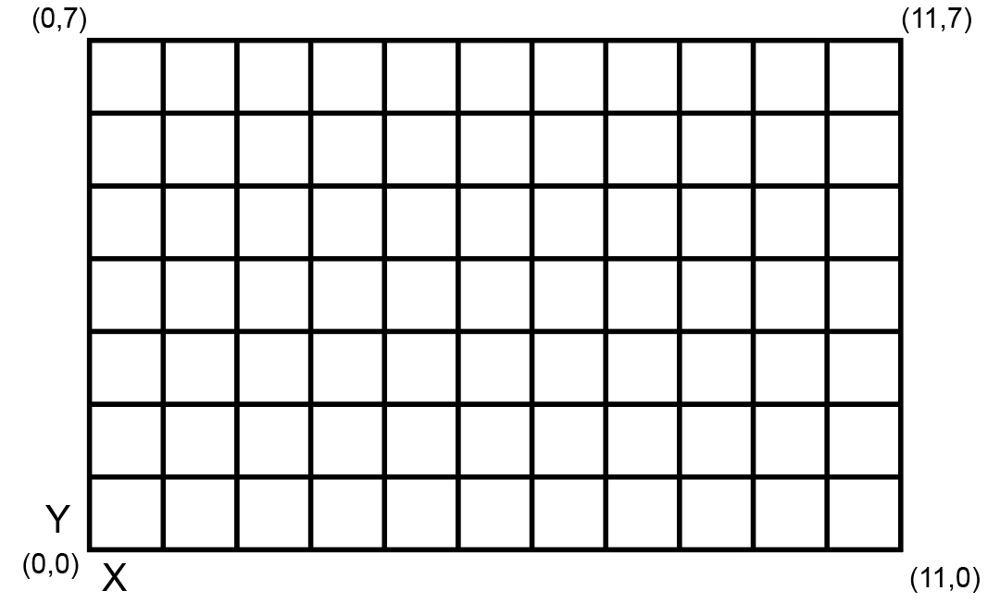
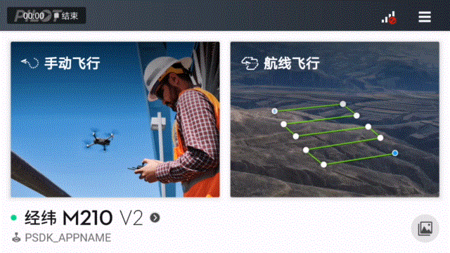
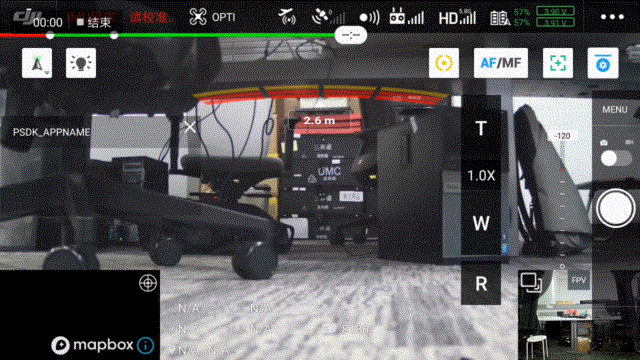

## 概述
使用PSDK 提供的测光控制功能，需要开发者**先实现**负载设备的测光功能，再将测光功能的函数注册到指定的接口中，用户通过使用DJI Pilot 以及基于MSDK 开发的移动端APP，即可控制使用PSDK 开发的相机类负载设备在**拍照**模式下，通过测光功能获得精准的曝光。

## 测光模式
* 平均测光，通过对画面整体亮度的分析，计算出画面的平均亮度的值，适合光照均匀的拍照场景；
* 中央重点测光，仅对图像传感器中间区域测光，适合拍摄框架式构图的照片；
* 点测光，对在以“指定的点”为中心的范围内测光，如 图1.点测光区域 所示，通过该方式能获得准确的测光结果，确保指定的对象能够曝光正确，适合光照复杂的拍摄场景。   
<div>
<div style="text-align: center"><p>图1.点测光区域  </p>
</div>
<div style="text-align: center"><p><span>
      </span></p>
</div></div>

图像传感器被分为12列8行定义的96个点区域。行索引范围是[0,7]，其中值在图像上从上到下递增；列索引范围是[0，11]，其中值从左到右增加。

## 实现测光功能
请开发者根据选用的**开发平台**以及行业应用实际的使用需求，按照PSDK 中的结构体`T_PsdkCameraExposureMeteringHandler`构造实现相机类负载设备测光功能的函数，将测光功能的函数注册到PSDK 中指定的接口后，用户通过使用DJI Pilot 或基于MSDK 开发的移动端APP 能够控制相机类负载设备测光。

```c
    // 实现设置测光模式的功能
    s_exposureMeteringHandler.SetMeteringMode = SetMeteringMode;
    s_exposureMeteringHandler.GetMeteringMode = GetMeteringMode;
    // 实现控制负载设备测光的功能
    s_exposureMeteringHandler.SetSpotMeteringTarget = SetSpotMeteringTarget;
    s_exposureMeteringHandler.GetSpotMeteringTarget = GetSpotMeteringTarget;
```

## 使用测光功能
#### 1. 注册测光功能
开发者实现相机类负载设备的测光功能后，需要通过`PsdkPayloadCamera_RegExposureMeteringHandler`注册测光功能；调用指定的接口后，用户通过使用DJI Pilot 以及基于MSDK 开发的移动端APP 即可控制相机类负载设备测光，如 图2. 测光功能   

```c
    returnCode = PsdkPayloadCamera_RegExposureMeteringHandler(&s_exposureMeteringHandler);
    if (returnCode != PSDK_RETURN_CODE_OK) {
        PsdkLogger_UserLogError("camera register exposure metering handler error:%lld", returnCode);
        return returnCode;
    }
```

### 2. 设置测光模式
基于PSDK 开发的负载设备控制程序调用`SetMeteringMode`和`GetMeteringMode`接口能够设置或获取相机类负载设备的测光模式，用户使用DJI Pilot 以及基于MSDK 开发的APP 能够查看负载设备的测光模式，如 图3. 指点测光 和 图4. 中央重点测光 所示。

```c
    static T_PsdkReturnCode SetMeteringMode(E_PsdkCameraMeteringMode mode)
    {
        PsdkLogger_UserLogDebug("set metering mode:%d", mode);
        s_cameraMeteringMode = mode;

        return PSDK_RETURN_CODE_OK;
    }

    static T_PsdkReturnCode GetMeteringMode(E_PsdkCameraMeteringMode *mode)
    {
        *mode = s_cameraMeteringMode;
        PsdkLogger_UserLogDebug("get metering mode:%d", *mode);

        return PSDK_RETURN_CODE_OK;
    }
```

### 3. 设置测光对象
相机类负载设备在调用`SetSpotMeteringTarget`和`GetSpotMeteringTarget`接口后，使用DJI Pilot 以及基于MSDK 开发的移动端APP 可设置或获取相机类负载设备的测光对象。

```c
    static T_PsdkReturnCode SetSpotMeteringTarget(T_PsdkCameraSpotMeteringTarget target)
    {
        PsdkLogger_UserLogDebug("set spot metering area col:%d row:%d", target.col, target.row);
        memcpy(&s_cameraSpotMeteringTarget, &target, sizeof(T_PsdkCameraSpotMeteringTarget));

        return PSDK_RETURN_CODE_OK;
    }

    static T_PsdkReturnCode GetSpotMeteringTarget(T_PsdkCameraSpotMeteringTarget *target)
    {
        memcpy(target, &s_cameraSpotMeteringTarget, sizeof(T_PsdkCameraSpotMeteringTarget));
        PsdkLogger_UserLogDebug("get spot metering area col:%d row:%d", target->col, target->row);

        return PSDK_RETURN_CODE_OK;
    }
```

<div>
<div style="text-align: center"><p>图2.测光功能  </p>
</div>
<div style="text-align: center"><p><span>
      </span></p>
</div></div>

<div>
<div style="text-align: center"><p>图3. 中央重点测光</p>
</div>
<div style="text-align: center"><p><span>
      </span></p>
</div></div> 

<div>
<div style="text-align: center"><p>图4. 指点测光 </p>
</div>
<div style="text-align: center"><p><span>
      </span></p>
</div></div>


> **说明：**  在DJI Pilot 上使用相机类负载设备的测光功能时，若按钮为绿色，表示当前为对焦功能，点击后，即可切换为测光模式。 