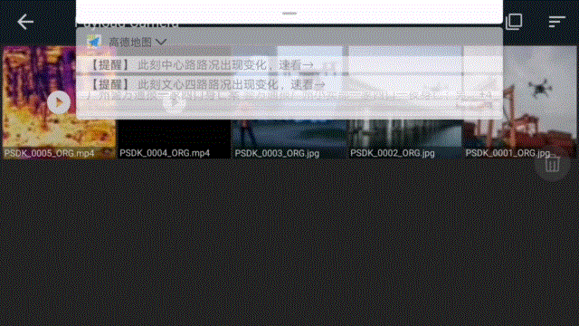

## 概述
为方便开发者快速开发相机类负载设备的回放下载功能，开发者**需要先实现**相机类负载设备的回放下载功能，再将回放下载功能的函数注册到指定的接口中，用户通过使用DJI Pilot 或基于MSDK 开发的移动端APP，即可获取获取相机类负载设备中的媒体文件。   

## 媒体文件管理
使用PSDK 开发的相机类负载设备能够根据用户的指令，执行文件删除或下载等操作。

#### 媒体文件预览功能
使用PSDK 开发的相机类负载设备支持用户使用DJI Pilot 或基于MSDK 开发的移动端APP 预览负载设备中的媒体文件。
* 静态预览：预览单个文件或文件列表
  * 缩略图，预览文件列表
    - 图像：负载设备按照文件的原始比例生成缩略图，请将预览图的宽度设置为100 像素 
    - 视频：截取视频某一帧的画面
  * 截屏图，预览单个文件
    - 图像：按原始比例，建议缩放图像成宽为600 像素的预览图 
    - 视频：截取视频某一帧的画面
  * 原始文件，如需获得相机类负载设备中原始的媒体文件，请使用下载功能获取指定的媒体文件。
* 动态预览（视频预览)：播放、暂停、停止、跳转（快进、快退和进度拖动）
    
    > **说明：** 支持动态预览的文件格式：MP4、JPG、DNG 和MOV，编码格式请参见[“视频标准”](../guide/payload-criterion.html)。

## 实现回放下载功能
请开发者根据选用的**开发平台**以及行业应用实际的使用需求，按照`T_PsdkCameraMediaDownloadPlaybackHandler`结构体构造实现**下载媒体文件原始数据**、**创建/销毁缩略图**、**创建/下载缩略图**等回访下载功能的函数，并将函数注册到PSDK 中指定的接口后，用户通过使用DJI Pilot 或基于MSDK 开发的移动端APP 能够从基于PSDK 开发的相机类负载设备上下载媒体文件或实现视频流回放功能。

```c
    // 实现获取媒体文件信息的功能
    s_psdkCameraMedia.GetMediaFileDir = GetMediaFileDir;
    s_psdkCameraMedia.GetMediaFileOriginInfo = GetMediaFileOriginInfo;
    s_psdkCameraMedia.GetMediaFileOriginData = GetMediaFileOriginData;
    // 实现获取媒体文件缩略图的功能
    s_psdkCameraMedia.CreateMediaFileThumbNail = CreateMediaFileThumbNail;
    s_psdkCameraMedia.GetMediaFileThumbNailInfo = GetMediaFileThumbNailInfo;
    s_psdkCameraMedia.GetMediaFileThumbNailData = GetMediaFileThumbNailData;
    s_psdkCameraMedia.DestroyMediaFileThumbNail = DestroyMediaFileThumbNail;
    // 实现获取媒体文件截屏图的功能
    s_psdkCameraMedia.CreateMediaFileScreenNail = CreateMediaFileScreenNail;
    s_psdkCameraMedia.GetMediaFileScreenNailInfo = GetMediaFileScreenNailInfo;
    s_psdkCameraMedia.GetMediaFileScreenNailData = GetMediaFileScreenNailData;
    s_psdkCameraMedia.DestroyMediaFileScreenNail = DestroyMediaFileScreenNail;
    // 实现删除媒体文件的功能
    s_psdkCameraMedia.DeleteMediaFile = DeleteMediaFile;
    // 实现控制媒体文件回放的功能
    s_psdkCameraMedia.SetMediaPlaybackFile = SetMediaPlaybackFile;
    s_psdkCameraMedia.StartMediaPlayback = StartMediaPlayback;
    s_psdkCameraMedia.StopMediaPlayback = StopMediaPlayback;
    s_psdkCameraMedia.PauseMediaPlayback = PauseMediaPlayback;
    s_psdkCameraMedia.SeekMediaPlayback = SeekMediaPlayback;
    s_psdkCameraMedia.GetMediaPlaybackStatus = GetMediaPlaybackStatus;
    // 实现下载媒体文件的功能
    s_psdkCameraMedia.StartDownloadNotification = StartDownloadNotification;
    s_psdkCameraMedia.StopDownloadNotification = StopDownloadNotification;

```
## 使用回放下载功能

> **注意**
> 
> * 请使用编解码工具[ffmpeg 2.8.15](https://trac.ffmpeg.org/) 操作相机类负载设备中的文件并执行相应的编解码功能。使用`ffmpeg -v`可查看当前ffmepg 的版本信息。
> * 仅基于Linux 开发的负载设备支持使用回放下载功能。

### 1. 配置网络参数

为确保用户能够处理在Linux 平台上开发的相机类负载设备中的媒体文件，请以**手动**的方式设置相机类负载设备的网络参数：

* IP 地址：`192.168.5.3`
* 网  关 ：`192.168.5.1`
* 子网掩码：`255.255.255.0`

IP 地址设置完成后，使用`ping` 和`ifconfig` 命令查看相机类负载设备和无人机间的网络状态。

> **说明：** 若使用虚拟机调试相机类负载设备，请将虚拟机网络适配器的模式设置为桥接模式，同时启用“复制物理网络连接状态”。

### 2. 注册回放下载中的功能
> **说明：** 用户可根据实际的使用需要注册视频回放下载功能。

```c
  // 注册开始执行回放媒体文件的功能
 static T_PsdkReturnCode StartMediaPlayback(void)
{
    T_PsdkReturnCode psdkStat;

    PsdkLogger_UserLogDebug("start media playback");
    psdkStat = PsdkPlayback_StartPlay(&s_playbackInfo);
    if (psdkStat != PSDK_RETURN_CODE_OK) {
        PsdkLogger_UserLogError("start media playback status error, stat:%lld", psdkStat);
        return psdkStat;
    }

    return psdkStat;}
  // 注册停止回放媒体文件的功能
static T_PsdkReturnCode StopMediaPlayback(void)
{
    T_PsdkReturnCode psdkStat;

    PsdkLogger_UserLogDebug("stop media playback");
    psdkStat = PsdkPlayback_StopPlay(&s_playbackInfo);
    if (psdkStat != PSDK_RETURN_CODE_OK) {
        PsdkLogger_UserLogError("stop media playback error, stat:%lld", psdkStat);
        return psdkStat;
    }

    return psdkStat;
}
  // 注册控制类负载设备暂停回放中的媒体文件的功能
static T_PsdkReturnCode PauseMediaPlayback(void)
{
    T_PsdkReturnCode psdkStat;

    PsdkLogger_UserLogDebug("pause media playback");
    psdkStat = PsdkPlayback_PausePlay(&s_playbackInfo);
    if (psdkStat != PSDK_RETURN_CODE_OK) {
        PsdkLogger_UserLogError("pause media playback error, stat:%lld", psdkStat);
        return psdkStat;
    }

    return psdkStat;
}
  // 注册控制相机类负载设备在指定的点位回放媒体文件的功能
       static T_PsdkReturnCode SeekMediaPlayback(uint32_t playbackPosition)
       {
           T_PsdkReturnCode psdkStat;
       
           PsdkLogger_UserLogDebug("seek media playback:%d", playbackPosition);
           psdkStat = PsdkPlayback_SeekPlay(&s_playbackInfo, playbackPosition);
           if (psdkStat != PSDK_RETURN_CODE_OK) {
               PsdkLogger_UserLogError("seek media playback error, stat:%lld", psdkStat);
               return psdkStat;
           }
       
           return psdkStat;
}
```

### 获取文件列表

#### 1. 获取媒体文件的路径
使用PSDK 开发的相机类负载设备通过`GetMediaFileDir`接口获取用户指定的文件的地址，用户使用DJI Pilot 以及基于MSDK 开发的移动端APP 能够获取指定的媒体文件所在的路径。
>**说明：** 媒体文件的默认路径为`camera_media_emu/media_file`，用户可根据实际的使用需要，更改媒体文件所在的路径。

```c
static T_PsdkReturnCode GetMediaFileDir(char *dirPath)
{
    strcpy(dirPath, PSDK_MEDIA_FILE_PATH);

    return PSDK_RETURN_CODE_OK;
}
```

#### 2. 获取媒体文件的列表
指定媒体文件所在的路径后，基于MSDK 开发的移动端APP 将向相机类负载设备发送获取文件信息的命令。
* 基于PSDK 开发的负载设备通过调用PSDK 中获取媒体文件信息的接口，能够获取负载设备中媒体文件的信息，如文件的名称、路径和大小等。
* 相机类负载设备通过FFmpeg 命令，能够获取媒体文件的长度、帧率和分辨率。
   
```c
   static T_PsdkReturnCode GetMediaFileOriginInfo(const char *filePath, T_PsdkCameraMediaFileInfo *fileInfo)
   {
       T_PsdkReturnCode psdkStat;
       T_PsdkMediaFileHandle mediaFileHandle;
   
       psdkStat = PsdkMediaFile_CreateHandle(filePath, &mediaFileHandle);
       if (psdkStat != PSDK_RETURN_CODE_OK) {
           PsdkLogger_UserLogError("Media file create handle error stat:%lld", psdkStat);
           return psdkStat;
       }
   
       psdkStat = PsdkMediaFile_GetMediaFileType(mediaFileHandle, &fileInfo->type);
       if (psdkStat != PSDK_RETURN_CODE_OK) {
           PsdkLogger_UserLogError("Media file get type error stat:%lld", psdkStat);
           goto out;
       }
   
       psdkStat = PsdkMediaFile_GetMediaFileAttr(mediaFileHandle, &fileInfo->mediaFileAttr);
       if (psdkStat != PSDK_RETURN_CODE_OK) {
           PsdkLogger_UserLogError("Media file get attr error stat:%lld", psdkStat);
           goto out;
       }
   
       psdkStat = PsdkMediaFile_GetFileSizeOrg(mediaFileHandle, &fileInfo->fileSize);
       if (psdkStat != PSDK_RETURN_CODE_OK) {
           PsdkLogger_UserLogError("Media file get size error stat:%lld", psdkStat);
           goto out;
       }
   
   out:
       psdkStat = PsdkMediaFile_DestroyHandle(mediaFileHandle);
       if (psdkStat != PSDK_RETURN_CODE_OK) {
           PsdkLogger_UserLogError("Media file destroy handle error stat:%lld", psdkStat);
           return psdkStat;
       }
   
       return psdkStat;
   }
```
#### 3. 获取媒体文件的原始数据
使用PSDK 开发的相机类负载设备通过`GetMediaFileOriginData`接口，获取负载设备上的媒体文件的原始数据，用户使用DJI Pilot 以及基于MSDK 开发的移动端APP 能够获取指定的媒体文件所在的路径。

```c
   static T_PsdkReturnCode GetMediaFileOriginData(const char *filePath, uint32_t offset, uint32_t length, uint8_t *data)
   {
       T_PsdkReturnCode psdkStat;
       uint16_t realLen = 0;
       T_PsdkMediaFileHandle mediaFileHandle;
   
       psdkStat = PsdkMediaFile_CreateHandle(filePath, &mediaFileHandle);
       if (psdkStat != PSDK_RETURN_CODE_OK) {
           PsdkLogger_UserLogError("Media file create handle error stat:%lld", psdkStat);
           return psdkStat;
       }
   
       psdkStat = PsdkMediaFile_GetDataOrg(mediaFileHandle, offset, length, data, &realLen);
       if (psdkStat != PSDK_RETURN_CODE_OK) {
           PsdkLogger_UserLogError("Media file get size error stat:%lld", psdkStat);
           return psdkStat;
       }
   
       psdkStat = PsdkMediaFile_DestroyHandle(mediaFileHandle);
       if (psdkStat != PSDK_RETURN_CODE_OK) {
           PsdkLogger_UserLogError("Media file destroy handle error stat:%lld", psdkStat);
           return psdkStat;
       }
   
       return PSDK_RETURN_CODE_OK;
   }
```
>**说明** 
> * 获取媒体文件列表的功能只能获取到媒体文件的原始文件和缩略图；
> * 实现获取媒体文件列表的功能后，用户能够获得指定文件的截屏图；
> * 用户通过下载功能能够得到指定媒体文件的原始文件。 

### 创建缩略图
#### 1. 获取指定对象的路径并创建缩略图
使用PSDK 开发的相机类负载设备通过`CreateMediaFileThumbNail`接口，获取用户指定媒体文件的路径并创建缩略图，用户使用DJI Pilot 以及基于MSDK 开发的移动端APP 能够向负载设备发送创建指定媒体文件的缩略图的命令。

```c
      static T_PsdkReturnCode CreateMediaFileThumbNail(const char *filePath)
       {
           T_PsdkReturnCode psdkStat;       
           psdkStat = PsdkMediaFile_CreateThm(s_mediaFileThumbNailHandle);
           if (psdkStat != PSDK_RETURN_CODE_OK) {
               PsdkLogger_UserLogError("Media file create thumb nail error stat:%lld", psdkStat);
               return psdkStat;
           }
       
           return PSDK_RETURN_CODE_OK;
       }
```

#### 2. 获取缩略图的信息
使用PSDK 开发的相机类负载设备通过`GetMediaFileThumbNailInfo`接口，获取指定媒体文件的缩略图信息，用户使用DJI Pilot 以及基于MSDK 开发的移动端APP 能够向负载设备发送获取指定媒体文件缩略图信息的命令。

```c
        static T_PsdkReturnCode GetMediaFileThumbNailInfo(const char *filePath, T_PsdkCameraMediaFileInfo *fileInfo)
       {
           T_PsdkReturnCode psdkStat;
       
           USER_UTIL_UNUSED(filePath);
       
           psdkStat = PsdkMediaFile_GetMediaFileType(s_mediaFileThumbNailHandle, &fileInfo->type);
           if (psdkStat != PSDK_RETURN_CODE_OK) {
               PsdkLogger_UserLogError("Media file get type error stat:%lld", psdkStat);
               return psdkStat;
           }
       
           psdkStat = PsdkMediaFile_GetMediaFileAttr(s_mediaFileThumbNailHandle, &fileInfo->mediaFileAttr);
           if (psdkStat != PSDK_RETURN_CODE_OK) {
               PsdkLogger_UserLogError("Media file get attr error stat:%lld", psdkStat);
               return psdkStat;
           }
       
           psdkStat = PsdkMediaFile_GetFileSizeThm(s_mediaFileThumbNailHandle, &fileInfo->fileSize);
           if (psdkStat != PSDK_RETURN_CODE_OK) {
               PsdkLogger_UserLogError("Media file get size error stat:%lld", psdkStat);
               return psdkStat;
           }
       
           return PSDK_RETURN_CODE_OK;
       }
```

#### 3. 获取缩略图
使用PSDK 开发的相机类负载设备通过`GetMediaFileThumbNailData`接口，获取指定媒体文件的缩略图，用户使用DJI Pilot 以及基于MSDK 开发的移动端APP 能够向负载设备发送获取指定媒体文件缩略图的命令，并获得指定的缩略图。

```c
    static T_PsdkReturnCode GetMediaFileThumbNailData(const char *filePath, uint32_t offset, uint32_t length, uint8_t *data)
       {
           T_PsdkReturnCode psdkStat;
           uint16_t realLen = 0;
       
           USER_UTIL_UNUSED(filePath);
       
           psdkStat = PsdkMediaFile_GetDataThm(s_mediaFileThumbNailHandle, offset, length, data, &realLen);
           if (psdkStat != PSDK_RETURN_CODE_OK) {
               PsdkLogger_UserLogError("Media file get data error stat:%lld", psdkStat);
               return psdkStat;
           }
       
           return PSDK_RETURN_CODE_OK;
       }
```

#### 4. 销毁缩略图
使用PSDK 开发的相机类负载设备通过`DestroyMediaFileThumbNail`接口，销毁负载设备上生成的缩略图，用户使用DJI Pilot 以及基于MSDK 开发的移动端APP 能够向负载设备发送删除指定媒体文件缩略图的命令。
>**说明：** DJI Pilot 及基于MSDK 开发的移动端APP 接收到相机类负载设备上的缩略图后，将缓存在APP 本地。

```c
    static T_PsdkReturnCode DestroyMediaFileThumbNail(const char *filePath)
       {
           T_PsdkReturnCode psdkStat;
       
           USER_UTIL_UNUSED(filePath);
       
           psdkStat = PsdkMediaFile_DestoryThm(s_mediaFileThumbNailHandle);
           if (psdkStat != PSDK_RETURN_CODE_OK) {
               PsdkLogger_UserLogError("Media file destroy thumb nail error stat:%lld", psdkStat);
               return psdkStat;
           }
       
           psdkStat = PsdkMediaFile_DestroyHandle(s_mediaFileThumbNailHandle);
           if (psdkStat != PSDK_RETURN_CODE_OK) {
               PsdkLogger_UserLogError("Media file destroy handle error stat:%lld", psdkStat);
               return psdkStat;
           }
       
           return PSDK_RETURN_CODE_OK;
       }
```

### 创建截屏图
#### 1. 获取指定对象的路径并创建截屏图 
使用PSDK 开发的相机类负载设备通过`CreateMediaFileScreenNail`接口，获取用户指定媒体文件的路径并创建截屏图，用户使用DJI Pilot 以及基于MSDK 开发的移动端APP 能够向负载设备发送创建指定媒体文件的截屏图的命令。

```c
       static T_PsdkReturnCode CreateMediaFileScreenNail(const char *filePath)
       {
           T_PsdkReturnCode psdkStat;
       
           psdkStat = PsdkMediaFile_CreateHandle(filePath, &s_mediaFileScreenNailHandle);
           if (psdkStat != PSDK_RETURN_CODE_OK) {
               PsdkLogger_UserLogError("Media file create handle error stat:%lld", psdkStat);
               return psdkStat;
           }
       
           psdkStat = PsdkMediaFile_CreateScr(s_mediaFileScreenNailHandle);
           if (psdkStat != PSDK_RETURN_CODE_OK) {
               PsdkLogger_UserLogError("Media file create screen nail error stat:%lld", psdkStat);
               return psdkStat;
           }
       
           return PSDK_RETURN_CODE_OK;
       }
```

#### 2. 获取截屏图的信息
使用PSDK 开发的相机类负载设备通过`GetMediaFileScreenNailInfo`接口，获取指定媒体文件的截屏图信息，用户使用DJI Pilot 以及基于MSDK 开发的移动端APP 能够向负载设备发送获取指定媒体文件截屏图信息的命令。

```c
  static T_PsdkReturnCode GetMediaFileScreenNailInfo(const char *filePath, T_PsdkCameraMediaFileInfo *fileInfo)
       {
           T_PsdkReturnCode psdkStat;
           USER_UTIL_UNUSED(filePath);
       
           psdkStat = PsdkMediaFile_GetMediaFileType(s_mediaFileScreenNailHandle, &fileInfo->type);
           if (psdkStat != PSDK_RETURN_CODE_OK) {
               PsdkLogger_UserLogError("Media file get type error stat:%lld", psdkStat);
               return psdkStat;
           }
       
           psdkStat = PsdkMediaFile_GetMediaFileAttr(s_mediaFileScreenNailHandle, &fileInfo->mediaFileAttr);
           if (psdkStat != PSDK_RETURN_CODE_OK) {
               PsdkLogger_UserLogError("Media file get attr error stat:%lld", psdkStat);
               return psdkStat;
           }
       
           psdkStat = PsdkMediaFile_GetFileSizeScr(s_mediaFileScreenNailHandle, &fileInfo->fileSize);
           if (psdkStat != PSDK_RETURN_CODE_OK) {
               PsdkLogger_UserLogError("Media file get size error stat:%lld", psdkStat);
               return psdkStat;
           }
       
           return PSDK_RETURN_CODE_OK;
       }
```

#### 3. 获取截屏图
使用PSDK 开发的相机类负载设备通过`GetMediaFileScreenNailData`接口，获取指定媒体文件的截屏图，用户使用DJI Pilot 以及基于MSDK 开发的移动端APP 能够向负载设备发送获取指定媒体文件截屏图的命令，并获得指定的截屏图。

```c
static T_PsdkReturnCode
       GetMediaFileScreenNailData(const char *filePath, uint32_t offset, uint32_t length, uint8_t *data)
       {
           T_PsdkReturnCode psdkStat;
           uint16_t realLen = 0;
       
           USER_UTIL_UNUSED(filePath);
       
           psdkStat = PsdkMediaFile_GetDataScr(s_mediaFileScreenNailHandle, offset, length, data, &realLen);
           if (psdkStat != PSDK_RETURN_CODE_OK) {
               PsdkLogger_UserLogError("Media file get size error stat:%lld", psdkStat);
               return psdkStat;
           }
       
           return PSDK_RETURN_CODE_OK;
       }
       
static T_PsdkReturnCode DestroyMediaFileScreenNail(const char *filePath)
       {
           T_PsdkReturnCode psdkStat;
       
           USER_UTIL_UNUSED(filePath);
       
           psdkStat = PsdkMediaFile_DestroyScr(s_mediaFileScreenNailHandle);
           if (psdkStat != PSDK_RETURN_CODE_OK) {
               PsdkLogger_UserLogError("Media file destroy screen nail error stat:%lld", psdkStat);
               return psdkStat;
           }
       
           psdkStat = PsdkMediaFile_DestroyHandle(s_mediaFileScreenNailHandle);
           if (psdkStat != PSDK_RETURN_CODE_OK) {
               PsdkLogger_UserLogError("Media file destroy handle error stat:%lld", psdkStat);
               return psdkStat;
           }
       
           return PSDK_RETURN_CODE_OK;
       }
```

使用DJI Pilot 或基于MSDK 开发的移动端APP 能够自动拉取相机类负载设备中`/media_file`目录下的媒体文件，显示媒体文件的名称和截屏图，点击后即可显示媒体文件的截屏图，如 图1.查看截屏图 所示 。  
<div>
<div style="text-align: center"><p>图1.查看截屏图  </p>
</div>
<div style="text-align: center"><p><span>
      </span></p>
</div></div>
  

### 删除媒体文件
使用PSDK 开发的相机类负载设备通过`DeleteMediaFile`接口，删除负载设备上的媒体文件，用户使用DJI Pilot 以及基于MSDK 开发的移动端APP 能够向负载设备发送删除媒体文件的命令。

```c
static T_PsdkReturnCode DeleteMediaFile(char *filePath)
    {
        T_PsdkReturnCode psdkStat;
    
        psdkStat = PsdkFile_Delete(filePath);
        if (psdkStat != PSDK_RETURN_CODE_OK) {
            PsdkLogger_UserLogError("Media file delete error stat:%lld", psdkStat);
            return psdkStat;
        }
    
        return PSDK_RETURN_CODE_OK;
    }
```

在媒体列表界面，选中需要删除的文件，点击删除按钮，可删除相机类负载设备中的媒体文件，如 图2.删除媒体文件 所示。   
  <div>
<div style="text-align: center"><p>  图2.删除媒体文件 </p>
</div>
<div style="text-align: center"><p><span>
      </span></p>
</div></div>

### 实现媒体文件回放功能
>**说明** 
> * 使用PSDK 开发相机类负载设备控制程序的回放功能前，需要先实现获取负载设备文件列表的功能。
> * 使用PSDK 开发相机类负载设备的回放功能时，需要先获取媒体文件的路径，将指定的媒体文件转换为H.264 格式。

#### 1. 指定媒体文件的路径
使用PSDK 开发的相机类负载设备通过`SetMediaPlaybackFile`接口，获取用户指定的媒体文件的路径，用户使用DJI Pilot 以及基于MSDK 开发的移动端APP 能够向负载设备发送媒体文件所在的路径。

```c
  static T_PsdkReturnCode SetMediaPlaybackFile(const char *filePath)
   {
       PsdkLogger_UserLogDebug("set media playback file:%s", filePath);
       T_PsdkReturnCode psdkStat;
   
       psdkStat = PsdkPlayback_StopPlay(&s_playbackInfo);
       if (psdkStat != PSDK_RETURN_CODE_OK) {
           return psdkStat;
       }
   
       psdkStat = PsdkPlayback_SetPlayFile(&s_playbackInfo, filePath, 0);
       if (psdkStat != PSDK_RETURN_CODE_OK) {
           return psdkStat;
       }
   
       psdkStat = PsdkPlayback_StartPlay(&s_playbackInfo);
       if (psdkStat != PSDK_RETURN_CODE_OK) {
           return psdkStat;
       }
   
       return PSDK_RETURN_CODE_OK;
   }
   ```

#### 2. 格式转换
使用PSDK 开发的相机类负载设备通过`PsdkPlayback_VideoFileTranscode`接口，将用户指定的媒体文件转换为H，264 格式的文件，用户使用DJI Pilot 以及基于MSDK 开发的移动端APP 能够向负载设备发送转换媒体文件格式的指令，将指定的文件转为H.264 格式，同时获取转换后媒体文件的帧率、帧信息、总帧数等信息。

```c
      psdkStat = PsdkPlayback_VideoFileTranscode(videoFilePath, "h264", transcodedFilePath,
                                                        PSDK_MEDIA_FILE_PATH_LEN_MAX);
             if (psdkStat != PSDK_RETURN_CODE_OK) {
                 PsdkLogger_UserLogError("transcode video file error: %lld.", psdkStat);
                 continue;
             }
             psdkStat = PsdkPlayback_VideoFileTranscode(videoFilePath, "h264", transcodedFilePath,
                                                        PSDK_MEDIA_FILE_PATH_LEN_MAX);
             if (psdkStat != PSDK_RETURN_CODE_OK) {
                 PsdkLogger_UserLogError("transcode video file error: %lld.", psdkStat);
                 continue;
             }
     
             psdkStat = PsdkPlayback_GetFrameRateOfVideoFile(transcodedFilePath, &frameRate);
             if (psdkStat != PSDK_RETURN_CODE_OK) {
                 PsdkLogger_UserLogError("get frame rate of video error: %lld.", psdkStat);
                 continue;
             }
     
             psdkStat = PsdkPlayback_GetFrameInfoOfVideoFile(transcodedFilePath, frameInfo, VIDEO_FRAME_MAX_COUNT,
                                                             &frameCount);
             if (psdkStat != PSDK_RETURN_CODE_OK) {
                 PsdkLogger_UserLogError("get frame info of video error: %lld.", psdkStat);
                 continue;
             }
     
             psdkStat = PsdkPlayback_GetFrameNumberByTime(frameInfo, frameCount, &frameNumber,
                                                          startTimeMs);
             if (psdkStat != PSDK_RETURN_CODE_OK) {
                 PsdkLogger_UserLogError("get start frame number error: %lld.", psdkStat);
                 continue;
             }
```

#### 3. 发送媒体文件
使用PSDK 开发的相机类负载设备通过`PsdkPayloadCamera_SendVideoStream`接口，将根据格式转换后的媒体文件的帧率、帧信息、总帧数等信息找到媒体文件的帧头，并按照指定的码率向DJI Pilot 或基于MSDK 开发的APP 发送媒体文件，用户使用DJI Pilot 以及基于MSDK 开发的移动端APP 能够接收到负载设备发送的媒体文件。

>**说明：** 有关实现视频流传输功能的详细说明和具体步骤请参见[“视频流传输”](./video-stream-transmission.html)。

```c
    while (dataLength - lengthOfDataHaveBeenSent) {
                 lengthOfDataToBeSent = USER_UTIL_MIN(DATA_SEND_FROM_VIDEO_STREAM_MAX_LEN,
                                                      dataLength - lengthOfDataHaveBeenSent);
                 psdkStat = PsdkPayloadCamera_SendVideoStream((const uint8_t *) dataBuffer + lengthOfDataHaveBeenSent,
                                                              lengthOfDataToBeSent);
                 if (psdkStat != PSDK_RETURN_CODE_OK) {
                     PsdkLogger_UserLogError("send video stream error: %lld.", psdkStat);
                     goto free;
                 }
                 lengthOfDataHaveBeenSent += lengthOfDataToBeSent;
}
```

#### 4. 获取媒体文件的传输状态
使用PSDK 开发的相机类负载设备通过`GetMediaPlaybackStatus`接口，能够获取当前媒体文件的传输状态，用户使用DJI Pilot 或基于MSDK 开发的移动端APP 能够获取到当前传输的媒体文件的状态信息。

```c
   static T_PsdkReturnCode GetMediaPlaybackStatus(T_PsdkCameraPlaybackStatus *status)
   {
       T_PsdkReturnCode psdkStat;
   
       psdkStat = PsdkPlayback_GetPlaybackStatus(&s_playbackInfo, status);
       if (psdkStat != PSDK_RETURN_CODE_OK) {
           PsdkLogger_UserLogError("get playback status error, stat:%lld", psdkStat);
           return psdkStat;
       }
   
       status->videoPlayProcess = (uint8_t) (((float) s_playbackInfo.playPosMs / (float) s_playbackInfo.videoLengthMs) *
                                             100);
   
       PsdkLogger_UserLogDebug("get media playback status %d %d %d %d", status->videoPlayProcess, status->playPosMs,
                               status->videoLengthMs, status->playbackMode);
   
       return PSDK_RETURN_CODE_OK;
   }
```
使用DJI Pilot 或基于MSDK 开发的移动端APP 在媒体列表界面，点击所需播放的视频文件，即可进入播放界面，通过按钮和进度条控件，播放视频或调整视频播放进度，如 图3.播放视频文件 所示；在媒体列表界面，选中指定的文件，点击下载按钮，即可下载相机类负载设备中的媒体文件，如 图4.媒体文件下载 所示。
<div>
<div style="text-align: center"><p> 图3.播放视频文件 </p>
</div>
<div style="text-align: center"><p><span>
      </span></p>
</div></div>
<div>
<div style="text-align: center"><p>图4.媒体文件下载 </p>
</div>
<div style="text-align: center"><p><span>
      </span></p>
</div></div>

> **说明：** 媒体文件的下载速度约为 300KB/s，受飞机工作环境影响实际下载速度可能会有差异。  