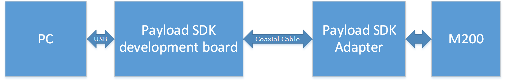
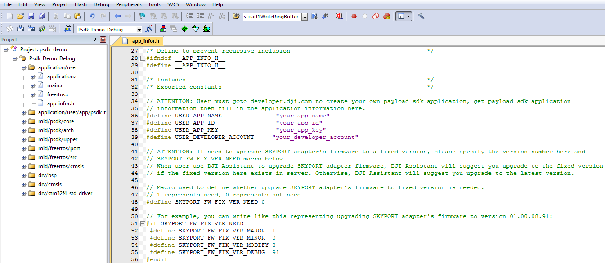
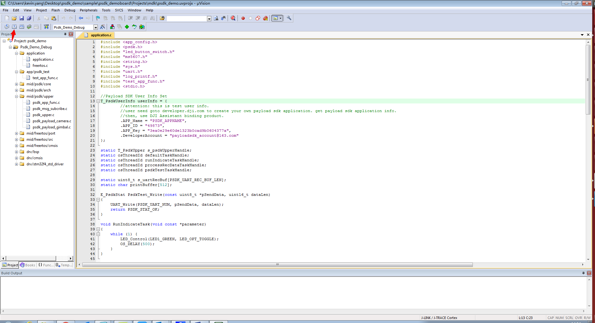
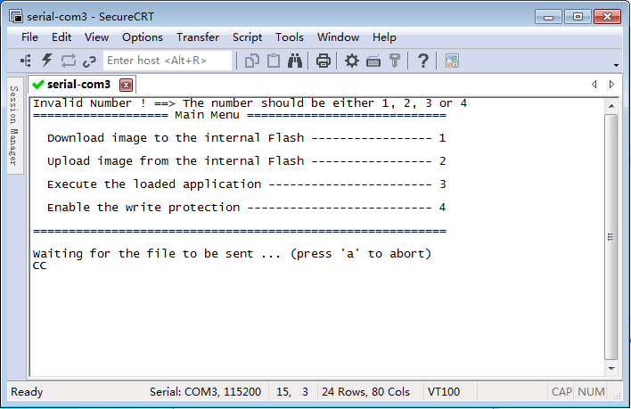
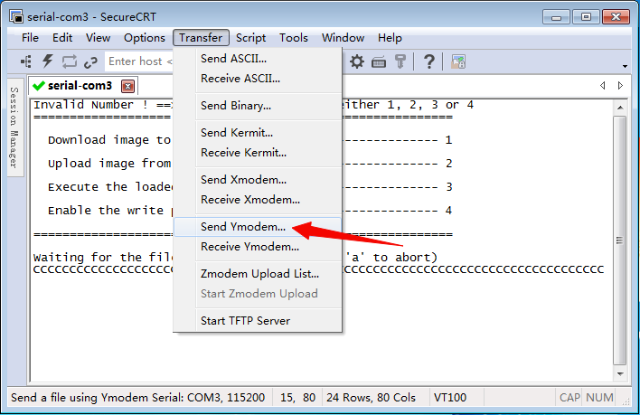

此页面显示如何构建 Payload SDK 示例应用程序固件并将其下载到 PSDK 开发板。

对于您自己的应用程序，这些步骤将非常相似：请遵循与此文档描述相同的步骤，但是用您自己的项目路径替换示例项目的路径。

目前对于构建和编译过程，我们只支持具有 armcc 编译器的 Keil MDK。 

1. 连接系统，如以下图所示：

将 SKYPORT 转接环安装到飞行器。使用开发套件自带的同轴线连接转接环以及 Payload SDK 开发板。使用 Micro USB 数据线连接开发板上的 Micro USB 至电脑 USB 口。

2. 打开飞行器电源，确保 SKYPORT 转接环已经安装好。（适配器和飞机上的红点应该对齐）。如果连接设置正确，则 Payload SDK 开发板上的蓝色 LED 常亮。 

3. 从 [用户中心](https://developer.dji.com/user/apps/#all) 下载 Payload SDK 开发包。

4. 配置 Payload SDK 开发环境. 您需要下载 [Keil MDK](http://www2.keil.com/mdk5/) >5.22 并购买许可进行激活。然后使用 Keil's `Pack Installer` 安装最新的 STM32F4xx_DFP.2.x.x pack包, 如下图所示. (或者, 您可以从 <a href="http://www.keil.com/dd2/Pack/" target="_blank">http://www.keil.com/dd2/Pack/</a> 手动下载并从 Pack Installer中导入下载的文件。)

5. 在 Keil uVision IDE 中打开位于 `sample/psdk_development_board/Projects/mdk/psdk_demo.uvprojx` 的工程项目。

6. 编译代码前, 需要在 `sample/psdk_development_board/Application/app_infor.h` 文件中输入您的 Payload SDK App name, App ID, App Key 和 Payload SDK 企业账号。

7. 进行 Payload SDK 固件编译。编译完成后, 你可以在 `sample/psdk_development_board/Projects/mdk` 文件夹中看到一个bin文件 (`psdk_demo.bin`) 。

8. 长按 Payload SDK 开发板上的 KEY1 按钮并重启飞行器。直至 Payload SDK 开发板上的 LED2 红灯常亮即可松手。

9. 打开 SecureCRT, 选择快速连接，设置串口号、波特率、停止位等 (115200 8N1)。设置完成后，输入回车，可以看到主界面。 然后输入1（下载固件到开发包中）。

10. 点击顶部菜单栏 “Transfer”，选择 “Send Ymodem”，添加程序编译后生成的bin文件（psdk_demo.bin），固件即开始下载到开发板中。

11. 待下载 100% 后，输入“3”以允许应用，开发板上 LED3 绿灯慢闪即运行成功。
