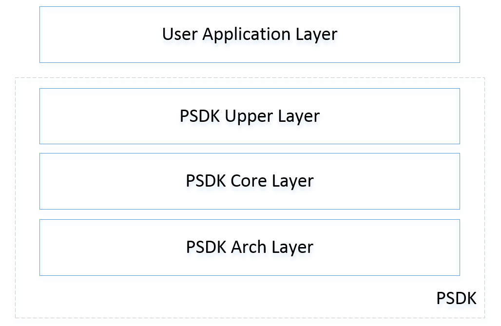

## Payload SDK 软件架构

- User Application Layer : 用户的应用程序。
- PSDK Upper Layer : API 层，用户调用 API 层函数使用 Payload SDK功能
- PSDK Core Layer : 协议层，处理底层协议相关
- PSDK Arch Layer : 用于 Payload SDK 移植，与平台相关。

## 运行 Payload SDK
Payload SDK 的初始化函数在 "Payload_SDK/psdk_upper/inc/psdk_upper.h" 文件中提供。您可以参考功能接口说明，为 Payload SDK 构建运行环境并与您的应用程序合并。

## 使用 Payload SDK 功能
"Payload_SDK/psdk_upper/inc" 文件夹中各种功能的主要头文件如下所示：

•	psdk_app_func.h: 提供与 Mobile SDK 通信和 DJI Pilot 自定义控件功能等相关功能。
 
•	psdk_msg_subcribe.h: 提供消息订阅功能，供用户订阅 GPS，时间，无人机位置和姿态以及其他无人机系统信息。

•	psdk_payload_camera.h: 提供相机负载开发接口。支持 DJI Pilot 和 Mobile SDK 对相机负载进行控制。

•	psdk_payload_gimbal.h: 提供云台负载开发接口。支持 DJI Pilot 和 Mobile SDK 对云台负载进行控制。

•	psdk_osdk_func.h: 提供与 Onboard SDK 通信等相关功能。

•	psdk_positioning.h: 提供定位相关开发接口。可用于精准测绘等应用。

## Payload SDK 移植接口
在 Payload SDK 源码包中提供将 Payload SDK 移植到 FreeRTOS操作系统、裸机（MCU 为 STM32F407IG ）和 Linux 操作系统的示例。您可以尝试将 Payload SDK 示例移植到您自己的负载平台。请参阅 “Payload_SDK / psdk_arch / arch_template / psdk_arch_sys.h” 和 “Payload_SDK / psdk_arch / arch_template / psdk_arch_sys.c” 以了解如何移植 Payload SDK。
