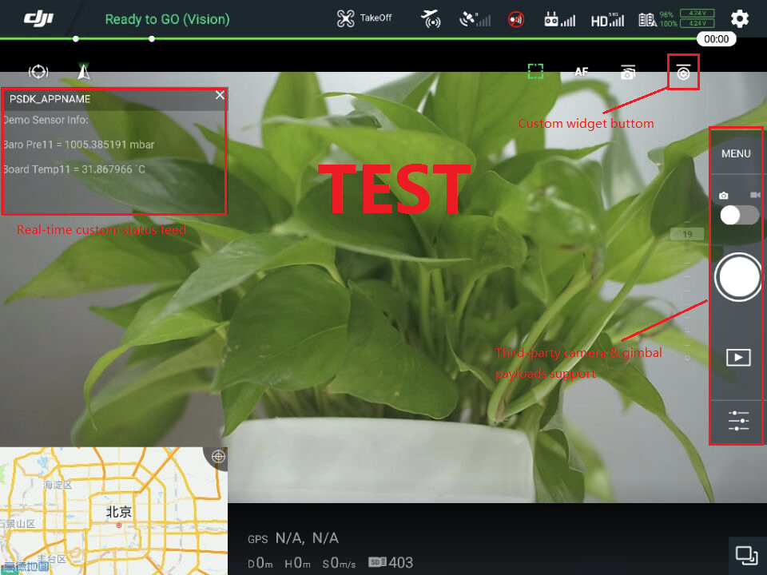

## DJI开发者生态系统

DJI Payload SDK 增加了不断增长的开发者生态系统，包括 [Mobile SDK](https://developer.dji.com/mobile-sdk/documentation/introduction/index.html), [Onboard SDK](https://developer.dji.com/onboard-sdk/documentation/introduction/homepage.html) 和各种应用程序/工具，包括 [DJI Pilot](http://dl.djicdn.com/djipilot-official.apk) 和 [DJI Assistant 2](https://www.dji.com/matrice-200-series/info#downloads)。

- 当您想要将负载添加到飞机上时，Payload SDK是您的首选。
- PSDK与Mobile SDK紧密集成，为Mobile SDK应用程序的用户提供原生体验。
- Onboard SDK与PSDK的集成即将推出！

## DJI Pilot 支持

## Mobile SDK 支持
Mobile SDK提供了与PSDK数据交互的接口。

Mobile SDK支持以下与PSDK相关的功能：

- 数据透传接口。
- 网络端口下行数据传输接口。
- 网络端口传输的固定格式 H264 视频解码。
- Payload SDK相机和云台接口支持。

## DJI Assistant 2 支持
DJI Assistant 2 提供 SKYPORT转接环配置功能如下：

- 转接环的绑定和解绑
- 设置 SKYPORT 转接环通道和通道波特率
- 设置 SKYPORT 转接环数据推送数据频率
- 更新 SKYPORT 转接环固件

企业用户可以使用 Payload SDK 帐户登录 DJI Assistant 2 并在 SKYPORT 的配置页面配置 SKYPORT 转接环。
