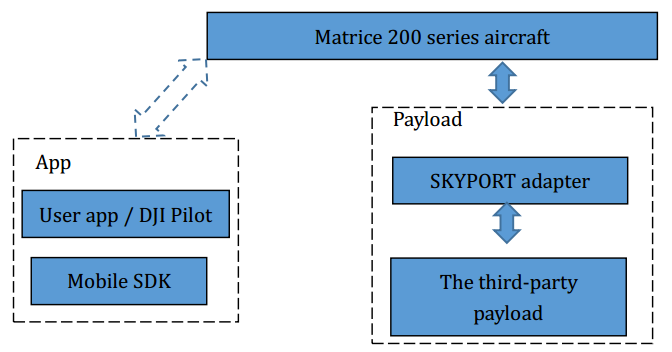

## 系统框图

## 功能概述

点击下表中的链接查看每个功能的更多详细信息。

| 特征                                                                                       | 描述                                                                                        |
|--------------------------------------------------------------------------------------------|---------------------------------------------------------------------------------------------|
| [数据透传](data-transmission.html#direct-data-transmission-UART-CAN)                       | 通过 UART / CAN 端口直接在 Mobile SDK 和 SKYPORT 之间传输数据                               |
| [网络数据传输](data-transmission.html#network-stream-data-transmission-udp)                | 采用UDP协议通过网络端口发送大量的下行数据。以指定格式传输视频码流时 Mobile SDK 提供码流分析 |
| [飞机状态数据推送](aircraft-state-push-data.html)                                          | 将无人机状态数据推送至负载，包括 GPS 信息，姿态信息，APP 时间等                                |
| [相机和云台功能](camera-gimbal-features.html)                                              | Payload SDK 为用户提供了一组相机和云台接口，以便快速开发相机和云台类负载                    |
| [Mobile SDK 支持](integrate-other-dji-sdk-apps.html#mobile-sdk-support)                    | 提供 PSDK 接口支持                                                                            |
| [DJI Pilot 支持](integrate-other-dji-sdk-apps.html#dji-pilot-support)                      | DJI Pilot 提供 PSDK 接口支持                                                                   |

