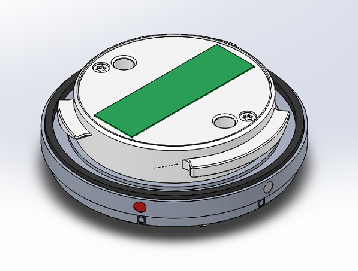
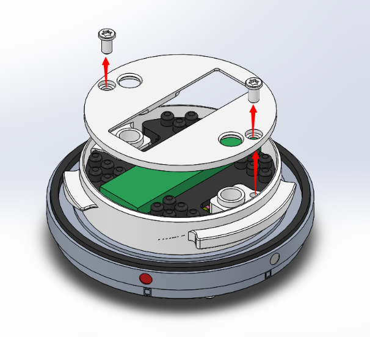
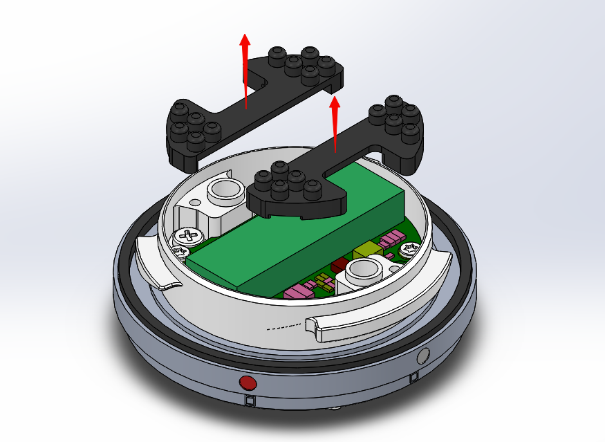
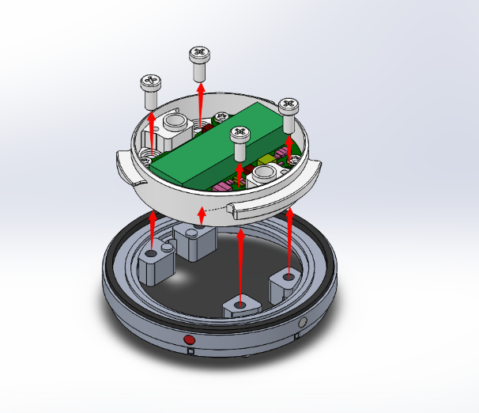
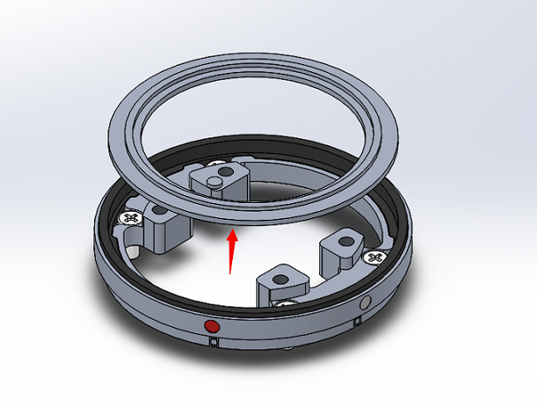
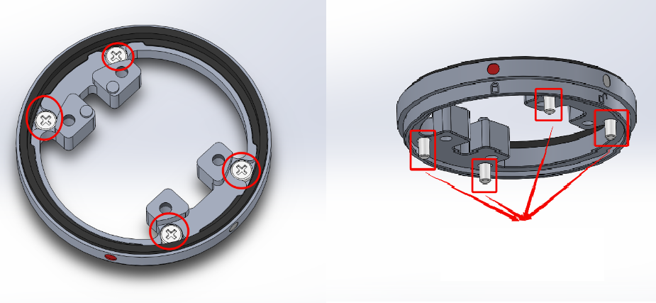
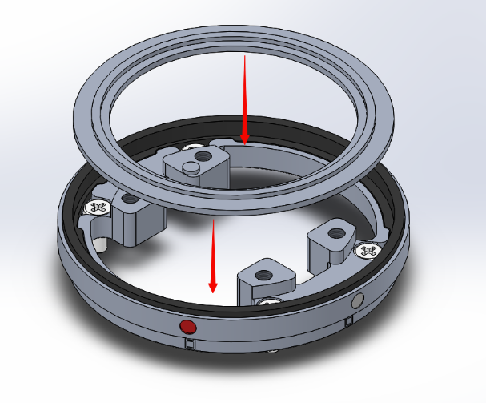
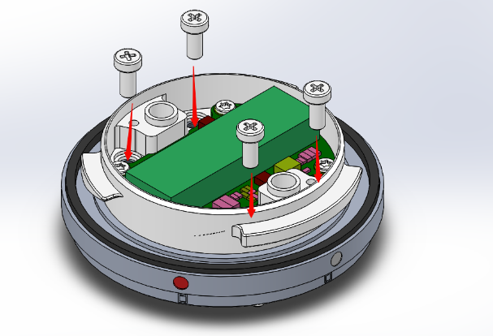
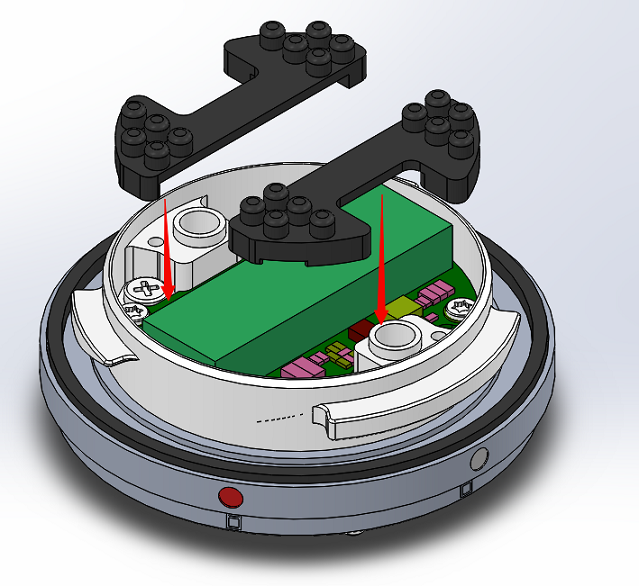
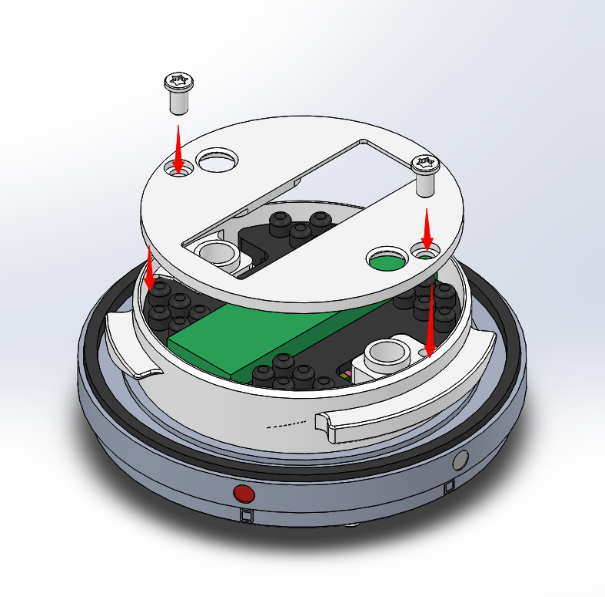

想要更好的学习如何安装负载设备，请查看 <a href="https://www.skypixel.com/videos/dji-payload-sdk" target="_blank">安装负载设备视频</a>.

## 拆卸指南

### 1. 下图是一个新的 DJI SKYPORT.

### 2. 拧下下图中的两颗螺丝，然后取下金属盖片。

### 3. 取下硅胶垫。

### 4. 拧下下图中的四颗螺钉（不要拧下四颗 PCBA 锁定螺丝），并取下固定 PCBA 的金属环。

### 5. 拆下下图中央的压力环，不要取下橡胶圈。

### 6. 下图中显示的四个螺钉用于安装您自己的负载设备。你的负载应该预留 M2.5 螺纹孔，最小深度为 3.5mm。

## 组装指南

### 1.  安装金属环（压力片），同时确保橡胶圈保持原位而不变形; 向下按压金属环以确保设备已安装到位。

### 2. 安装 PCBA 金属环（注意：左图中的引脚需要与右图中的引脚孔对齐）。

### 3.  如下图所示，拧紧四颗螺丝。

### 4. 安装两个硅胶垫，如下图所示。

### 5. 安装金属盖片，然后拧紧螺钉。

