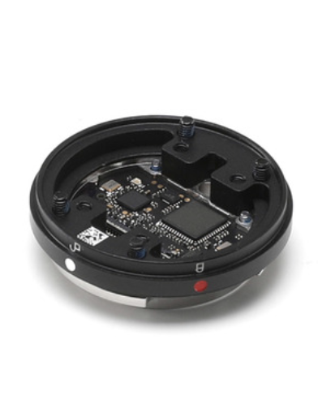
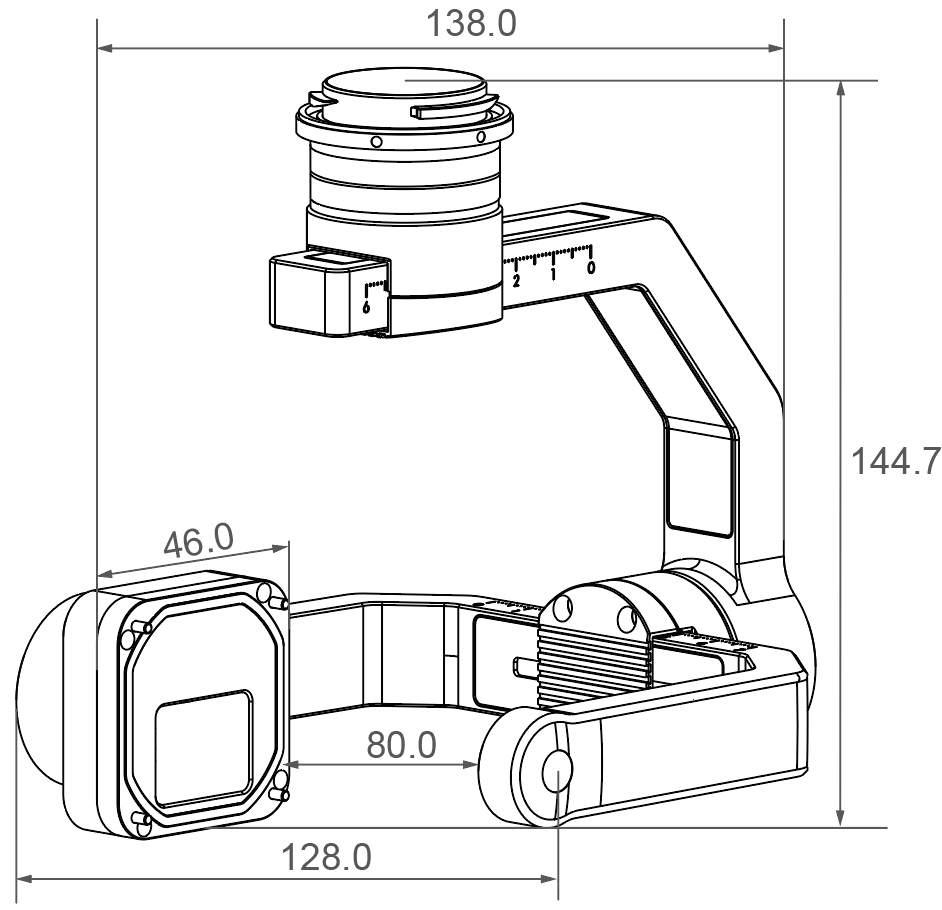
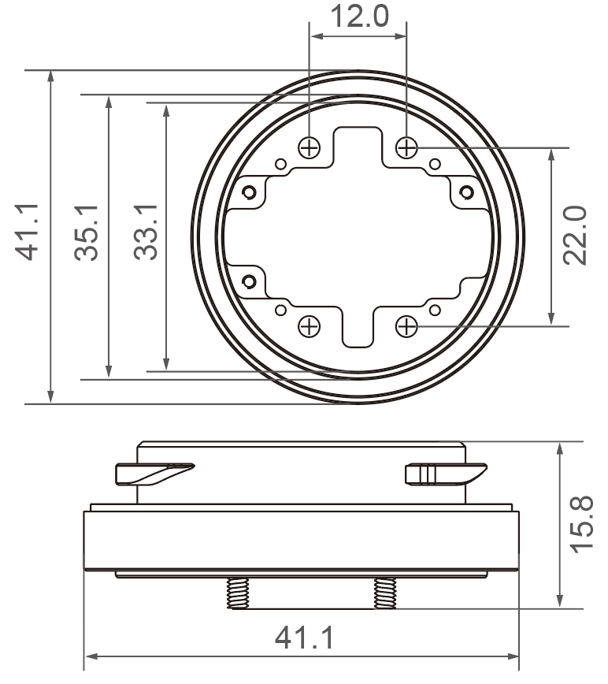
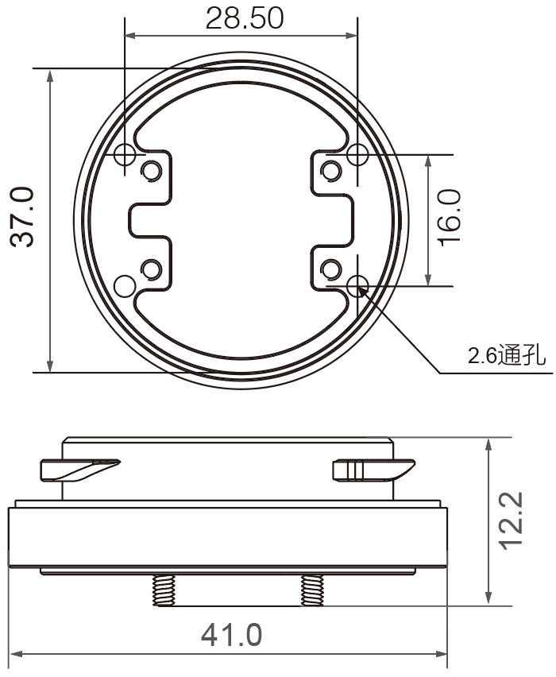

> **注意**  
> * X-Port 和Skyport V2 仅支持使用**PSDK V2.x.x**；
> * Skyport 仅支持使用**PSDK V1.x.x** ；
> * DJI 将在 **2020年 2月 1日**停止对**PSDK V1.x.x** 和Skyport 的维护，建议使用**X-Port** 或**Skyport V2** 在**PSDK V2.x.x** 的基础上开发负载设备。

## 购买开发套件

#### Skyport V2
借助<a href="https://store.dji.com/cn/product/psdk-development-kit-v2">Skyport V2</a> 开发套件中的接口拓展板，开发者能够使用第三方开发板开发负载设备。    
Skyport V2 包含如下配件：    

      

> **说明：** 当负载设备进入量产阶段后，请购买 <a href="https://store.dji.com/cn/product/dji-skyport-adapter-set-v2">Skyport V2 转接环套装</a>。

#### Skyport
利用<a href="https://store.dji.com/cn/product/psdk-development-kit">Skyport</a> 开发套件中的负载设备开发板，开发者无需购置第三方开发板，即可开发出功能全面且兼容性较好的负载设备。     
Skyport 包含如下配件：  

      

> **说明：** 当负载设备进入量产阶段后，请购买<a href="https://store.dji.com/cn/product/psdk-ribbon-cable-set">同轴线套装</a>和 <a href="https://store.dji.com/cn/product/dji-skyport-adapter-set">Skyport 转接环套装</a>。

## 硬件平台对比
<table id="开发套件对比">
  <thead>
    <tr>
      <th style="border:none">   </th>
      <th style="border:none;text-align:center">X-Port</th>
      <th style="border:none;text-align:center">Skyport V2</th>
      <th style="border:none;text-align:center">Skyport </th>
    </tr>
  </thead>
  <tbody>
    <tr style="text-align:center">
      <td style="border-right: none;text-align:left;border-left: none;"> </td>
      <td style="border-right: none;border-left: none;">

      

</td>
      <td style="border-right: none;">

      

</td>
      <td style="border-right: none;">

      

</td>
    </tr>
    <tr style="text-align:center">
      <td style="border-right: none;text-align:left;border-left: none;"><b>硬件尺寸</b></td>
      <td style="border-right: none;border-left: none;">

      

</td>
      <td style="border-right: none;">

      

</td>
      <td style="border-right: none;">

      

</td>
    </tr>
    <tr style="text-align:center">
      <td style="border-left: none;text-align:left;border-right: none;"><b>重量</b></td>
      <td style="border-right: none;border-left: none;text-align:left">345g</td>
      <td style="border-right: none;">29g</td>
      <td style="border-right: none;">24g</td>
    </tr>
    <tr style="text-align:center">
      <td style="border-left: none;text-align:left;border-right: none;"><b>负载尺寸</b></td>
      <td style="border-right: none;text-align:left;border-left: none;">负载设备需要在以X-Port 质心为 圆心，直径为145mm 的球内</td>
      <td colspan="2" style="border-right: none;">负载设备不可撞击或干涉无人机的正常运行</td>
    </tr>
    <tr style="text-align:center">
      <td style="text-align:left;border-right: none;border-left: none"><b>负载重量</b></td>
      <td style="border-right: none;text-align:left;border-left: none;">450g</td>
      <td colspan="2" 1style="border-right: none;">单个负载设备的重量不超过600g 
 <b>说明：</b>有关负载设备重量的详细说明，请参见<a href=../guide/payload-criterion.html>结构标准</a>。
</td>
    </tr>
    <tr style="text-align:center">
      <td style="border-right: none;text-align:left;border-left: none;"><b>适配PSDK 版本</b></td>
      <td  colspan="2" style="border-right: none;border-left: none;">PSDK 2.0 
     </td>
      <td style="border-right: none;"> PSDK 1.0</td>
    </tr>
    <tr style="text-align:left">
      <td style="border-left: none;text-align:left;border-right: none;"><b>电压输出</b></td>
      <td style="border-right: none;text-align:left; border-right: none;border-left: none;"> 13.6V / 2A 17V / 2.5A(高功率申请)
     </td>
      <td style="border-right: none;"> 13.6V / 4A   17V / 4A (高功率申请)</td>
      <td style="border-right: none;">M200 系列：12.7V / 4A  M200 V2 系列：13.6V / 4A </td>
    </tr>
    <tr>
    <td rowspan=2 style="border-top: none;border-left: none;border-right: none;text-align:left"><b>GPIO</b></td>
    <td colspan="2" style="text-align:center;border-left: none;">1个</td>
    <td style="border: none;text-align:center">ㄨ</td>
    </tr>
    <tr style="text-align:center" >
      <td colspan="3" style="border-top: none;border-right: none;border-right: none;border-left: none;">I/O 硬件触发</td>
    </tr>
    <tr style="text-align:center" >
      <td style="border-left: none;text-align:left;border-right: none;"><b>UART 信号传输</b></td>
      <td colspan="3" style="border-right: none;border-left: none;" >1个，使用UART 端口，通过TTL 电平（3.3V）传输数据</td>
    </tr>
    <tr style="text-align:center" >
      <td style="border-left: none;text-align:left;border-right: none;"><b>MDI 数据传输</b></td>
      <td colspan="3" style="border-right: none;border-left: none;" >1个，通过该接口传输视频流、媒体文件和高速数据</td>
    </tr>
    <tr style="text-align:center" >
      <td style="border-right: none;text-align:left;border-left: none;border-right: none;"><b>CAN 信号传输</b></td>
      <td colspan="2" style="border-right: none;border-left: none;">ㄨ</td>
      <td style="border-right: none;">传输控制命令</td>
    </tr>
    <tr style="text-align:center" >
      <td style="border-right: none;text-align:left;border-left: none;"><b>High Power Apply</b> </td>
      <td  colspan="2" style="border-left: none;border-right: none;">通过该接口输出申请高功率的数字信号（0～3.3V）</td>
      <td style="border-right: none;">ㄨ</td>
    </tr>
    <tr style="text-align:center" >
      <td style="border-left: none;text-align:left;border-right: none;"><b>PPS 信号传输</b></td>
      <td colspan="3" style="border-right: none;border-left: none;" >通过PPS 引脚传输数字信号（0～3.3V），实现时间同步功能</td>
    </tr>
    <tr style="text-align:center">
      <td style="border-right: none;text-align:left;border-left: none;"><b>适配机型</b></td>
      <td colspan="2" style="border-right: none;border-left: none;">Matrice 200 V2 Matrice 210 V2   Matrice 210 RTK V2    
     </td>
      <td style="border-right: none;">Matrice 200、Matrice 200 V2 Matrice 210、Matrice 210 RTK Matrice 210 V2 、Matrice 210 RTK V2</td>
    </tr>
  </tbody>
</table>

> **说明** 
> * X-Port 的防护等级：IP44，工作温度范围：-20°C～50°C。
> * 受实际工作环境的影响，X-Port 实际的工作电流可能会和额定电流有一定的差异。

## X-Port 
有关使用X-Port 的操作步骤，请参见 [“使用硬件平台”](../guide/hardware.html)。	
#### 云台结构
X-Port 标准云台的结构如 图1. X-Port 标准云台 所示：

图1. X-Port 标准云台（单位：mm）

      

#### 负载设备设计约束

使用X-Port 开发的负载设备需符合如下要求：

* X-Port 轴臂的宽度为**80mm**，为确保负载设备能够正常转动，负载设备的宽度**不可**超出该轴距；    
* 负载设备的重量**不可**超过 **450g**，超出该质量的负载设备可能会损坏云台支架或减震球；    
* 负载设备的质心需要在安装结构的轴心线上；确保负载设备在**以质心为球心**，直径为145mm 的球内，防止负载设备上扬45° 时，影响X-Port 的正常转动；    
  >**说明：** 请确保可变焦的负载设备在最大变焦倍数时，负载设备的质心在安装轴的**轴线**上。  

* 无人机在静置状态下，若负载设备可能会触碰到地面，建议使用**加长起落架**；    
* 请确保安装负载设备的接口与X-Port 主轴臂的防水垫圈**完全贴合**；   
* 推荐负载设备使用铝合金材质的外壳，不建议使用**塑料材质**的外壳或**碳纤维材质**的外壳。    
