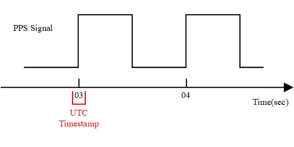
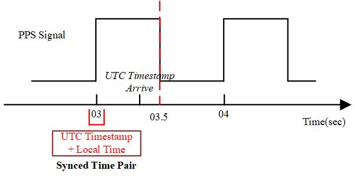
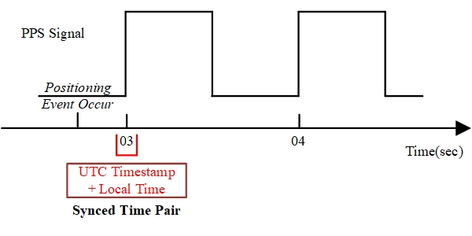

## 概述

* 为满足厘米级精准度的定位需求，DJI 支持开发者使用基准站（如D-RTK 2）和移动站（如M210 RTK V2），借助RTK（Real Time Kinematic，实时动态载波相位差分技术）获取无人机飞行姿态和高精度的定位信息。
* 实现精准定位功能，需要先同步时间，消除时钟差；通过时间转换，计算定位事件发生时准确的时间信息；负载设备通过定位接口调用，可获取精准的位置信息。

## 相关概念

* 兴趣点：负载设备上某一器件的任意位置，如相机图像传感器的中心点。
* 目标点：获取定位信息的位置，该目标点也可以为兴趣点。

> **说明**：M210 RTK V2的目标点为主云台口中心点，即定位接口的返回值为主云台口中心点位置。

* 定位事件：触发位置请求的事件，如相机曝光时会触发位置请求，则"相机曝光"是一个定位事件。
* UTC 时间：RTK导航定位系统的时间系统。
* UTC 时间戳：PPS 硬件脉冲信号上升沿的时间信息，无人机在PPS 硬件信号的上升沿处将该信号发送至负载设备。
* 本地时间：负载设备使用的时间系统。

## 注意事项

* 为获取精准的定位信息，请通过APP确认无人机与RTK 卫星间保持良好的通信状态。

>**说明**：该APP可为DJI 发布的APP，也可为使用MSDK开发的APP。

* PPS 信号上升沿到达负载至负载记录本地时间之间的延迟影响定位精度，请根据实际的使用情况，保证较低的延迟，该延迟不应高于1ms。

## 同步时间

为使无人机与GNSS（Global Navigation Satellite System，卫星导航系统）的时钟保持同步，消除时钟差对定位信息的影响，负载设备会主动执行时钟同步。  

1. 将SKYPORT连接器安装至云台卡口后，负载设备将主动检测PPS 硬件脉冲信号。
2. 当负载设备检测到PPS 硬件脉冲信号的上升沿时，负载设备将记录负载设备的本地时间。
3. 负载设备在记录PPS 硬件脉冲信号的上升沿后，会从命令通道接收与PPS 硬件脉冲信号上升沿对应的UTC 时间戳:



* 若UTC时间戳与PPS硬件脉冲信号上升沿相比超出500ms到达负载设备时，该UTC时间戳会被丢弃，导致本次时间同步失败，影响定位数据的精准度；

* 当UTC 时间戳在PPS 硬件脉冲信号上升沿500ms 内到达负载设备时，负载设备根据UTC 时间戳与PPS硬件脉冲信号上升沿的本地时间，计算UTC时间与本地时间的时间差，实现负载设备与RTK系统的时钟同步（形成一个时间对）。



> 相关参考：[Onboard SDK 硬件同步功能原理介绍](https://developer.dji.com/cn/onboard-sdk/documentation/guides/component-guide-hardware-sync.html#Principles-of-Operation)

## 时间转换

通过时间转换，将本地定位时间转换为RTK系统的时间后，负载设备可获取精准的RTK定位信息。

1. 当定位事件发生时，负载设备将记录定位事件发生时负载设备的本地时间。  
2. 负载设备通过下述公式，计算定位事件发生时的UTC 时间:

* 假设同步时间对中的UTC 时间为 <b>t<sub>UTC</sub><sup>synced</sup></b>
* 本地时间为 <b>t<sub>local</sub><sup>synced</sup></b>
* 定位事件发生时的本地时间为 <b>t<sub>local</sub><sup>event</sup></b>
* 则定位事件发生时的UTC 时间为 <b>(t<sub>local</sub><sup>event</sup> - t<sub>local</sub><sup>synced</sup>) + t<sub>UTC</sub><sup>synced</sup></b>

>**说明**：请确保UTC 时间与负载本地时间的时间格式保持一致。

### 时间格式

仅当时间格式相同时，可实现对本地时间和RTK时间的相互转换，为方便使用，建议使用下示时间格式：

```
typedef struct {
    uint16_t year;         /*!< Specifies year. */
    uint8_t month;         /*!< Specifies month. */
    uint8_t day;           /*!< Specifies day. */
    uint8_t hour;          /*!< Specifies hour. */
    uint8_t minute;        /*!< Specifies minute. */
    uint8_t second;        /*!< Specifies second. */
    uint32_t microsecond;  /*!< Specifies microsecond. */
} T_UtcTimestampMsg;
```
## 获取位置信息

负载设备通过如下步骤，向无人机请求精确的定位信息。  

1. 仅当定位事件发生时的UTC 时间早于最新的PPS 信号上升沿时（时间间隔小于2s ），负载设备将使用定位事件发生时的UTC 时间，通过`PsdkPositioning_GetPos`接口，向无人机请求当前的位置信息。 



2. 无人机将目标点位置、无人机姿态、位置属性以及主云台口中心与无人机RTK 主天线的位置偏移量发送给负载设备。 

3. 通过`E_PsdkPositioningPositionSolutionProperty`可获取位置解属性的具体含义，如目标点位置/无人机姿态信息，负载结构参数/缓存的云台姿态信息计算出兴趣点位置。

## 查询定位记录

在无人机`cam_mark_file`中查看Mark 文件获取准确的定位信息，有关Mark 文件的详细说明请参见[Mark 文件简介](https://djisdksupport.zendesk.com/hc/zh-cn/articles/360024019493-Mark文件简介)。

## 最佳适配

M210 RTK V2


