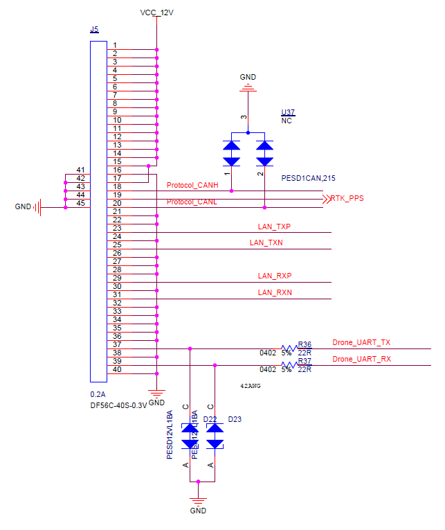

This document introduces the hardware involved in the development of an application payload with Payload SDK.

## Payload Weight Requirements
<table id="t01">
  <thead>
    <tr>
      <th>Flight platform</th>
      <th>Weight</th>
    </tr>
  </thead>
  <tbody>
    <tr>
      <td>M200 series</td>
      <td>Less than 600g</td>     
    </tr>
  </tbody>
</table>

## Payload SDK Development Kit
You can get the Payload SDK development kit after becoming a Payload SDK enterprise user. The Payload SDK development kit allows you to explore the Payload SDK features and facilitates quick development. 

The Payload SDK development kit contains the following components：

- DJI SKYPORT Adapter  x1
- Payload SDK Development Board  x1
- Round Ribbon Cable 250mm  x1
- Flat Ribbon Cable 30mm  x1
- Ribbon Cable Connector  x3

## DJI SKYPORT Adapter
### Introduction

The SKYPORT adapter is docked to a M200 series' gimbal port to connect user payloads and UAVs. For the connection of the SkyPort and the payload, see [SKYPORT installation](../guide/adapter_install.html).

### Dimensions

### Interfaces

#### Interfaces Parameters
<table id="t01">
  <thead>
    <tr>
      <th>Interface type</th>
      <th>Parameter</th>
      <th>Description</th>
    </tr>
  </thead>
  <tbody>
    <tr>
      <td>Power supply</th>
      <td>12.7V / 4A</td>
      <td>Peak operating current is 4A</td>        
    </tr>
    <tr>
      <td>Command communication</th>
      <td>UART(TTL 3.3V), CAN</td>
      <td>Command communications with SKYPORT</td>        
    </tr>
    <tr>
      <td>High speed bulk data communication</th>
      <td>MDI network port</td>
      <td>Transmit video stream and user-defined data</td>        
    </tr>
  </tbody>
</table>

#### Definition of Interfaces Pin

## Payload SDK Development Board
The Payload SDK development board helps you explore the Payload SDK features to quickly familiarize yourself with the Payload SDK usage and prototype your application during the preliminary R&D phase. You can port the Payload SDK to your own payload platform later. The Payload SDK development board uses the MCU STM32F407IGT6.

### Hardware description

<table id="t02">
  <thead>
    <tr>
      <th>Interface Number</th>
      <th>Interface Name</th>
      <th>Interface Description</th>
    </tr>
  </thead>
  <tbody>
    <tr>
      <td>J5</th>
      <td>SKYPORT connector</td>
      <td>Connect to the SKYPORT adapter using the Round Ribbon Cable 250mm.</td>        
    </tr>
    <tr>
      <td>J7</th>
      <td>External Test Port</td>
      <td>Transfers the UART/CAN signal from the SKYPORT adapter into a pinned connector to facilitate connection to other platforms.</td>        
    </tr>
    <tr>
      <td>J10</th>
      <td>Ethernet Port</td>
      <td>Transmit video stream and user-defined data</td>        
    </tr>
    <tr>
      <td>J11</th>
      <td>MCU Debug Port</td>
      <td>SWD interface for debugging the device using a SWD debugger/prober and downloading MCU programs; UART interface for logging data</td>        
    </tr>
    <tr>
      <td>J12</th>
      <td>USB Debug Port</td>
      <td>Print log fles and update frmware using a PC connected to this port.</td>        
    </tr>
  </tbody>
</table>
