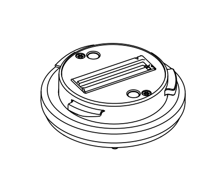
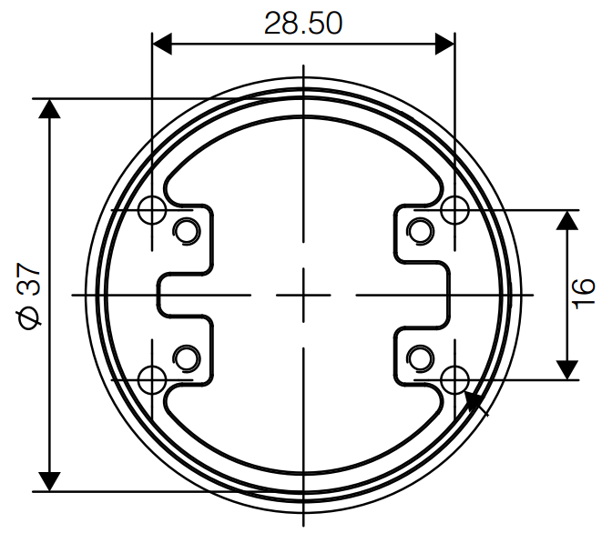
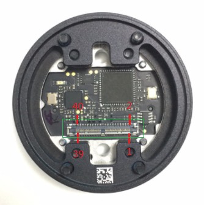
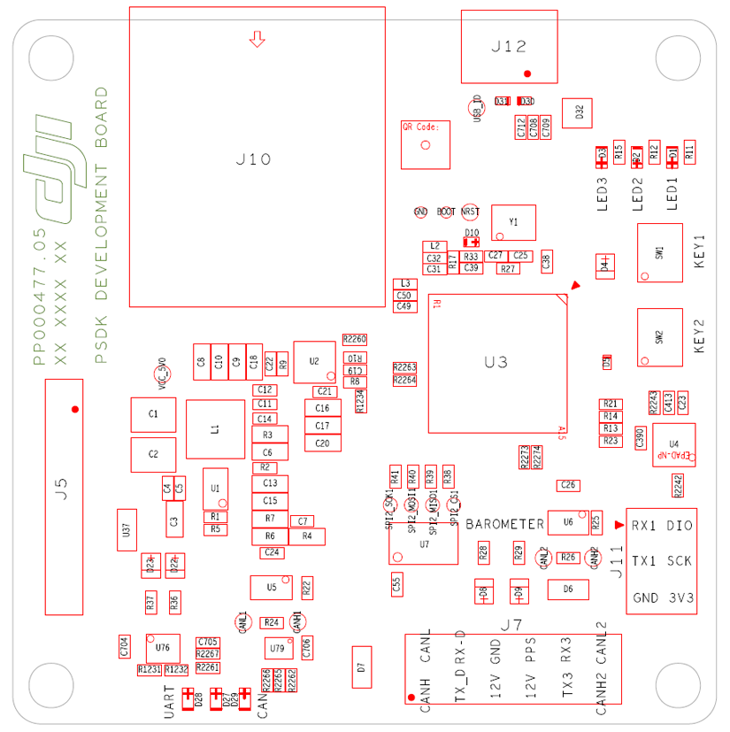

本文档介绍了使用 Payload SDK 开发负载应用所涉及的硬件。

## 负载重量要求
<table id="t01">
  <thead>
    <tr>
      <th>飞行平台</th>
      <th>重量</th>
    </tr>
  </thead>
  <tbody>
    <tr>
      <td>M200 系列</td>
      <td>小于 600g</td>     
    </tr>
  </tbody>
</table>

## Payload SDK 开发工具包
成为 Payload SD K企业用户后，您可以获得 Payload SDK 开发工具包。Payload SDK 开发工具包可让您探索 Payload SDK 功能并促进快速开发。 

Payload SDK 开发工具包包含以下组件：

- DJI SKYPORT 转接环  x1
- Payload SDK 开发板  x1
- 圆形同轴线 250mm  x1
- 扁状同轴线 30mm  x1
- 同轴线端座  x3

## DJI SKYPORT 转接环
### 介绍

SKYPORT 转接环可以安装到 M200 系列的云台端口，用于连接用户负载和无人机。有关 SKYPORT 和负载的连接，请参阅 [SKYPORT 安装](../guide/adapter_install.html)。

### 外形尺寸

### 接口

#### 接口参数
<table id="t01">
  <thead>
    <tr>
      <th>接口类型</th>
      <th>参数</th>
      <th>描述</th>
    </tr>
  </thead>
  <tbody>
    <tr>
      <td>电源</th>
      <td>12.7V / 4A</td>
      <td>峰值工作电流是 4A</td>        
    </tr>
    <tr>
      <td>通讯方式</th>
      <td>UART(TTL 3.3V), CAN</td>
      <td>用于与转接环通讯</td>        
    </tr>
    <tr>
      <td>大数据传输通道</th>
      <td>MDI 网络端口</td>
      <td>用于传输视频流和用户定义的数据</td>        
    </tr>
  </tbody>
</table>

#### 接口引脚定义

<table id="t03">
  <thead>
    <tr>
      <th>引脚</th>
      <th>定义</th>
    </tr>
  </thead>
  <tbody>
    <tr>
      <td>1 - 15</td>
      <td>VCC</td>     
    </tr>
    <tr>
      <td>16</td>
      <td>GND</td>     
    </tr>
    <tr>
      <td>17</td>
      <td>VCC</td>     
    </tr>
    <tr>
      <td>18</td>
      <td>CANH</td>     
    </tr>
    <tr>
      <td>19</td>
      <td>GND</td>     
    </tr>
    <tr>
      <td>20</td>
      <td>CANL</td>     
    </tr>
    <tr>
      <td>21 - 22</td>
      <td>GND</td>     
    </tr>
    <tr>
      <td>23</td>
      <td>LAN_TXP</td>     
    </tr>
    <tr>
      <td>24</td>
      <td>GND</td>     
    </tr>
    <tr>
      <td>25</td>
      <td>LAN_TXN</td>     
    </tr>
    <tr>
      <td>26 - 28</td>
      <td>GND</td>     
    </tr>
    <tr>
      <td>29</td>
      <td>LAN_RXP</td>     
    </tr>
    <tr>
      <td>30</td>
      <td>GND</td>     
    </tr>
    <tr>
      <td>31</td>
      <td>LAN_RXN</td>     
    </tr>
    <tr>
      <td>32 - 36</td>
      <td>GND</td>     
    </tr>
    <tr>
      <td>37</td>
      <td>Drone_Uart_TX</td>     
    </tr>
    <tr>
      <td>38</td>
      <td>GND</td>     
    </tr>
    <tr>
      <td>39</td>
      <td>Drone_Uart_RX</td>     
    </tr>
    <tr>
      <td>40</td>
      <td>GND</td>     
    </tr>
  </tbody>
</table>

## Payload SDK 开发板
开发板可帮助您探索 Payload SDK 功能，以便在初步研发阶段快速熟悉 Payload SDK 的使用情况并为您的应用程序构建原型。稍后您可以将 Payload SDK 移植到您自己的负载平台上。Payload SDK 开发板使用的 MCU 为 STM32F407IGH6。

### 硬件描述

<table id="t02">
  <thead>
    <tr>
      <th>接口编号</th>
      <th>接口名称</th>
      <th>接口说明</th>
    </tr>
  </thead>
  <tbody>
    <tr>
      <td>J5</th>
      <td>同轴线端座</td>
      <td>使用同轴线连接到 SKYPORT 转接环。</td>        
    </tr>
    <tr>
      <td>J7</th>
      <td>外部测试端口</td>
      <td>将SKYPORT转接环的 UART/CAN 信号转换成杜邦线接口，以方便连接其他平台。</td>        
    </tr>
    <tr>
      <td>J10</th>
      <td>以太网端口</td>
      <td>传输视频流和用户定义的数据。</td>        
    </tr>
    <tr>
      <td>J11</th>
      <td>MCU 调试端口</td>
      <td>SWD 接口，用于使用 SWD 调试器下载和调试MCU程序; 用于记录数据的 UART 接口。</td>        
    </tr>
    <tr>
      <td>J12</th>
      <td>USB 调试端口</td>
      <td>用于连接到电脑打印 Log 和更新固件。</td>        
    </tr>
  </tbody>
</table>
