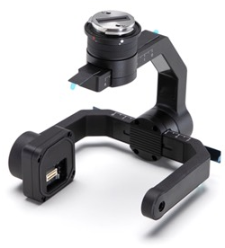
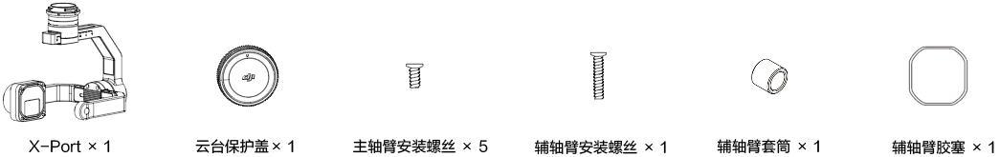
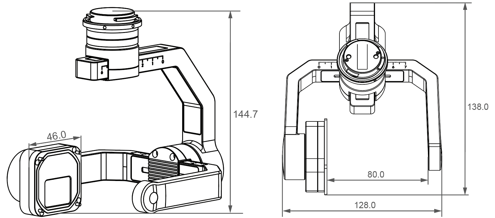

> **说明** 
> * X-Port 仅支持开发者使用PSDK V2.0.0 ，若您仍使用PSDK V 1.5.0 开发负载设备，请下载[PSDK V1.5.0](https://terra-1-g.djicdn.com/71a7d383e71a4fb8887a310eb746b47f/psdk/payload-sdk-doc-1.0.zip) 的文档并使用[SkyPort](https://store.dji.com/cn/product/psdk-development-kit)。
> * 有关X-Port 的使用说明和参数调校的详细步骤，请参见[PSDK V2.0.0](https://developer.dji.com/payload-sdk/downloads/)开发包中的使用说明书。

[X-Port 标准云台](https://store.dji.com/cn/product/dji-x-port)是一个具有云台功能的负载设备开发工具，开发者使用X-Port 并借助[Payload SDK 开发套件 2.0](https://store.dji.com/cn/product/psdk-development-kit-v2)中的配件，能够快速开发出可挂载在DJI 无人机上具有云台功能的负载设备，在使用PSDK 开放的API 接口实现高度定制化的同时，还能有效降低负载设备的开发成本，大幅度提升负载设备的可靠性与兼容性。

图1. X-Port  

      

图2. X-Port 包装清单 

      

## 主要特点
* 高精度三轴云台
* 高度开放的API 控制接口
* 支持云台上置和云台下置两种使用方式

## 适配机型
* Matrice 200 V2
* Matrice 210 V2
* Matrice 210 RTK V2

## X-Port 云台结构

图3. X-Port 云台结构(单位：mm)

      

* 重量：340g
* 荷载重量：450g
* X-Port 的防护等级：IP44 
* 工作温度范围：-20°C～50°C
* 电压输出：13.6V / 2A 或 17V / 2.5A(高功率申请)
> **说明** 
> * 受实际工作环境的影响，X-Port 实际的工作电流可能会和额定电流有一定的差异；
> * 有关X-Port 负载设备的结构标准，请参见[负载开发标准](../guide/payload-criterion.html)；
> * 有关X-Port 硬件接口的详细说明，请参见[设备连接](../workflow/device-connection.html)。

## 支持功能
* <a href="../tutorial/X-Port.html"><b> X-Port控制</b></a>
* <a href="../camera/camera-basic-functions.html"><b>相机功能</b></a>
* <a href="../tutorial/payload-collaboration.html"><b>负载协同</b></a>
* <a href="../tutorial/custom-widget.html"><b>自定义控件</b></a>
* <a href="../tutorial/positioning.html"><b>精准定位</b></a>

## 使用MSDK 和OSDK
* MSDK：使用MSDK 开发的移动端APP 能够控制X-Port 以及X-Port 上的负载设备执行指定的动作和任务。
* OSDK：使用OSDK 开发的应用程序，借助机载计算机（如Manifold 2-C）的强大算力，控制无人机、X-Port和负载设备执行指定的动作和相应的任务。

> **说明：** X-Port 支持开发者使用DJI Assistant 2 (2.0.11 及以上版本）调整配置参数。

-------

<a href="https://store.dji.com/cn/product/dji-x-port">购买X-Port 标准云台</a>

<a href="https://store.dji.com/cn/product/psdk-development-kit-v2">Payload SDK 开发套件 2.0</a>

