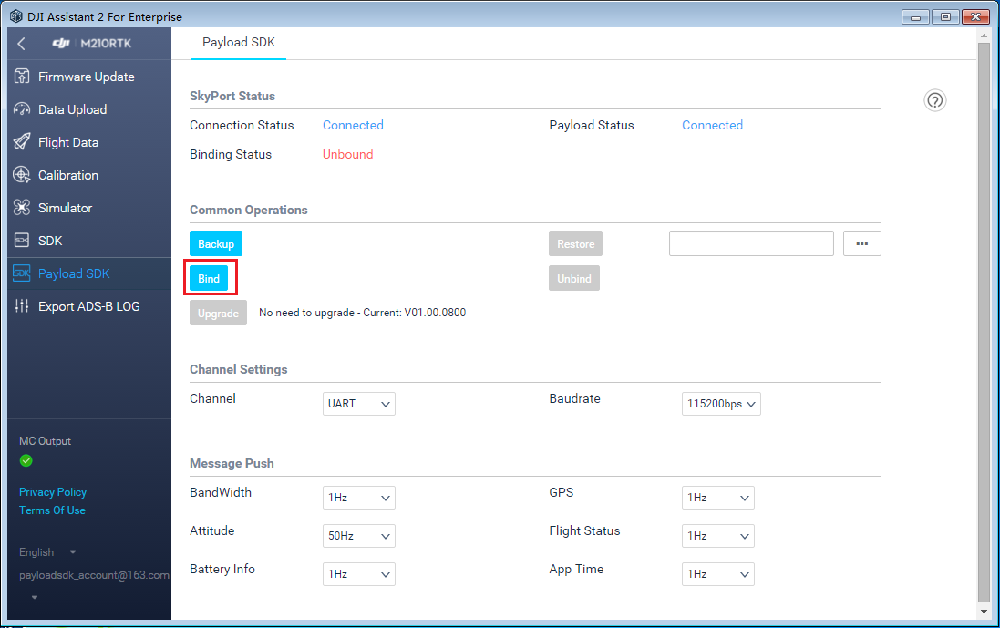

为了更好地学习如何开始使用 DJI Payload SDK，请查看本  <a href="https://www.djivideos.com/video_play/25c96b11-66fb-48bc-b754-4633b8f85c74?autoplay=1" target="_blank">入门视频</a>。

## 注册和创建应用程序

入门的第一步是创建您的 PSDK 企业用户帐户并申请 PSDK 应用程序。请按照 [这里](https://developer.dji.com/payload-sdk/apply) 的步骤来进行。

## 升级飞行器
使用 DJI Assistant 2 将飞行器固件升级为支持 PSDK 的固件。

## 获取 Payload SDK 软件
成为 Payload SDK 企业用户后，您可以前往 [用户中心](https://developer.dji.com/user/apps/#all) 获取 Payload SDK 软件包和相关软件。

## 构建 Payload SDK 应用程序

接下来，您可以按照 [这里](../development-workflow/build-application.html) 的步骤从计算机构建应用程序并下载到 Payload SDK 开发板。

## 绑定 Payload SDK 应用程序
仅限第一次使用时，SKYPORT 转接环需要与 Payload SDK 应用程序绑定。请按照以下步骤进行绑定。

1. 使用同轴线将 SKYPORT 转接环连接到 Payload SDK 开发板，然后将转接环安装到飞行器。使用 USB 线将无人机连接到 PC。

2. 打开 DJI Assistant 2，然后登录到您的 Payload SDK 企业帐户。

3. 打开 SKYPORT 选项卡。您可以看到 SKYPORT 转接环的状态以及负载的状态，如转接环状态区域中显示`"已连接"`。点击`绑定`按钮以绑定 SKYPORT 转接环和 Payload SDK 应用程序。绑定操作成功后，绑定状态显示为`已绑定`。

## 运行 Payload SDK 应用程序

### DJI Pilot 通信演示

- Payload SDK 的功能在完成绑定过程后才能启用。 
- 您可以在 Android 设备上使用 DJI Pilot 测试 PSDK 的功能。 
- 您可以在 [这里](https://www.dji.com/cn/matrice-200-series/info#downloads), 下载最新版本的 DJI Pilot App。安装在DJI CrystalSky 或者其他 Android 设备上, 然后使用USB线连接到遥控器。
- 运行 DJI Pilot App。在首次使用时，您的移动设备需要互联网连接才能完成注册，并需要登录您的 DJI 账户。
- 注册完成后，您可以看到开发板的传感器数据显示在 APP 中。这意味着通讯是成功的！

