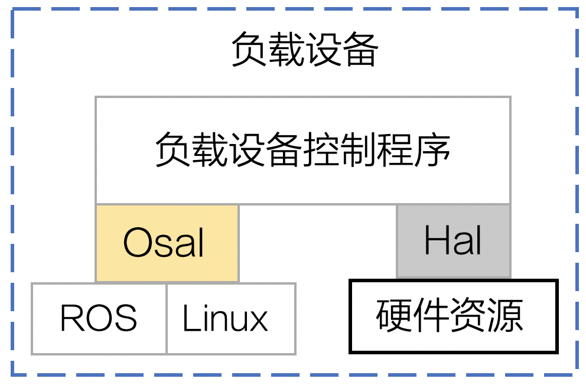

将基于PSDK 开发的负载设备控制程序移植到不同版本的软硬件平台上时，需要**先初始化**Hal 和Osal 层，注册关键的配置信息；通过加载静态库、引用指定的资源文件并声明结构体，设置负载设备控制程序跨平台移植所需的基本信息；最后使用指定的接口将Platform 模块注册到控制程序中，获取硬件资源和操作系统资源。 

>**示例代码**
> * Linux ： `sample/maniflod2/Applicaiton/platform`
> * FreeRTOS： `sample/stm32f4_eval/Application/platform`

>**说明：** PSDK Platform 模块的API 接口，在`psdk_lib/api_headers/psdk_platform.h`文件中。

## 概述
为能使基于PSDK 开发的负载设备控制程序移植到不同的软硬件平台，需要通过Hal（Hardware Abstraction Layer，硬件接口层）适配不同的硬件平台，通过Osal（Operating System Abstraction Layer，操作系统抽象层）实现与不同操作系统的兼容，如 图1.代码移植 所示。  
<div>
<div style="text-align: center"><p>图1.代码移植  </p>
</div>
<div style="text-align: center"><p><span>
      </span></p>
</div></div>

## 基础概念
### Hal 层
Hal（Hardware Abstraction Layer，硬件接口层）是PSDK 硬件接口抽象层，位于操作系统、负载设备控制程序和硬件接口间。开发者通过`PsdkPlatform_RegHalUartHandler`函数，将硬件相关的接口函数注册到负载设备控制程序后，使用PSDK 开发的负载设备控制程序，通过Hal 层即可直接访问负载设备硬件的底层资源，控制负载设备执行相应的动作，使负载设备控制程序能够适配不同的硬件平台，如STM32F407IGH6-EVAL 或Manifold 2-C 等。

#### 串口功能
为实现使用PSDK 开发的负载设备控制程序与不同硬件平台底层资源间的通信，开发者需要实现下述函数：

* 串口初始化：`T_PsdkReturnCode Hal_UartInit(void)`
* 发送数据：`T_PsdkReturnCode Hal_UartSendData(const uint8_t *buf， uint16_t len)`
* 接收数据：`T_PsdkReturnCode Hal_UartReadData(uint8_t *buf， uint16_t *len)`
#### 串口参数
为了实现负载设备与DJI 无人机间的通信，请修改负载设备串口的参数：

* 波特率：460800
* 停止位：1
* 数据位：8
* 奇偶校验：无

### Osal 层
Osal（Operating System Abstraction Layer，操作系统抽象层）是PSDK 的操作系统抽象层，位于负载设备控制程序和操作系统间。开发者通过`PsdkPlatform_RegOsalHandler`函数，将操作系统相关的接口函数注册到负载设备控制程序后，使用PSDK 开发的负载设备控制程序即可直接访问操作系统以及操作系统内核的资源，可以移植到不同的操作系统上。
#### 线程函数
使用线程机制管理负载设备控制程序执行相应的任务，开发者需要实现创建线程、销毁线程和线程睡眠的函数。

* 创建线程：

```
 T_PsdkReturnCode (*TaskCreate)(T_PsdkTaskHandle *task,
                                void *(*taskFunc)(void *),
                                uint32_t stackSize,void *arg)
```

* 销毁线程：`T_PsdkReturnCode (*TaskDestroy)(T_PsdkTaskHandle task)`
* 线程睡眠：`T_PsdkReturnCode (*TaskSleepMs)(uint32_t timeMs)`

#### 互斥锁
互斥锁是一种用于防止多个线程同时对同一队列、计数器和中断处理程序等公共资源（如共享内存等）执行读写操作的机制，能够有效避免进程死锁或长时间的等待。使用互斥锁机制，需要开发者实现创建互斥锁、销毁互斥锁、互斥锁上锁和互斥锁解锁。

* 创建互斥锁：`T_PsdkReturnCode (*MutexCreate)(T_PsdkMutexHandle *mutex)`  
* 销毁互斥锁：`T_PsdkReturnCode (*MutexDestroy)(T_PsdkMutexHandle mutex)`  
* 互斥锁上锁：`T_PsdkReturnCode (*MutexLock)(T_PsdkMutexHandle mutex)`        
* 互斥锁解锁：`T_PsdkReturnCode (*MutexUnlock)(T_PsdkMutexHandle mutex)`

#### 信号量
信号量是一种用于防止多线程同时操作相同代码段的机制。开发者使用该机制时，需要实现创建信号量、销毁信号量、等待信号量、释放信号量和等待超时信号量函数。

* 创建信号量：`T_PsdkReturnCode (*SemaphoreCreate)(T_PsdkSemHandle *semaphore， uint32_t initValue)`
    >**说明：** 使用该接口时，请设置`initValue`信号量的初始值。

* 销毁信号量：`T_PsdkReturnCode (*SemaphoreDestroy)(T_PsdkSemHandle semaphore)`
* 等待信号量：`T_PsdkReturnCode (*SemaphoreWait)(T_PsdkSemHandle semaphore)`
   >**说明：** 等待信号量接口等待时间的**最大值**为**32767 ms**。

* 等待超时信号量：`T_PsdkReturnCode (*SemaphoreTimedWait)(T_PsdkSemHandle semaphore，uint32_t waitTimeMs)`
* 释放信号量：`T_PsdkReturnCode (*SemaphorePost)(T_PsdkSemHandle semaphore)`

#### 时间接口
获取当前系统的时间（ms）：`T_PsdkReturnCode (*GetTimeMs)(uint32_t *ms)`

#### 内存管理接口
* 申请内存：`void *(*Malloc)(uint32_t size)`
* 释放内存：`void (*Free)(void *ptr)`

## 实现跨平台移植
### 1. 跨平台移植模块初始化
创建工程文件后，请先调用如下接口，将硬件平台和操作系统的接口函数注册到使用PSDK 开发的负载设备控制程序后，即可访问硬件设备和操作系统，**否则**使用PSDK 开发的负载设备**将无法移植到其他硬件平台和操作系统上**。

```c
T_PsdkReturnCode PsdkPlatform_RegHalUartHandler(const T_PsdkHalUartHandler *halUartHandler);
T_PsdkReturnCode PsdkPlatform_RegOsalHandler(const T_PsdkOsalHandler *osalHandler);
```

#### Hal 层适配
在`hal_uart.c` 文件中修改串口配置参数。

* Linux     
使用USB 转串口模块将第三方开发平台连接至DJI 的无人机后，第三方开发平台的默认标识为 `ttyUSB0`，在实现并注册串口初始化、接收数据和发送数据的功能后，才能使用串口功能。     
详细实现方法请参见：`/sample/platform/linux/manifold2/hal/hal_uart.c`

* RTOS     
请根据MCU 的型号配置对应的串口管脚，在实现并注册串口设备初始化、接收数据和发送数据的功能后，才能使用串口功能。     
详细实现方法请参见：`sample/platform/rtos_freertos/stm32f4_eval/hal/hal_uart.c`

#### Osal 层适配
* Linux  
使用标准库 `pthread` 封装 `T_PsdkOsalHandler`中的线程函数、互斥锁、信号量以及时间接口等接口。    
详细实现方法请参见：`sample/maniflod2/Applicaiton/platform/osal.c`

* RTOS   
使用 CMSIS 封装的`thread`接口，封装 `T_PsdkOsalHandler`中的线程函数、互斥锁、信号量以及时间接口等接口。  
详细实现方法请参见：`/sample/platform/rtos_freertos/common/osal/osal.c` 

### 2. 配置关键文件

#### 加载库和头文件
* 加载静态库`psdklib.a`，修改示例工程目录中的`CMakeLists.txt`
* 引用头文件：

```
#include "psdk_platform.h"
#include "platform/osal.h"
#include "platform/hal_uart.h"
```

#### 结构体声明
请完整地填充 `T_PsdkOsalHandler` 和 `T_PsdkOsalHandler` 中的内容，确保所注册的接口能够正常使用。

* T_PsdkHalUartHandler halUartHandler

```
T_PsdkHalUartHandler halUartHandler = {
    .UartInit = Hal_UartInit,
    .UartReadData = Hal_UartReadData,
    .UartWriteData = Hal_UartSendData,
};
```

* T_PsdkHalUartHandler osalHandler

```
T_PsdkOsalHandler osalHandler = {
    .Malloc = Osal_Malloc,
    .Free = Osal_Free,
    .TaskCreate = Osal_TaskCreate,
    .TaskDestroy = Osal_TaskDestroy,
    .TaskSleepMs = Osal_TaskSleepMs,
    .MutexCreate = Osal_MutexCreate,
    .MutexDestroy = Osal_MutexDestroy,
    .MutexLock = Osal_MutexLock,
    .MutexUnlock = Osal_MutexUnlock,
    .SemaphoreCreate = Osal_SemaphoreCreate,
    .SemaphoreDestroy = Osal_SemaphoreDestroy,
    .SemaphoreWait = Osal_SemaphoreWait,
    .SemaphorePost = Osal_SemaphorePost,
    .SemaphoreTimedWait = Osal_SemaphoreTimedWait,
    .GetTimeMs = Osal_GetTimeMs,
};
```

### 3. 注册跨平台移植模块
分别调用 `PsdkPlatform_RegHalUartHandler `和 `PsdkPlatform_RegOsalHandler` 函数注册
Hal 层和Osal 层。

> **说明：** 跨平台移植模块必须在其他PSDK 功能模块前被注册，若Platform 模块注册失败或未注册，用户将无法使用基于PSDK 开发的负载设备。

```
if (PsdkPlatform_RegHalUartHandler(&halUartHandler) != PSDK_RETURN_CODE_OK) {
    printf("psdk register hal uart handler error");
    return PSDK_RETURN_CODE_ERR_UNKNOWN;
}

if (PsdkPlatform_RegOsalHandler(&osalHandler) != PSDK_RETURN_CODE_OK) {
    printf("psdk register osal handler error");
    return PSDK_RETURN_CODE_ERR_UNKNOWN;
}
```
函数注册成功后，将返回`PSDK_RETURN_CODE_OK`，否则请根据返回码和日志信息排查错误问题。