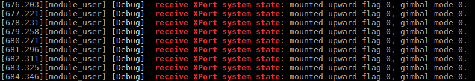
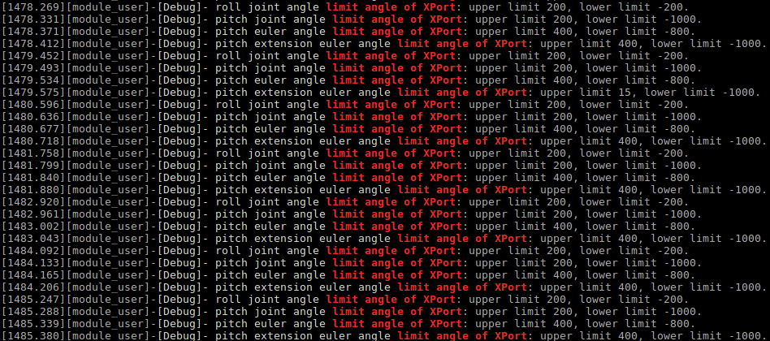
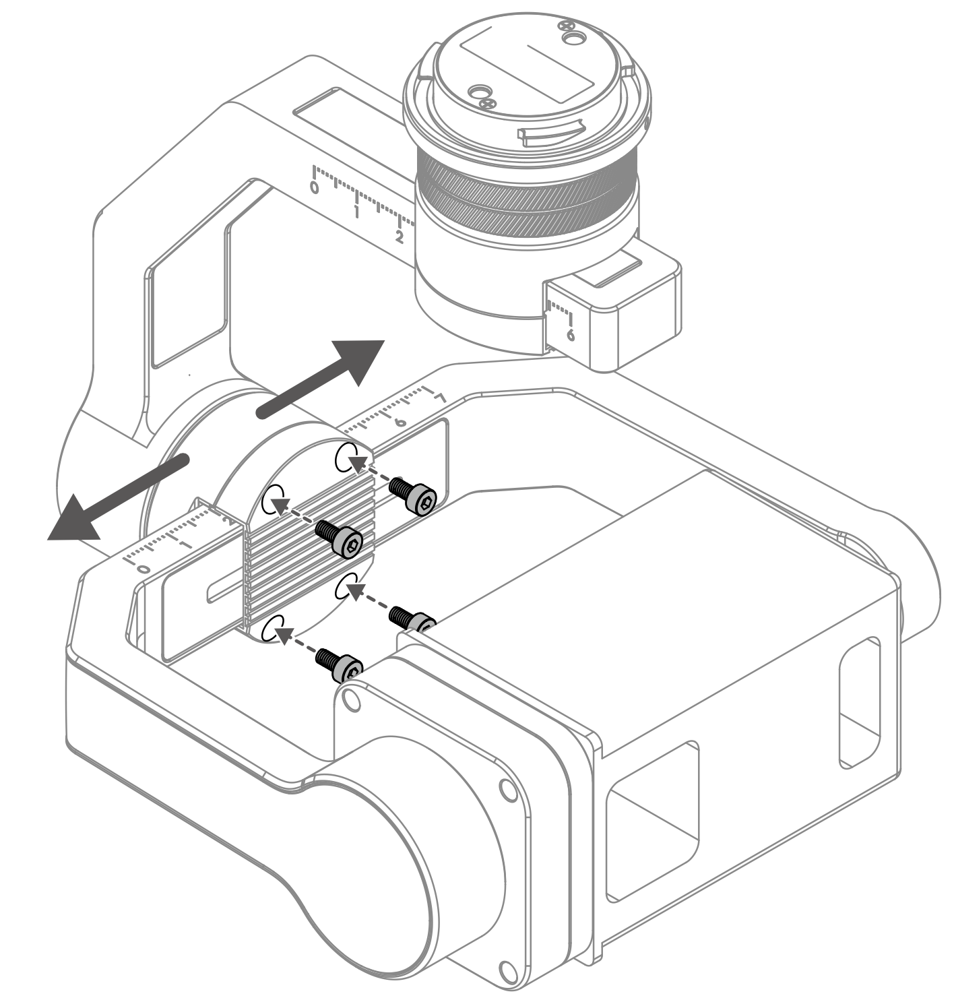
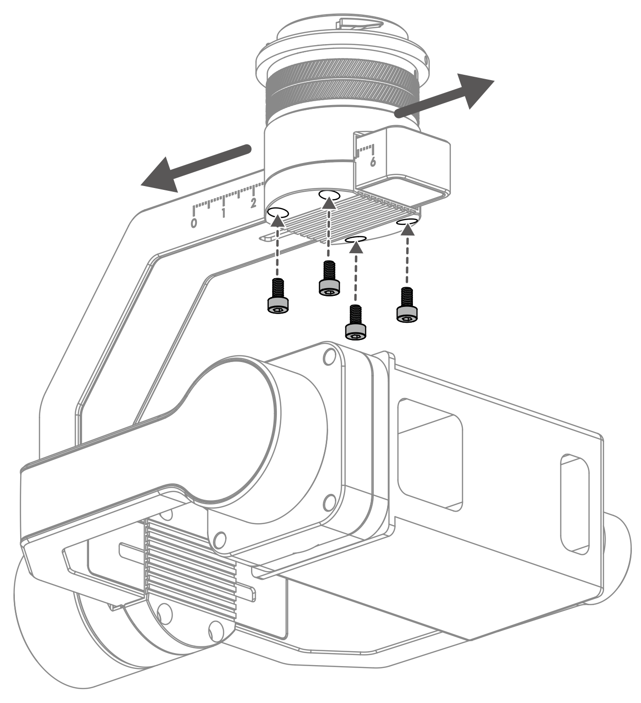

> **说明** 
> * 在使用X-Port 控制功能前，请根据 <a href="https://terra-1-g.djicdn.com/71a7d383e71a4fb8887a310eb746b47f/psdk/DJI ENTERPRISE X-Port 用户手册.pdf">使用指南</a>、根据[负载标准](../payloadguide/payload-criterion.html)和[接口说明](../quickstart/device-connection.html)中的要求和说明，合理地设计负载设备，正确地使用X-Port；
> * 使用X-Port 开发负载设备前，请先阅读[云台控制](./gimbal-control.html)教程，学习有关控制云台转动的基本概念；
> * 当X-Port 被异常下电时，如直接从云台接口断开连接，X-Port 工作过程中设置的参数信息可能无法被正常存储。  

## 概述
DJI X-Port 标准云台是一个用于开发负载设备的硬件平台，用户使用X-Port，能够快速开发具有云台功能的负载设备；结合[自定义控件](./custom-widget.html)功能，使用DJI Pilot 以及基于MSDK 开发的APP 还可以显示开发者设计的控件，方便用户通过控件控制使用X-Port 标准云台和PSDK 开发的负载设备。

## 基础功能
### X-Port 状态信息
基于PSDK 开发的负载设备能够获取X-Port 的模式、X-Port 的当前姿态和校准结果等信息。有关负载设备获取X-Port 状态的方法等详情请参见**PSDK API 文档**。

* 基本信息：X-Port模式
* X-Port状态：转动状态、控制状态、复位状态、限位角度
* 关键参数：速度转换系数

### X-Port 控制
> **说明：** X-Port 标准云台集成了云台的基础功能，详细说明请参见[云台控制](./gimbal-control.html)中的内容。

#### X-Port 控制方式
* 相对角度控制：X-Port 根据用户**指定的**角度，在规定的时间内，**转动指定的角度**。  
  X-Port 接收到转动控制指令后，先根据控制模式和控制方式计算出航向轴转动到目标角度的**中间量**，再计算最终航向轴的**目标角度**，X-Port 将根据最终航向轴目标角度，转动X-Port 航向轴。
  * 航向轴旋转方向与旋转角度符号**无关**。 
  * 航向轴转动到目标角度的**中间量(X)**=航向轴当前角度 + 航向轴转动角度
  * 最终航向轴**目标角度**=`MOD((X + 180), 360) - 180`  
* 绝对角度控制：X-Port 根据用户的指令，在规定的时间内，从**当前的位置**转动到指定的位置。
* 速度控制：X-Port 实际运动速度受到最大速度限制。

> **说明** 
> * 在角度控制模式下，X-Port 航向轴转动的范围为 [-180,180]，X-Port 的**实际运动时间**受到X-Port运动的**最大加速度与最大速度限制**。
> * X-Port 的横滚轴用于消除无人机抖动,使用PSDK 开发的负载设备无法控制X-Port 的横滚轴。  
> * X-Port **实际可到达位置**受到X-Port 限位的限制。

#### X-Port 控制权限
有关X-Port 控制权限的详细说明请参见 表1.X-Prot 控制权限。    
* 权限规则：
  * 优先级低的控制动作在优先级高的控制动作结束后**才能**控制X-Port；
  * 高优先级的控制动作可**抢占**低优先级控制动作的控制权；
  * 同等优先级的控制场景按照开始控制的**时间先后顺序**抢占控制权，开始控制时间较晚的控制场景不能夺取控制权。

* 权限释放 
  * 使用PSDK 开发的负载设备完成对X-Port 的控制后释放控制权。
  * 若使用PSDK 开发的负载设备完成对X-Port 的控制后未释放控制权，X-Port将在转动结束后的2s 内自动释放控制权。
<div><div style="text-align: center">
<p>
表1.X-Port 控制权限  </p></div>
<div>
<table>
<thead>
<tr>
  <th>权限角色</th>
  <th>权限等级</th>
 </tr>
</thead>
<tbody>
 <tr>
  <td>使用遥控器云台摇杆控制X-Port</td>
  <td>1</td>
 </tr>
 <tr>
  <td>通过MSDK 接口控制X-Port 角度</td>
  <td>1</td>
 </tr>
 <tr>
  <td>通过DJI Pilot 控制X-Port</td>
  <td>2</td>
 </tr>
 <tr>
  <td>通过负载协同功能控制X-Port</td>
  <td>2</td>
 </tr>
 <tr>
  <td>通过MSDK 接口控制X-Port 速度</td>
  <td>2</td>
 </tr>
 <tr>
  <td>通过航线飞行控制X-Port</td>
  <td>2</td>
 </tr>
 <tr>
  <td>通过PSDK 控制X-Port 的角度</td>
  <td>2</td>
 </tr>
 <tr>
  <td>通过PSDK 控制X-Port 的速度</td>
  <td>2</td>
 </tr>
</tbody>
</table></div></div>

#### 速度转换系数
当相机类负载设备的变焦系数较大时，若X-Port 转动速度较快，相机类负载设备所录制的画面会变得模糊，影响影像录制效果和观视体验，因此，PSDK 提供了“速度转换系数”功能，通过设置控制命令与旋转速度间的转换系数，使负载设备在变焦倍数较大时，用户认可获得稳定的画面，得到极佳的录制效果和观赏体验。
  * Factor：用户可根据实际的需要设置X-Port 的速度转换系数，**推荐**将速度转换系数设置为*变焦倍数的倒数*。
  * Max_speed（X-Port 的最大速度）=`默认最大速度 × 最大速度百分比`
  * X-Port 实际的运动速度 = `Max_speed * Factor`,Factor≤ 1

> **说明：** X-Port 仅支持用户使用DJI Pilot 和PSDK 设置X-Port 的速度转换系数。

### X-Port 复位
* 航向轴复位：将X-Port 航向轴的角度复位为无人机航向轴角度与X-Port 航向轴微调角度的和。
* 俯仰轴与航向轴复位：将X-Port 俯仰轴的角度复位为微调的角度，将X-Port 航向轴的角度复位为无人机航向轴角度与X-Port 航向轴微调角度的和。
* 重置X-Port 的偏航轴和俯仰轴：将X-Port 偏航轴的角度重置为无人机偏航轴和X-Port 微调角度的和。重置X-Port 俯仰轴为-90°与X-Port 微调角度的和（X-Port 下置），90°与X-Port 微调角度的和（X-Port 上置）。
* 重置X-Port 的偏航轴为-90°与X-Port 微调角度的和（X-Port 下置），90°与X-Port 微调角度的和（X-Port 上置）。

### X-Port 限位
#### 限位角角度
为避免X-Port 在工作时，因结构问题撞击无人机上的部件而意外损坏或干扰无人机的执行飞行任务，请务必为X-Port 设置限位，有关限位类型和限位角度详细的调整范围请参见 表2.X-Port 限位角度 。  
<div><div>
<p>
表2.X-Port 限位角角度 </p></div>
<div>
  <table id="XPort limit angle">
  <thead>
    <tr>
      <th>限位角类型</th>
      <th>默认上限</th>
      <th>上限可调整范围</th>
      <th>默认下限</th>
      <th>下限可调整范围</th>
    </tr>
  </thead>
  <tbody>
    <tr>
      <td>俯仰轴关节角</td>
      <td>40°</td>
      <td>40° ~ 0</td>
      <td>-125°</td>
      <td>-125° ~ 0</td>
    </tr>
    <tr>
      <td>横滚轴关节角</td>
      <td>55°</td>
      <td>55° ~ 0</td>
      <td>-55°</td>
      <td>-55° ~ 0</td>
    </tr>
    <tr>
      <td>航向轴关节角</td>
      <td>320°</td>
      <td>320° ~ 0</td>
      <td>-320°</td>
      <td>-320° ~ 0</td>
    </tr>
    <tr>
      <td>俯仰轴欧拉角</td>
      <td>30°</td>
      <td>30° ~ 0</td>
      <td>-90°</td>
      <td>-90° ~ 0</td>
    </tr>
    <tr>
      <td>扩展俯仰轴欧拉角</td>
      <td>30°</td>
      <td>30° ~ 0</td>
      <td>-120°</td>
      <td>-120° ~ 0</td>
    </tr>
    <tr>
      <td>横滚轴欧拉角</td>
      <td>20°</td>
      <td>不可调整</td>
      <td>-20°</td>
      <td>不可调整</td>
    </tr>
  </tbody>
</table></div></div>
  
设置X-Port 限位角角度后，X-Port 将在限制范围内转动，若X-Port 转动的角度超出限位角的限制范围，X-Port 将自动调整姿态，此时会导致X-Port 轻微抖动，为减轻X-Port 的抖动，X-Port 设置了限位缓冲区。

> **注意：** 除“横滚轴欧拉角”的范围不可修改外，其他类型的限位角的范围均可根据实际的使用需要调整。

#### 限位缓冲区
为减轻超过限位角的X-Port 在调整姿态时产生的抖动，X-Port 的俯仰轴、横滚轴及航向轴已设置了限位缓冲区；当X-Port进入限位缓冲区后，X-Port 会停在限位缓冲区内。

  > **说明** 
  > * X-Port 处于限位缓冲区内时，将无法再向限位方向运动。
  >* X-Port 俯仰轴和横滚轴的限位缓冲区宽度为5°，航向轴的限位缓冲区宽度为15°。

> **示例**
> * 若航向轴关节角上限位为 90°，限位缓冲区宽度为 15°，则限位缓冲区为 75° ～ 90°；
> * 当 X-Port 航向轴角度为 30° 并以角度控制命令控制X-Port 航向轴角度到达 78° 时，X-Port 将停止与限位缓冲区内某处，如 80°；
> * 此时X-Port 的航向轴将无法向大于80° 的方向运动。

</br>

------------

##### X-Port （下置/上置）欧拉角运动范围说明
* X-Port 下置：
  * 未启用俯仰轴角度范围扩展时，俯仰轴欧拉角的运动范围为 [pitchEulerAngleLowerLimit, pitchEulerAngleUpperLimit] 
  * 启用俯仰轴角度范围扩展时，俯仰轴欧拉角的运动范围为 
  [pitchEulerAngleExtensionLowerLimit, pitchEulerAngleExtensionUpperLimit]
* X-Port 上置：
  * 未启用俯仰轴角度范围扩展时，俯仰轴欧拉角的运动范围为[-pitchEulerAngleUpperLimit, -pitchEulerAngleLowerLimit] 
  * 启用俯仰轴角度范围扩展时，俯仰轴欧拉角的运动范围为 
 [-pitchEulerAngleExtensionUpperLimit, -pitchEulerAngleExtensionLowerLimit]

---------

## 使用X-Port 开发负载设备

### 1. X-Port 功能模块初始化
使用X-Port 开发负载设备时，需要先初始化 X-Port 功能模块。

```c
psdkStat = PsdkXPort_Init();
if (psdkStat != PSDK_RETURN_CODE_OK) {
    PsdkLogger_UserLogError("XPort init error: %lld.", psdkStat);
    return psdkStat;
}
```

### 2. 获取X-Port 状态信息
1. 获取X-Port 的系统状态
* 通过构造回调函数接收X-Port 的状态信息。

```c
static T_PsdkReturnCode ReceiveXPortSystemState(T_PsdkGimbalSystemState systemState)
{
    PsdkLogger_UserLogDebug("receive XPort system state: mounted upward flag %d, gimbal mode %d.",
                            systemState.mountedUpward, systemState.gimbalMode);

    PsdkLogger_UserLogDebug("XPort fine tune: %d %d %d.", systemState.fineTuneAngle.pitch,
                            systemState.fineTuneAngle.roll, systemState.fineTuneAngle.yaw);

    return PSDK_RETURN_CODE_OK;
}
```

* 通过注册回调函数接收X-Port 的状态信息，如 图1.X-Port 状态 所示。

```c
psdkStat = PsdkXPort_RegReceiveSystemStateCallback(ReceiveXPortSystemState);
if (psdkStat != PSDK_RETURN_CODE_OK) {
    PsdkLogger_UserLogError("register receive XPort system state callback function error: %lld.", psdkStat);
    return psdkStat;
}
```
<div>
<div style="text-align: center"><p>   图1.X-Port 状态 </p>
</div>
<div style="text-align: center"><p><span>
      </span></p>
</div></div>

2. 获取X-Port 姿态信息

* 构造回调函数获取X-Port 的姿态，在回调函数中打印X-Port 的姿态信息。

```c
static T_PsdkReturnCode ReceiveXPortAttitudeInformation(T_PsdkGimbalAttitudeInformation attitudeInformation)
{
    PsdkLogger_UserLogDebug("receive XPort attitude information:");
    PsdkLogger_UserLogDebug("XPort attitude: pitch %d, roll %d, yaw %d.", attitudeInformation.attitude.pitch,
                            attitudeInformation.attitude.roll, attitudeInformation.attitude.yaw);

    return PSDK_RETURN_CODE_OK;
}
```
* 通过注册回调函数获取X-Port 的姿态信息，如 图2.X-Port 姿态 所示。

```c
psdkStat = PsdkXPort_RegReceiveAttitudeInformationCallback(ReceiveXPortAttitudeInformation);
if (psdkStat != PSDK_RETURN_CODE_OK) {
    PsdkLogger_UserLogError("register receive XPort attitude information callback function error: %lld.", psdkStat);
    return psdkStat;
}
```
<div>
<div style="text-align: center"><p>图2.X-Port 姿态 </p>
</div>
<div style="text-align: center"><p><span>
      </span></p>
</div></div>


### 3. 设置X-Port 限位角
* 设置X-Port 限位角       
为避免X-Port 在工作时，因结构干涉导致X-Port 意外损坏或干扰无人机的执行飞行任务，请依据“标准声明”中的[“结构标准”](../payloadguide/payload-criterion.html)，设置X-Port 的限位角，如 表3.X-Port 限位角 所示。
> **说明：** 在下述代码中X-Port 的角度单位为0.1度。

<div><div>
<p>
表3.X-Port 限位角 </p></div>
<div>
<table>
  <thead>
    <tr>
      <th>类别</th>
      <th>限位角度（度）</th>
    </tr>
  </thead>
  <tbody>
    <tr>
      <td>俯仰轴关节角</td>
      <td>20（上限），-100（下限）</td>
    </tr>
    <tr>
      <td>横滚轴关节角</td>
      <td>20（上限），-20（下限）</td>
    </tr>
    <tr>
      <td>俯仰轴欧拉角</td>
      <td>25（上限），-80（下限）</td>
    </tr>
    <tr>
      <td>扩展俯仰轴欧拉角</td>
      <td>25（上限），-100（下限）</td>
    </tr>
    <tr>
      <td>航向轴关节角</td>
      <td>挂载于I 号云台：30（上限），-150（下限）<br>
     挂载于II 号云台：150（上限），-30（下限）</td>
    </tr>
  </tbody>
</table></div></div>

```c
limitAngle.upperLimit = 200;
limitAngle.lowerLimit = -200;
psdkStat = PsdkXPort_SetLimitAngleSync(PSDK_XPORT_LIMIT_ANGLE_CATEGORY_ROLL_JOINT_ANGLE, limitAngle);
if (psdkStat != PSDK_RETURN_CODE_OK) {
    PsdkLogger_UserLogError("set roll joint angle limit angle for XPort error: %lld.", psdkStat);
    return psdkStat;
}

limitAngle.upperLimit = 200;
limitAngle.lowerLimit = -1000;
psdkStat = PsdkXPort_SetLimitAngleSync(PSDK_XPORT_LIMIT_ANGLE_CATEGORY_PITCH_JOINT_ANGLE, limitAngle);
if (psdkStat != PSDK_RETURN_CODE_OK) {
    PsdkLogger_UserLogError("set pitch joint angle limit angle for XPort error: %lld.", psdkStat);
    return psdkStat;
}

limitAngle.upperLimit = 250;
limitAngle.lowerLimit = -800;
psdkStat = PsdkXPort_SetLimitAngleSync(PSDK_XPORT_LIMIT_ANGLE_CATEGORY_PITCH_EULER_ANGLE, limitAngle);
if (psdkStat != PSDK_RETURN_CODE_OK) {
    PsdkLogger_UserLogError("set pitch euler angle limit angle for XPort error: %lld.", psdkStat);
    return psdkStat;
}

limitAngle.upperLimit = 250;
limitAngle.lowerLimit = -1000;
psdkStat = PsdkXPort_SetLimitAngleSync(PSDK_XPORT_LIMIT_ANGLE_CATEGORY_PITCH_EULER_ANGLE_EXTENSION, limitAngle);
if (psdkStat != PSDK_RETURN_CODE_OK) {
    PsdkLogger_UserLogError("set pitch extension euler angle limit angle for XPort error: %lld.", psdkStat);
    return psdkStat;
}

psdkStat = PsdkAircraftInfo_GetBaseInfo(&aircraftInfoBaseInfo);
if (psdkStat != PSDK_RETURN_CODE_OK) {
    PsdkLogger_UserLogError("get aircraft base information error: %lld.", psdkStat);
    return psdkStat;
}

if (aircraftInfoBaseInfo.payloadMountPosition == PSDK_AIRCRAFT_INFO_PAYLOAD_MOUNT_POSITION_NO1) {
    limitAngle.upperLimit = 300;
    limitAngle.lowerLimit = -1500;
} else if (aircraftInfoBaseInfo.payloadMountPosition == PSDK_AIRCRAFT_INFO_PAYLOAD_MOUNT_POSITION_NO2) {
    limitAngle.upperLimit = 1500;
    limitAngle.lowerLimit = -300;
} else {
    PsdkLogger_UserLogWarn("payload mount position is unknown.");
    return PSDK_RETURN_CODE_ERR_SYSTEM;
}

psdkStat = PsdkXPort_SetLimitAngleSync(PSDK_XPORT_LIMIT_ANGLE_CATEGORY_YAW_JOINT_ANGLE, limitAngle);
if (psdkStat != PSDK_RETURN_CODE_OK) {
    PsdkLogger_UserLogError("set yaw joint angle limit angle for XPort error: %lld.", psdkStat);
    return psdkStat;
}
```


* 在X-Port 的线程中获取限位角的角度并打印在终端上，如 图3.X-Port 限位角 所示。

```c
psdkStat = PsdkXPort_GetLimitAngleSync(PSDK_XPort_LIMIT_ANGLE_CATEGORY_ROLL_JOINT_ANGLE, &limitAngle);
if (psdkStat != PSDK_RETURN_CODE_OK) {
    PsdkLogger_UserLogError("get roll joint angle limit angle from XPort error: %lld.", psdkStat);
    continue;
}

PsdkLogger_UserLogDebug("roll joint angle limit angle of XPort: upper limit %d, lower limit %d.",
                        limitAngle.upperLimit, limitAngle.lowerLimit);

psdkStat = PsdkXPort_GetLimitAngleSync(PSDK_XPort_LIMIT_ANGLE_CATEGORY_PITCH_JOINT_ANGLE, &limitAngle);
if (psdkStat != PSDK_RETURN_CODE_OK) {
    PsdkLogger_UserLogError("get pitch joint angle limit angle from XPort error: %lld.", psdkStat);
    continue;
}

PsdkLogger_UserLogDebug("pitch joint angle limit angle of XPort: upper limit %d, lower limit %d.",
                        limitAngle.upperLimit, limitAngle.lowerLimit);

psdkStat = PsdkXPort_GetLimitAngleSync(PSDK_XPort_LIMIT_ANGLE_CATEGORY_PITCH_EULER_ANGLE, &limitAngle);
if (psdkStat != PSDK_RETURN_CODE_OK) {
    PsdkLogger_UserLogError("get pitch euler angle limit angle from XPort error: %lld.", psdkStat);
    continue;
}

PsdkLogger_UserLogDebug("pitch euler angle limit angle of XPort: upper limit %d, lower limit %d.",
                        limitAngle.upperLimit, limitAngle.lowerLimit);

psdkStat = PsdkXPort_GetLimitAngleSync(PSDK_XPort_LIMIT_ANGLE_CATEGORY_PITCH_EULER_ANGLE_EXTENSION,
                                       &limitAngle);
if (psdkStat != PSDK_RETURN_CODE_OK) {
    PsdkLogger_UserLogError("get pitch extension euler angle limit angle from XPort error: %lld.", psdkStat);
    continue;
}

PsdkLogger_UserLogDebug("pitch extension euler angle limit angle of XPort: upper limit %d, lower limit %d.",
                        limitAngle.upperLimit, limitAngle.lowerLimit);
}

psdkStat = PsdkXPort_GetLimitAngleSync(PSDK_XPort_LIMIT_ANGLE_CATEGORY_YAW_JOINT_ANGLE, &limitAngle);
if (psdkStat != PSDK_RETURN_CODE_OK) {
    PsdkLogger_UserLogError("get yaw joint angle limit angle from XPort error: %lld.", psdkStat);
    continue;
}

PsdkLogger_UserLogDebug("yaw joint angle limit angle of XPort: upper limit %d, lower limit %d.",
                        limitAngle.upperLimit, limitAngle.lowerLimit);
```
<div>
<div style="text-align: center"><p>   图3.X-Port 限位角 </p>
</div>
<div style="text-align: center"><p><span>
      </span></p>
</div></div>

### 4. 设置速度转换系数
为实现对X-Port 的稳定控制，需设置X-Port 速度转换系数。

```c
if (USER_UTIL_WORK_RUN(step, 10, XPort_TASK_FREQ)) {
    psdkStat = PsdkTest_CameraGetOpticalZoomFactor(&opticalZoomFactor);
    if (psdkStat != PSDK_RETURN_CODE_OK) {
        PsdkLogger_UserLogError("get camera optical zoom factor error: %d.", psdkStat);
        continue;
    }

    psdkStat = PsdkTest_CameraGetDigitalZoomFactor(&digitalZoomFactor);
    if (psdkStat != PSDK_RETURN_CODE_OK) {
        PsdkLogger_UserLogError("get camera digital zoom factor error: %d.", psdkStat);
        continue;
    }

    psdkStat = PsdkXPort_SetSpeedConversionFactor(1 / (opticalZoomFactor * digitalZoomFactor));
    if (psdkStat != PSDK_RETURN_CODE_OK) {
        PsdkLogger_UserLogError("set speed conversion factor error: %d.", psdkStat);
        continue;
    }
}
```
### 5. 设置X-Port 工作模式
* 设置 X-Port 的模式后，通过 X-Port 系统状态可查看X-Port 的工作模式。
* 有关X-Port 工作模式的详细说明请参见“云台控制”中的[“云台控制模式”](./gimbal-control.html)。

```objectivec
psdkStat = PsdkXPort_SetGimbalModeSync(PSDK_GIMBAL_MODE_FREE);
if (psdkStat != PSDK_RETURN_CODE_OK) {
    PsdkLogger_UserLogError("set XPort gimbal mode error: %lld.", psdkStat);
    return psdkStat;
}
```

### 6. 使用X-Port 复位功能

```c
psdkStat = PsdkXPort_ResetSync(PSDK_GIMBAL_RESET_MODE_PITCH_AND_YAW);
if (psdkStat != PSDK_RETURN_CODE_OK) {
    PsdkLogger_UserLogError("reset XPort gimbal error: %lld.", psdkStat);
    return psdkStat;
}
```

## X-Port 调试
把负载设备安装在X-Port 上，并将无人机接入DJI Assistant 2后，开发者可使用[DJI Assistant 2](http://www.dji.com/matrice-200-series-v2/info#downloads) 调试X-Port。

> **说明** 
> * 有关在X-Port 上安装负载设备的详细步骤和DJI Assistant 2 界面的介绍请参见DJI X-Port <a href="https://terra-1-g.djicdn.com/71a7d383e71a4fb8887a310eb746b47f/psdk/DJI ENTERPRISE X-Port 用户手册.pdf">使用指南</a>；
> * 将负载设备安装在X-Port 上时，请确保X-Port 上的负载设备在俯仰轴、偏航轴和横滚轴的各个位置上**均能停留**，且在**各个位置上保持平衡**。

#### 手动调平
**1. 调整俯仰轴**
将负载设备安装在X-Port 上时，绕P 轴中心轴线转动负载设备，确保负载设备在俯仰轴的各个位置上均能停留。

**2.横滚轴调平**
1. 使用 L 型内六角螺丝刀拧松Row 轴轴臂上的4 颗螺丝(无需取下螺丝)；
2. 左右调节R 轴轴臂的位置，使R 轴轴臂在转动时，在任意位置上均能保持平衡；
3. 重新锁紧 4 颗螺丝(扭力 批大小为 2.0±0.1 kgf.cm)。

<div>
<div style="text-align: center"><p>图4.X-Port 横滚轴调平 </p>
</div>
<div style="text-align: center"><p><span>
      </span></p>
</div></div>

**3. 偏航轴调平**
1. 使用L 型内六角螺丝刀拧松偏航轴轴臂上的4 颗螺丝(无需取下螺丝)；
2. 前后调节偏航轴臂位置，使得偏航轴基座轴线在不垂直于地面时，负载设备在任意位置均能停留，而不会绕着偏航轴基座转动；
3. 重新锁紧4 颗螺丝(扭力批大小为 2.0±0.1 kgf.cm
)。
<div>
<div style="text-align: center"><p>图5.X-Port 偏航轴调平 </p>
</div>
<div style="text-align: center"><p><span>
      </span></p>
</div></div>

#### 软件调试
使用[DJI Assistant 2](http://www.dji.com/matrice-200-series-v2/info#downloads) ，开发者可对负载设备执行平衡度检测、同轴度检测及力度调整等调试操作。

> **说明** 
> * 使用DJI Assistant 2 调试云台的同时，请勿控制云台，如控制云台角度、速度和云台回中等。
> * 使用DJI Assistant 2 调试DJI X-Port 时，请按照平衡度检测、同轴度检测、控制参数自整定、自动校准的顺序调试云台。

##### 1. 平衡度检测（X-Port 为关节角模式）
1. 在“云台设置”页面，点击“云台平衡度检测”，根据指导准备无人机和X-Port 云台；
2. 根据DJI Assistant 2 的指引检测并调整X-Port；
3. 检测时，一旦X-Port 没有配平，开发者需根据检测进度和检测结果重新调整云台：
  1. 请向前(向后)、向上(向下)移动负载，再重新执行平衡度检测；
  2. 请向左(向右)调整云台横滚轴轴臂的位置，再重新执行平衡度检测；
  3. 请向前(向后)调整云台偏航轴轴臂的位置，再重新执行平衡度检测。

##### 2. 同轴度检测（X-Port 为关节角模式）
> **说明：** 在执行同轴度检测功能前，请先执行平衡度检测，并保证X-Port 的平衡度良好。   

1. 在“云台设置”页面，点击“云台同轴度检测”，根据指导准备无人机和X-Port 云台；
2. 根据DJI Assistant 2 的指引检测并调整X-Port；
3. 检测时，一旦X-Port 的同轴度检测结果较差，开发者需根据检测进度和检测结果重新调整负载设备和X-Port 辅轴轴臂的安装方式：请向前(向后)、向上(向下)调节负载辅轴臂的螺丝并重新执行同轴度检测。

##### 3. 控制参数自整定
> **说明** 
> * 在执行控制参数自整定功能前，请先执行平衡度检测和同轴度检测，并保证X-Port 的平衡度检测和同轴度检测的结果为良好； 
> * 在执行“控制参数自整定”的操作时，请水平放置无人机，确保无人机横滚轴和俯仰轴的角度在±5° 内。

1. 在“云台设置”页面，点击“云台参数自整定”，DJI Assistant 2 将根据负载设备的状态，自动调整X-Port 的控制参数；
2. 关闭无人机电机，使负载设备处于静止的状态；
3. DJI Assistant 2 或DJI Pilot 向X-Port 发送云台控制指令，执行控制参数自整定的功能。

##### 4. 自动校准
若X-Port 上负载设备的初始位置未水平居中，请使用自动校准功能校准X-Port。
