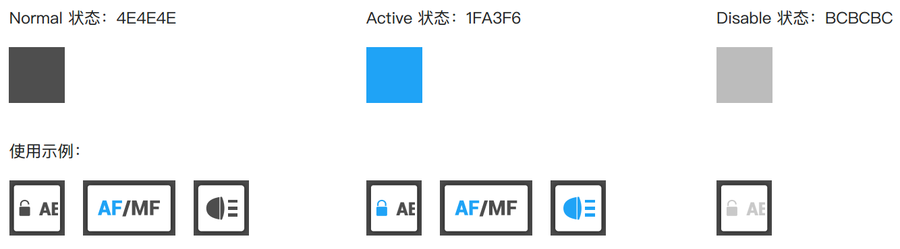
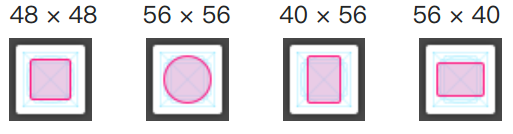
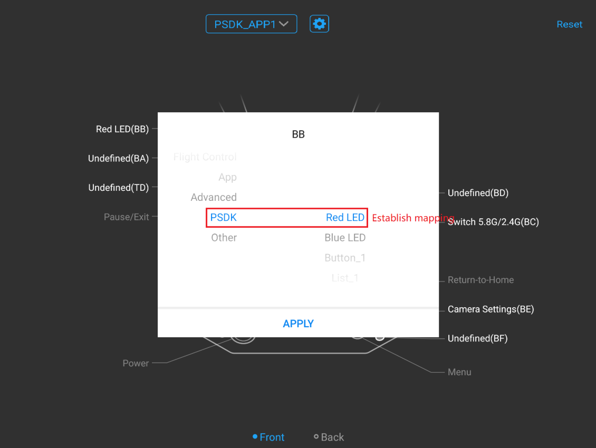

## 概述
“自定义控件”是一个将“负载设备的功能”封装为按钮、开关以及滑块等控件的功能；使用DJI Pilot 或基于MSDK 开发的移动端APP 能够识别负载设备中控件的配置信息并生成UI 控件，方便用户快速设置负载设备的参数并控制负载设备执行指定的动作；同时，DJI Pilot 或基于MSDK 开发的移动端APP 还能以浮窗的形式显示负载设备的状态信息；此外，用户还能根据使用需求，将负载设备的功能映射到遥控器上的预留按键上，通过使用遥控器上的预留按键，以更便捷的方式控制负载设备。

## 基础概念
### 控件
#### 主界面的控件
* 动作栏控件：动作栏支持按钮、开关、范围条和选择列表四个控件类型，最多支持设置5个自定义控件。
* 浮窗：实时显示负载设备的状态信息。    
<div>
<div style="text-align: center"><p>图1. 主界面 </p>
</div>
<div style="text-align: center"><p><span>
      </span></p>
</div></div>

#### 配置界面的控件  
用户在配置界面能够操作配置界面中的控件，如按钮、开关、范围条、选择列表、文本输入框、整型值输入框，如 图2. 配置界面 所示。 

<div>
<div style="text-align: center"><p>图2. 配置界面 </p>
</div>
<div style="text-align: center"><p><span>
      </span></p>
</div></div>

> **说明** 
> * 配置界面仅支持显示一个“文本输入框”控件。
> * 使用PSDK 开发的负载设备通过`PsdkDataTransmission_RegReceiveDataFromMobileCallback(ReceiveDataFromMobile)`函数能够获取用户在DJI Pilot **文本输入框控件**中向负载设备发送的信息（编码格式为UTF-8）。

### 控件配置文件
>**说明**
> * 控件配置文件的路径：`sample/api_sample/widget/widget_file`
> * DJI Pilot系统语言为中文时，控件配置文件为`cn_big_screen`
> * DJI Pilot系统语言为英文时，控件配置文件为`en_big_screen`
>* 不同语言下的配置信息如控件编号、数量与类型等需要保持一致。

> **注意：** 控件配置文件包含<b>静态配置文件</b>和<b>控件UI 图标</b>，建议先在<b>静态配置文件</b>中配置控件属性，再设计控件图标。

#### 配置控件属性
`widget_config.json`是一个用于配置控件静态属性的文件，修改`widget_config.json`文件时，请务必严格遵守[JSON](https://www.json.org/)的语法规则，否则配置文件将无法使用。

>**提示**
> * JSON文件中的配置项被包裹在一个{}中，通过key-value的方式表达数据；
> * JSON的Key 必须包裹在一个双引号中，请勿丢失Key 值的双引号；
> * JSON的值只支持数字（含浮点数和整数）、字符串、Bool值（如true 和 false)、数组（需要包裹在[]中)和对象（需要包裹在{}中 ）

>**注意：** 下述代码中 “//” 后的内容为代码注释，在实际的JSON配置文件请勿添加该内容。


```c
{
    "version":  { // 自定义控件配置文件版本,用户不可更改此版本号
        "major" :  1,
        "minor" :  0
    },
    "main_interface": { // DJI Pilot 主界面控件设置
        "floating_window": {// 浮窗配置
            "is_enable": true // 浮窗是否显示，true ：显示，false ：隐藏
        },
        "widget_list": [ // 主界面动作栏控件列表
            {
                "widget_index": 0, // 控件编号
                "widget_type": "button", // 控件类型，主界面Action控件支持 "button" : 按钮，"switch" : 开关，"range" : 范围条，"list" : 选择列表
                "widget_name": "Button_1", // 控件名称
                "icon_file_set":  { // 控件图标文件集
                    "icon_file_name_selected" :  "icon_button1.png", // 选中状态下控件图标文件名称
                    "icon_file_name_unselected" :  "icon_button1.png" // 未选中状态下控件图标文件名称
                }
            },
            {
                "widget_index": 1,
                "widget_type": "button",
                "widget_name": "Button_2",
                "icon_file_set":  {
                    "icon_file_name_selected" :  "icon_button2.png",
                    "icon_file_name_unselected" :  "icon_button2.png"
                }
            },
            {
                "widget_index": 2,
                "widget_type": "list",
                "widget_name": "List",
                "list_item": [
                    {
                        "item_name": "Item_1",
                        "icon_file_set":  {
                            "icon_file_name_selected" :  "icon_list_item1.png",
                            "icon_file_name_unselected" :  "icon_list_item1.png"
                        }
                    },
                    {
                        "item_name": "Item_2",
                        "icon_file_set":  {
                            "icon_file_name_selected" :  "icon_list_item2.png",
                            "icon_file_name_unselected" :  "icon_list_item2.png"
                        }
                    }
                ]
            },
            {
                "widget_index": 3,
                "widget_type": "switch",
                "widget_name": "Switch",
                "icon_file_set":  {
                    "icon_file_name_selected" :  "icon_switch_select.png",
                    "icon_file_name_unselected" :  "icon_switch_unselect.png"
                }
            },
            {
                "widget_index": 4,
                "widget_type": "scale",
                "widget_name": "Scale",
                "icon_file_set":  {
                    "icon_file_name_selected" :  "icon_scale.png",
                    "icon_file_name_unselected" :  "icon_scale.png"
                }
            }
        ]
    },
    "config_interface": {
        "text_input_box": { // 文本输入框
            "widget_name":"TextInputBox", //文本输入框名称
            "placeholder_text":"Please input message", //文本输入框占位符文本
            "is_enable":false // 文本输入框是否显示，false : 不显示，true ： 显示
        },
        "widget_list": [
            {
                "widget_index": 5,
                "widget_type": "button",
                "widget_name": "Button 5"
            },
            {
                "widget_index": 6,
                "widget_type": "scale",
                "widget_name": "Scale 6"
            },
            {
                "widget_index": 7,
                "widget_type": "int_input_box",
                "widget_name": "Integer Input Box 7",
                "int_input_box_hint": "unit:s"
            },
            {
                "widget_index": 8,
                "widget_type": "switch",
                "widget_name": "Switch 8"
            },
            {
                "widget_index": 9,
                "widget_type": "list",
                "widget_name": "List 9",
                "list_item": [
                    {
                        "item_name": "Item 1"
                    },
                    {
                        "item_name": "Item 2"
                    },
                    {
                        "item_name": "Item 3"
                    },
                    {
                        "item_name": "Item 4"
                    }
                ]
            }
        ]
    }
```


#### 设计控件图标
为提高用户自定义控件与DJI Pilot 控件的适配性，请遵守以下规范设计控件的图标。
> **提示：**
使用DJI 提供的[Sketch 文件](https://developer.dji.com/payload-sdk/downloads/)快速设计出适配DJI Pilot 的控件图标。

* 图标尺寸
	* 标准尺寸：96px
	* 底框：80px（色值：#000000；透明度：0.6 Alapha；Blur = 4）
	* 圆⻆：4px
* 颜色  
<div>
<div style="text-align: center"><p>图3. 控件颜色  </p>
</div>
<div style="text-align: center"><p><span>
      </span></p>
</div></div>
   
* 图标格式：PNG
* 视觉修正：
<div>
<div style="text-align: center"><p>   图4. 视觉修正 </p>
</div>
<div style="text-align: center"><p><span>
      </span></p>
</div></div>
    

#### RTOS 配置文件转换  
 
RTOS 系统不支持文件系统，请按如下步骤将配置文件转换为`.h`类型的文件：

* 使用`tools/file2c`目录下的工具`file2c`，将**所有的**自定义控件配置文件生成 `.h` 头文件，详细说明请参见目录下 `Readme.txt` 文件；
* `.h `头文件在`sample/widget/widget_file_c`目录下；
* 调用接口`PsdkWidget_SetDefaultUiConfigByBinaryArray`和`PsdkWidget_RegUiConfigByBinaryArray`调用控件配置文件。

> 配置参考文件
> * 中文配置文件：`file_binary_array_list_cn.h` 和`file_binary_array_list_cn.c`
> * 英文配置文件：`file_binary_array_list_en.h` 和`file_binary_array_list_en.c`

## 使用自定义控件功能
开发负载设备的自定义控件功能，需要先完成自定义控件的初始化，获取控件配置文件所在的目录，配置控件在不同系统语言下显示的配置文件，通过设置控件处理函数列表，应用自定义控件功能，最终实现自定义控件功能。

### 1. 控件初始化
使用“自定义控件”功能前，需要使用如下代码初始化负载设备的控件。

```
psdkStat = PsdkWidget_Init();
  if (psdkStat != PSDK_RETURN_CODE_OK) {
      PsdkLogger_UserLogError("Psdk test widget init error, stat = %lld", psdkStat);
      return psdkStat;
  }
```
### 2. 设置控件配置信息
在Linux 和RTOS 系统上开发负载设备时，需要设置控件的配置信息，如控件默认的配置文件和不同系统语言对应的控件配置文件。确保DJI Pilot 能够获取控件的配置信息并正确地显示在DJI Pilot上。

>**说明：** 不同系统语言下的控件配置文件中的配置项如控件编号、控件数量与控件类型等需要保持一致。

#### 设置负载设备的控件参数（Linux）

```
char curFileDirPath[WIDGET_DIR_PATH_LEN_MAX];
char tempPath[WIDGET_DIR_PATH_LEN_MAX];
psdkStat = PsdkUserUtil_GetCurrentFileDirPath(__FILE__, WIDGET_DIR_PATH_LEN_MAX, curFileDirPath);
if (psdkStat != PSDK_RETURN_CODE_OK) {
    PsdkLogger_UserLogError("Get file current path error, stat = %lld", psdkStat);
    return psdkStat;
}

snprintf(tempPath, WIDGET_DIR_PATH_LEN_MAX, "%swidget_file/en_big_screen", curFileDirPath);

   //设置默认的控件配置文件
psdkStat = PsdkWidget_RegDefaultUiConfigByDirPath(tempPath);
if (psdkStat != PSDK_RETURN_CODE_OK) {
    PsdkLogger_UserLogError("Add default widget ui config error, stat = %lld", psdkStat);
    return psdkStat;
}

   //设置系统语言为英文时控件配置文件的路径
psdkStat = PsdkWidget_RegUiConfigByDirPath(PSDK_AIRCRAFT_INFO_MOBILE_APP_LANGUAGE_ENGLISH,
                                           PSDK_AIRCRAFT_INFO_MOBILE_APP_SCREEN_TYPE_BIG_SCREEN,
                                           tempPath);
if (psdkStat != PSDK_RETURN_CODE_OK) {
    PsdkLogger_UserLogError("Add widget ui config error, stat = %lld", psdkStat);
    return psdkStat;
}

   //设置系统语言为中文时控件配置文件的路径
 snprintf(tempPath, WIDGET_DIR_PATH_LEN_MAX, "%swidget_file/cn_big_screen", curFileDirPath);
psdkStat = PsdkWidget_RegUiConfigByDirPath(PSDK_AIRCRAFT_INFO_MOBILE_APP_LANGUAGE_CHINESE,
                                           PSDK_AIRCRAFT_INFO_MOBILE_APP_SCREEN_TYPE_BIG_SCREEN,
                                           tempPath);
if (psdkStat != PSDK_RETURN_CODE_OK) {
    PsdkLogger_UserLogError("Add widget ui config error, stat = %lld", psdkStat);
    return psdkStat;
}
```
#### 设置负载设备的控件参数（RTOS）
```
T_PsdkWidgetBinaryArrayConfig enWidgetBinaryArrayConfig = {
    .binaryArrayCount = g_EnBinaryArrayCount,
    .fileBinaryArrayList = g_EnFileBinaryArrayList
};

T_PsdkWidgetBinaryArrayConfig cnWidgetBinaryArrayConfig = {
    .binaryArrayCount = g_CnBinaryArrayCount,
    .fileBinaryArrayList = g_CnFileBinaryArrayList
};

//设置默认的控件配置文件
psdkStat = PsdkWidget_RegDefaultUiConfigByBinaryArray(&enWidgetBinaryArrayConfig);
if (psdkStat != PSDK_RETURN_CODE_OK) {
    PsdkLogger_UserLogError("Add default widget ui config error, stat = %lld", psdkStat);
    return psdkStat;
}

//设置系统语言为英文时控件配置文件的路径
psdkStat = PsdkWidget_RegUiConfigByBinaryArray(PSDK_AIRCRAFT_INFO_MOBILE_APP_LANGUAGE_ENGLISH,
                                               PSDK_AIRCRAFT_INFO_MOBILE_APP_SCREEN_TYPE_BIG_SCREEN,
                                               &enWidgetBinaryArrayConfig);
if (psdkStat != PSDK_RETURN_CODE_OK) {
    PsdkLogger_UserLogError("Add widget ui config error, stat = %lld", psdkStat);
    return psdkStat;
}

//设置系统语言为中文时控件配置文件的路径
psdkStat = PsdkWidget_RegUiConfigByBinaryArray(PSDK_AIRCRAFT_INFO_MOBILE_APP_LANGUAGE_CHINESE,
                                               PSDK_AIRCRAFT_INFO_MOBILE_APP_SCREEN_TYPE_BIG_SCREEN,
                                               &cnWidgetBinaryArrayConfig);
if (psdkStat != PSDK_RETURN_CODE_OK) {
    PsdkLogger_UserLogError("Add widget ui config error, stat = %lld", psdkStat);
    return psdkStat;
}
```

### 3.注册控件处理函数列表
通过`PsdkWidget_RegHandlerList`接口注册负载设备的某项功能和对应的控件参数，将负载设备的功能绑定到指定的控件上。 

```
psdkStat = PsdkWidget_RegHandlerList(s_widgetHandlerList, s_widgetHandlerListCount);
if (psdkStat != PSDK_RETURN_CODE_OK) {
    PsdkLogger_UserLogError("Set widget handler list error, stat = %lld", psdkStat);
    return psdkStat;
}
```

## 按键映射
将负载设备的功能映射到遥控器Cendence GL900A 上的预留按键后，用户使用预留按键，能够快速控制负载设备执行指定的动作，详细的对应关系请参见 表1.UI控件与预留按键对应关系，映射效果如 图5. 按键映射 所示。
<table id="t02">
表1.UI控件与预留按键对应关系
  <tbody>
    <tr>
      <td>控件类型</td>
      <td>预留按键</td>
      <td>触发</td>
    </tr>
    <tr>
      <td>按钮</td>
      <td rowspan="3">按键：C1-C4/BA-BH </td>
      <td>· 按键按下：触发“按钮”控件按下命令</br>· 按键释放：触发按钮控件释放命令</td>
    </tr>
    <tr>
      <td>开关</td>
      <td>交替触发：按键按下后释放，触发“开关”控件打开或关闭命令</td>
    </tr>
    <tr>
     <td>下拉列表</td>
      <td>单击触发：按键按下后释放，触发选择下一个项目的命令</td>
    </tr>
     <tr>
      <td>滑块</td>
      <td>左右拨杆：LD/RD </td>
      <td>拨动触发：拨动拨杆触发滑块控件，可修改滑块数值</td>
    </tr>
       <tr>
    <td>输入框</td>
      <td>调焦旋钮：TD</td>
      <td>旋钮触发：拨动调焦旋钮触发输入框控件，可修改输入框数值</td>
</tr>
  </tbody>
</table>

<div>
<div style="text-align: center"><p> 图5. 按键映射 </p>
</div>
<div style="text-align: center"><p><span>
      </span></p>
</div></div>

>**提示：** DJI Pilot 支持创建多个映射表适配不同的负载设备。

> 相关参考
> * [Mobile SDK](https://developer.dji.com/mobile-sdk/documentation/introduction/index.html)
> * [Payload SDK数据传输功能](data-transmission.html)
