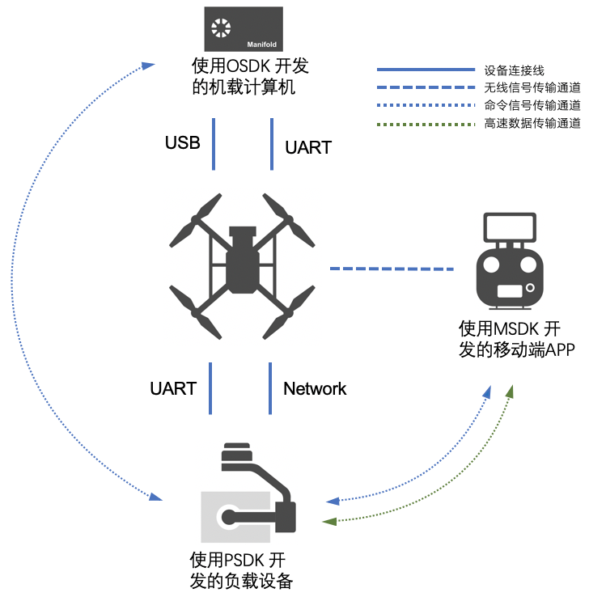
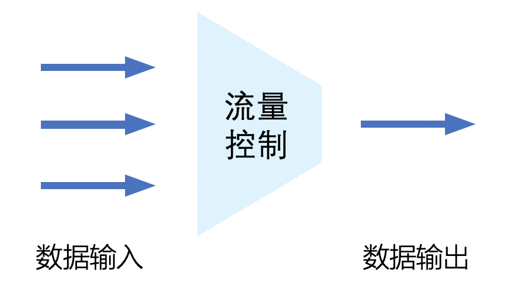
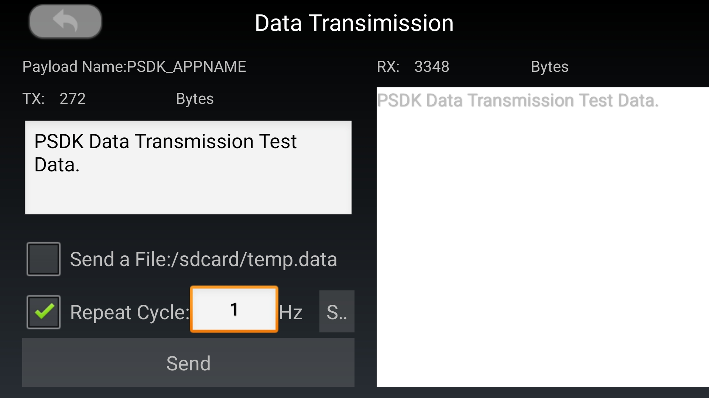
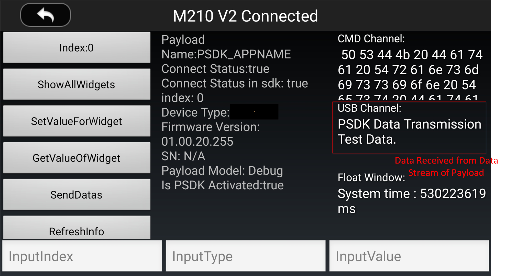
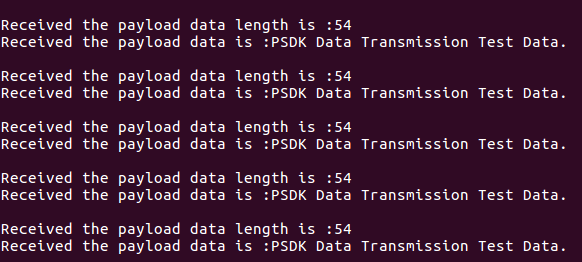
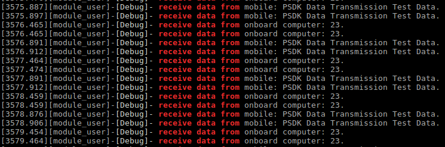

>**提示** 
> * “移动端APP” 为使用MSDK 开发的移动端APP 或DJI Pilot。
> * “负载设备” 为使用PSDK 开发的负载设备。
> * “机载计算机” 为运行了基于OSDK 开发的无人机控制程序的计算设备，如Manifold。

## 概述
负载设备和无人机使用数据传输模块，在控制命令传输通道上以透传的方式在PSDK、MSDK 和OSDK 间传输控制指令；在高速数据传输通道上以透传的方式在PSDK、MSDK 和OSDK 间传输数据信息以及用户自定义的数据。使用数据传输功能，不仅可以设置不同类型的数据占用**高速数据传输通道**带宽的比例，还能够查看不同数据传输通道的状态。
>**说明:** PSDK 的数据传输模块以透传的方式在负载设备、机载计算机和无人机间传输数据，支持用户根据实际的使用需求设计数据传输协议，使基于PSDK 开发的负载设备能够与移动端APP 或机载计算机间实现复杂通信。

## 基础概念
### 通道的分类
根据实际传输的数据类型和数据的作用，PSDK 的数据传输通道可分为命令信号传输通道和高速数据传输通道，如 图1.信号传输通道 所示。
* 命令信号传输通道：可靠性强，专用于传输对可靠性要求较高的信号，如控制指令和状态信息等。
* 高速数据传输通道：带宽较大，主要用于传输数据量较大且对实时性要求较高的数据，如雷达信号和点云数据等。       
<div>
<div style="text-align: center"><p>图1.信号传输通道   </p>
</div>
<div style="text-align: center"><p><span>
      </span></p>
</div></div>

### 通道的带宽
* 通道带宽：数据通道在**理论状态下**可传输的数据量
* 实时带宽：数据通道在**工作状态下理论上**可传输的数据量
* 实际带宽：数据通道实际传输的数据量
#### 通道带宽限制
数据传输通道的带宽限制，是指在单位时间内，通道**最大**能够传输的数据量（byte/s）。    
受制于接口部件的物理特性和实际的使用环境，命令信号传输通道和高速数据传输通道的带宽可分为**静态带宽限制**和**动态带宽限制**。

#### 静态带宽限制  
静态带宽限制是指命令信号传输通道**固定的**带宽大小，受制于材料的物理特性和固有的电气特性而**无法被改变**，有关数据传输通道静态带宽的详细参数，请参见 表1 静态带宽。  
表1 静态带宽 
<table id=1>
  <thead>
    <tr>
      <th>通道类型</th>
      <th>传输方向</th>
      <th>M200 V2</th>
      <th>M210 V2</th>
      <th>M210 RTK V2</th>
    </tr>
  </thead>
  <tbody>
    <tr>
      <td rowspan="4">命令信号传输通道</td>
      <td>移动端APP ➟ 负载设备</td>
      <td colspan="3" rowspan="4" style="text-align:center" >4KB/s</td>
    </tr>
    <tr>
      <td>负载设备 ➟ 移动端APP</td>
    </tr>
    <tr>
      <td>机载计算机 ➟ 负载设备</td>
    </tr>
    <tr>
      <td>负载设备 ➟ 机载计算机</td>
    </tr>
    <tr>
      <td>高速数据传输通道</td>
      <td>负载设备 ➟ 移动端APP</td>
      <td>8Mbps</td>
      <td colspan=2 style="text-align:center">4Mbps</td>
    </tr>
  </tbody>
</table>

#### 动态带宽限制  
动态带宽限制是指**高速数据传输通道**受链路状态和电磁环境等因素的影响，通道**最大**能够传输的数据量会动态变化，因此，**高速数据传输通道**的*实际带宽*低于*实时带宽*。
##### 设置带宽占用比例
PSDK 支持用户为不同的数据类型设置**高速数据传输通道**带宽使用比例，实现对高速数据传输通道带宽占用的精准控制。
某类数据的**实际带宽**=高速数据传输通道的动态带宽 ✕ 带宽分配比例。

>**说明：** 命令信号传输通道的动态带宽限制等于静态带宽限制。

### 流量控制
PSDK 的数据传输模块通过使用流量阈值和缓冲区，限制负载设备向移动端APP 或机载计算机发送的数据量，实现流量控制功能，如 图2.流量控制 所示。  

PSDK 的流量控制过程如下所示：

1. 负载设备通过数据通道向机载计算机或移动端APP 传输数据信息；
2. 当负载设备发送的数据大于流量控制功能的阈值时，流量控制功能将超出**流量阈值**的数据暂存入缓冲区中；
3. 当缓冲区已存满数据时，负载设备发送的**超出流量阈值**的数据将被丢弃；
4. 当数据通道空闲时，流量控制模块将发送暂存在缓冲区的数据。

>**说明：** 数据传输模块的流量控制周期为 1s，在每个控制周期内，负载设备传输的数据量应小于用户设置的**流量阈值**。  

<div>
<div style="text-align: center"><p>图2.流量控制   </p>
</div>
<div style="text-align: center"><p><span>
      </span></p>
</div></div>

### 通道状态
使用PSDK 开发的负载设备能够获取到如下信息：
  * **信息数据传输通道**在用户使用流量控制功能前**实际的带宽**；
  * **信息数据传输通道**在用户使用流量控制功能后**实际的带宽**；
  * 通道的繁忙状态：当对应通道的数据被存入缓冲区或被丢弃时，数据传输模块的通道状态为“繁忙”。

## 使用数据传输功能
使用PSDK 的数据传输功能，需要在创建工程文件并完成PSDK 的初始化后，初始化数据传输模块，设置不同类型的数据占用高速数据传输通道的比例；再实现数据传输功能和监控数据通道状态的功能。
### 1. 数据传输功能模块初始化
使用“数据传输”功能前，需要使用如下代码初始化数据传输功能模块，确保负载设备能够正常传输数据。  
```c
psdkStat = PsdkDataTransmission_Init();
if (psdkStat != PSDK_RETURN_CODE_OK) {
    PsdkLogger_UserLogError("init data transmission module error.");
    return PSDK_RETURN_CODE_ERR_UNKNOWN;
}
```

### 2. 设置带宽占用比例
用户通过使用基于MSDK 开发的移动端APP 或使用OSDK 开发的无人机控制程序，为不同类型的数据设置高速数据传输通道带宽的占用比例后，使用PSDK 开发的负载设备通过调用`PsdkDataChannel_SetBandwidthProportionForHighspeedChannel` 接口，能够设置如下载视频流等类型的数据占用高速数据传输通道带宽的比例。

```
psdkStat = PsdkDataChannel_SetBandwidthProportionForHighspeedChannel(bandwidthProportion);
if (psdkStat != PSDK_RETURN_CODE_OK) {
    PsdkLogger_UserLogError("set bandwidth proportion for high-speed channel error.");
    return PSDK_RETURN_CODE_ERR_UNKNOWN;
}
```

>**说明** 
> * 仅Linux 系统支持使用“设置高速数据传输通道带宽占用比例”的功能；
> * 视频流、数据流和下载流所占高速数据传输通道带宽的默认比例分别为33％，33％和34％。


### 3. 实现数据发送功能
使用PSDK 开发的负载设备通过命令信号传输通道和高速数据传输通道向移动端APP 或机载计算机发送测试数据。

* 向移动端APP 发送控制命令      
使用PSDK 开发的负载设备在命令信号传输通道上向移动端APP 发送**控制命令**。

```c
psdkStat = PsdkDataTransmission_SendDataToMobile(dataToBeSent, sizeof(dataToBeSent));
if (psdkStat != PSDK_RETURN_CODE_OK)
    PsdkLogger_UserLogError("send data to mobile error.");
```

移动端APP 接收负载设备通过命令信号传输通道发送的控制命令，如 图3.APP 数据接收（1） 所示。  
<div>
<div style="text-align: center"><p>图3.移动端APP 数据接收（1）</p>
</div>
<div style="text-align: center"><p><span>
      </span></p>
</div></div>
     
* 向移动端APP 发送数据信息      
使用PSDK 开发的负载设备在高速数据传输通道上向移动端APP 发送**数据信息**。

```c
psdkStat = PsdkDataTransmission_SendDataStream(dataToBeSent, sizeof(dataToBeSent));
if (psdkStat != PSDK_RETURN_CODE_OK)
    PsdkLogger_UserLogError("send data to data stream error.");
```
移动端APP 接收负载设备通过高速数据传输通道发送的数据信息，如 图4. 移动端APP 数据接收（2） 所示。  
<div>
<div style="text-align: center"><p>图4. 移动端APP 数据接收（2）</p>
</div>
<div style="text-align: center"><p><span>
      </span></p>
</div></div>

* 向机载计算机发送控制命令     
使用PSDK 开发的负载设备在命令信号传输通道上向机载计算机发送**控制命令**。

```c
psdkStat = PsdkDataTransmission_SendDataToOsdk(dataToBeSent, sizeof(dataToBeSent));
if (psdkStat != PSDK_RETURN_CODE_OK)
    PsdkLogger_UserLogError("send data to onboard computer error.");
```
机载计算机接收负载设备通过命令信号传输通道发送的控制命令，如 图5.机载计算机数据接收 所示。  
<div>
<div style="text-align: center"><p>图5. 机载计算机数据接收 </p>
</div>
<div style="text-align: center"><p><span>
      </span></p>
</div></div>

### 4. 实现数据接收功能
构造并注册数据接收函数后，使用PSDK 开发的负载设备能够通过命令信号传输通道接收从移动端设备和机载计算机发送的控制命令。

##### 1. 构造回调函数
构造回调函数获取并打印从移动端APP 和机载计算机上发送的控制命令。  

```c
static T_PsdkReturnCode ReceiveDataFromMobile(const uint8_t *data, uint16_t len)
{
    static char printData[PSDK_DATA_TRANSMISSION_DATA_RECEIVE_FROM_MOBILE_MAX_LEN + 1];

    USER_UTIL_UNUSED(len);

    strncpy(printData, (const char *) data, len);
    printData[len] = '\0';
    PsdkLogger_UserLogDebug("receive data from mobile: %s.", printData);

    return PSDK_RETURN_CODE_OK;
}

static T_PsdkReturnCode ReceiveDataFromOnboardComputer(const uint8_t *data, uint16_t len)
{
    static char printData[PSDK_DATA_TRANSMISSION_DATA_RECEIVE_FROM_ONBOARD_COMPUTER_MAX_LEN + 1];
    USER_UTIL_UNUSED(len);
    strncpy(printData, (const char *) data, len);
    printData[len] = '\0';
    PsdkLogger_UserLogDebug("receive data from onboard computer: %s.", printData);
    return PSDK_RETURN_CODE_OK;
}
```

##### 2. 注册回调函数
通过注册回调函数，负载设备能够接收从移动端APP 和机载计算机发送的控制命令。

```c
psdkStat = PsdkDataTransmission_RegReceiveDataFromMobileCallback(ReceiveDataFromMobile);
if (psdkStat != PSDK_RETURN_CODE_OK) {
    PsdkLogger_UserLogError("register receive data from mobile error.");
    return PSDK_RETURN_CODE_ERR_UNKNOWN;
}

psdkStat = PsdkDataTransmission_RegReceiveDataFromOsdkCallback(ReceiveDataFromOnboardComputer);
if (psdkStat != PSDK_RETURN_CODE_OK) {
    PsdkLogger_UserLogError("register receive data from onboard coputer error.");
    return PSDK_RETURN_CODE_ERR_UNKNOWN;
}
```

负载设备接收移动端APP 和机载计算机从命令信号传输通道发送的测试数据，如 图6.负载设备数据接收 所示。  
<div>
<div style="text-align: center"><p>图6.负载设备数据接收</p>
</div>
<div style="text-align: center"><p><span>
      </span></p>
</div></div>

### 5. 监控数据传输通道的状态
在数据传输线程中获取数据通道的状态并打印到终端。  

* 获取命令信号传输通道的状态信息    
获取负载设备向移动端APP 和机载计算机发送控制命令的命令信号传输通道的状态。
```
psdkStat = PsdkDataTransmission_GetSendToMobileState(&state);
if (psdkStat == PSDK_RETURN_CODE_OK) {
    PsdkLogger_UserLogDebug(
        "send to mobile state: realtimeBandwidthBeforeFlowController: %d, realtimeBandwidthAfterFlowController: %d, busyState: %d.",
        state.realtimeBandwidthBeforeFlowController, state.realtimeBandwidthAfterFlowController,
        state.busyState);
} else {
    PsdkLogger_UserLogError("get send to mobile channel state error.");
}

psdkStat = PsdkDataTransmission_GetSendToOsdkState(&state);
if (psdkStat == PSDK_RETURN_CODE_OK) {
    PsdkLogger_UserLogDebug(
        "send to onboard computer state: realtimeBandwidthBeforeFlowController: %d, realtimeBandwidthAfterFlowController: %d, busyState: %d.",
        state.realtimeBandwidthBeforeFlowController, state.realtimeBandwidthAfterFlowController,
        state.busyState);
} else {
    PsdkLogger_UserLogError("get send to onboard computer channel state error.");
}
```

* 获取高速数据传输通道的状态信息

>**说明：** 仅基于Linux 开发的负载设备能获取高速数据传输通道的状态信息。

```c
psdkStat = PsdkDataTransmission_GetDataStreamState(&state);
if (psdkStat == PSDK_RETURN_CODE_OK) {
    PsdkLogger_UserLogDebug(
        "data stream state: realtimeBandwidthLimit: %d, realtimeBandwidthBeforeFlowController: %d, busyState: %d.",
        state.realtimeBandwidthLimit, state.realtimeBandwidthBeforeFlowController, state.busyState);
} else {
    PsdkLogger_UserLogError("get data stream state error.");
}
```

高速数据传输通道状态如 图7.数据传输 所示。  

> **说明：** 实时带宽统计周期为 1s。

<div>
<div style="text-align: center"><p>图7.数据传输 </p>
</div>
<div style="text-align: center"><p><span>
      
      </span></p>
</div></div>
