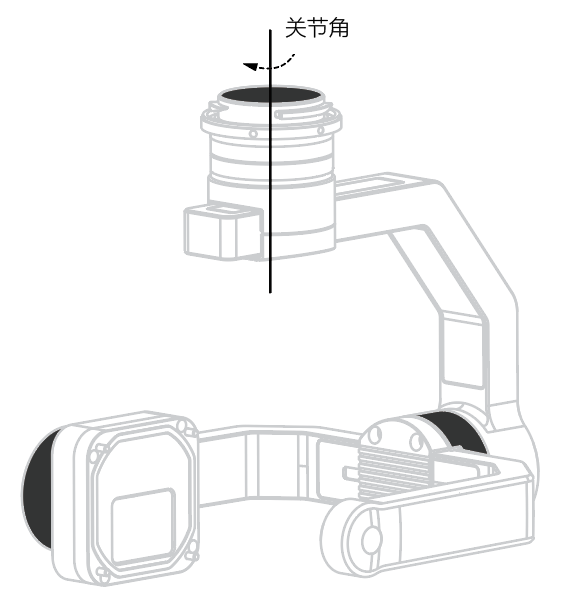
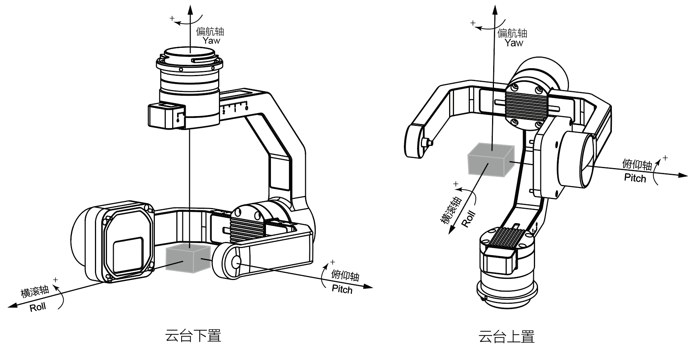
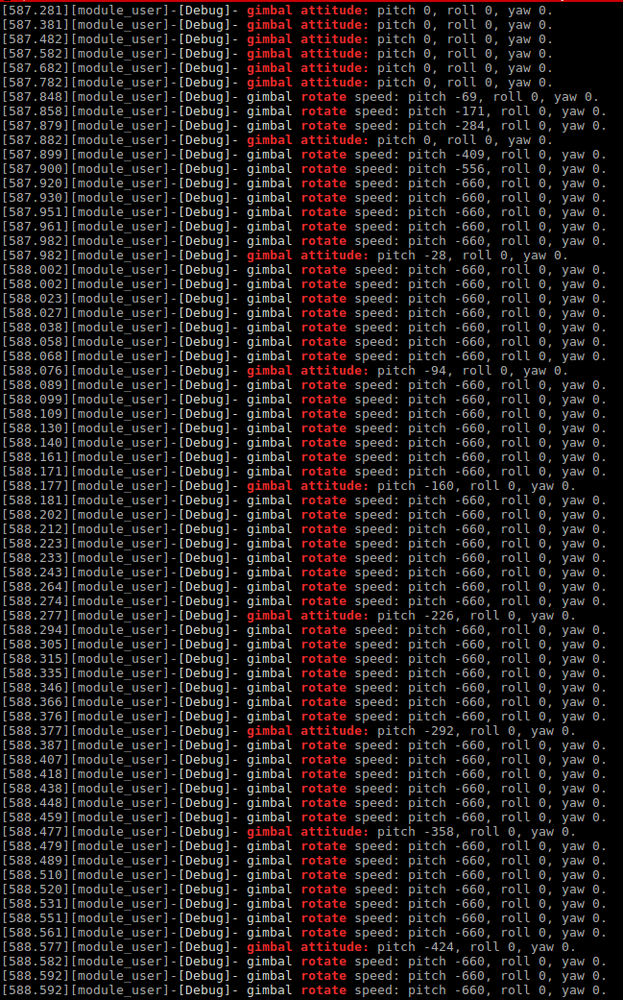
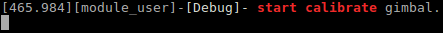
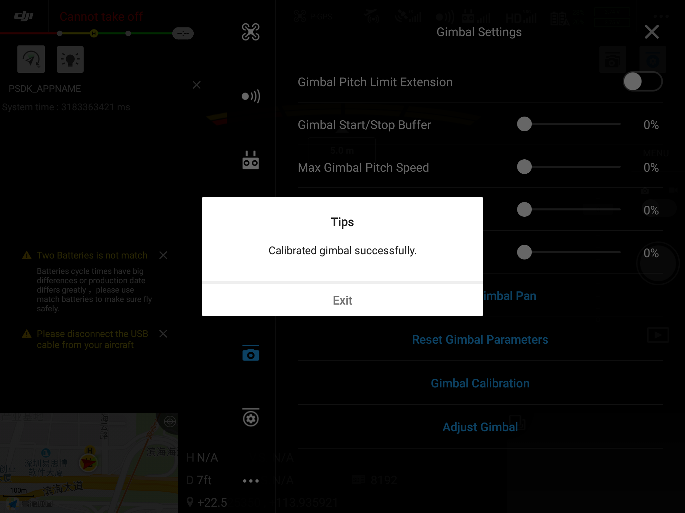

>**说明：** 仅使用SkyPort 开发的负载设备支持使用PSDK 的云台功能。
## 概述
使用PSDK 的“云台控制”功能，开发者需要先设计负载设备的云台并开发出控制云台的程序，将云台的控制函数注册到PSDK 指定的接口后，用户通过使用DJI Pilot、基于MSDK 开发的移动端APP 及遥控器即可控制基于PSDK 开发的具有云台功能的负载设备，同时获得负载设备的相关信息，如姿态等。

## 基础概念
### 云台状态信息
使用PSDK 开发的云台类负载设备需要按照指定的要求上报云台的状态、当前姿态和校准状态等信息，方便用户移动端APP 或机载计算机根据云台的状态，实现精准控制。有关获取云台状态的方法和相关详情请参见**PSDK API 文档**。

### 关节角与姿态角
#### 云台关节与云台关节角  
云台的关节如图1.云台关节 所示，云台关节是云台上带动负载设备转动的结构件：云台电机，云台关节角即云台电机转动的角度。本教程使用机体坐标系描述云台的关节角。    
<div>
<div style="text-align: center"><p>图1.云台关节 </p>
</div>
<div style="text-align: center"><p><span>
      </span></p>
</div></div>
  
#### 云台姿态与云台姿态角
云台的姿态如 图2.云台姿态 所示，根据用户的控制指令，云台能够调整姿态；云台姿态角即使用大地坐标系（NED，北东地坐标系）描述云台上**负载设备**的角度，该角度也称为欧拉角。

<div>
<div style="text-align: center"><p>图2.云台姿态  </p>
</div>
<div style="text-align: center"><p><span>
      </span></p>
</div></div>
   

### 云台模式
云台模式决定了云台跟随无人机运动时的转动方式：  
* 自由模式：当无人机的姿态改变时，云台将不会转动。
* FPV 模式：当无人机的姿态发生改变时，云台会转动航向轴与横滚轴，确保负载设备当前的视场角不会发生改变。
* YAW 跟随模式：在该模式下，云台的航向轴会跟随无人机的航向轴转动。

> **说明：** 在以上三种模式下，无人机系统中的其他模块（航线飞行时的云台控制指令）、遥控器和移动端APP，能够控制云台转动。  

### 云台控制

#### 控制方式
云台转动的控制方式分为以下三种：    
* 相对角度控制：使用PSDK 开发的云台根据用户**指定的**角度，在规定的时间内，转动**指定的角度**。
* 绝对角度控制：使用PSDK 开发的云台根据用户的指令，在规定的时间内，从**当前的位置**转动到指定的位置。
* 速度控制：用户可控制使用PSDK 开发的云台的转动速度。  

> **说明** 
> * 在角度控制模式下，云台转动的时间受云台最大旋转速度和最大加速度限制，实际的转动角度受云台限位角度的限制。
> * 在速度控制模式下，云台根据用户指定的速度转动0.5s，当云台转动到限位角时，将会停止转动。

#### 控制权限
有关云台控制权限的详细说明请参见 表1.云台控制权限。
* 控制规则：
  * 优先级低的控制动作在优先级高的控制动作结束后才能控制云台；
  * 高优先级的控制动作可抢占低优先级控制动作的控制权；
  * 同等优先级的控制场景按照开始控制的时间先后顺序抢占控制权，开始控制时间较晚的控制场景不能夺取控制权。
* 权限释放
  * 控制模块完成对云台的控制后会释放控制权；
  * 若控制模块完成对云台的控制后未释放控制权，使用PSDK 开发的云台将在云台转动结束后指定的时间内自动释放控制权。  
<div><div>
<p>
表1.云台控制权限  </p></div>
<div>
<table id="01">
  <thead>
    <tr>
      <th>权限角色</th>
      <th>权限等级</th>
      <th>云台运动持续时间</th>
      <th>权限超时释放时间</th>
    </tr>
  </thead>
  <tbody>
    <tr>
      <td>遥控器云台摇杆</td>
      <td>1</td>
      <td>0</td>
      <td>500 ms</td>
    </tr>
    <tr>
      <td>MSDK 云台控制指令</td>
      <td>1</td>
      <td>由控制命令指定</td>
      <td>2000 ms</td>
    </tr>
    <tr>
      <td>DJI APP 云台控制指令</td>
      <td>2</td>
      <td>0</td>
      <td>500 ms</td>
    </tr>
    <tr>
      <td>负载协同指令</td>
      <td>2</td>
      <td colspan="2" style="text-align: center">由控制命令指定</td>
    </tr>
    <tr>
      <td>MSDK 云台速度指令</td>
      <td>2</td>
      <td>0</td>
      <td>500 ms</td>
    </tr>
    <tr>
      <td>航线飞行时的云台控制指令</td>
      <td>2</td>
<td colspan="2" style="text-align: center">由控制命令指定</td>
    </tr>
  </tbody>
</table></div></div>

#### 平滑度
云台的平滑度是指云台响应动作的缓急，使用PSDK 开发的云台支持用户通过DJI Pilot和基于MSDK 开发的移动端APP 通过设置平滑控制系数，实现云台的缓启停。       

* 平滑控制系数：平滑控制系数决定云台转动的最大加速度。     
* 云台转动的最大加速度= 10000 × (0.8 ^ (1 + X)) deg/s^2 (X 为平滑控制系数)  

#### 最大速度百分比
* 最大速度百分比：云台的最大速度百分比决定云台旋转的最大速度。
* 云台实际最大的转动速度= 默认最大速度 × 最大速度百分比    
  >**说明：** 开发者根据实际的使用需要，可设置云台默认的最大云台转动运动速度。

#### 角度微调
使用PSDK 开发的云台支持用户通过DJI Pilot和基于MSDK 开发的移动端APP，精细化地调整云台关节角的角度，调整结果还可作为校准参数存储在负载设备中，用于降低云台的各类误差。

#### 云台限位功能
为避免云台在工作时，因结构干涉导致云台意外损坏或干扰无人机的执行飞行任务，请务必为云台设置机械限位和软件限位。

* 机械限位：机械限位由云台类负载设备的物理形态和设计结构决定，详情请参见[标准声明](../guide/payload-criterion.html)。
* 软件限位：开发者可根据实际的使用需求设置软件限位：
  * 设置云台俯仰轴、横滚轴和航向轴的欧拉角角度限制；
  * 设置俯仰轴欧拉角扩展角角度限制；
  * 设置云台关节角限制。
  > **提示** 
  > * 使用俯仰轴角度范围扩展功能后，可将云台俯仰轴的欧拉角角度限制设置为默认限制和扩展限制。
  > * 当云台的关节角达到限位时，使用DJI Pilot 以及基于MSDK 开发的移动端APP 将接收到云台转动到限位角的提示信息。

#### 云台复位
使用PSDK 开发的云台类负载设备支持用户通过DJI Pilot和基于MSDK 开发的移动端APP 复位云台，将云台的姿态复位为初始状态。

* 航向轴复位：将云台航向轴的角度复位为无人机航向轴角度与云台航向轴微调角度的和。
* 俯仰轴与航向轴复位：将云台俯仰轴的角度复位为微调的角度，将云台航向轴的角度复位为无人机航向轴角度与云台航向轴微调角度的和。

## 实现云台功能
请开发者根据选用的**开发平台**以及行业应用实际的使用需求，按照PSDK 中的结构体`T_PsdkGimbalCommonHandler`构造实现云台类负载设备控制功能的函数，将云台控制功能的函数注册到PSDK 中指定的接口后，用户通过使用DJI Pilot 或基于MSDK 开发的移动端APP 能够控制基于PSDK 开发的云台类负载设备执行指定的动作。

```c 
    // 获取云台的状态信息
    s_commonHandler.GetSystemState = GetSystemState;
    s_commonHandler.GetAttitudeInformation = GetAttitudeInformation;
    s_commonHandler.GetCalibrationState = GetCalibrationState;
    // 实现云台控制功能
    s_commonHandler.Rotate = PsdkTest_GimbalRotate;
    s_commonHandler.StartCalibrate = StartCalibrate;
    s_commonHandler.SetControllerSmoothFactor = SetControllerSmoothFactor;
    s_commonHandler.SetPitchRangeExtensionEnabled = SetPitchRangeExtensionEnabled;
    s_commonHandler.SetControllerMaxSpeedPercentage = SetControllerMaxSpeedPercentage;
    s_commonHandler.RestoreFactorySettings = RestoreFactorySettings;
    s_commonHandler.SetMode = SetMode;
    s_commonHandler.Reset = Reset;
    s_commonHandler.FineTuneAngle = FineTuneAngle;
```

## 使用云台控制功能
使用云台控制功能，需要先实现云台控制功能，再实现云台限位功能，根据云台模式调整云台的姿态、目标角度和限位标志，最后实现云台校准功能校准云台。  
> **说明：** 使用PSDK 开发负载设备的云台功能时，请使用**SkyPort 2.0** 或 **SkyPort 1.0** ，若您所用的开发工具为X-Port，请阅读[X-Port 控制](./X-Port.html)。

### 使用云台基础控制功能

#### 1. 云台控制功能模块初始化
使用“云台控制”功能前，需要先初始化云台控制功能模块，确保云台控制功能可正常运行。 

```c
psdkStat = PsdkGimbal_Init();
if (psdkStat != PSDK_RETURN_CODE_OK) {
    PsdkLogger_UserLogError("init gimbal module error: %lld", psdkStat);
}
```

#### 2.注册云台控制功能
使用PSDK 的云台控制功能控制云台类负载设备时，开发者需要将控制云台的函数注册到指定的接口中。

```c
psdkStat = PsdkGimbal_RegCommonHandler(&s_commonHandler);
if (psdkStat != PSDK_RETURN_CODE_OK) {
    PsdkLogger_UserLogError("gimbal register common handler error: %lld", psdkStat);
}
```

#### 3. 获取云台的状态信息
为方便用户控制云台执行相应的动作，需调用`GetSystemState` 接口获取云台的状态。

```c
static T_PsdkReturnCode GetSystemState(T_PsdkGimbalSystemState *systemState)
{
    PsdkLogger_UserLogDebug("get gimbal system state");
    *systemState = s_systemState;
    return PSDK_RETURN_CODE_OK;
}
```

#### 4. 构造回调函数计算云台的转动速度
构造回调函数计算云台的转动速度、调整云台的姿态并记录云台转动的目标角度和转动速度。

```c
T_PsdkReturnCode PsdkTest_GimbalRotate(E_PsdkGimbalRotationMode rotationMode,
                                       T_PsdkGimbalRotationProperty rotationProperty,
                                       T_PsdkAttitude3d rotationValue)
{
    T_PsdkReturnCode psdkStat;
    T_PsdkReturnCode returnCode = PSDK_RETURN_CODE_OK;
    T_PsdkAttitude3d attitudeTemp = {0};
    T_PsdkAttitude3d speedTemp = {0};

    PsdkLogger_UserLogDebug("gimbal rotation value invalid flag: pitch %d, roll %d, yaw %d.",
                            rotationProperty.rotationValueInvalidFlag.pitch,
                            rotationProperty.rotationValueInvalidFlag.roll,
                            rotationProperty.rotationValueInvalidFlag.yaw);
    // 设置线程锁
    if (PsdkOsal_MutexLock(s_attitudeMutex) != PSDK_RETURN_CODE_OK) {
        PsdkLogger_UserLogError("mutex lock error");
        return PSDK_RETURN_CODE_ERR_UNKNOWN;
    }

    if (PsdkOsal_MutexLock(s_commonMutex) != PSDK_RETURN_CODE_OK) {
        PsdkLogger_UserLogError("mutex lock error");
        returnCode = PSDK_RETURN_CODE_ERR_UNKNOWN;
        goto out2;
    }
    // 根据云台的模式调整云台转动的目标姿态
        switch (rotationMode) {
        case PSDK_GIMBAL_ROTATION_MODE_RELATIVE_ANGLE:
            PsdkLogger_UserLogDebug("gimbal relative rotate angle: pitch %d, roll %d, yaw %d.", rotationValue.pitch,
                                    rotationValue.roll, rotationValue.yaw);
            PsdkLogger_UserLogDebug("gimbal relative rotate action time: %d.",
                                    rotationProperty.relativeAngleRotation.actionTime);

            if (s_rotatingFlag == true) {
                PsdkLogger_UserLogWarn("gimbal is rotating.");
                goto out1;
            }

            attitudeTemp.pitch =
                rotationProperty.rotationValueInvalidFlag.pitch == true ? s_attitudeInformation.attitude.pitch : (
                    s_attitudeInformation.attitude.pitch + rotationValue.pitch);
            attitudeTemp.roll =
                rotationProperty.rotationValueInvalidFlag.roll == true ? s_attitudeInformation.attitude.roll : (
                    s_attitudeInformation.attitude.roll + rotationValue.roll);
            attitudeTemp.yaw =
                rotationProperty.rotationValueInvalidFlag.yaw == true ? s_attitudeInformation.attitude.yaw : (
                    s_attitudeInformation.attitude.yaw + rotationValue.yaw);

            PsdkTest_GimbalAngleIegalization(&attitudeTemp, s_aircraftAttitude, NULL);
            s_targetAttitude = attitudeTemp;
            s_rotatingFlag = true;
            s_controlType = TEST_GIMBAL_CONTROL_TYPE_ANGLE;

            psdkStat = PsdkTest_GimbalCalculateSpeed(s_attitudeInformation.attitude, s_targetAttitude,
                                                     rotationProperty.relativeAngleRotation.actionTime, &s_speed);
            if (psdkStat != PSDK_RETURN_CODE_OK) {
                PsdkLogger_UserLogError("calculate gimbal rotation speed error: %lld.", psdkStat);
                returnCode = psdkStat;
                goto out1;
            }

            break;
        case PSDK_GIMBAL_ROTATION_MODE_ABSOLUTE_ANGLE:
            PsdkLogger_UserLogDebug("gimbal absolute rotate angle: pitch %d, roll %d, yaw %d.", rotationValue.pitch,
                                    rotationValue.roll, rotationValue.yaw);
            PsdkLogger_UserLogDebug("gimbal absolute rotate action time: %d.",
                                    rotationProperty.absoluteAngleRotation.actionTime);

            if (s_rotatingFlag == true) {
                PsdkLogger_UserLogWarn("gimbal is rotating.");
                goto out1;
            }

            attitudeTemp.pitch =
                rotationProperty.rotationValueInvalidFlag.pitch == true ? s_attitudeInformation.attitude.pitch
                                                                        : rotationValue.pitch;
            attitudeTemp.roll =
                rotationProperty.rotationValueInvalidFlag.roll == true ? s_attitudeInformation.attitude.roll
                                                                       : rotationValue.roll;
            attitudeTemp.yaw =
                rotationProperty.rotationValueInvalidFlag.yaw == true ? s_attitudeInformation.attitude.yaw
                                                                      : rotationValue.yaw;

            PsdkTest_GimbalAngleIegalization(&attitudeTemp, s_aircraftAttitude, NULL);
            s_targetAttitude = attitudeTemp;
            s_rotatingFlag = true;
            s_controlType = TEST_GIMBAL_CONTROL_TYPE_ANGLE;

            psdkStat = PsdkTest_GimbalCalculateSpeed(s_attitudeInformation.attitude, s_targetAttitude,
                                                     rotationProperty.absoluteAngleRotation.actionTime, &s_speed);
            if (psdkStat != PSDK_RETURN_CODE_OK) {
                PsdkLogger_UserLogError("calculate gimbal rotation speed error: %lld.", psdkStat);
                returnCode = psdkStat;
                goto out1;
            }

            break;
        case PSDK_GIMBAL_ROTATION_MODE_SPEED:
            PsdkLogger_UserLogDebug("gimbal rotate speed: pitch %d, roll %d, yaw %d.", rotationValue.pitch,
                                    rotationValue.roll, rotationValue.yaw);

            if (s_rotatingFlag == true && s_controlType == TEST_GIMBAL_CONTROL_TYPE_ANGLE) {
                PsdkLogger_UserLogWarn("gimbal is rotating.");
                goto out1;
            }

            memcpy(&speedTemp, &rotationValue, sizeof(T_PsdkAttitude3d));
            PsdkTest_GimbalSpeedIegalization(&speedTemp);
            s_speed = speedTemp;

            if (rotationValue.pitch != 0 || rotationValue.roll != 0 || rotationValue.yaw != 0) {
                s_rotatingFlag = true;
                s_controlType = TEST_GIMBAL_CONTROL_TYPE_SPEED;
            } else {
                s_rotatingFlag = false;
            }

            break;
        default:
            PsdkLogger_UserLogError("gimbal rotation mode invalid: %d.", rotationMode);
            returnCode = PSDK_RETURN_CODE_ERR_UNSUPPORT;
            goto out1;
    }

out1:
    if (PsdkOsal_MutexUnlock(s_commonMutex) != PSDK_RETURN_CODE_OK) {
        PsdkLogger_UserLogError("mutex unlock error");
        returnCode = PSDK_RETURN_CODE_ERR_UNKNOWN;
        goto out2;
    }

out2:
    if (PsdkOsal_MutexUnlock(s_attitudeMutex) != PSDK_RETURN_CODE_OK) {
        PsdkLogger_UserLogError("mutex unlock error");
        return PSDK_RETURN_CODE_ERR_UNKNOWN;
    }

    return returnCode;
}
```

#### 5. 控制云台转动
负载设备根据云台的姿态和转动速度，将相对角度控制量、绝对角度控制量或速度控制量转换为控制云台转动的速度，根据该速度控制云台转动，如 图3.云台控制 所示。

```c
nextAttitude.pitch = s_attitudeInformation.attitude.pitch + s_speed.pitch / PAYLOAD_GIMBAL_TASK_FREQ;
nextAttitude.roll = s_attitudeInformation.attitude.roll + s_speed.roll / PAYLOAD_GIMBAL_TASK_FREQ;
nextAttitude.yaw = s_attitudeInformation.attitude.yaw + s_speed.yaw / PAYLOAD_GIMBAL_TASK_FREQ;

if (s_controlType == TEST_GIMBAL_CONTROL_TYPE_ANGLE) {
    nextAttitude.pitch =
        (nextAttitude.pitch - s_targetAttitude.pitch) * s_speed.pitch >= 0 ? s_targetAttitude.pitch
                                                                           : nextAttitude.pitch;
    nextAttitude.roll = (nextAttitude.roll - s_targetAttitude.roll) * s_speed.roll >= 0 ? s_targetAttitude.roll
                                                                                        : nextAttitude.roll;
    nextAttitude.yaw =
        (nextAttitude.yaw - s_targetAttitude.yaw) * s_speed.yaw >= 0 ? s_targetAttitude.yaw : nextAttitude.yaw;
}

s_attitudeInformation.attitude = nextAttitude;
PsdkTest_GimbalAngleIegalization(&s_attitudeInformation.attitude, s_aircraftAttitude,
                                 &s_attitudeInformation.reachLimitFlag);

if (s_controlType == TEST_GIMBAL_CONTROL_TYPE_ANGLE) {
    if (memcmp(&nextAttitude, &s_targetAttitude, sizeof(T_PsdkAttitude3d)) == 0) {
        s_rotatingFlag = false;
    }
} else if (s_controlType == TEST_GIMBAL_CONTROL_TYPE_SPEED) {
    if ((s_attitudeInformation.reachLimitFlag.pitch == true || s_speed.pitch == 0) &&
        (s_attitudeInformation.reachLimitFlag.roll == true || s_speed.roll == 0) &&
        (s_attitudeInformation.reachLimitFlag.yaw == true || s_speed.yaw == 0)) {
        s_rotatingFlag = false;
    }
}
```

<div>
<div style="text-align: center"><p>图3.云台控制  </p>
</div>
<div style="text-align: center"><p><span>
      </span></p>
</div></div>

### 调整云台处于不同模式时的参数
开发者能够根据**实际的使用需求**调整云台处于不同模式时的姿态、目标角度和到达限位标志。
* 在FPV 模式下：
    * 调整云台姿态：将无人机姿态的变化量叠加到云台的横滚轴和航向轴上；
    * 调整云台转动的目标角度：云台旋转时，将无人机的姿态变化量叠加到云台的横滚轴和航向轴上。
* 在YAW 模式下：
    * 调整云台姿态：将无人机姿态的变化量叠加到云台的航向轴上；
    * 调整云台转动的目标角度：云台旋转时，将无人机的姿态变化量叠加到云台的航向轴上。
* 调整云台姿态与目标角度的转动范围，负载设备能够计算出云台的达到限位标志。

```c
switch (s_systemState.gimbalMode) {
    case PSDK_GIMBAL_MODE_FREE:
        break;
    case PSDK_GIMBAL_MODE_FPV:
        s_attitudeInformation.attitude.roll += (s_aircraftAttitude.roll - s_lastAircraftAttitude.roll);
        s_attitudeInformation.attitude.yaw += (s_aircraftAttitude.yaw - s_lastAircraftAttitude.yaw);

        if (s_rotatingFlag == true && s_controlType == TEST_GIMBAL_CONTROL_TYPE_ANGLE) {
            s_targetAttitude.roll += (s_aircraftAttitude.roll - s_lastAircraftAttitude.roll);
            s_targetAttitude.yaw += (s_aircraftAttitude.yaw - s_lastAircraftAttitude.yaw);
        }
        break;
    case PSDK_GIMBAL_MODE_YAW_FOLLOW:
        s_attitudeInformation.attitude.yaw += (s_aircraftAttitude.yaw - s_lastAircraftAttitude.yaw);

        if (s_rotatingFlag == true && s_controlType == TEST_GIMBAL_CONTROL_TYPE_ANGLE) {
            s_targetAttitude.yaw += (s_aircraftAttitude.yaw - s_lastAircraftAttitude.yaw);
        }
        break;
    default:
        PsdkLogger_UserLogError("gimbal mode invalid: %d.", s_systemState.gimbalMode);
}
s_lastAircraftAttitude = s_aircraftAttitude;

PsdkTest_GimbalAngleIegalization(&s_attitudeInformation.attitude, s_aircraftAttitude,
                                 &s_attitudeInformation.reachLimitFlag);
PsdkTest_GimbalAngleIegalization(&s_targetAttitude, s_aircraftAttitude, NULL);
```

### 使用云台校准功能
为方便用户更加精准地控制云台，**建议**开发者在开发具有云台功能的负载设备时实现云台校准功能。  
#### 1. 使用云台校准功能
如需使用云台校准功能，请先实现云台校准功能，并将云台校准功能的函数，注册到指定的接口中，方便用户使用DJI Pilot 或基于MSDK 开发的移动端APP 校准具有云台功能的负载设备。
```c
static T_PsdkReturnCode StartCalibrate(void)
{
    T_PsdkReturnCode psdkStat;

    PsdkLogger_UserLogDebug("start calibrate gimbal.");

    psdkStat = PsdkOsal_GetTimeMs(&s_calibrationStartTime);
    if (psdkStat != PSDK_RETURN_CODE_OK) {
        PsdkLogger_UserLogError("get start time error: %lld.", psdkStat);
    }

    if (PsdkOsal_MutexLock(s_calibrationMutex) != PSDK_RETURN_CODE_OK) {
        PsdkLogger_UserLogError("mutex lock error");
        return PSDK_RETURN_CODE_ERR_UNKNOWN;
    }

    s_calibrationState.calibratingFlag = true;
    s_calibrationState.progress = 0;
    s_calibrationState.stage = PSDK_GIMBAL_CALIBRATION_STAGE_PROCRESSING;

    if (PsdkOsal_MutexUnlock(s_calibrationMutex) != PSDK_RETURN_CODE_OK) {
        PsdkLogger_UserLogError("mutex unlock error");
        return PSDK_RETURN_CODE_ERR_UNKNOWN;
    }

    return PSDK_RETURN_CODE_OK;
}
```
#### 2. 云台校准状态更新
负载设备执行云台校准功能后，将记录云台的校准状态，基于MSDK 开发的移动端APP 能够获取云台的校准状态。

```c
calibration:
        if (s_calibrationState.calibratingFlag != true)
            continue;

        psdkStat = PsdkOsal_GetTimeMs(&currentTime);
        if (psdkStat != PSDK_RETURN_CODE_OK) {
            PsdkLogger_UserLogError("get current time error: %lld.", psdkStat);
            continue;
        }

        if (PsdkOsal_MutexLock(s_calibrationMutex) != PSDK_RETURN_CODE_OK) {
            PsdkLogger_UserLogError("mutex lock error");
            continue;
        }

        progressTemp = (currentTime - s_calibrationStartTime) * 100 / PAYLOAD_GIMBAL_CALIBRATION_TIME_MS;
        if (progressTemp >= 100) {
            s_calibrationState.calibratingFlag = false;
            s_calibrationState.progress = 100;
            s_calibrationState.stage = PSDK_GIMBAL_CALIBRATION_STAGE_COMPLETE;
        }

        if (PsdkOsal_MutexUnlock(s_calibrationMutex) != PSDK_RETURN_CODE_OK) {
            PsdkLogger_UserLogError("mutex unlock error");
            continue;
        }
```
在DJI Pilot 以及基于MSDK 开发的移动端APP 中使用“云台自动校准”功能后，使用PSDK 开发的负载设备将接收到云台校准命令并校准云台，如图4和图5 所示。  
<div>
<div style="text-align: center"><p>图4.云台校准（1） </p>
</div>
<div style="text-align: center"><p><span>
      </span></p>
</div></div>

<div>
<div style="text-align: center"><p>图5.云台校准（2） </p>
</div>
<div style="text-align: center"><p><span>
      </span></p>
</div></div>
