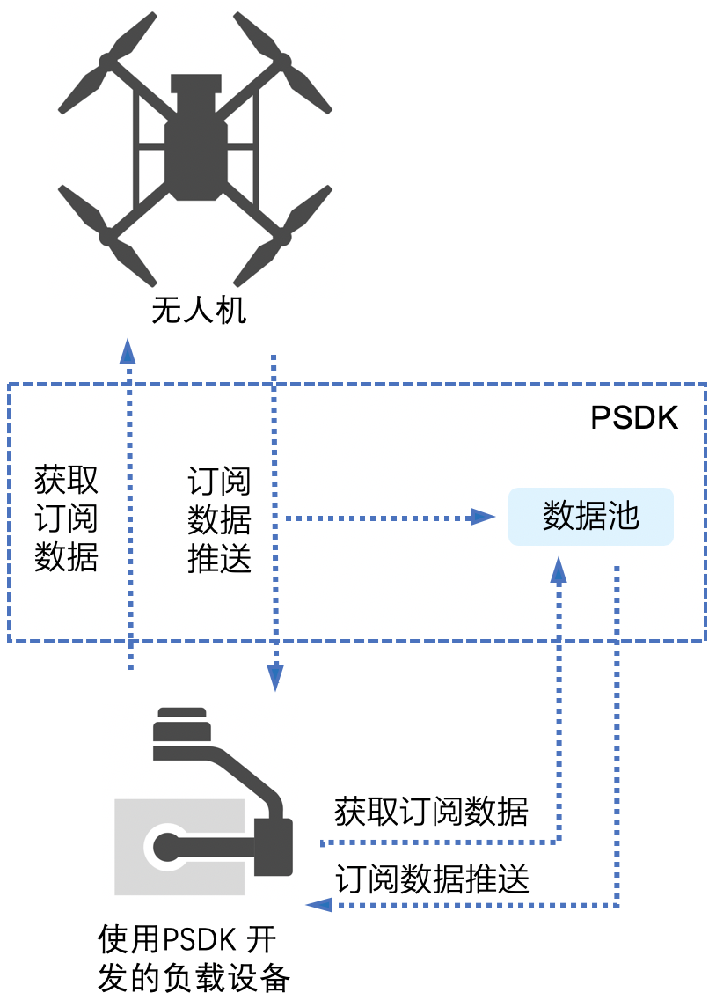
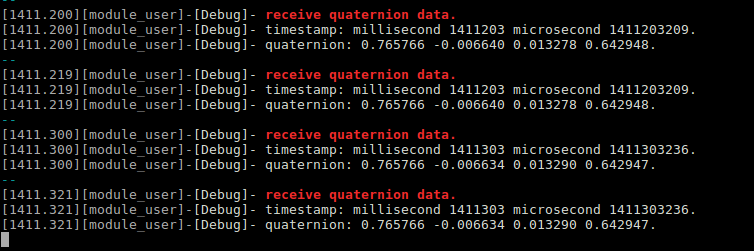
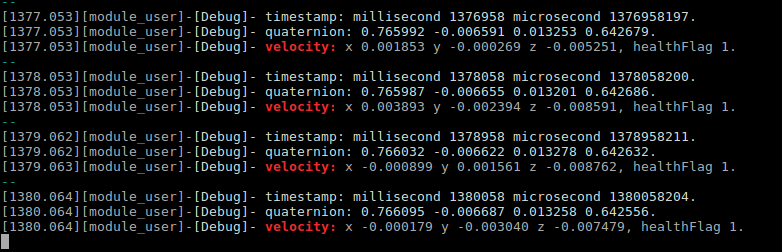

## 概述
PSDK 的信息管理功能包含信息获取和消息订阅功能，基于PSDK 开发的负载设备具有信息获取功能，能够主动获取到无人机的型号、负载设备挂载的位置以及用户使用的移动端APP 等信息，加载不同的配置文件，方便用户使用负载设备；具有消息订阅功能的负载设备，能够记录用户订阅的数据信息，方便用户实现更广泛的应用。

## 基础概念
### 信息获取  
信息获取是指负载设备能够**主动获取并记录**无人机上如无人机型号、硬件平台类型和负载设备挂载位置等数据信息。
>**说明：** 将使用PSDK 开发的负载设备安装到无人机上，在开机初始化5s 后才能够获取到无人机正确的数据信息。

使用PSDK 开发的负载设备在初始化后，即可获取到如下信息：
* 基本信息：无人机型号、硬件平台类型和负载挂载位置
* 移动端APP 信息：APP 的系统语言和APP 的屏幕类型

### 消息订阅
无人机上的各个部件根据无人机实际的飞行状况，会实时产生大量的数据信息并被无人机推送给其他模块，用户使用具有消息订阅功能的负载设备，能够指定所需订阅的数据信息。

#### 订阅流程
设置订阅项后，负载设备和移动端APP 即可获得用户订阅的信息，具体流程如 图1.消息订阅 所示。   
<div>
<div style="text-align: center"><p>图1.消息订阅  </p>
</div>
<div style="text-align: center"><p><span>
      </span></p>
</div></div>

#### 订阅项
使用PSDK 消息订阅功能可订阅的数据信息如 表1.无人机订阅项 所示。    
<div><div><p>
表1.无人机订阅项  </p></div>
<div>
<table>
  <thead>
      <th>数据类型</th>
      <th>订阅项（Topic）</th>
      <th>最大订阅频率（Hz）</th>
  </thead>
  <tbody>
  <tr>
      <th rowspan="7">基础信息</th>
      <td>姿态四元数</td>
      <td>200</td>
    </tr>
    <tr>
      <td>速度</td>
      <td>200</td>
    </tr>
    <tr>
      <td>融合海拔高度</td>
      <td>200</td>
    </tr>
    <tr>
      <td>相对高度</td>
      <td>200</td>
    </tr>
    <tr>
      <td>融合位置</td>
      <td>200</td>
    </tr>
    <tr>
      <td>飞行状态</td>
      <td>50</td>
    </tr>
    <tr>
      <td>电池信息</td>
      <td>50</td>
    </tr>
    <tr>
    <th rowspan="6">GPS 信息</th>
    <td>GPS 日期</td>
    <td>5</td>
    </tr>
    <tr>
      <td>GPS 时间</td>
      <td>5</td>
    </tr>
    <tr>
      <td>GPS 位置</td>
      <td>5</td>
    </tr>
    <tr>
      <td>GPS 速度</td>
      <td>5</td>
    </tr>
    <tr>
      <td>GPS 信息</td>
      <td>5</td>
    </tr>
    <tr>
      <td>GPS 信号等级</td>
      <td>50</td>
    </tr>
    <tr>
     <th rowspan="5">RTK 信息</th>
      <td>RTK 位置</td>
      <td>5</td>
    </tr>
    <tr>
      <td>RTK 速度</td>
      <td>5</td>
    </tr>
    <tr>
      <td>RTK 航向角</td>
      <td>5</td>
    </tr>
    <tr>
      <td>RTK 位置属性</td>
      <td>5</td>
    </tr>
    <tr>
      <td>RTK 航向角属性</td>
      <td>5</td>
    </tr>
  </tbody>
</table></div></div>

#### 订阅规则
* 消息订阅功能最多支持订阅**5类频率**，如最多支持订阅1Hz、10Hz、20Hz、50Hz、100Hz，5类频率，每个订阅项只能被订阅一次。
* 指定订阅频率时，任何参数的订阅频率不能小于或等于0 ，相同订阅频率的主题的数据长度总和须小于或等于242。

## 使用消息订阅功能
PSDK 支持通过注册回调和接口调用两种方式订阅无人机对外推送的数据信息：

* 通过调用`PsdkDataSubscription_GetValueOfTopicWithTimestamp()`获取无人机最新产生的订阅项的数据信息及其对应的时间。
* 通过调用`PsdkDataSubscription_RegTopicSync`接口指定订阅频率和订阅项，通过构造并注册回调函数，获取无人机最新产生的订阅项的数据信息及其对应的时间。

>**说明：** 使用订阅功能将接收到订阅项的数据与该数据产生时无人机系统的时间，该时间**暂不支持**与负载设备上的时间实现同步。

#### 消息订阅功能模块初始化
使用PSDK 开发的负载设备如需订阅无人机上的状态信息，需要先调用`PsdkDataSubscription_Init()`初始化消息订阅模块。

```c
psdkStat = PsdkDataSubscription_Init();
if (psdkStat != PSDK_RETURN_CODE_OK) {
    PsdkLogger_UserLogError("init data subscription module error.");
    return PSDK_RETURN_CODE_ERR_UNKNOWN;
}
```

#### 通过构造回调函数获取无人机上的信息

1. 构造回调函数      
通过构造回调函数接收无人机推送的信息。
>**注意：** 为避免出现内存踩踏事件，须将数据地址的类型强制转换为订阅项数据结构中的指针类型。

```c
static T_PsdkReturnCode PsdkTest_DataSubscriptionReceiveQuaternionCallback(uint8_t *data, uint16_t dataSize,
                                                                           T_PsdkDataSubscriptiontTimestamp *timestamp)
{
    T_PsdkDataSubscriptionQuaternion *quaternion = (T_PsdkDataSubscriptionQuaternion *) data;
    USER_UTIL_UNUSED(dataSize);
    PsdkLogger_UserLogDebug("receive quaternion data.");
    PsdkLogger_UserLogDebug("timestamp: millisecond %u microsecond %u.", timestamp->millisecond,
                            timestamp->microsecond);
    PsdkLogger_UserLogDebug("quaternion: %f %f %f %f.", quaternion->q0, quaternion->q1, quaternion->q2, quaternion->q3);
    return PSDK_RETURN_CODE_OK;
}
```

2. 注册回调函数     
注册回调函数接收无人机产生并对外推送的数据信息，下述代码以10 Hz 的频率订阅无人机“姿态四元数”和“无人机飞行速度”，如 图2. 订阅结果（1） 所示。
>**说明：** 使用订阅功能订阅无人机上的数据信息时，订阅频率只能为”最大订阅频率“的约数。

```c
psdkStat = PsdkDataSubscription_RegTopicSync(PSDK_DATA_SUBSCRIPTION_TOPIC_QUATERNION, 10,
                                             PsdkTest_DataSubscriptionReceiveQuaternionCallback);
if (psdkStat != PSDK_RETURN_CODE_OK) {
    PsdkLogger_UserLogError("add package QUATERNION error.");
    return PSDK_RETURN_CODE_ERR_UNKNOWN;
}

psdkStat = PsdkDataSubscription_RegTopicSync(PSDK_DATA_SUBSCRIPTION_TOPIC_VELOCITY, 10, NULL);
if (psdkStat != PSDK_RETURN_CODE_OK) {
    PsdkLogger_UserLogError("add package VELOCITY error.");
    return PSDK_RETURN_CODE_ERR_UNKNOWN;
}
```
<div>
<div style="text-align: center"><p>图2. 订阅结果（1）</p>
</div>
<div style="text-align: center"><p><span>
      </span></p>
</div></div>

#### 在线程函数中获取无人机上的信息
通过数据订阅线程函数获取无人机推送的信息并打印在终端上。下述代码以10Hz 的频率，订阅无人机最新产生的姿态四元数和无人机飞行速度，以及该数据对应的时间，如 图3. 订阅结果（2） 所示。

```c
psdkStat = PsdkDataSubscription_GetValueOfTopicWithTimestamp(PSDK_DATA_SUBSCRIPTION_TOPIC_QUATERNION,
                                                             (uint8_t *) &quaternion,
                                                             sizeof(T_PsdkDataSubscriptionQuaternion),
                                                             &timestamp);
if (psdkStat != PSDK_RETURN_CODE_OK) {
    PsdkLogger_UserLogError("get value of topic error.");
} else {
    PsdkLogger_UserLogDebug("timestamp: millisecond %u microsecond %u.", timestamp.millisecond,
                            timestamp.microsecond);
    PsdkLogger_UserLogDebug("quaternion: %f %f %f %f.", quaternion.q0, quaternion.q1, quaternion.q2,
                            quaternion.q3);
}

psdkStat = PsdkDataSubscription_GetValueOfTopicWithTimestamp(PSDK_DATA_SUBSCRIPTION_TOPIC_VELOCITY,
                                                             (uint8_t *) &velocity,
                                                             sizeof(T_PsdkDataSubscriptionVelocity),
                                                             &timestamp);
if (psdkStat != PSDK_RETURN_CODE_OK) {
    PsdkLogger_UserLogError("get value of topic error.");
} else {
    PsdkLogger_UserLogDebug("velocity: x %f y %f z %f, healthFlag %d.", velocity.data.x, velocity.data.y,
                            velocity.data.z, velocity.info.health);
}
```

<div>
<div style="text-align: center"><p>图3. 订阅结果（2）  </p>
</div>
<div style="text-align: center"><p><span>
      </span></p>
</div></div>


