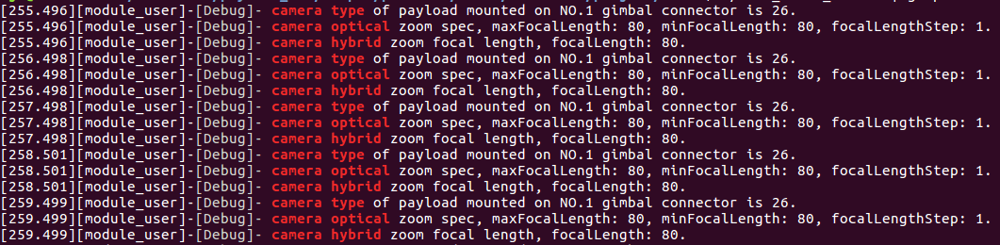

## 概述
负载协同是一种控制无人机上多个负载设备相互协作的工作模式，控制探照灯与相机协同，能够满足夜间搜寻任务对光照同步的需要；控制补光灯与变焦相机协同，能够满足巡查任务对精准补光的需要；控制可见光相机与光谱相机协同，能够满足检测任务对多带宽成像的需要。  

> **说明：** 用户通过DJI Pilot 能够控制挂载在DJI 无人机上的负载设备实现负载协同功能，详细步骤和说明请参见**支持**多负载协同功能的无人机的<a href="https://www.dji.com/cn/matrice-200-series-v2/info#downloads" target="_blank" rel="external">说明书或DJI Pilot</a>。

## 使用负载协同功能
无人机挂载的负载设备能够获取无人机其他云台上负载设备的参数信息，如相机的类型、焦距及变焦数据等，实现同步变焦等功能，此外，根据无人机挂载的负载设备的各项参数，如图像传感器尺寸，还能实现视场角同步等功能。   

> **注意** 
> * 使用PSDK 开发的具有拍照、录像和云台功能的负载设备，能够接收用户发送的控制命令，执行相同的动作，实现负载协同功能。

#### 1. 负载协同功能模块初始化
使用“负载协同”功能前，需要使用如下代码初始化负载协同功能，确保控制程序能够正确地获取负载设备上的信息。

```c
if (PsdkPayloadCollaboration_Init() != PSDK_RETURN_CODE_OK) {
    PsdkLogger_UserLogError("payload collaboration module init error");
    return PSDK_RETURN_CODE_ERR_UNKNOWN;
}
```

#### 2. 获取无人机上负载设备的信息

* 获取负载设备的类型
```
psdkStat = PsdkPayloadCollaboration_GetCameraTypeOfPayload(requestedPayloadMountPosition, &cameraType);
if (psdkStat != PSDK_RETURN_CODE_OK) {
    continue;
}
PsdkLogger_UserLogDebug("camera type of payload mounted on NO.%d gimbal connector is %d.",
                        requestedPayloadMountPosition, cameraType);
```

* 获取相机类负载设备的变焦参数

```c
psdkStat = PsdkPayloadCollaboration_GetCameraOpticalZoomSpecOfPayload(requestedPayloadMountPosition,
                                                                      &cameraOpticalZoomSpec);
if (psdkStat != PSDK_RETURN_CODE_OK) {
    continue;
}
PsdkLogger_UserLogDebug(
    "camera optical zoom specification of payload mounted on NO.%d gimbal connector, maxFocalLength: %d, minFocalLength: %d, focalLengthStep: %d.",
    requestedPayloadMountPosition, cameraOpticalZoomSpec.maxFocalLength,
    cameraOpticalZoomSpec.minFocalLength, cameraOpticalZoomSpec.focalLengthStep);
```

* 获取相机类负载设备的焦距

```c
psdkStat = PsdkPayloadCollaboration_GetCameraHybridZoomFocalLengthOfPayload(requestedPayloadMountPosition,
                                                                            &cameraHybridZoomFocalLength);
if (psdkStat != PSDK_RETURN_CODE_OK) {
    continue;
}
PsdkLogger_UserLogDebug(
    "camera hybrid zoom focal length of payload mounted on NO.%d gimbal connector, focalLength: %d.",
    requestedPayloadMountPosition, cameraHybridZoomFocalLength);
```

<div>
<div style="text-align: center"><p> 图1. 获取相机类负载设备的参数信息 </p>
</div>
<div style="text-align: center"><p><span>
      </span></p>
</div></div>

## 适配产品
<table id="t01">
  <thead>
    <tr>
      <th>功 能 </th>
      <td>负载同步控制</td>
      <td>负载同步变焦</td>
    </tr>
  </thead>
  <tbody>
    <tr>
      <th>产 品 </th>
      <td>M210 V2、M210 RTK V2、M300 RTK</td>
      <td>M210、M210 RTK、M210 V2、M210 RTK V2、M300 RTK</td>
    </tr>
    <tr>
      <th>负载相机</th>
      <td>ZENMUSE XT、ZENMUSE XT2；</br>ZENMUSE X7、ZENMUSE Z30；</br>ZENMUSE X4S、ZENMUSE X5S、ZENMUSE XT S；</br>ZENMUSE H20、ZENMUSE H20T</td>
      <td>ZENMUSE XT2、ZENMUSE X4S；</br>ZENMUSE X5S、ZENMUSE X7、ZENMUSE Z30；</br>ZENMUSE H20、ZENMUSE H20T</td>
    </tr>
  </tbody>
</table>

> **说明** 
> * 仅Matrice 300 RTK 支持使用ZENMUSE H20 和 ZENMUSE H20T。
> * 使用Matrice 200 V2 系列无人机时，请将使用PSDK 开发的负载设备挂载在无人机Ⅱ 号云台上，Ⅰ号云台只可挂载指定的<a href="#t01">负载设备</a>。  