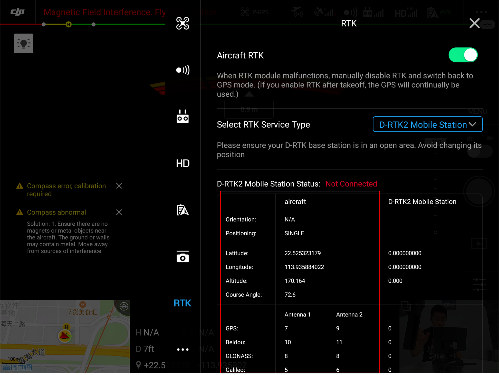
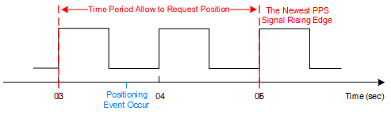
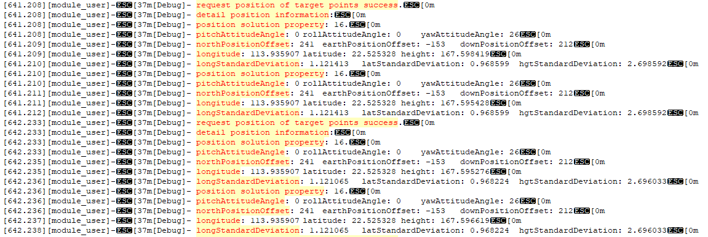

>**提示：** 在运行“精准定位”示例代码前，请使用DJI Pilot 或MSDK开发的APP 查看无人机与RTK 卫星间保持良好的通信状态，确保负载设备可获取精准的定位结果，如 图1. RTK信号状态 所示。  
<div>
<div style="text-align: center"><p>图1. RTK信号状态 </p>
</div>
<div style="text-align: center"><p><span>
      </span></p>
</div></div>
 
## 概述
为满足使用PSDK 开发的负载设备对厘米级精度的定位需求，DJI 支持开发者使用基准站（如D-RTK 2）和移动站（如M210 RTK V2），借助RTK（Real Time Kinematic，实时动态载波相位差分技术）获取无人机飞行姿态和高精度的定位信息。

## 基础概念  
#### 术语解释
* 目标点：实际获取到定位信息的位置，如云台口中心点。
  > **说明** ：M210 RTK V2的目标点为负载设备转接环上表面的中心点，该负载设备需要挂载在无人机I 号云台上。
* 兴趣点：由用户任意指定的负载设备上某一器件的位置，如相机图像传感器的中心点，该目标点也可以为兴趣点。
* 任务：多个连续的飞行动作集合称为一个任务，如对某个区域执行一次测绘任务。根据实际使用需要，用户可创建多个任务。
* 定位事件：触发定位请求的事件，如相机曝光时触发定位请求，则"相机曝光"是一个定位事件；多个事件的集合为事件集合，使用PSDK 开发的负载设备可同时请求多个定位事件发生时的位置信息，如相机协同曝光。

#### 获取精准定位
> **说明：** 获取精准定位时，需使用时间同步功能将负载设备的本地时间同步为无人机时间，有关使用时间同步功能的详细说明请参见[时间同步](./time-synchronization.html)。   

1. 定位事件发生时，负载设备需要会记录本地时间（该时间为负载设备上的时间）；
2. 负载设备通过时间转换功能，将负载设备上的时间转换为无人机上的时间；
3. 负载设备使用定位事件发生时的无人机时间（无人机系统的时间）请求位置。
>**说明:** 定位事件发生时的无人机时间（无人机系统的时间）应早于最新的PPS 信号上升沿时间，且时间间隔须小于2s，如 图2.获取精准定位 所示。  
 
<div>
<div style="text-align: center"><p>图2.获取精准定位 </p>
</div>
<div style="text-align: center"><p><span>
      </span></p>
</div></div>
 
获取目标点的位置后，根据目标点的位置，使用目标点与无人机RTK 主天线位置的偏移量、无人机的姿态、负载设备的结构等信息，能够计算兴趣点的位置。  

## 使用精准定位功能 

### 1. 定位功能模块初始化
使用“精准定位”功能前，需要先初始化精准定位功能模块，确保精准定位功能可正常运行。  

```c
psdkStat = PsdkPositioning_Init();
if (psdkStat != PSDK_RETURN_CODE_OK) {
    PsdkLogger_UserLogError("positioning module init error.");
    return psdkStat;
}
```

##### 设置任务编号
**建议**使用任务编号功能，方便用户在Mark 文件中快速查找到位置请求信息（未设置任务编号时，任务编号的默认值为0）。

```
PsdkPositioning_SetTaskIndex(0);
```

### 2. 请求并打印位置信息
用户触发精准定位功能后，负载设备将根据定位事件发生时的时间获取精准的定位信息。

1. 获取本地时间      
用户触发精准定位功能后，负载设备获取PPS 信号触发时负载设备上的本地时间。

```c
psdkStat = PsdkTest_TimeSyncGetNewestPpsTriggerLocalTimeUs(&ppsNewestTriggerTimeUs);
if (psdkStat != PSDK_RETURN_CODE_OK) {
    PsdkLogger_UserLogError("get newest pps trigger time error: %lld.", psdkStat);
    continue;
}
```

2. 时间转换     
将指定的定位事件发生时的负载设备上的本地时间转换为无人机系统的时间。

```c
for (i = 0; i < TEST_EVENT_COUNT; ++i) {
    eventInfo[i].eventSetIndex = s_eventIndex;
    eventInfo[i].targetPointIndex = i;

    psdkStat = PsdkTimeSync_TransferToAircraftTime(
        ppsNewestTriggerTimeUs - i * TEST_TIME_INTERVAL_AMONG_EVENTS_US, &aircraftTime);
    if (psdkStat != PSDK_RETURN_CODE_OK) {
        PsdkLogger_UserLogError("transfer to aircraft time error: %lld.", psdkStat);
        continue;
    }

    eventInfo[i].eventTime = aircraftTime;
}
```

3. 获取精准的定位信息      
完成时间同步后，用户即可获取并打印负载设备在某一时刻的精准位置，负载设备详细的位置信息如 图3. 定位详情 所示。

```c
psdkStat = PsdkPositioning_GetPositionInformationSync(TEST_EVENT_COUNT, eventInfo, positionInfo);
if (psdkStat != PSDK_RETURN_CODE_OK) {
    PsdkLogger_UserLogError("get position information error.");
    continue;
}

PsdkLogger_UserLogDebug("request position of target points success.");
PsdkLogger_UserLogDebug("detail position information:");
for (i = 0; i < TEST_EVENT_COUNT; ++i) {
    PsdkLogger_UserLogDebug("position solution property: %d.", positionInfo[i].positionSolutionProperty);
    PsdkLogger_UserLogDebug("pitchAttitudeAngle: %d\trollAttitudeAngle: %d\tyawAttitudeAngle: %d",
                            positionInfo[i].uavAttitude.pitch, positionInfo[i].uavAttitude.roll,
                            positionInfo[i].uavAttitude.yaw);
    PsdkLogger_UserLogDebug("northPositionOffset: %d\tearthPositionOffset: %d\tdownPositionOffset: %d",
                            positionInfo[i].offsetBetweenMainAntennaAndTargetPoint.x,
                            positionInfo[i].offsetBetweenMainAntennaAndTargetPoint.y,
                            positionInfo[i].offsetBetweenMainAntennaAndTargetPoint.z);
    PsdkLogger_UserLogDebug("longitude: %f\tlatitude: %f\theight: %f",
                            positionInfo[i].targetPointPosition.longitude,
                            positionInfo[i].targetPointPosition.latitude,
                            positionInfo[i].targetPointPosition.height);
    PsdkLogger_UserLogDebug("longStandardDeviation: %f\tlatStandardDeviation: %f\thgtStandardDeviation: %f",
                            positionInfo[i].targetPointPositionStandardDeviation.longitude,
                            positionInfo[i].targetPointPositionStandardDeviation.latitude,
                            positionInfo[i].targetPointPositionStandardDeviation.height);
}

s_eventIndex++;
```
<div>
<div style="text-align: center"><p>图3. 定位详情 </p>
</div>
<div style="text-align: center"><p><span>
      </span></p>
</div></div>

### 查询定位记录
请在无人机内的`cam_mark_file`文件中查看Mark 文件获取准确的定位信息，有关Mark 文件的详细说明请参见[Mark 文件简介](https://djisdksupport.zendesk.com/hc/zh-cn/articles/360024019493-Mark文件简介)。

## 适配产品
M210 RTK V2
