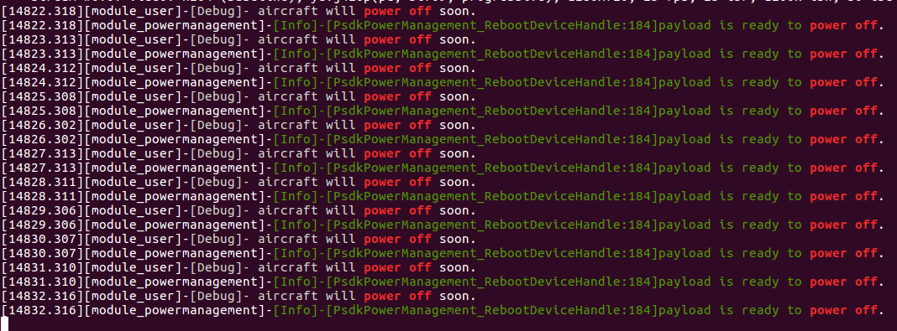

## 概述
将基于PSDK 开发的负载设备安装在无人机的云台上后，负载设备通过功率申请能获得较高的功率，因此，使用高功率的负载设备必须同时支持使用低功率；为防止负载设备未执行关机准备而丢失数据或意外损毁，PSDK 还提供了下发关机通知的功能。

* 当无人机获取到用户发送的关机通知时，无人机将向使用PSDK 开发的负载设备发送关机通知，同时等待获取负载设备关机的准备状态；
* 当负载设备接收到无人机发送的关机通知后，负载设备将完成关机前需执行的操作，如存储关键信息等，同时更改关机准备状态；
* 当无人机获取所有负载设备关机准备状态后，将会立即关机。
>**注意：** 无人机在接收到关机通知的一段时间后，将会强制关机，具体强制关机的时间请参见对应产品型号的<a href="https://www.dji.com/cn/products/enterprise?site=brandsite&from=nav#drones">说明书</a>。

## 使用电源管理功能
### 1. 引脚初始化
需要使用高功率的负载设备在申请高功率前，需要先初始化负载设备上用于申请高功率的引脚。

```c
static T_PsdkReturnCode PsdkTest_HighPowerApplyPinInit(void)
{
    GPIO_InitTypeDef GPIO_InitStructure;

    RCC_AHB1PeriphClockCmd(HIGH_POWER_APPLY_RCC, ENABLE);

    GPIO_InitStructure.GPIO_Mode = GPIO_Mode_OUT;
    GPIO_InitStructure.GPIO_PuPd = GPIO_PuPd_DOWN;
    GPIO_InitStructure.GPIO_Speed = GPIO_Speed_100MHz;

    GPIO_InitStructure.GPIO_Pin = HIGH_POWER_APPLY_PIN;
    GPIO_Init(HIGH_POWER_APPLY_Port, &GPIO_InitStructure);

    return PSDK_RETURN_CODE_OK;
}
```

### 2. 开发并注册改变负载设备引脚电平状态的函数
1.开发改变负载设备引脚电平状态的函数      
开发者开发出负载设备改变引脚电平状态的功能后，需要将改变负载设备引脚电平状态的函数注册到指定的接口中。

```c
static T_PsdkReturnCode PsdkTest_WriteHighPowerApplyPin(E_PsdkPowerManagementPinState pinState)
{
    BitAction action;
    switch (pinState) {
        case PSDK_POWER_MANAGEMENT_PIN_STATE_RESET:
            action = Bit_RESET;
            break;
        case PSDK_POWER_MANAGEMENT_PIN_STATE_SET:
            action = Bit_SET;
            break;
        default:
            PsdkLogger_UserLogError("pin state unknown: %d.", pinState);
            return PSDK_RETURN_CODE_ERR_UNKNOWN;
    }
    GPIO_WriteBit(HIGH_POWER_APPLY_Port, HIGH_POWER_APPLY_PIN, action);
    return PSDK_RETURN_CODE_OK;
}
```

2.注册改变引脚电平状态的函数     
注册改变负载设备引脚电平状态的函数后，用户能够控制负载设备改变引脚的电平状态。

```c
psdkStat = PsdkPowerManagement_RegWriteHighPowerApplyPinCallback(s_applyHighPowerHandler.pinWrite);
if (psdkStat != PSDK_RETURN_CODE_OK) {
    PsdkLogger_UserLogError("register WriteHighPowerApplyPinCallback error.");
    return psdkStat;
}
```

### 3.申请高功率
负载设备调用`PsdkPowerManagement_ApplyHighPowerSync()`接口后，负载设备能够向无人机申请高功率，高功率申请完成后，可使用电压表等仪器测量SkyPort-2.0 和X-Port 指定接口的电压。

```c
psdkStat = PsdkPowerManagement_ApplyHighPowerSync();
if (psdkStat != PSDK_RETURN_CODE_OK) {
    PsdkLogger_UserLogError("apply high power error");
    return psdkStat;
}
```

## 使用关机通知功能

#### 1.构造关机状态回调函数  
开发者开发出负载设备执行关机准备的功能后，需要将负载设备执行关机准备功能的函数注册到指定的接口中。

```c
static T_PsdkReturnCode PsdkTest_PowerOffNotificationCallback(bool *powerOffPreparationFlag)
{
    PsdkLogger_UserLogDebug("aircraft will power off soon.");
    *powerOffPreparationFlag = true;
    return PSDK_RETURN_CODE_OK;
}
```

#### 2.注册回调函数  
注册负载设备关机准备功能的函数后，负载设备在接收到关机通知后，将执行关机准备动作，并更改负载设备的关机准备状态，如 图1. 关机信息 所示。

```c
psdkStat = PsdkPowerManagement_RegPowerOffNotificationCallback(PsdkTest_PowerOffNotificationCallback);
if (psdkStat != PSDK_RETURN_CODE_OK) {
    PsdkLogger_UserLogError("register power off notification callback function error");
    return psdkStat;
}
```

<div>
<div style="text-align: center"><p>图1. 关机信息 </p>
</div>
<div style="text-align: center"><p><span>
      </span></p>
</div></div>
 