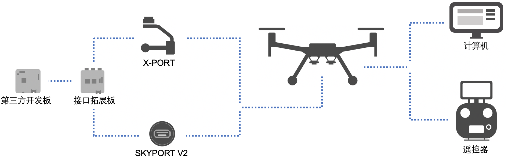
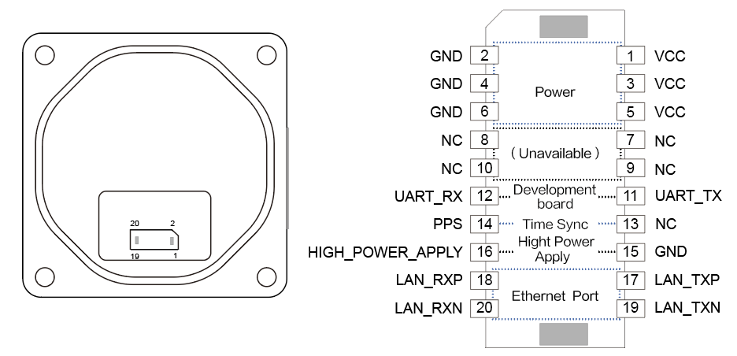
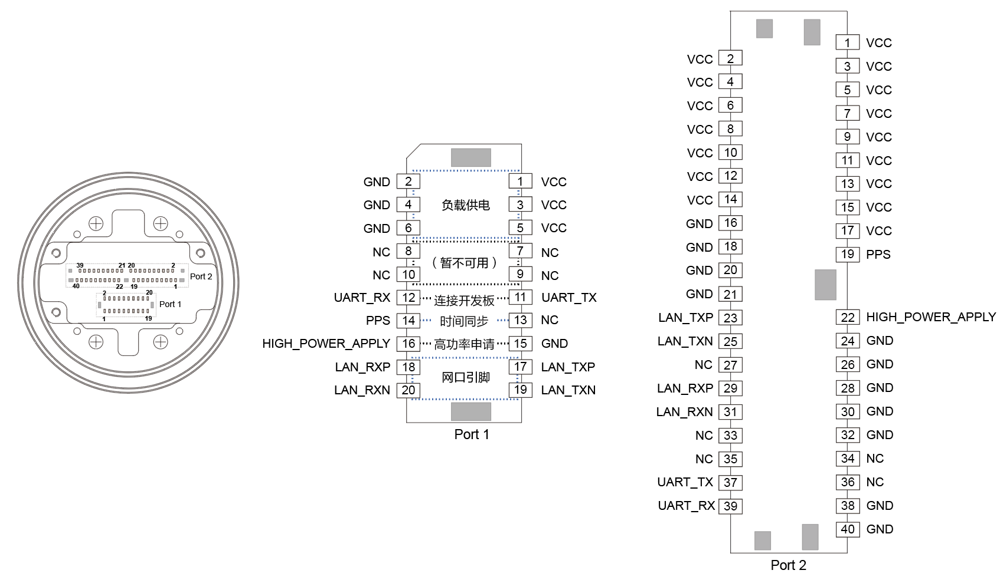
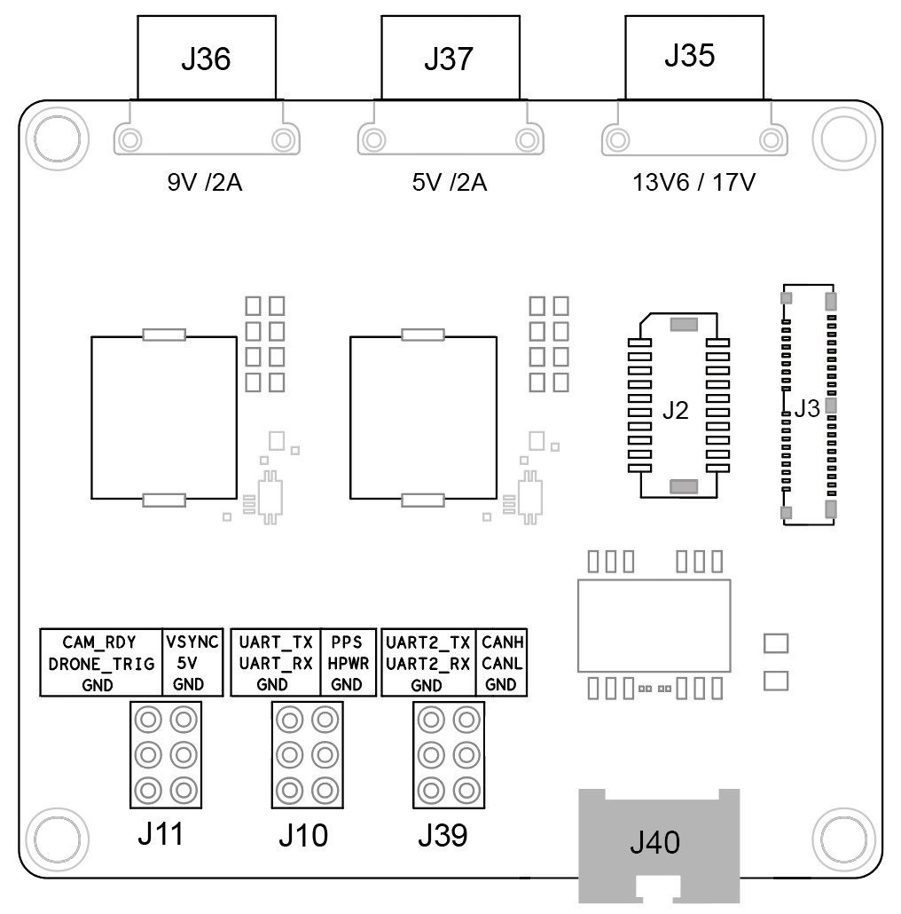

使用X-Port 或Skyport V2 开发负载设备时，请按本文引导连接硬件平台、负载设备开发板、接口拓展板和DJI 的无人机，如 图1.设备连接 所示。
> **说明：** 本文档**未描述的硬件接口**将逐步开放，敬请关注。

图1.设备连接

      

> **提示**
> * 请根据所购机型[说明书](https://www.dji.com/cn/downloads)中的指导连接无人机和遥控器。
> * 有关硬件平台参数的详细说明请参见[“选购硬件平台”](../guide/hardware.html)。
> * 若您仍使用**PSDK V1.x.x 和 Skyport** 开发负载设备，请根据压缩包中“PSDK 1.5.0”的文档连接Skyport 和负载设备开发板。

## 使用X-Port
#### X-Port 引脚说明
X-Port提供了排线接口，使用排线可将X-Port 连接至接口拓展板或第三方开发板。X-Port 标准云台的引脚如 图2. X-Port 标准云台引脚接口 所示。  

图2. X-Port 标准云台引脚接口

      

* 使用X-Port 的供电功能，请使用引脚：1～６；
* 为实现使用X-Port 开发的负载设备与DJI 的无人机通信，**必须**连接引脚：11和12；
* 使用PSDK 提供的时间同步功能，需要连接PPS 引脚（14）与**具有RTK 功能的无人机**间同步时间；
* 使用高功率功能的负载设备通过引脚15 和16 向DJI 的无人机申请高功率；
* 使用网口高速数据传输功能，需连接引脚17～20。

#### 安装负载设备
1. 安装主轴臂：使用四颗M2×12 的螺丝锁定负载设备，负载设备上对应螺纹孔的深度不小于5.3 mm。
2. 安装辅轴臂：使用一颗M3 螺丝、辅轴臂套筒和辅轴臂胶塞锁定辅轴臂。确保M3螺丝穿过俯仰轴中心轴线。
3. 负载设备质心位置
   * 质心位置不变的负载，需保证负载设备的质心位于俯仰轴中心轴线上；
   * 质心位置可变的负载设备如变焦相机，需保证当变焦镜头在最大变焦倍数时，相机的质心位于P轴的轴线上。

## 使用Skyport V2

Skyport V2 提供了排线接口和同轴线接口，使用排线通过Port 1 接口可将Skyport V2 连接至接口拓展板或第三方开发板；使用同轴线通过Port 2 接口可将Skyport V2 连接至Skyport 负载设备开发板；Skyport V2 的引脚如 图3.Skyport V2 引脚接口 所示。  
> **注意：** 请勿同时使用Port 1 和Port 2。

图3. Skyport V2 引脚接口

      

##### Port 1
* 使用Skyport V2 的供电功能，请使用引脚：1～６；
* 为实现使用Skyport V2 开发的负载设备与DJI 的无人机通信，**必须**连接引脚：11和12；
* 使用PSDK 提供的时间同步功能，需要连接PPS 引脚（14）与**具有RTK 功能的无人机**间同步时间；
* 使用高功率功能的负载设备通过引脚15 和16 向DJI 的无人机申请高功率；
* 使用网口高速数据传输功能，需连接引脚17～20。

##### Port 2

* 使用Skyport V2 的供电功能，请使用引脚：1～17；
* 为实现使用Skyport V2 开发的负载设备与DJI 的无人机通信，**必须**连接引脚：37和39；
* 使用PSDK 提供的时间同步功能，需要连接PPS 引脚（19）与**具有RTK 功能的无人机**间同步时间；
* 使用高功率功能的负载设备通过HIGH_POWER_APPLY 引脚（22） 向DJI 的无人机申请高功率；
* 使用高速数据传输功能，需连接引脚23、25、29 和31。

## 使用接口拓展板
开发者使用接口拓展板，能够接入第三方开发板，开发出类型丰富的负载设备，接口拓展板的接口如 图4.接口拓展板接口 所示，有关接口拓展板接口的详细说明请参见 表1.接口拓展板接口说明。  

   

      

图4.接口拓展板接口  

      

      

      

      

    

表1.接口拓展板接口说明

<table id="interface parameters">
  <thead>
    <tr>
      <th>接口编号</th>
      <th>接口类型</th>
      <th>引脚名称</th>
      <th>功能说明</th>
    </tr>
  </thead>
  <tbody>
   <tr>
      <td>J2</td>
      <td>排线接口</td>
      <td rowspan=2>-</td>
      <td>通过该接口，将接口拓展板连接至Skyport V2 或X-Port</td>
    </tr>
    <tr>
      <td>J3</td>
      <td>同轴线接口</td>
      <td>通过该接口，将接口拓展板连接至Skyport V2 或  
Skyport 开发套件中的负载设备开发板 </td>
    </tr>  
    <tr>
      <td rowspan=3 >J10</td>
      <td rowspan=3>引脚</td>
      <td>UART_TX；UART_RX</td>
      <td>通过该接口将接口拓展板连接至第三方开发板 </td>
    </tr>
    <tr>
      <td>PPS</td>
      <td>第三方开发板通过该引脚与<b>具有RTK 功能的无人 机</b>间同步时间</td>
    </tr>
    <tr>
      <td>HPWR</td>
      <td>第三方开发板通过该引脚向无人机申请高电压</td>
    </tr>
    <tr>
      <td>J35</td>
      <td rowspan=3>电源输出接口</td>
      <td rowspan=3>-</td>
      <td>接口拓展板输出13.6V/4A 或 17V/4A 电压</td>
    </tr>
    <tr>
      <td>J36</td>
      <td>接口拓展板输出9V/2A 电压</td>
    </tr>
    <tr>
      <td>J37</td>
      <td>接口拓展板输出5V/2A 电压</td>
    </tr>
    <tr>
      <td>J40</td>
      <td>网络接口</td>
      <td>-</td>
      <td>开发者通过该接口可获得负载设备上的视频流和用户自定义的数据信息</td>
    </tr>
  </tbody>
</table>

## 连接开发板
#### 运行RTOS 示例代码
按照RTOS 示例代码中的串口配置项，将STM32F407xG 连接至接口拓展板。

> **说明：** 如需使用其他型号的开发板，请先在Hal 文件中修改配置参数，详细操作请参见[跨平台移植](../tutorial/transplant.html)。

 * 与X-Port 或Skyport V2 通信：`PA2(TX)`和`PA3(RX)`
 * 与计算机通信：`PC10(TX)`和`PC11(RX)`
 * 使用时间同步功能：`PD2`
 * 申请高功率：`PD1`
 * 波特率：921600

#### 运行Linux 示例代码
使用**USB 转串口模块**或**网线**将Manifold 2-C 连接至接口拓展板。

* 使用USB 转串口模块：将USB 转串口模块连接至接口拓展板`UART_TX`和`UART_RX` 引脚上。
* 使用网线：使用网线连接第三方开发板和接口拓展板。
