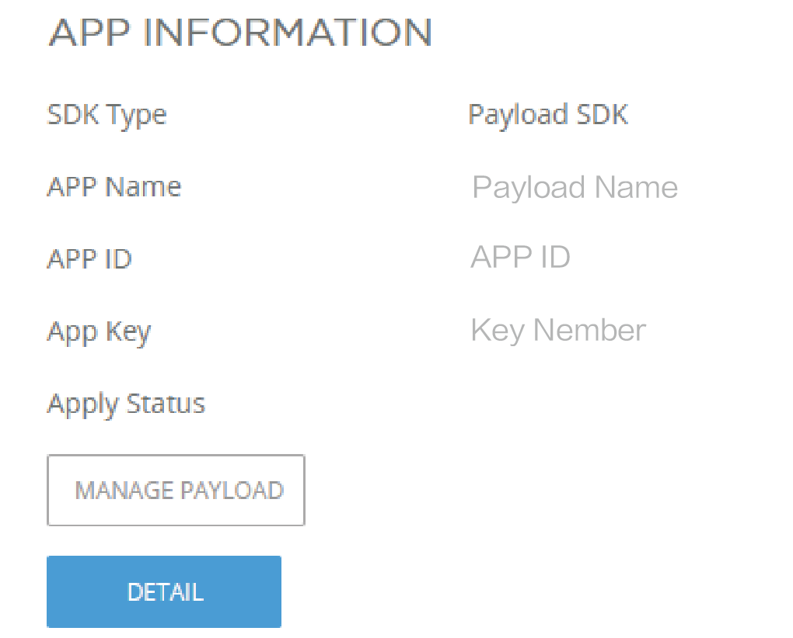
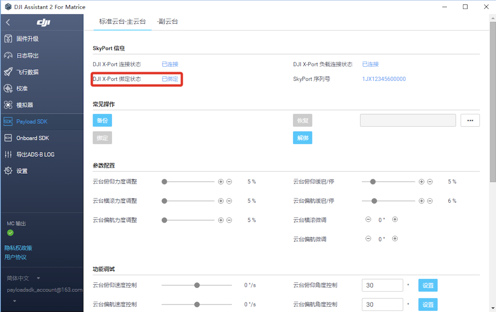

在注册PSDK 企业账号后，请下载PSDK 提供的示例代码并在示例代码中补充应用信息，通过编译、调试和烧录等操作获得示例程序。在DJI Assistant 2 上绑定DJI 的硬件平台后，即可运行示例程序，借助示例程序了解使用PSDK 开发负载设备的方法。

> **提示：** 如需将RTOS 或Linux 的示例代码运行在其他开发板或操作系统中，请参考 [跨平台移植](../tutorial/transplant.html)。  

## 1. 获取示例代码
借助示例代码即可了解使用PSDK 开发负载设备的方法，借助示例代码，开发者能够快速开发出功能完善的出负载设备。

在 <a href="https://developer.dji.com/payload-sdk/apply/" target="_blank">注册</a>成为DJI PSDK 的企业用户后，即可下载DJI PSDK 开发包，在PSDK 开发包中获取DJI 提供的示例代码。

## 2. 补充应用信息
获取使用PSDK 开发负载产品的[权限](https://developer.dji.com/payload-sdk/apply) 后，请在[用户中心](https://developer.dji.com/user/apps/#all) 创建应用程序，获取应用ID 和应用秘钥，如图1.填写应用信息 所示。
<div>
<div style="text-align: center"><p>图1. 填写应用信息</p>
</div>
<div style="text-align: center"><p><span>
      </span></p>
</div></div>

> **注意：** 为提高您的开发效率，请在示例代码中**正确**填写*应用的名称*、*ID*、*Key*和*用户账号*，否则编译后的示例程序将无法正常运行。

#### 在RTOS 示例代码中补充应用信息

* 使用Keil IDE 运行工程文件     
工程文件所在的目录：`sample/stm32f4_eval/Projects/mdk_release/psdk_demo.uvprojx` 

>**说明：** RTOS 的示例代码以**STM32F407IGH6-EVAL** 开发板为负载设备。

* 填写应用信息     
在 `sample/stm32f4_eval/Application/app_info.h` 文件中替换应用的名称、ID、Key和用户账号：

```
#define USER_APP_NAME               "your_app_name"
#define USER_APP_ID                 "your_app_id"
#define USER_APP_KEY                "your_app_key"
#define USER_DEVELOPER_ACCOUNT      "your_developer_account"
```

#### 在Linux 示例代码中补充应用信息
>**说明：** Linux 的示例代码以Manifold 2-C 为负载设备，该示例代码也可直接运行在Manifold 2-G 上。

* 在 `sample/manifold2/Application/app_info.h` 文件中替换应用的名称、ID、Key和开发者账号：
```
#define USER_APP_NAME               "your_app_name"
#define USER_APP_ID                 "your_app_id"
#define USER_APP_KEY                "your_app_key"
#define USER_DEVELOPER_ACCOUNT      "your_developer_account"
```

* 在 `sample/manifold2/Application/platform/hal_uart.c` 文件的 `LINUX_UART_DEV` 宏中填写串口名称。

```
#define LINUX_UART_DEV   "dev/your_com"
```

## 3. 编译调试

#### RTOS：
* 使用Keil MDK 编译示例代码为示例程序
* 配置串口调试工具的波特率：`Baud Rate: 921600`
> **说明：** 编译示例代码后，请将编译后的程序**烧录**到负载设备中（如STM32F407IGH6-EVAL）。


#### Linux
* 获取串口访问权限     
在终端中使用 `sudo chmod 777 /dev/xxx`命令获取串口设备访问权限。
>**说明：** xxx为串口的名称。

* 编译示例代码      
进入示例代码的目录： `sample/manifold2`，使用如下命令将示例代码编译为示例程序。
	1. `mkdir build`
  2. `cd build`
	3. `cmake -DCMAKE_BUILD_TYPE=Release ..`
	4. `make`

* 执行示例程序       
  * 进入示例程序的目录： `sample/manifold2/build/demo_linux_ubuntu`
  * 使用`./demo_linux_ubuntu`命令运行示例程序  

## 4. 应用绑定
通过DJI Assistant 2 将负载设备绑定到DJI 的无人机后，负载设备将运行示例程序。

> **注意：** 使用DJI Assistant 2 调试负载设备时，请先在软件右上角的“配置”标签中打开 **“数据授权”** 开关，否则DJI Assistant 2 将无法正常调试负载设备。

1. 将负载设备（如Manifold 2-C）或开发板（如STM32F407IGH6-EVAL）挂载在DJI 的无人机上，同时将DJI 的无人机连接到计算机；
2. 使用**应用信息**中的**账号**登陆DJI Assistant 2 ，单击“Payload SDK ”选项卡，进入PSDK 硬件平台界面；
3. 在PSDK 硬件平台界面，单击“绑定”按钮，实现硬件平台、示例程序和DJI 无人机的绑定；
4. 绑定成功后，PSDK 硬件平台界面中的绑定状态将显示为`已绑定`，如 图2. 应用绑定 所示；
5. 应用绑定成功后，负载设备将自动运行示例程序。

<div>
<div style="text-align: center"><p>图2. 应用绑定</p>
</div>
<div style="text-align: center"><p><span>
      </span></p>
</div></div>


### 绑定故障排查
#### Skyport 故障排查
<table id="3">
  <thead>
    <tr>
      <th>错误代码</th>
      <th>错误说明</th>
      <th>解决方案</th>
    </tr>
  </thead>
  <tbody>
    <tr>
      <td>1</td>
      <td>无法获取负载信息</td>
      <td>1. 确认硬件平台正常连接</br>2. 确认基于PSDK 开发的负载设备控制程序已正常运行</td>      
    </tr>
    <tr>
      <td>2</td>
      <td>开发者账号非法</td>
      <td>请确认应用程序中的用户信息与绑定转接环的用户信息相同</td>
    </tr>
    <tr>
      <td>3</td>
      <td>无法获取认证信息</td>
      <td rowspan=5>请将负载设备中的日志信息提交给DJI 技术支持团队排查相应的问题</td>  
    </tr>
    <tr>
      <td>4</td>
      <td>Skyport 校验失败</td>
    </tr>
    <tr>   
      <td>5</td>
      <td>认证信息错误</td>
    </tr>
       <tr>   
      <td>6</td>
      <td>存储绑定信息失败</td>
    </tr>
       <tr>   
      <td>7</td>
      <td>无法获取SN 号</td>
    </tr>
    </tbody>
</table>

#### 应用服务故障排查
<table id="3">
  <thead>
    <tr>
      <th>错误代码</th>
      <th>错误说明</th>
      <th>解决方案</th>
    </tr>
  </thead>
  <tbody>
    <tr>
      <td>400</td>
      <td>SN 不存在</td>
      <td rowspan=5>请将负载设备中的日志信息提交给DJI 技术支持团队排查相应的问题</td>         
    </tr>
    <tr>
      <td>500</td>
      <td>服务器异常</td>
    </tr>
    <tr>
      <td>700</td>
      <td>未找到负载设备的应用程序</td>
    </tr>
    <tr>
      <td>701</td>
      <td>数据校验失败</td>
    </tr>
    <tr>   
      <td>702</td>
      <td>绑定关系错误</td>
    </tr>
       <tr>   
      <td>703</td>
      <td>绑定数量超过限制</td>
      <td>在开发模式下，每个用户最多可绑定10个负载设备控制程序</td>
    </tr>
    </tbody>
</table>

#### 调参软件故障排查
<table id="3">
  <thead>
    <tr>
      <th>错误代码</th>
      <th>错误说明</th>
      <th>解决方案</th>
    </tr>
  </thead>
  <tbody>
    <tr>
      <td>3</td>
      <td>网络异常</td>
      <td>请确认您的计算机能够访问互联网</td>   
    </tr>
    <tr>
      <td>4</td>
      <td>调参软件错误</td>
      <td rowspan=2>重新安装调参软件或重新启动计算机</td>   
    </tr>
    <tr>
      <td>5</td>
      <td>FTP 错误</td>
    </tr>
    </tbody>
</table>