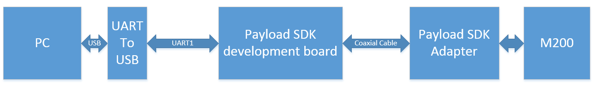
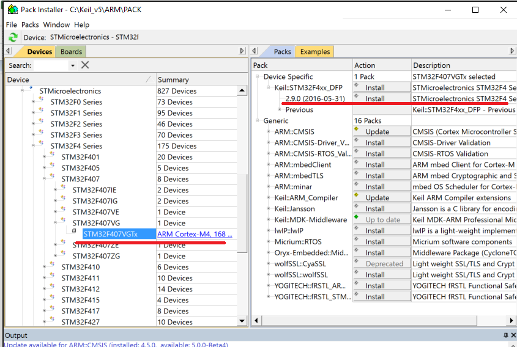
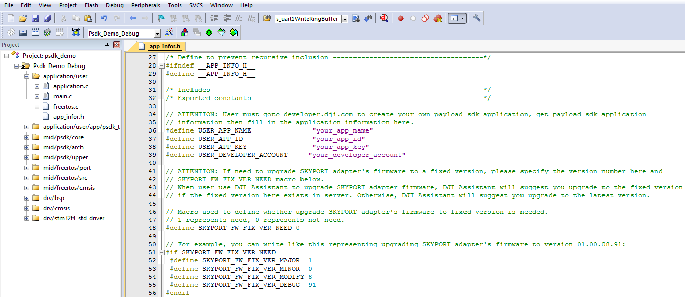
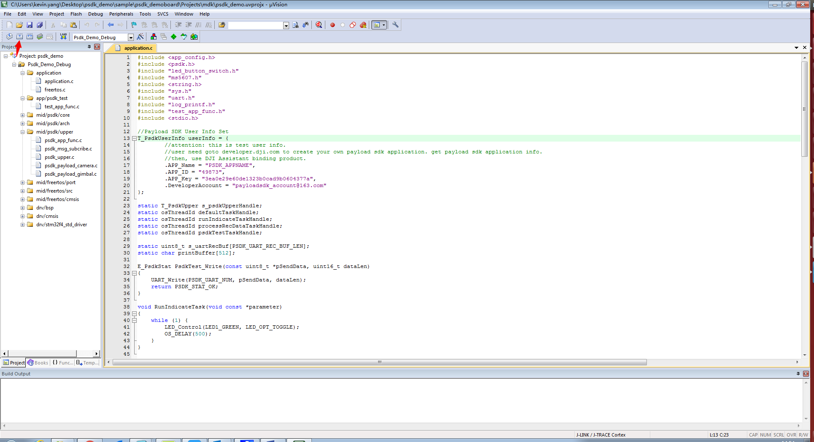
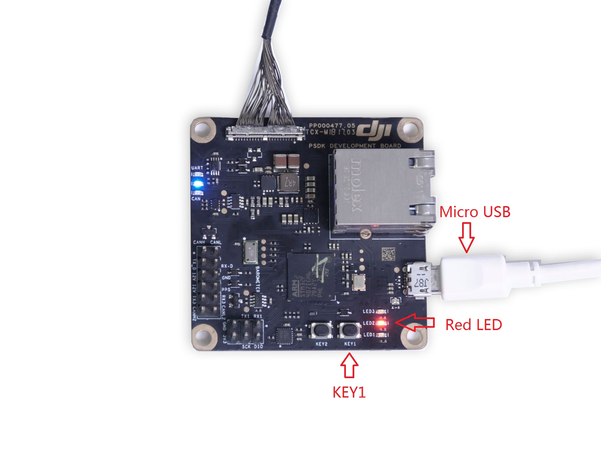
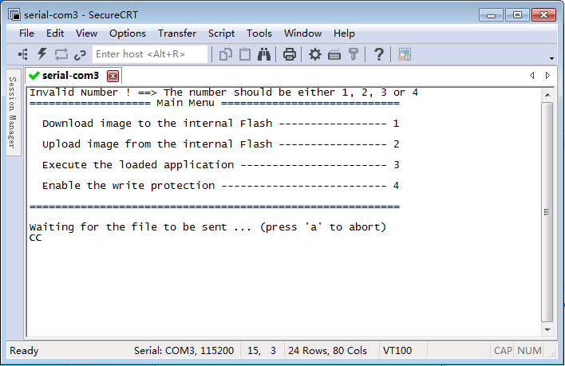
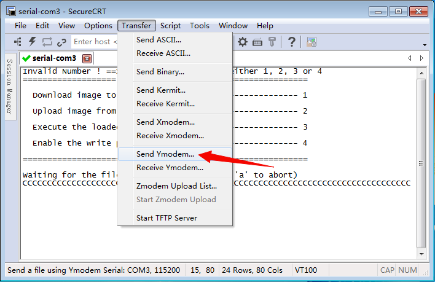

This page shows how to build and flash the Payload SDK Demo Application firmware to the PSDK development board.

For your own application, the steps will be very similar: follow the same outline as this document describes, but replace the path to the demo project with your own project path.

Currently for the build and flash process, we only support the Keil MDK with the armcc compiler. 

1. Connect the system, as shown in the following setup diagram:

Connect the SKYPORT adapter to M200. Use the coaxial cable to connect the adapter to the Payload SDK development board. The firmware of the Payload SDK development board uses Micro USB port to communicate with the computer. 

2. Power on the M200, and make sure the SKYPORT Adapter is firmly connected to the aircraft. (The red dots on the adapter and the aircraft should line up). If the connection is set up correctly, a blue LED on Payload SDK development board will turn on. 

3. Download the Payload SDK development package from the [USER CENTER](https://developer.dji.com/user/apps/#all).

4. Config the Payload SDK Development board toolchain. You will need [Keil MDK](http://www2.keil.com/mdk5/) >5.22, and a license for it. Then use Keil's `Pack Installer` to install the latest STM32F4xx_DFP.2.x.x pack, as shown below. (Alternatively, you can download manually from <a href="http://www.keil.com/dd2/Pack/" target="_blank">http://www.keil.com/dd2/Pack/</a> and import the downloaded file from Pack Installer.)

5. Open the project located in `sample/psdk_development_board/Projects/mdk/psdk_demo.uvprojx` in Keil uVision IDE.

6. To build the code, input your Payload SDK App name, App ID, App Key and Payload SDK enterprise account obtained from DJI Developer in the `sample/psdk_development_board/Application/app_infor.h` file.

7. Build firmware for Payload SDK development board. After the build completes, you can see a binary file (`psdk_demo.bin`) in `sample/psdk_development_board/Projects/mdk`

8. Hold down the button labeled KEY1 on the Payload SDK development board, then restart M200. After restart, you can see the red LED on the Payload SDK development board lights up. Then, you can release KEY1.

9. Using SecureCRT, open the UART1 port (115200 8N1). Press Enter, you can see the Main Menu. Then press 1 to download image to the internal flash.

10. Send `sample/psdk_development_board/Projects/mdk/psdk_demo.bin` file using Ymodem. 

11. After successfully flashing the image to your Payload SDK development board, press 3 in SecureCRT to execute the application. Then, the green led (LED1) on the PSDK board will start blinking.
