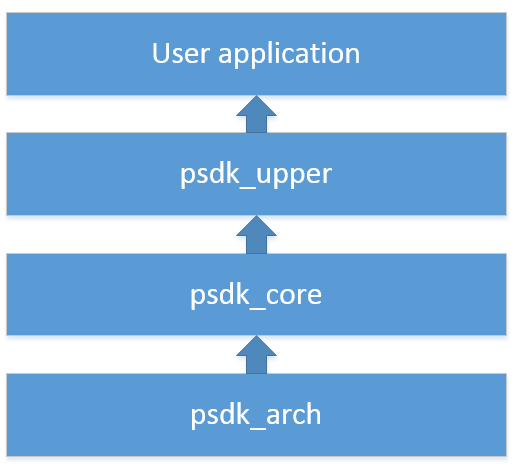

## Software architecture of Payload SDK

- User Application Layer : The user's application.
- PSDK Upper Layer : PSDK function layer. A user can call this layer interface to use PSDK functionalities.
- PSDK Core Layer : PSDK low layer functions to deal with protocol parse, protocol package and debugging.
- PSDK Arch Layer : PSDK platform wrapper layer to port payload SDK to different platforms.

## Run Payload SDK
The initialization functions of the Payload SDK are provided in the file "Payload_SDK/psdk_upper/inc/psdk_upper.h file" of the SDK. You can refer to the function interface description to incorporate and establish the Payload SDK running environment for your application.

## Use Payload SDK features
The major interface header files for various features in the folder "Payload_SDK/psdk_upper/inc" of the SDK are listed as follows:

•	psdk_app_func.h: provides the functions related to mobile SDK communications and DJI Pilot custom control features.
 
•	psdk_msg_subcribe.h: provides the message subscription feature for users to subscribe to GPS, time, UAV location and pose and other UAV system information. 

•	psdk_payload_camera.h: provides the camera payload development interfaces. DJI Pilot supports camera payload interfaces and the mobile SDK provides interfaces for the camera payloads. 

•	psdk_payload_gimbal.h: provides the gimbal development interfaces. DJI Pilot supports gimbal interfaces and the mobile SDK provides interfaces for the gimbal.

## Payload SDK Port
The examples for porting the Payload SDK to the MCU STM32F407IG FreeRTOS and a Linux system are available. Payload SDK is provided in source code. You can try to port the Payload SDK example to your own payload platform.  See "Payload_SDK/psdk_arch/arch_template/psdk_arch_sys.h" and "Payload_SDK/psdk_arch/arch_template/psdk_arch_sys.c" to learn how to port the Payload SDK.
