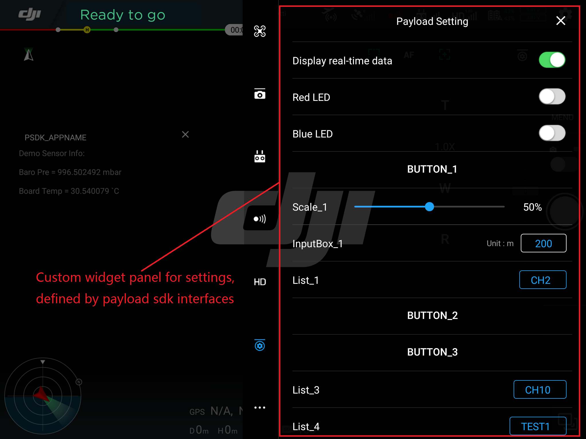

## DJI Developer Ecosystem

The DJI Payload SDK adds to the growing developer ecosystem that includes the [Mobile SDK](https://developer.dji.com/mobile-sdk/documentation/introduction/index.html), [Onboard SDK](https://developer.dji.com/onboard-sdk/documentation/introduction/homepage.html) and various applications/tools including [DJI Pilot](http://dl.djicdn.com/djipilot-official.apk) and [DJI Assistant 2](https://www.dji.com/matrice-200-series/info#downloads).

- The Payload SDK is your SDK of choice when you want to add sensing to the aircraft.
- The PSDK integrates with the Mobile SDK tightly to provide a native experience for users of Mobile SDK applications.
- Onboard SDK integration with the PSDK is coming soon!

## DJI Pilot Support

## Mobile SDK Support
Mobile SDK provides interfaces for interacting with PSDK data. 

Mobile SDK supports the following functions related to PSDK:

- Direct data transmission interface.
- Network port downlink data transmission interface.
- Network port transmission of the fixed format H264 code stream analysis.
- Payload SDK camera and gimbal interface support. 

## DJI Assistant Support
DJI Assistant provides SKYPORT adapter configuration features as below:

- Set to bind or unbind the adapter with the application
- Set the SKYPORT adapter channel and channel baud rate
- Set the SKYPORT adapter push data frequency
- SKYPORT Adapter firmware update can also be done through the Assistant software

Enterprise users can use their Payload SDK account to login the DJI Assistant and configure the SKYPORT Adapter on the SKYPORT’s configuration page.
