To have a better experience of learning how to mount a payload device, please check this  <a href="https://www.skypixel.com/videos/dji-payload-sdk-mounting-a-payload-device-89abebc6-6f7f-48dd-b855-fba7f6288a96" target="_blank">Mounting a Payload Device Video</a>.

## Disassembly Guide

### 1. The following figure shows the DJI SkyPort.
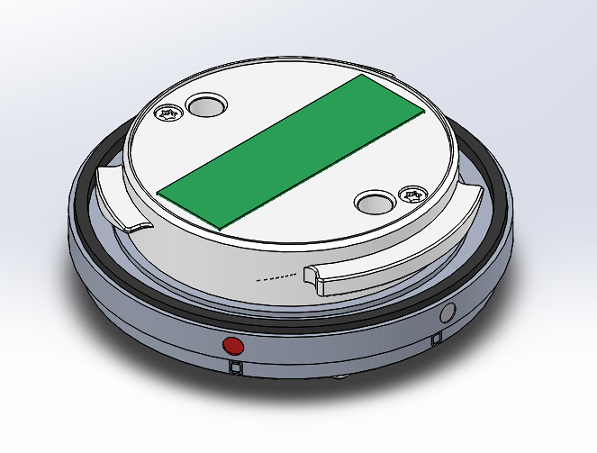

### 2. Unscrew the two screws in the following figure, and remove the cap flashing.
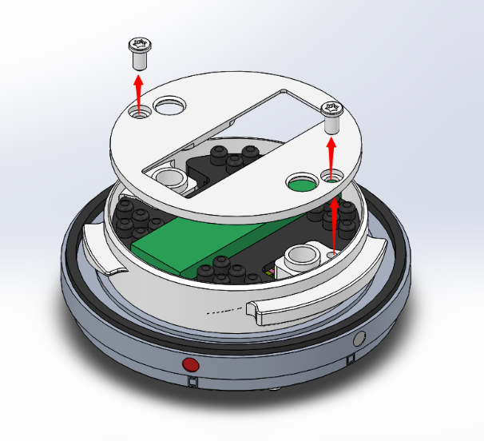

### 3. Remove the silicone pad.
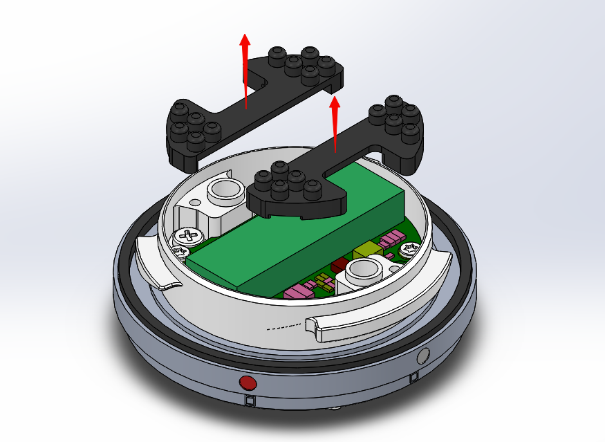

### 4. Unscrew the four screws in the the following figure (do not unscrew the four PCBA-locking screws) and remove the metal ring fixed on the PCBA.
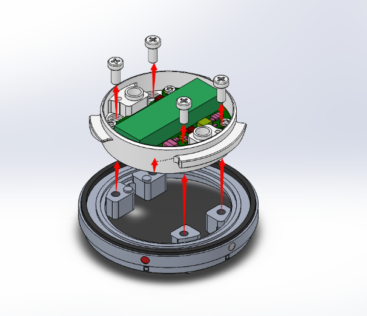

### 5. Remove the pressure ring in the center of the following figure, and do not remove the rubber ring.
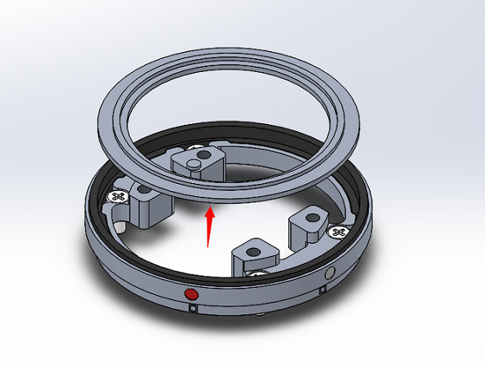

### 6. The four screws shown in the following figure are used to mount your own payload devices. Your payload should have M2.5 screwed holes with the minimum depth of 3.5 mm.
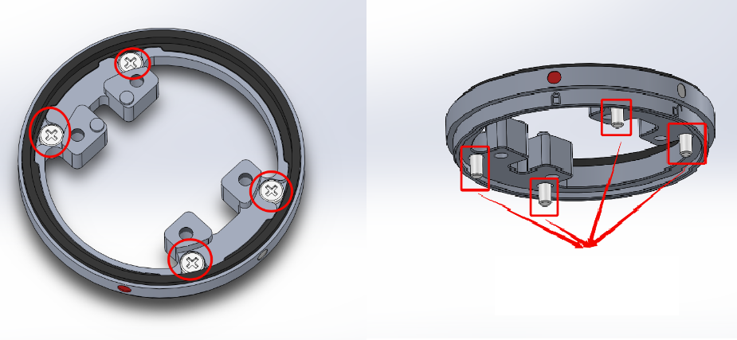

## Assembly Guide

### 1.  Mount the metal ring (pressure piece), while making sure that the rubber ring remains in its original place without being misaligned; press the the metal ring downward to make sure that the device is mounted in the place. 
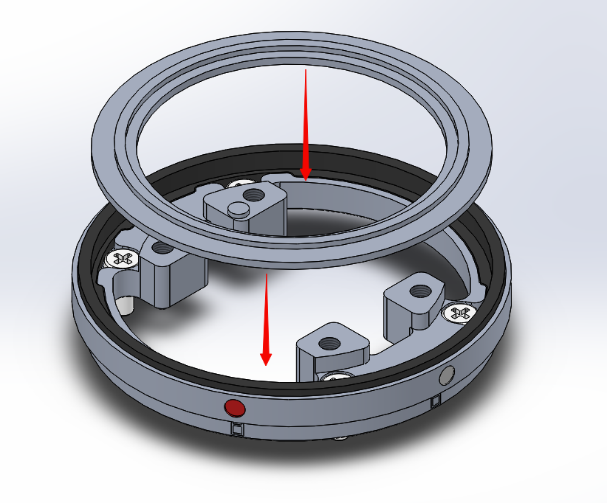

### 2. Mount the PCBA metal ring (Note that:  the pin in the left figure needs ro be aligned with the pin hole in the right figure).
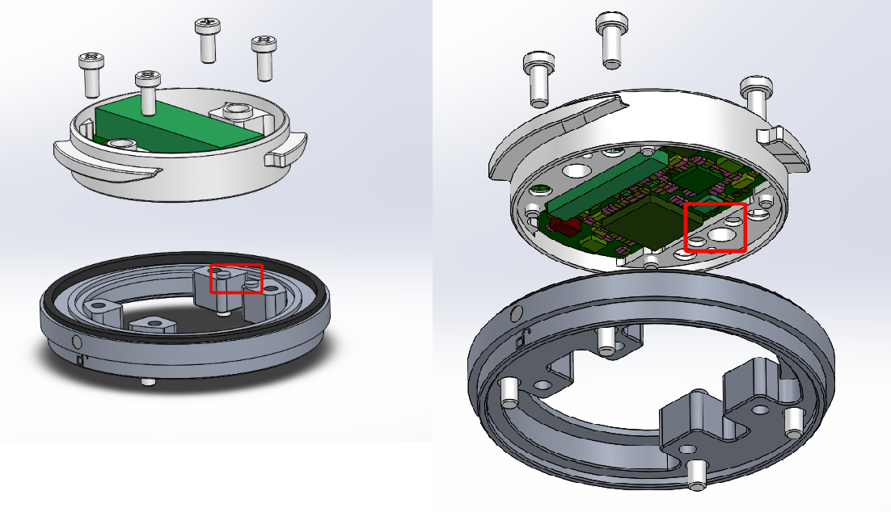

### 3.  Screw the four screws tightly, as shown in the figure below.
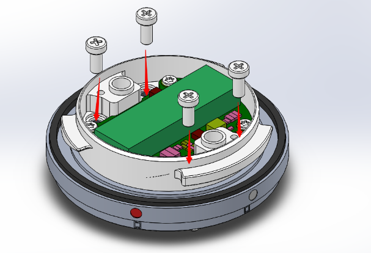

### 4. Mount the two silicone pads, as shown in the figure below.
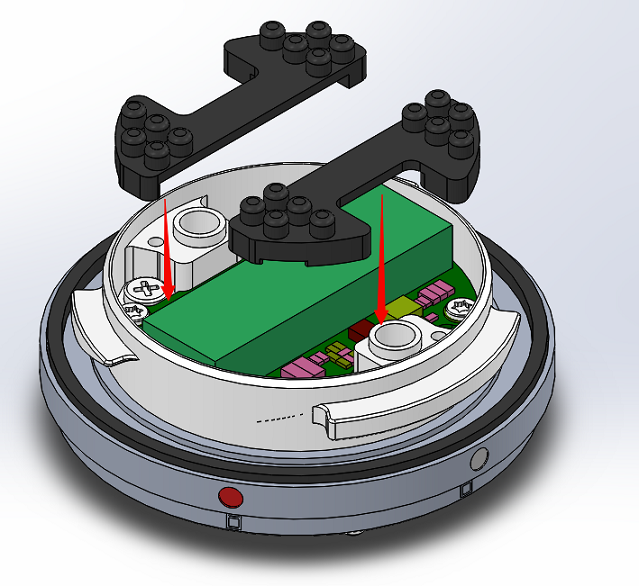

### 5. Mount the cap flashing, and screw the screws tightly.
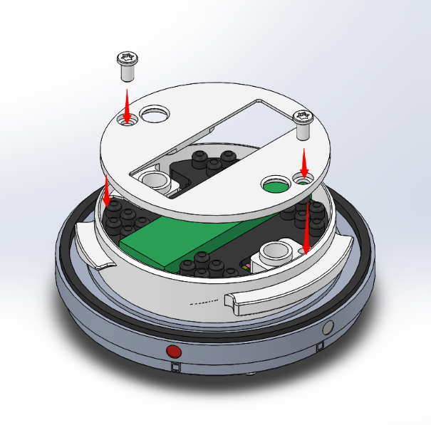
