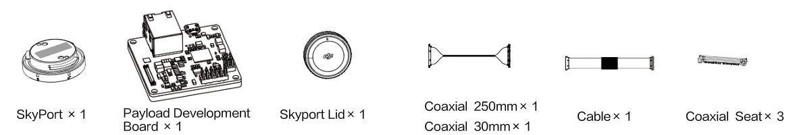

> **NOTE** 
> * This article is **Machine-Translated**. If you have any questions about this article, please send an <a href="mailto:dev@dji.com">E-mail </a>to DJI, we will correct it in time. DJI appreciates your support and attention.
> * X-Port and SkyPort V2 only support **PSDK V2.x.x**.
> * SkyPort only supports **PSDK V1.x.x**.
> * DJI recommended developers use **PSDK V2.xx** with **X-Port** or **SkyPort V2** to develop payload.

Developers use the X-Port or SkyPort could obtain the resources from DJI‘s drone to develop the payload such as cameras, searchlights, and radar, etc.

## Development Kit

#### X-Port <a href="https://store.dji.com/product/dji-x-port">（Purchase）</a>
To use the X-Port, parts in [Payload SDK Development Kit 2.0](https://store.dji.com/product/psdk-development-kit-v2) and API could help developers develop the payload which has gimbal's functions more easily.

      

#### SkyPort V2
Using the Expansion-Board, developers can choose third-party development boards to develop payload.     
<a href="https://store.dji.com/product/psdk-development-kit-v2">SkyPort V2 </a>includes components is as follows:

      

> **NOTE:** The value meal for the mass production stage to purchase the <a href="https://store.dji.com/product/dji-skyport-adapter-set-v2">DJI SKYPORT Adapter Set</a>.

#### SkyPort
Using the payload development-board, developers do not need to purchase a third-party development board.     
<a href="https://store.dji.com/product/psdk-development-kit">SkyPort</a> includes components is as follows:  

      

> **NOTE:** The value meal for the mass production stage to purchase the <a href="https://store.dji.com/product/psdk-ribbon-cable-set">PSDK Ribbon Cable Set
</a>and <a href="https://store.dji.com/product/dji-skyport-adapter-set">DJI SKYPORT Adapter Set</a>.

## Compared
<table id="t1">
  <thead>
    <tr>
      <th style="border:none">   </th>
      <th style="border:none;text-align:center">X-Port</th>
      <th style="border:none;text-align:center">SkyPort V2</th>
      <th style="border:none;text-align:center">SkyPort </th>
    </tr>
  </thead>
  <tbody>
    <tr style="text-align:center">
      <td style="border-right: none;text-align:left;border-left: none;"> </td>
      <td style="border-right: none;border-left: none;">

      

</td>
      <td style="border-right: none;">

      

</td>
      <td style="border-right: none;">

      

</td>
    </tr>
    <tr style="text-align:center">
      <td style="border-right: none;text-align:left;border-left: none;"><b>Hardware Platform Dimension</b></td>
      <td style="border-right: none;border-left: none;">

      

</td>
      <td style="border-right: none;">

      

</td>
      <td style="border-right: none;">

      

</td>
    </tr>
    <tr style="text-align:center">
      <td style="border-left: none;text-align:left;border-right: none;"><b>Weight</b></td>
      <td style="border-right: none;border-left: none;text-align:left">340g</td>
      <td style="border-right: none;">29g</td>
      <td style="border-right: none;">24g</td>
    </tr>
    </tr>
    <tr style="text-align:center">
      <td style="text-align:left;border-right: none;border-left: none"><b>Payload Weight</b></td>
      <td style="border-right: none;text-align:left;border-left: none;">450g</td>
      <td colspan="2" 1style="border-right: none;">The weight of the payload must lighter than 600g. 
 <b>NOTE:</b>For the detail of payload weight, please refer to <a href=../2.选型指南/01.了解负载标准.html>Standard</a>.
</td>
    </tr>
    <tr style="text-align:center">
      <td style="border-right: none;text-align:left;border-left: none;"><b>Version</b></td>
      <td  colspan="2" style="border-right: none;border-left: none;">PSDK 2.0 
     </td>
      <td style="border-right: none;"> PSDK 1.0</td>
    </tr>
    <tr style="text-align:left">
      <td style="border-left: none;text-align:left;border-right: none;"><b>Voltage</b></td>
      <td style="border-right: none;text-align:left; border-right: none;border-left: none;"> 13.6V / 2A 17V / 2.5A(Hight Power Apply)
     </td>
      <td style="border-right: none;"> 13.6V / 4A   17V / 4A (Hight Power Apply)</td>
      <td style="border-right: none;">M200 series：12.7V / 4A  M200 V2 series：13.6V / 4A </td>
    </tr>
    <tr>
    <td rowspan=2 style="border-top: none;border-left: none;border-right: none;text-align:left"><b>GPIO</b></td>
    <td colspan="2" style="text-align:center;border-left: none;">1</td>
    <td style="border: none;text-align:center">ㄨ</td>
    </tr>
    <tr style="text-align:center" >
      <td colspan="3" style="border-top: none;border-right: none;border-right: none;border-left: none;">I/O Hardware Trigger</td>
    </tr>
    <tr style="text-align:center" >
      <td style="border-left: none;text-align:left;border-right: none;"><b>UART</b></td>
      <td colspan="3" style="border-right: none;border-left: none;" >1,Transmit data by TTL level (3.3V).</td>
    </tr>
    <tr style="text-align:center" >
      <td style="border-left: none;text-align:left;border-right: none;"><b>MDI</b></td>
      <td colspan="3" style="border-right: none;border-left: none;" >1,Transmit video streams, media and high-speed data.</td>
    </tr>
    <tr style="text-align:center" >
      <td style="border-right: none;text-align:left;border-left: none;border-right: none;"><b>CAN</b></td>
      <td colspan="2" style="border-right: none;border-left: none;">ㄨ</td>
      <td style="border-right: none;">Signal</td>
    </tr>
    <tr style="text-align:center" >
      <td style="border-right: none;text-align:left;border-left: none;"><b>High Power Apply</b> </td>
      <td  colspan="2" style="border-left: none;border-right: none;">Output the digital digital signal to apply the highter power（0～3.3V）.</td>
      <td style="border-right: none;">ㄨ</td>
    </tr>
    <tr style="text-align:center" >
      <td style="border-left: none;text-align:left;border-right: none;"><b>PPS</b></td>
      <td colspan="3" style="border-right: none;border-left: none;" >Transmit the digital signal（0～3.3V）to synchronized time.</td>
    </tr>
    <tr style="text-align:center">
      <td style="border-right: none;text-align:left;border-left: none;"><b>Drone</b></td>
      <td colspan="2" style="border-right: none;border-left: none;">Matrice 200 V2 Matrice 210 V2   Matrice 210 RTK V2    
     </td>
      <td style="border-right: none;"> • Matrice 200 Series V1: Matrice 200、Matrice 210、Matrice 210 RTK  • Matrice 200 Series V2: Matrice 200 V2、Matrice 210 V2 、Matrice 210 RTK V2</td>
    </tr>
  </tbody>
</table>

> **NOTE** 
> * X-Port Ingress Protection: IP44
> * X-Port Temperature: -20°C～50°C
> * The rated-current of X-Port may be affected by the working environment.
