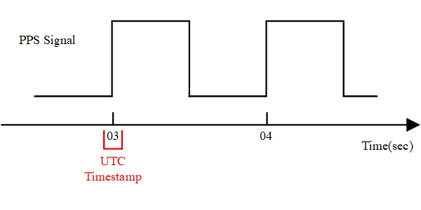
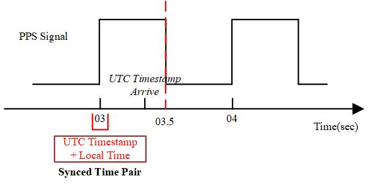
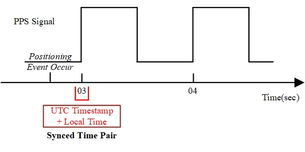

## Overview

* DJI supports developers using base stations (such as D-RTK 2) and mobile stations (such as M210 RTK V2), and RTK (Real-Time Kinematic, real-time dynamic carrier phase difference technology) to obtain drone‘s flight attitude and high-precision positioning information, the error will Less than 1 cm.  
* To obtain the Precise Positioning, need [Synchronize](#Synchronization) to eliminate the clock difference; the [Conversion](#Conversion), will help to calculate the precise time when the positioning event occurs; the payload called the interface will obtain the precise [Positioning](#Positioning).

## Glossary

* Point of interest：Is a specific point of a component, which on the device, such as the center of the camera sensor.
* Actor：Obtain the positioning of the device, which can also be a point of interest.

> **NOTE**：The actor of **M210 RTK V2** is the center of the gimbal，it means that the callback value is the center of the gimbal.

* Positioning Event: An event that triggers a position request. If the position request is triggered when the camera is exposed, "camera exposure" is a positioning event.
* UTC Time: The time system of the RTK.
* UTC Timestamp: Timepoint of the rising edge of the PPS hardware pulse signal. The drone sends the signal to the payload at the rising edge of the PPS hardware signal.
* Local Time: The time system of the payload.

## Restriction

* Make sure that the state of communication between the drone and the RTK satellite should be well, you can confirm it from the APP.
>**NOTE**: The app would be published by DJI or developed using MSDK.

* The delay between the rising edge of the PPS signal and the local time will affect the accuracy of positioning. Please ensure a low delay, recommend less than 1 second.

## Synchronization

To synchronize the drone with the GNSS (Global Navigation Satellite System), eliminate the influence of the clock, the payload will perform synchronization.

1. Using the SKYPORT connect to the PTZ mount, the payload will detect the PPS hardware pulse signal.
2. When the payload detects a rising edge of the PPS hardware pulse signal, it will record the local time from the payload.
3. After recording the rising edge of the PPS hardware pulse signal, the payload will receive the UTC timestamp corresponding the rising edge of the PPS hardware pulse signal from the command channel:



* If the UTC timestamp is more than 500ms compared to the rising edge of the PPS hardware pulse signal, the UTC timestamp will be discarded, causing the time synchronization to fail and affecting the accuracy of the positioning data.
* When the UTC timestamp reaches the load device within 500ms of the rising edge of the PPS hardware pulse signal, the load device calculates the time difference between UTC time and local time according to the UTC timestamp and the local time of the rising edge of the PPS hardware pulse signal to implement the load device and RTK. The system's clock is synchronized (forming a time pair).  



> Reference：[Principles of Operation](https://developer.dji.com/cn/onboard-sdk/documentation/guides/component-guide-hardware-sync.html#Principles-of-Operation)

## Conversion

Conversion will converte the local time to the RTK system time, and the payload can obtain the precise RTK positioning.
1. When a positioning event occurs, the payload will record the time when the positioning event occurred.
2. The payload calculates the UTC time as follow:

* The UTC time of the synchronization time alignment is <b>t<sub>UTC</sub><sup>synced</sup></b>
* Local time is <b>t<sub>local</sub><sup>synced</sup></b>
* The local time when the location event occurred is <b>t<sub>local</sub><sup>event</sup></b>
* The UTC time at which the location event occurred is <b>(t<sub>local</sub><sup>event</sup> - t<sub>local</sub><sup>synced</sup>) + t<sub>UTC</sub><sup>synced</sup></b>

>**NOTE**：The UTC time's format should consistent with the local time.

### Format

The conversion between payload and RTK can be realized only when the time format is the same. It is recommended to use the time format shown below：

```
typedef struct {
    uint16_t year;         /*!< Specifies year. */
    uint8_t month;         /*!< Specifies month. */
    uint8_t day;           /*!< Specifies day. */
    uint8_t hour;          /*!< Specifies hour. */
    uint8_t minute;        /*!< Specifies minute. */
    uint8_t second;        /*!< Specifies second. */
    uint32_t microsecond;  /*!< Specifies microsecond. */
} T_UtcTimestampMsg;
```

## Positioning

The payload requests precise positioning from the drone is as follow：

1. When the positioning event occurs，The UTC time should earlier than the latest PPS signal rising edge (time interval is less than 2s), the payload will use the UTC time and call `PsdkPositioning_GetPos` to obtain the Precise positioning.  
  

  
2. The drone sends the position, attitude, attribute, and the position of the main station center and the main antenna to the payload.  
3. The specific meaning of the location solution attribute can be obtained by `E_PsdkPositioningPositionSolutionProperty`, using the target point position/UAV attitude information, the load structure parameter/cached PTZ attitude information to calculate the interest point position.
4. View the Mark file in the drone `cam_mark_file` for positioning. For details on the Mark file, please refer to [Introduction to Mark File](https://djisdksupport.zendesk.com/hc/zh-cn/articles/360024019493-Mark文件简介).

## Optimal

M210 RTK V2


