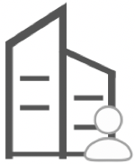
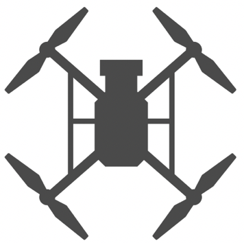
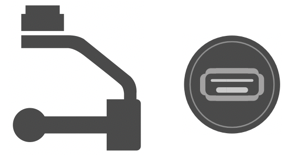
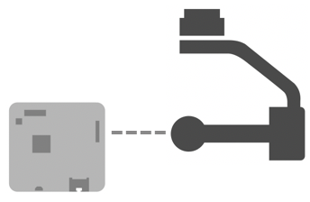
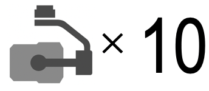

> **NOTE** 
> * This article is **Machine-Translated**. If you have any questions about this article, please send an <a href="mailto:dev@dji.com">E-mail </a>to DJI, we will correct it in time. DJI appreciates your support and attention. 
> * This series of documentation introduces the functions of PSDK V2.x.x, as well as the steps and methods of developing payload using PSDK V2.x.x. If you are still using PSDK V 1.5.x, please download the documentation of [PSDK V1.5.x](https://terra-1-g.djicdn.com/71a7d383e71a4fb8887a310eb746b47f/psdk/payload-sdk-doc-1.0.zip).

Before using PSDK to develop the payload, you should register an Enterprise Account, then purchase drones and **Hardware Platform**. According to the Criterion to design the payload, at last, using tutorials and API documents, develop the payload which could be mounted on DJI drones.

<table>
<tbody>
  <tr>
   <td style="border-right: none;border-left: none;">

      

</td></td>
       <td style="border-right: none;border-left: none;">

      

</td></td>
        <td style="border-right: none;border-left: none;">

      

</td></td>
         <td style="border-right: none;border-left: none;">

      

</td></td>
         <td style="border-right: none;border-left: none;">

      

</td></td>
         <td style="border-right: none;border-left: none;">

      

</td></td>
         <td style="border-right: none;border-left: none;">

      

</td></td>
         <td style="border-right: none;border-left: none;">

      

</td></td>
  </tr>
  <tr>
   <td style="text-align:center"><a href="https://developer.dji.com/payload-sdk/apply/" target="_blank">1.Enterprise Account</a></td>
   <td style="text-align:center"><a href="https://www.dji.com/products/compare-m200-series?site=brandsite&from=nav" target="_blank" >2.Purchase Drone</a></td>
   <td style="text-align:center"><a href="../payloadguide/hardware.html">3.Hardware Platform</a></td>
   <td style="text-align:center"><a href="https://developer.dji.com/user/apps/#allhtml">4.Apply Application</a></td>
   <td style="text-align:center"><a href="../quickstart/run-the-sample.html">5.Using Sample</a></td>
   <td style="text-align:center"><a href="mailto:dev@dji.com">6.Produce</a></td>
   <td style="text-align:center"><a href="mailto:dev@dji.com">7.Join Ecology</a></td>
  </tr>
</tbody>
</table>

## 1. Sign Up
* Make sure that you have read the <a href="https://developer.dji.com/policies/privacy/"> Protocol, Terms and Policies </a> **carefully** when to <a href="https://developer.dji.com/payload-sdk/apply/" target="_blank"> Sign Up</a> for a DJI PSDK Enterprise Account.
* In order to get more services, please fill in the registration information correctly.

## 2. Purchase Products
* <a href="https://www.dji.com/en/products/compare-m200-series?site=brandsite&from=nav" target="_blank"> DJI Drone </a>
* [Hardware Platform](../payloadguide/hardware.html)
* [Development Platform](../payloadguide/platform.html)

> **NOTE**
> * X-Port and Skyport V2 only support **PSDK V2.x.x**.
> * Skyport only supports **PSDK V1.x.x**.
> * DJI recommended developers use **PSDK V2.xx** with **X-Port** or **Skyport V2** to develop payload.

## 3. Develop Payload

#### Preparation

* Learn the basic knowledge such as pitch, yaw, roll and lift.
* To know the [features](./feature-list.html) that PSDK supported.
* Follow DJI's payload [Design criterion](../payloadguide/payload-criterion.html).
* Choose [Hardware Platform](../payloadguide/hardware.html).
* Select [Development Platform](../payloadguide/platform.html).

#### Start to Develop

* Before using PSDK to develop payload, please read the content in [Attention](../quickstart/attention.html).
* [Connect](../quickstart/device-connection.html) drone, third-party development board, Hardware Platform, and computer.
* [Install](../quickstart/development-environment.html) software, prepare toolchains and libraries.
* [Run](../quickstart/run-the-sample.html) the sample to learn how to use various features provided by PSDK.
* [Porting](../quickstart/porting.html)(Optional) the payload control program developed based on PSDK to different software and hardware platforms.

#### Develop Payload
* Develop the payload according to the [tutorials](../tutorial/initial.html) and PSDK API documentation.
* Use [DJI Assistant 2](https://www.dji.com/en/downloads) and other tools to debug the payload.

## 4. Business Cooperation
Adhere to the concept of openness and mutual benefit, DJI provides developers technical support, payload detection, channel recommendation, and DJI ecological promotion services. We sincerely work with developers and partners to build a good application ecosystem.

* Apply for a license to produce more than 10 payloads.
* If the payload passed DJI's detection, it will be recommended to third-party partners.
* If payload can pass the inspection of a third-party professional organization, after signing a cooperation agreement with DJI, DJI will carry out more in-depth cooperation with the partner, such as recommending the partner's payload to <a href="https://www.dji.com/en/products/enterprise#partner-payloads">Global Users </a>, etc. For more cooperation matters, please <a href="mailto:dev@dji.com">Contact Us </a>.

## Support Services
Self Service:
* <a href="https://developer.dji.com/payload-sdk/documentation/faq/index.html"> FAQ </a>
* <a href="https://forum.dji.com/forum-139-1.html?from=developer"> DJI Technical Forum </a>

Support Service:
* Use the <a href="https://formcrafts.com/a/dji-developer-feedback-en"> Question Feedback </a> form.
* Send an <a href="mailto:dev@dji.com"> E-mail </a> to the DJI SDK team.
