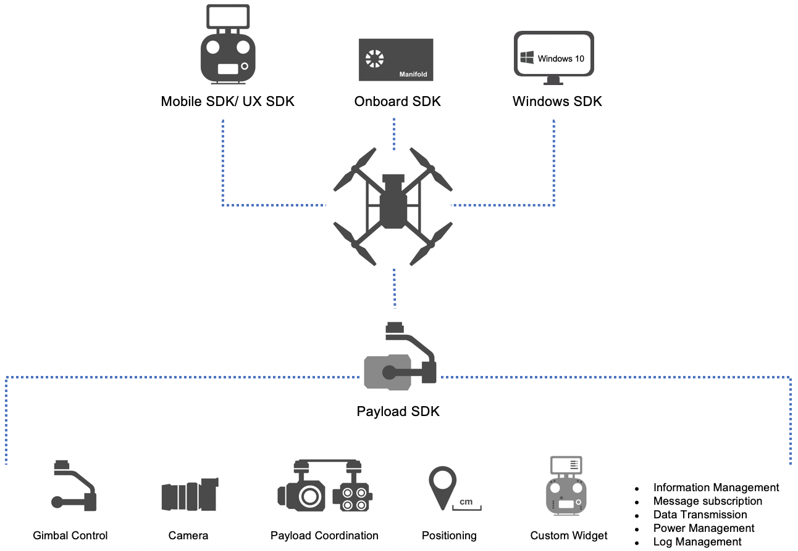

> **NOTE** 
> * This article is **machine-translated**. If you have any questions about this article, please send an <a href="mailto:dev@dji.com">E-mail </a>to DJI, we will correct it in time. DJI appreciates your support and attention.
> * This series of documentation introduces the functions of **PSDK V2.0.0**, as well as the steps and methods of developing payload using PSDK V2.0.0. If you are still using PSDK V 1.5.0, please download the documentation of [PSDK V1.5.0](https://terra-1-g.djicdn.com/71a7d383e71a4fb8887a310eb746b47f/psdk/payload-sdk-doc-1.0.zip).

To help developers to develop the payload, DJI provides Payload SDK (PSDK), [X-Port](../guide/hardware.html) and [Skyport](../guide/hardware.html) to expedite developers to obtain the **resources** from DJI drones, such as power and status (GPS, attitude, time and date).

 
  

## Advantages
* **Perfect Function**     
Using basic functions such as information acquisition, data transmission, and power management; advanced functions such as cameras, gimbals, payload coordination, and precise positioning, developers could design a **perfect function** payload.

* **Customized and Scalable**     
Besides the DJI Pilot is compatible with payload which developed using PSDK, DJI provides Mobile SDK to help developers to develop **Mobile APPs** to control the payload; provides Onboard SDK to support developers write the self-control programs; Windows SDK can help the developer to develop the Data analyzing software.

* **Support Services**     
PSDK not only provides the API and hardware for developing the payload, but also provides standards, technical support, marketing, and ecological cooperation services, etc.

## Typical Features

* <a href="../camera/camera-initial.html"> <b> Camera Control </b> </a>
* <a href="../tutorial/gimbal-contro.html"> <b> Gimbal Control </b> </a>
* <a href="../tutorial/payload-collaboration.html"> <b> Payoad Collaboration </b> </a>
* <a href="../tutorial/custom-widget.html"> <b> Custom Widget </b> </a>
* <a href="../tutorial/positioning.html"> <b> Positioning </b> </a>
* <a href="../tutorial/data-transmission.html"> <b> Data Communication </b> </a>
* <a href="../tutorial/information-manage.html"> <b> Information Management </b> </a>

## Usage Scenarios

<table id="t1">
  <thead style="text-align:center">
    <tr>
      <td rowspan="2" >Payload</td>
      <td colspan="3">Security</td>
      <td colspan="2">Inspection</td>
      <td colspan="3">Survey</td>
      <td colspan="2">Environment</td> 
      <td colspan="2">More Industries</td> 
    </tr>
    <tr>
      <td>Public Security</td>
      <td>Fire Fighting	</td>
      <td>Rescue Services	</td>
      <td>Pipeline Inspection</td>
      <td>Factory Inspection</td>
      <td>Geological Survey</td>
      <td>Urban Planning</td>
      <td>Resource</td>
      <td>Ecological Protection</td>
      <td>Biological Protection</td>
      <td>......</td>
    </tr>
  </thead>
  <tbody style="text-align:center">
    <tr>
      <td>Zoom Camera</td>
      <td> ✓ </td>
      <td> ✓ </td>
      <td> ✓ </td>
      <td> ✓ </td>
      <td> ✓ </td>
      <td> ✓ </td>
      <td> ✓ </td>
      <td> ✓ </td>
      <td> ✓ </td>
      <td> ✓ </td>
    </tr>
    <tr>
      <td>Thermal Imaging Camera</td>
      <td> ✓ </td>
      <td> ✓ </td>
      <td> ✓ </td>
      <td> ✓ </td>
      <td> ✓ </td>
      <td> - </td>
      <td> - </td>
      <td> ✓ </td>
      <td> ✓ </td>
      <td> ✓ </td>
    </tr>
    <tr>
      <td>Infrared Camera</td>
      <td> ✓ </td>
      <td> ✓ </td>
      <td> ✓ </td>
      <td> - </td>
      <td> ✓ </td>
      <td> - </td>
      <td> - </td>
      <td> ✓ </td>
      <td> ✓ </td>
      <td> ✓ </td>
    </tr>
    <tr>
      <td>Multi-Camera</td>
      <td> ✓ </td>
      <td> ✓ </td>
      <td> ✓ </td>
      <td> - </td>
      <td> - </td>
      <td> ✓ </td>
      <td> ✓ </td>
      <td> ✓ </td>
      <td> - </td>
      <td> - </td>
    </tr>
    <tr>
      <td>Starlight Camera</td>
      <td> ✓ </td>
      <td> - </td>
      <td> ✓ </td>
      <td> - </td>
      <td> - </td>
      <td> - </td>
      <td> - </td>
      <td> - </td>
      <td> - </td>
      <td> - </td>
    </tr>
    <tr>
      <td>Lidar</td>
      <td> - </td>
      <td> - </td>
      <td> ✓ </td>
      <td> ✓ </td>
      <td> - </td>
      <td> ✓ </td>
      <td> ✓ </td>
      <td> - </td>
      <td> - </td>
      <td> - </td>
    </tr>
    <tr>
      <td>Gas Detector</td>
      <td> - </td>
      <td> - </td>
      <td> ✓ </td>
      <td> ✓ </td>
      <td> ✓ </td>
      <td> - </td>
      <td> - </td>
      <td> - </td>
      <td> ✓ </td>
      <td> ✓ </td>
    </tr>
    <tr>
      <td>Radiation Detector</td>
      <td> ✓ </td>
      <td> ✓ </td>
      <td> - </td>
      <td> - </td>
      <td> - </td>
      <td> - </td>
      <td> - </td>
      <td> ✓ </td>
      <td> ✓ </td>
      <td> - </td>
    </tr>
    <tr>
      <td>Water Detector</td>
      <td> - </td>
      <td> - </td>
      <td> - </td>
      <td> - </td>
      <td> - </td>
      <td> - </td>
      <td> - </td>
      <td> - </td>
      <td> ✓ </td>
      <td> - </td>
    </tr>
    <tr>
      <td>Megaphone</td>
      <td> ✓ </td>
      <td> ✓ </td>
      <td> ✓ </td>
      <td> ✓ </td>
      <td> ✓ </td>
      <td> - </td>
      <td> - </td>
      <td> - </td>
      <td> - </td>
      <td> - </td>
    </tr>
    <tr>
      <td>Searchlight</td>
      <td> ✓ </td>
      <td> ✓ </td>
      <td> ✓ </td>
      <td> - </td>
      <td> ✓ </td>
      <td> - </td>
      <td> - </td>
      <td> ✓ </td>
      <td> - </td>
      <td> - </td>
    </tr>
     <tr>
      <td colspan="2" style="border: none;">More Payloads......</td>
    <td style="border: none;text-align:center;"></td>
  </tbody>
</table>

## Using MSDK and OSDK
* MSDK: The Mobile APP developed based on MSDK can control the payload.
* OSDK: The onboard computer could run the control program developed by the developer based on the OSDK.

> **Reference:** [How to use PSDK?](./how-to-use-PSDK.html)