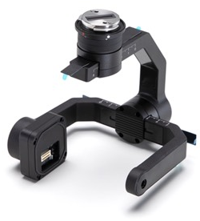

> **NOTE**
> * This article is **Machine-Translated**. If you have any questions about this article, please send an <a href="mailto:dev@dji.com">E-mail </a>to DJI, we will correct it in time. DJI appreciates your support and attention. 
> * This series of documentation introduces the functions of **PSDK V2.0.0**, as well as the steps and methods of developing payload using PSDK V2.0.0. If you are still using PSDK V 1.5.0, please download the documentation of [PSDK V1.5.0](https://terra-1-g.djicdn.com/71a7d383e71a4fb8887a310eb746b47f/psdk/payload-sdk-doc-1.0.zip).
> * X-Port only support developers use PSDK V2.0.0 ，if you still use PSDK V 1.5.0, please use [PSDK V1.5.0](https://terra-1-g.djicdn.com/71a7d383e71a4fb8887a310eb746b47f/psdk/payload-sdk-doc-1.0.zip) and use [SkyPort](https://store.dji.com/product/psdk-development-kit).
> * The details of the X-Port, please refer to the User's Manual in [PSDK V2.0.0](https://developer.dji.com/payload-sdk/downloads/).

DJI [X-Port](https://store.dji.com/product/dji-x-port) is a standard gimbal that allows drone hardware developers to quickly integrate their own custom sensors on DJI Matrice 200 Series V2. DJI X-Port includes a built-in communication API, DJI SkyPort V2 integration, and a gimbal debugging interface. Worked with [Payload SDK Development Kit 2.0](https://store.dji.com/product/psdk-development-kit-v2), X-Port is estimated to reduce start to finish development time for new payloads by up to 40 percent. 

Figure 1 X-Port  

      

Figure 2 Material Bill 

      

## Highlights
* High-precision 3-axis gimbal
* Integrates all functions of PSDK 2.0
* Customizable gimbal parameters 
* Supports Mounting in the Upward-facing Gimbal Slot
* Customizable channels for remote controller buttons
* Can be controlled directly through DJI Pilot app, MSDK and OSDK.

## Compatibility
Matrice 200 Series V2:
* Matrice 200 V2
* Matrice 210 V2
* Matrice 210 RTK V2

## Structure

Figure 3 The structure of the X-Port(unit: mm) 

      

* Weight of X-Port: 340g
* Supported load weight range: <450g
* Ingress protection: IP44 
* Operating temperature: -20°C～50°C (-4°F to 122°F)
* Power output: 13.6V / 2A or 17V / 2.5A (High Power Apply)

> **NOTE** 
> * Effected by work environment, the electric current of the X-Port would be different.
> * For supported load dimensions on X-Port, please refer to [Payload Criterion](../guide/payload-criterion.html)；
> * For the details of X-Port interface, please refer to [Device Connection
](../workflow/device-connection.html)。

## Support Features
* <a href="../tutorial/X-Port.html"><b> X-Port Control</b></a>
* <a href="../camera/camera-basic-functions.html"><b>Camera </b></a>
* <a href="../tutorial/payload-collaboration.html"><b>Payload Coordination</b></a>
* <a href="../tutorial/custom-widget.html"><b>Custom Widget</b></a>
* <a href="../tutorial/positioning.html"><b>Positioning</b></a>

## Use MSDK and OSDK
* MSDK: The Mobile App which developed based on MSDK could control X-Port and the custom sensors based on X-Port.
* OSDK: The Application which developed based on OSDK could control the dorne, X-Port and the custom sensors based on X-Port.

-------

<a href="https://store.dji.com/cn/product/dji-x-port">Purchase X-Port </a>

<a href="https://store.dji.com/cn/product/psdk-development-kit-v2">Payload SDK Development Kit 2.0</a>

