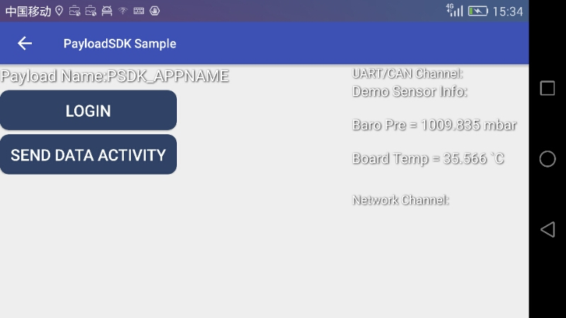

To have a better experience of learning how to get started with the DJI Payload SDK, please check this  <a href="https://www.skypixel.com/videos/dji-payload-sdk-how-to-use-payload-sdk-and-run-a-sample-application" target="_blank">Getting Started Video</a>.

## Registration and App creation

The first step for getting started is to create your PSDK enterprise user account and apply for a PSDK application. Follow the steps [here](https://developer.dji.com/payload-sdk/apply) to do this.

## Upgrade Matrice 200
Use DJI Assistant 2 to upgrade your M200 series' firmware to a PSDK-enabled firmware (M200 Firmware Version V01.01.0800 or above). 

## Get Payload SDK Software
After becoming a Payload SDK enterprise user, you can go to [USER CNETER](https://developer.dji.com/user/apps/#all) to get your Payload SDK Package and the related software.

## Build Payload SDK Application

Next, you can build and flash your application from a host computer to your Payload SDK development board by following the steps [here](../development-workflow/build-application.html).

## Bind Payload SDK Application
For the first use only, the SKYPORT adapter needs to be bound with your Payload SDK application. Please follow the steps below to bind it.

1. Connect the SKYPORT adapter to the Payload SDK development board with the coaxial cable, and then connect the adapter to the M200 series aircraft. Use USB cable to connect the M200 to a PC.

2. Open DJI Assistant 2, then log into your Payload SDK enterprise account.

3. Open the Payload SDK tab. You can see the statuses of the SKYPORT adapter and the attached payload shown as `"Connected"` in the area of Adapter Status. Enable the `Bind` button to bind the SKYPORT adapter and the Payload SDK application. After a successful Bind operation, the Binding Status shows as `Bound`.

## Run Payload SDK Application

### Mobile SDK Communication Sample

- Payload SDK functionality is enabled after completing the binding process. 
- You can test PSDK functions with the Mobile SDK-based PSDK sample application. 
- Please download and install the sample application from the Payload SDK download page in USER Center (Mobile SDK for Payload SDK), install it into a mobile device, and then connect to the remote controller with a USB cable.  
- Run Mobile SDK Sample app . On first use, your mobile device needs an internet connection to finish registration and needs login your DJI account. 
- After registration is done, you can see the development board’s sensor data displayed in the program. This means the communication is successful!

### DJI Pilot Integration Sample

You can use DJI Pilot on Android to see the same Payload SDK functionality. You need to get a newest version of DJI Pilot [here](http://dl.djicdn.com/djipilot-official.apk).

