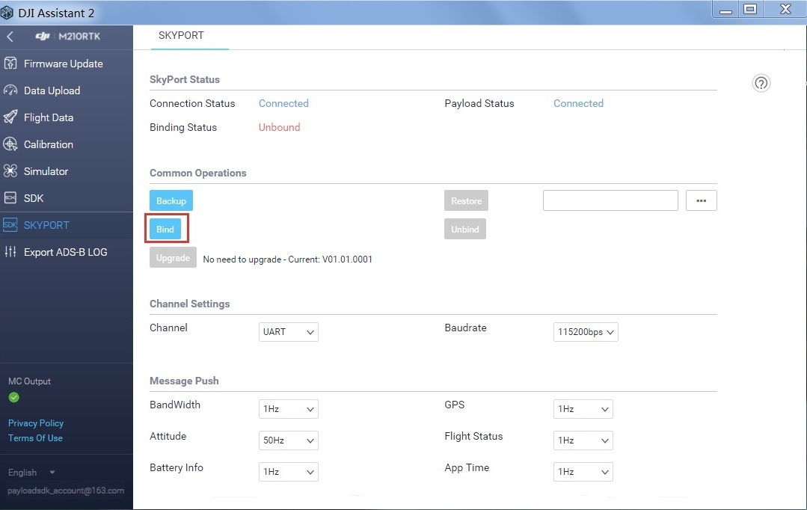
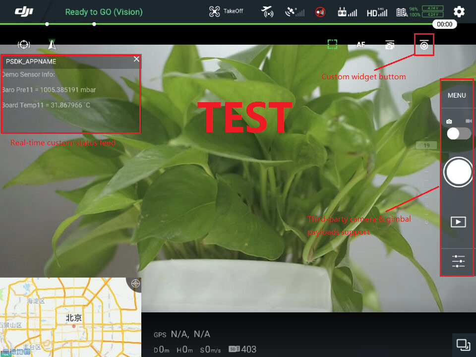

To have a better experience of learning how to get started with the DJI Payload SDK, please check this  <a href="https://www.djivideos.com/video_play/bf600c12-cd79-48f1-8958-27794f405c43?autoplay=1" target="_blank">Getting Started Video</a>.

## Registration and App creation

The first step for getting started is to create your PSDK enterprise user account and apply for a PSDK application. Follow the steps [here](https://developer.dji.com/payload-sdk/apply) to do this.

## Upgrade Matrice 200

Use DJI Assistant 2 to upgrade the firmware of your M200 series aircrafts to a PSDK-enabled version (M200 Firmware Version V01.01.0800 or above). 

## Get Payload SDK Software

After becoming a Payload SDK enterprise user, you can go to [USER CENTER](https://developer.dji.com/user/apps/#all) to get your Payload SDK Package and the related software.

## Build Payload SDK Application

Next, you can build and flash your application from a host computer to your Payload SDK development board by following the steps [here](../development-workflow/build-application.html).

## Bind Payload SDK Application

The SKYPORT adapter needs to be bound with your Payload SDK application only for the first use. Please follow the steps below to bind it.

1. Connect the SKYPORT adapter to the Payload SDK development board with the coaxial cable, and then connect the adapter to the M200 series aircraft. Use a USB cable to connect the M200 to a PC.

2. Open DJI Assistant 2 and log into your Payload SDK enterprise account.

3. Enter the SKYPORT menu. You can see the statuses of the SKYPORT adapter and the attached payload shown as `"Connected"` in the area of Adapter Status. Click the `Bind` button to bind the SKYPORT adapter and the Payload SDK application. After a successful binding operation, the Binding Status will show as  `Bound`.

## Run Payload SDK Application

### DJI Pilot Integration Sample

- Payload SDK functionality is enabled after completing the binding process. 
- You can test PSDK functions through DJI Pilot on Android devices. 
- Get the latest version of [DJI Pilot App](https://www.dji.com/matrice-200-series/info#downloads), install it on DJI Crystalsky or other Android devices. Then connect the remote controller and the mobile device using a USB cable.  
- Run DJI Pilot app. For the first use, your mobile device needs an internet connection to finish registration with your login DJI account. 
- After the registration, the sensor data of the development board will be displayed in the DJI Pilot app, which means the communication establishment is successful!

