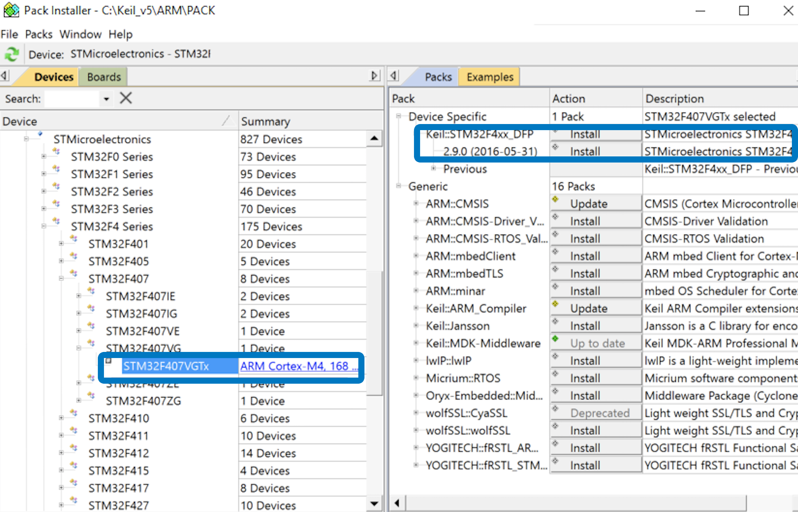

> **NOTE** This article is **Machine-Translated**. If you have any questions about this article, please send an <a href="mailto:dev@dji.com">E-mail </a>to DJI, we will correct it in time. DJI appreciates your support and attention.s's

This article describes the process of setting up the software environment. After connecting the hardware and setting up the software environment, the developer could create the project and run the sample code.

## Obtion Basic Software

* [DJI Assistant 2](https://www.dji.com/en/downloads)
* [DJI Pilot](https://www.dji.com/en/downloads)
* [Payload SDK](https://developer.dji.com/user)
* [Mobile SDK](https://developer.dji.com/user)  （Optional）     

## Configure RTOS Development Environment
Download and install the software:

* [Keil MDK](http://www2.keil.com/mdk5/)
    * C Compiler:  Armcc.exe V5.06 update 6 (build 750)
    * Assembler:              Armasm.exe V5.06 update 6 (build 750)
    * Linker/Locator:         ArmLink.exe V5.06 update 6 (build 750)
    * Library Manager:        ArmAr.exe V5.06 update 6 (build 750)
    * Hex Converter:          FromElf.exe V5.06 update 6 (build 750)

* Use Keil    
After **activated** the Keil MDK , please use Keil Pack Installer or <a href="http://www.keil.com/dd2/Pack/" target="_blank">download</a> the newest driver of STM32F4xx_DFP.2.x.x.

Figure 1 Install the Pack

      

## Configure Linux Development Environment
Download and install the software:

* C compiler: GCC 5.4.0 / 5.5.0
* CMake: 2.8 and above
* FFmpeg: 4.1.3 and above (optional)

