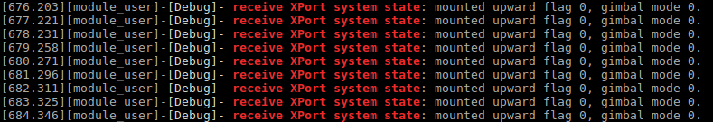
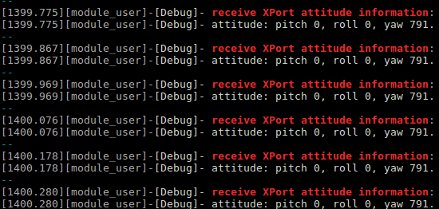
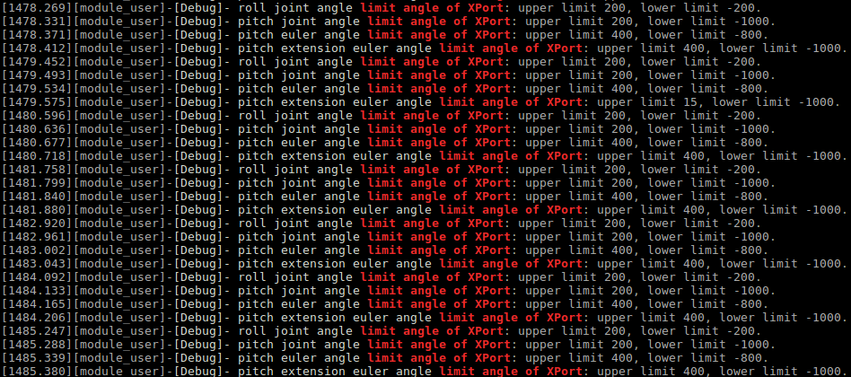

> **NOTE**
> * This article is **Machine-Translated**. If you have any questions about this article, please send an <a href="mailto:dev@dji.com">E-mail </a>to DJI, we will correct it in time. DJI appreciates your support and attention.
> * Before using X-Port to develop the payload, please read the [Gimbal Control](./gimbal-control.html) to learn the basic concepts of the gimbal.
> * If the X-Port is powered off abnormally, X-Port would lose the parameter.
> * f you want to config the parameters of the X-Port, please use the DJI Assistant 2 (2.0.11 or above).
## Overview 
X-Port is a Hardware Platform for the developer to develop the payload, use X-Port Control and [Custom Widget](./custom-widget.html), the user could display or control the payload, using DJI Pilot or the APP which developed based on MSDK.

## The status of the X-Port
The payload developed based on PSDK can obtain the mode、attitude and calibration of the X-Port. For details please refer to the API documentation.

* Basic Information: X-Port mode
* X-Port Status: Rotation status, Control status, Ceset status, Cimit angle
* Parameters: Speed ​​conversion factor

## X-Port Control
> **NOTE** X-Port integrates the basic functions of the gimbal. For details please refer to [Gimbal Control](./gimbal-control.html).

#### Control Method
* Relative angle control: Users could control the X-Port rotate the specified angle within a specified time.       
After receive the command from the user, X-Port could calculate the amount of the yaw, according to the control mode and control method, and then calculate and control the yaw, according to the target angle.     
  * The direction of the rotation is independent with the sign of the rotation angle.
  * The amount of the yaw(X) = current angle of yaw + yaw rotation angle
  * The target angle of the yaw=MOD((X + 180), 360) - 180
* Absolute angle control: According to the user's command, X-Port will rotate from the current position to the specified position within a specified time.
* Speed ​​control: Users could control the rotation speed of the X-Port.

> **NOTE**   
> * In the angle control method, the range of the yaw which on the X-Port is [-180,180], the rotation time of the X-Port is limited by the maximum acceleration and maximum speed.   
> * The roll which on the X-Port is used to eliminate drone jitter, this axis couldn't control by the payload.   
> * The reachable position of the X-Port is restricted by the X-Port position limit.   

#### Control Permission
The details for the X-Port control permissions, please refer to Table 1.

* Rules
  * The control action with low priority could control the X-Port only after the control action with high priority ends.
  * High-priority control actions can preempt control rights of low-priority control actions;
  * Control scenes of equal priority are preempted in order of control start time, and control scenes with a later start control time cannot seize control rights.

* Release
  * The control module will release the control right after completing the control of the X-Port;
  * If the control module does not release the control right after completing the control of the X-Port, x-Port will release the control right within the 2s after the end of the X-Port rotation. 

<div><div>
<p>
Table 1 The control permissions of the X-Port
  </p></div>
<div>
<table id="01">
  <thead>
    <tr>
      <th>Role</th>
      <th>level</th>
    </tr>
  </thead>
  <tbody>
    <tr>
      <td>The gimbel rockers of the controller</td>
      <td>1</td>
    </tr>
    <tr>
      <td>Commands of the MSDK</td>
      <td>1</td>
    </tr>
    <tr>
      <td>DJI APP gimbal control commands</td>
      <td>2</td>
    </tr>
    <tr>
      <td>Payload coordination command</td>
      <td>2</td>
    </tr>
    <tr>
      <td>The gimbal speed ​​command of MSDK</td>
      <td>2</td>
    </tr>
    <tr>
      <td>The gimbal control commands of the mission</td>
      <td>2</td>
    </tr>
    <tr>
  <td>Angle commands of the MSDK</td>
  <td>2</td>
 </tr>
 <tr>
  <td>Speed commands of the MSDK</td>
  <td>2</td>
 </tr>
  </tbody>
</table></div></div>

#### Speed ​​Conversion Factor
If the zoom factor of the camera is large, when the speed of the X-Port rotates faster, the picture recorded by the payload will very blurry, but PSDK provides the "Speed Conversion Factor" of the control command and the rotation speed to help user recognizes a stable picture, when the payload has a large zoom factor.
  * Factor: Users can set the speed conversion factor of X-Port it is recommended to set the speed conversion factor is the inverse of the zoom factor. 
  * Max_speed (the maximum speed of X-Port) = Default maximum speed × Maximum speed percentage
  * X-Port Speed = Max_speed * Factor (Factor≤ 1)


> **NOTE** Only DJI Pilot and PSDK could set the speed conversion coefficient of the X-Port.

### Reset
* Yaw: Reset angle of yaw axis to the sum of yaw axis angle of aircraft and the fine-tune angle of yaw axis of X-Port. 
* Yaw and pitch axis of X-Port: Reset angle of yaw axis to the sum of yaw axis angle of aircraft and the fine-tune angle of yaw axis of X-Port, and reset pitch axis angle to the fine-tune angle. 
* Yaw axis and pitch: reset the yaw axis to the sum of the drone yaw axis and the gimbal fine-tuning angle. Reset the pitch axis to the sum of -90° and the fine-tuning angle of the gimbal (under), and the sum of the 90° and the fine-tuning angle of the gimbal (upper).
* Reset the yaw axis to the sum of -90° and the fine-tuning angle of the gimbal (under), the sum of the 90° and the fine-tuning angle of the gimbal (upper).   

### X-Port Limitation
#### Limit Angle
To prevent the X-Port from being damaged or interfered with the drone's flight mission due to structural interference during the working, you must set the limit for the X-Port, the details please refer to Table 2.

<div><div>
<p>
Table 2 The Limit Angle of the X-Port </p></div>
<div>
  <table id="XPort limit angle">
  <thead>
    <tr>
      <th>Type</th>
      <th>Upper Limit</th>
      <th>The range of the upper limit</th>
      <th>Lower Limit</th>
      <th>The range of the Lower limit</th>
    </tr>
  </thead>
  <tbody>
    <tr>
      <td>The joint angle of the pitch</td>
      <td>40°</td>
      <td>40° ~ 0</td>
      <td>-125°</td>
      <td>-125° ~ 0</td>
    </tr>
    <tr>
      <td>The joint angle of the roll</td>
      <td>55°</td>
      <td>55° ~ 0</td>
      <td>-55°</td>
      <td>-55° ~ 0</td>
    </tr>
    <tr>
      <td>The joint angle of the yaw</td>
      <td>320°</td>
      <td>320° ~ 0</td>
      <td>-320°</td>
      <td>-320° ~ 0</td>
    </tr>
    <tr>
      <td>The Euler-angle of the pitch</td>
      <td>30°</td>
      <td>30° ~ 0</td>
      <td>-90°</td>
      <td>-90° ~ 0</td>
    </tr>
    <tr>
      <td>The extended Euler-angle of the pitch</td>
      <td>30°</td>
      <td>30° ~ 0</td>
      <td>-120°</td>
      <td>-120° ~ 0</td>
    </tr>
    <tr>
      <td>The Euler-angle of the roll</td>
      <td>20°</td>
      <td>Stable</td>
      <td>-20°</td>
      <td>Stable</td>
    </tr>
  </tbody>
</table></div></div>
  
After setting the X-Port limit angle, the X-Port will rotate within the limit range. If the X-Port rotation angle exceeds the range of the limited, the X-Port will automatically adjust the attitude but a little jitter. To reduce the jitter of the X-Port, X-Port has a limit buffer.

> **NOTE** Only the range that of the Euler-angle of the roll could not be changed.

#### The buffer of the limitation 
X-Port uses the buffer to reduce the jitter when the user adjusts the attitude beyond the limit angle.
  > **NOTE** 
  > * X-Port couldn't move ahead when X-Port in the buffer.
  > * The width of the buffer for the pitch and roll is 5°,15° is for the yaw.

> **Example**
> * If the upper limit of the yaw's joint angle is 90°, because the width of the limit buffer is 15°, the limit buffer is 75° to 90°;
> * The X-Port yaw angle is 30° and if the X-Port yaw angle reaches 78°, the X-Port will stop in the limit buffer, such as 80°;
> * At that time, the yaw of the X-Port couldn't move ahead over 80°.

</br>

------------

##### The range of the X-Port‘s Euler-angle
* Up
  * Unabled the extension:[pitchEulerAngleLowerLimit, pitchEulerAngleUpperLimit] 
  * Enabled the extension:[pitchEulerAngleExtensionLowerLimit, pitchEulerAngleExtensionUpperLimit]
* Down
  * Unabled the extension:[-pitchEulerAngleUpperLimit, -pitchEulerAngleLowerLimit] 
  * Enabled the extension:[-pitchEulerAngleExtensionUpperLimit, -pitchEulerAngleExtensionLowerLimit]

------------

## Use the X-Port to develop payload

### 1. Initialization
Using X-Port to develop the payload, the developer needs to initialize the X-Port control function with the following code.

```c
psdkStat = PsdkXPort_Init();
if (psdkStat != PSDK_RETURN_CODE_OK) {
    PsdkLogger_UserLogError("XPort init error: %lld.", psdkStat);
    return psdkStat;
}
```

### 2. Obtain the status of the X-Port 
1. Get the system status of the X-Port
* Create the callback function to receive the system status of the X-Port.

```c
static T_PsdkReturnCode ReceiveXPortSystemState(T_PsdkGimbalSystemState systemState)
{
    PsdkLogger_UserLogDebug("receive XPort system state: mounted upward flag %d, gimbal mode %d.",
                            systemState.mountedUpward, systemState.gimbalMode);

    PsdkLogger_UserLogDebug("XPort fine tune: %d %d %d.", systemState.fineTuneAngle.pitch,
                            systemState.fineTuneAngle.roll, systemState.fineTuneAngle.yaw);

    return PSDK_RETURN_CODE_OK;
}
```

* Register the callback function to receive the status of the X-Port, as shown in Figure 1.

```c
psdkStat = PsdkXPort_RegReceiveSystemStateCallback(ReceiveXPortSystemState);
if (psdkStat != PSDK_RETURN_CODE_OK) {
    PsdkLogger_UserLogError("register receive XPort system state callback function error: %lld.", psdkStat);
    return psdkStat;
}
```
<div>
<div style="text-align: center"><p>   Figure 1 The status of the X-Port </p>
</div>
<div style="text-align: center"><p><span>
      </span></p>
</div></div>

2. Obtain the attitude of the X-Port

* Create the callback function to receive the attitude of the X-Port.


```c
static T_PsdkReturnCode ReceiveXPortAttitudeInformation(T_PsdkGimbalAttitudeInformation attitudeInformation)
{
    PsdkLogger_UserLogDebug("receive XPort attitude information:");
    PsdkLogger_UserLogDebug("XPort attitude: pitch %d, roll %d, yaw %d.", attitudeInformation.attitude.pitch,
                            attitudeInformation.attitude.roll, attitudeInformation.attitude.yaw);

    return PSDK_RETURN_CODE_OK;
}
```

* Register the callback function to receive the attitude of the X-Port, as shown in Figure 2.


```c
psdkStat = PsdkXPort_RegReceiveAttitudeInformationCallback(ReceiveXPortAttitudeInformation);
if (psdkStat != PSDK_RETURN_CODE_OK) {
    PsdkLogger_UserLogError("register receive XPort attitude information callback function error: %lld.", psdkStat);
    return psdkStat;
}
```
<div>
<div style="text-align: center"><p>Figure 2 The attitude of the X-Port</p>
</div>
<div style="text-align: center"><p><span>
      </span></p>
</div></div>


### 3. Set the limit angle for the X-Port
* Please refer to [“Payload Criterion”](../payloadguide/payload-criterion.html) to Set the limit angle for the X-Port, prevent the X-Port from accidentally damaging. The limit angle for the X-Port is as shown in Table 3.
> **说明：** The unit of the angle in the following code is 0.1°.

<div><div>
<p>
Table 3 The limit angle for the X-Port </p></div>
<div>
<table>
  <thead>
    <tr>
      <th>Type</th>
      <th>Limit Angle（unit:1°）</th>
    </tr>
  </thead>
  <tbody>
    <tr>
      <td>The joint angle of the pitch</td>
      <td>20(Up Limit)，-100(Lower Limit)</td>
    </tr>
    <tr>
      <td>The joint angle of the roll	</td>
      <td>20(Up Limit)，-20(Lower Limit)</td>
    </tr>
    <tr>
      <td>The Euler-angle of the pitch	</td>
      <td>25(Up Limit)，-80(Lower Limit)</td>
    </tr>
    <tr>
      <td>The extended Euler-angle of the pitch</td>
      <td>25(Up Limit)，-100(Lower Limit)</td>
    </tr>
    <tr>
      <td>The joint angle of the yaw	</td>
      <td>gimbal I: 30 (upper limit), -150 (lower limit)
gimbal II: 150 (upper limit), -30 (lower limit)</td>
    </tr>
  </tbody>
</table></div></div>

```c
limitAngle.upperLimit = 200;
limitAngle.lowerLimit = -200;
psdkStat = PsdkXPort_SetLimitAngleSync(PSDK_XPORT_LIMIT_ANGLE_CATEGORY_ROLL_JOINT_ANGLE, limitAngle);
if (psdkStat != PSDK_RETURN_CODE_OK) {
    PsdkLogger_UserLogError("set roll joint angle limit angle for XPort error: %lld.", psdkStat);
    return psdkStat;
}

limitAngle.upperLimit = 200;
limitAngle.lowerLimit = -1000;
psdkStat = PsdkXPort_SetLimitAngleSync(PSDK_XPORT_LIMIT_ANGLE_CATEGORY_PITCH_JOINT_ANGLE, limitAngle);
if (psdkStat != PSDK_RETURN_CODE_OK) {
    PsdkLogger_UserLogError("set pitch joint angle limit angle for XPort error: %lld.", psdkStat);
    return psdkStat;
}

limitAngle.upperLimit = 250;
limitAngle.lowerLimit = -800;
psdkStat = PsdkXPort_SetLimitAngleSync(PSDK_XPORT_LIMIT_ANGLE_CATEGORY_PITCH_EULER_ANGLE, limitAngle);
if (psdkStat != PSDK_RETURN_CODE_OK) {
    PsdkLogger_UserLogError("set pitch euler angle limit angle for XPort error: %lld.", psdkStat);
    return psdkStat;
}

limitAngle.upperLimit = 250;
limitAngle.lowerLimit = -1000;
psdkStat = PsdkXPort_SetLimitAngleSync(PSDK_XPORT_LIMIT_ANGLE_CATEGORY_PITCH_EULER_ANGLE_EXTENSION, limitAngle);
if (psdkStat != PSDK_RETURN_CODE_OK) {
    PsdkLogger_UserLogError("set pitch extension euler angle limit angle for XPort error: %lld.", psdkStat);
    return psdkStat;
}

psdkStat = PsdkAircraftInfo_GetBaseInfo(&aircraftInfoBaseInfo);
if (psdkStat != PSDK_RETURN_CODE_OK) {
    PsdkLogger_UserLogError("get aircraft base information error: %lld.", psdkStat);
    return psdkStat;
}

if (aircraftInfoBaseInfo.payloadMountPosition == PSDK_AIRCRAFT_INFO_PAYLOAD_MOUNT_POSITION_NO1) {
    limitAngle.upperLimit = 300;
    limitAngle.lowerLimit = -1500;
} else if (aircraftInfoBaseInfo.payloadMountPosition == PSDK_AIRCRAFT_INFO_PAYLOAD_MOUNT_POSITION_NO2) {
    limitAngle.upperLimit = 1500;
    limitAngle.lowerLimit = -300;
} else {
    PsdkLogger_UserLogWarn("payload mount position is unknown.");
    return PSDK_RETURN_CODE_ERR_SYSTEM;
}

psdkStat = PsdkXPort_SetLimitAngleSync(PSDK_XPORT_LIMIT_ANGLE_CATEGORY_YAW_JOINT_ANGLE, limitAngle);
if (psdkStat != PSDK_RETURN_CODE_OK) {
    PsdkLogger_UserLogError("set yaw joint angle limit angle for XPort error: %lld.", psdkStat);
    return psdkStat;
}
```


* Get the limit angle of the X-Port in the thread and print it on the terminal, as shown in Figure 3.


```c
psdkStat = PsdkXPort_GetLimitAngleSync(PSDK_XPort_LIMIT_ANGLE_CATEGORY_ROLL_JOINT_ANGLE, &limitAngle);
if (psdkStat != PSDK_RETURN_CODE_OK) {
    PsdkLogger_UserLogError("get roll joint angle limit angle from XPort error: %lld.", psdkStat);
    continue;
}

PsdkLogger_UserLogDebug("roll joint angle limit angle of XPort: upper limit %d, lower limit %d.",
                        limitAngle.upperLimit, limitAngle.lowerLimit);

psdkStat = PsdkXPort_GetLimitAngleSync(PSDK_XPort_LIMIT_ANGLE_CATEGORY_PITCH_JOINT_ANGLE, &limitAngle);
if (psdkStat != PSDK_RETURN_CODE_OK) {
    PsdkLogger_UserLogError("get pitch joint angle limit angle from XPort error: %lld.", psdkStat);
    continue;
}

PsdkLogger_UserLogDebug("pitch joint angle limit angle of XPort: upper limit %d, lower limit %d.",
                        limitAngle.upperLimit, limitAngle.lowerLimit);

psdkStat = PsdkXPort_GetLimitAngleSync(PSDK_XPort_LIMIT_ANGLE_CATEGORY_PITCH_EULER_ANGLE, &limitAngle);
if (psdkStat != PSDK_RETURN_CODE_OK) {
    PsdkLogger_UserLogError("get pitch euler angle limit angle from XPort error: %lld.", psdkStat);
    continue;
}

PsdkLogger_UserLogDebug("pitch euler angle limit angle of XPort: upper limit %d, lower limit %d.",
                        limitAngle.upperLimit, limitAngle.lowerLimit);

psdkStat = PsdkXPort_GetLimitAngleSync(PSDK_XPort_LIMIT_ANGLE_CATEGORY_PITCH_EULER_ANGLE_EXTENSION,
                                       &limitAngle);
if (psdkStat != PSDK_RETURN_CODE_OK) {
    PsdkLogger_UserLogError("get pitch extension euler angle limit angle from XPort error: %lld.", psdkStat);
    continue;
}

PsdkLogger_UserLogDebug("pitch extension euler angle limit angle of XPort: upper limit %d, lower limit %d.",
                        limitAngle.upperLimit, limitAngle.lowerLimit);
}

psdkStat = PsdkXPort_GetLimitAngleSync(PSDK_XPort_LIMIT_ANGLE_CATEGORY_YAW_JOINT_ANGLE, &limitAngle);
if (psdkStat != PSDK_RETURN_CODE_OK) {
    PsdkLogger_UserLogError("get yaw joint angle limit angle from XPort error: %lld.", psdkStat);
    continue;
}

PsdkLogger_UserLogDebug("yaw joint angle limit angle of XPort: upper limit %d, lower limit %d.",
                        limitAngle.upperLimit, limitAngle.lowerLimit);
```
<div>
<div style="text-align: center"><p>   Figure 3 The limit angle of the X-Port </p>
</div>
<div style="text-align: center"><p><span>
      </span></p>
</div></div>

### 4. Set the speed conversion factor
Set the speed conversion factor for the X-Port to help the user control the X-Port more stable.

```c
if (USER_UTIL_WORK_RUN(step, 10, XPort_TASK_FREQ)) {
    psdkStat = PsdkTest_CameraGetOpticalZoomFactor(&opticalZoomFactor);
    if (psdkStat != PSDK_RETURN_CODE_OK) {
        PsdkLogger_UserLogError("get camera optical zoom factor error: %d.", psdkStat);
        continue;
    }

    psdkStat = PsdkTest_CameraGetDigitalZoomFactor(&digitalZoomFactor);
    if (psdkStat != PSDK_RETURN_CODE_OK) {
        PsdkLogger_UserLogError("get camera digital zoom factor error: %d.", psdkStat);
        continue;
    }

    psdkStat = PsdkXPort_SetSpeedConversionFactor(1 / (opticalZoomFactor * digitalZoomFactor));
    if (psdkStat != PSDK_RETURN_CODE_OK) {
        PsdkLogger_UserLogError("set speed conversion factor error: %d.", psdkStat);
        continue;
    }
}
```

### 5. Set the mode of the X-Port 
For details, please refer to the "Gimbal Control Mode" in ["Gimbal Control"](./gimbal-control.html).

```objectivec
psdkStat = PsdkXPort_SetGimbalModeSync(PSDK_GIMBAL_MODE_FREE);
if (psdkStat != PSDK_RETURN_CODE_OK) {
    PsdkLogger_UserLogError("set XPort gimbal mode error: %lld.", psdkStat);
    return psdkStat;
}
```

### 6. Develop the reset function of the X-Port

```c
psdkStat = PsdkXPort_ResetSync(PSDK_GIMBAL_RESET_MODE_PITCH_AND_YAW);
if (psdkStat != PSDK_RETURN_CODE_OK) {
    PsdkLogger_UserLogError("reset XPort gimbal error: %lld.", psdkStat);
    return psdkStat;
}
```
