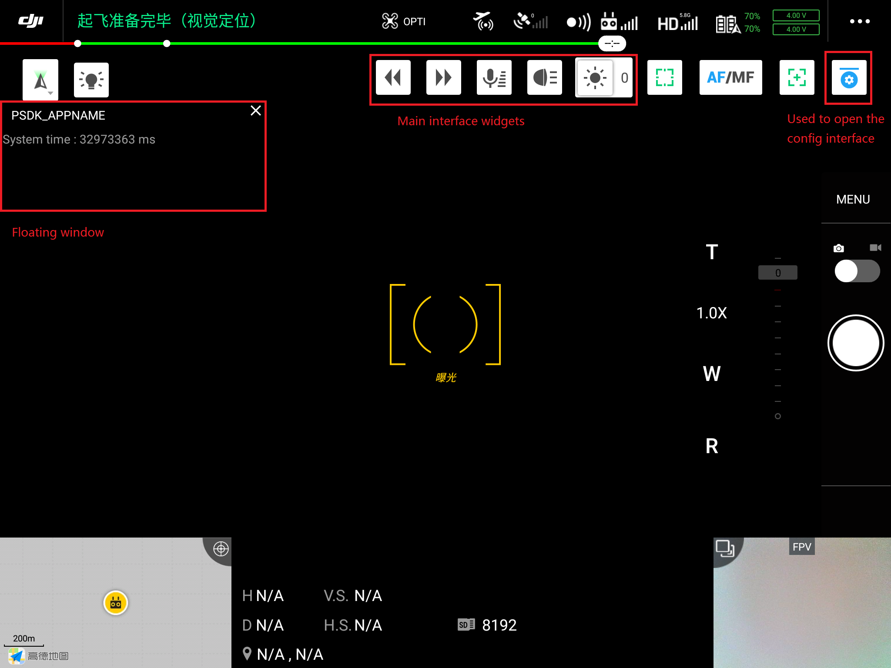
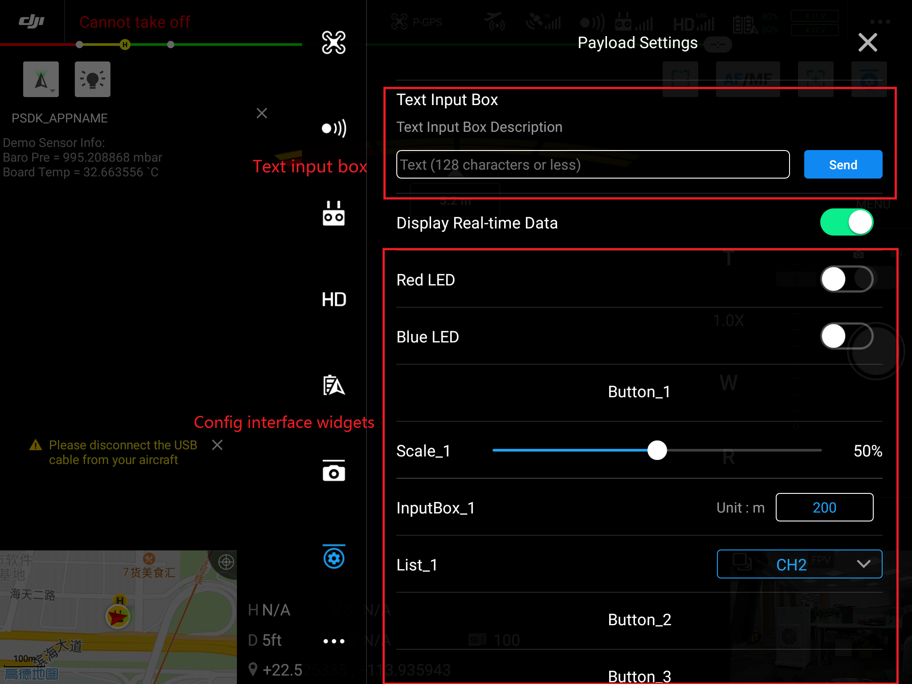
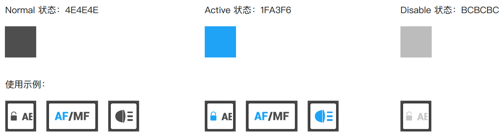
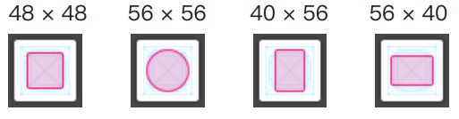
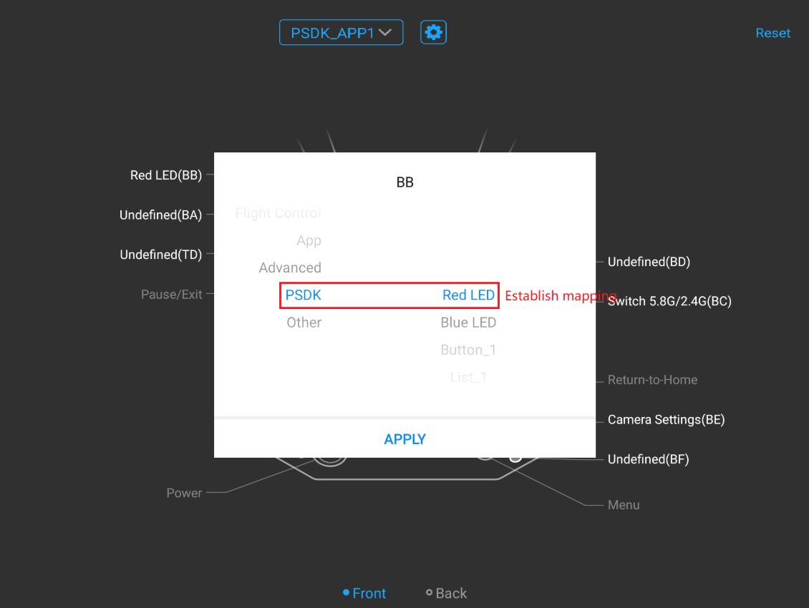
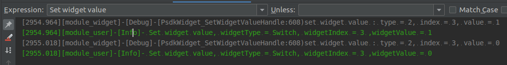

> **NOTE** This article is **Machine-Translated**. If you have any questions about this article, please send an <a href="mailto:dev@dji.com">E-mail </a>to DJI, we will correct it in time. DJI appreciates your support and attention.

## Overview
"Custom Widget" is a function that encapsulates the function of the payload into controls such as buttons, switches, and sliders; using DJI Pilot or a Mobile APP based on MSDK can identify the configuration information of the control in the payload and generate a UI Controls that allow users to set the parameters of the payload and control the payload to. At the same time, the DJI Pilot or Mobile APP based on MSDK can also display the status information of the payload in the form of floating windows; The user can also map the functions of the payload to the reserved buttons on the remote control according to the user needs, and use the reserved buttons on the remote control to control the payload more conveniently.

## Concepts
### Controls
It is convenience for the user to use the controls and widgets to control the payload which on the main interface and configuration interface.

#### Main Interface
* Controls: The bar supports four control types of buttons, switches, range bars, and selection lists, and supports setting up to 5 custom controls.
* Floating window: Display the status of the payload. 
<div>
<div style="text-align: center"><p>Figure 1 Main Interface </p>
</div>
<div style="text-align: center"><p><span>
      </span></p>
</div></div>

#### Configuration interface  
The user can operate the controls in the configuration interface, such as buttons, switches, range bars, selection lists, text input boxes, and value input boxes.
  
<div>
<div style="text-align: center"><p>Figure 2 Configuration Interface </p>
</div>
<div style="text-align: center"><p><span>
      </span></p>
</div></div>

> **NOTE** 
> * The configuration interface only supports display only one "text input boxes", whcih could receive almost 128 letters.
> * Use the `PsdkDataTransmission_RegReceiveDataFromMobileCallback (ReceiveDataFromMobile)` to obtain the information that the user sends to the payload in the DJI Pilot **text input boxes** (using UTF-8).
> * Restricted by the length of the log, the characters entered by the user could not be displayed completly.

### Configuration File
> **NOTE**
> * Configuration file path: `sample/api_sample/widget/widget_file`
> * When the DJI Pilot system language is Chinese, the control configuration file is `cn_big_screen`
> * When the DJI Pilot system language is English, the control configuration file is `en_big_screen`
> * The configuration information in different languages must be consistent, such as control number, quantity, and type.

> **NOTICE：** The configuration file contains <b> static configuration file </b> and <b> UI icon </b>. It is recommended to configure the control properties in <b> static configuration file </b> before to design the control icon.

#### Properties Configure 
`widget_config.json` is a file used to configure the static properties of the control. When modifying the` widget_config.json` file, please strictly follow the syntax rules of [JSON](https://www.json.org/), otherwise, the configure file is unusable.

> **TIPS**
> * The configuration items in the JSON file are wrapped in a {}, and the data is expressed by key-value;
> * The JSON Key must be wrapped in double-quotes. Please do not lose the double quotes of the Key value;
> * The value of JSON only support numbers (including floats and integers), strings, Bool (true and false), arrays (need to be wrapped in []) and objects (need to be wrapped in {}).

> **NOTE** The content after the "//" in the following code is a code comment. Do not add this content in the actual JSON configuration file.

```c
{
    "version":  { //the version of the control configuration file version, please don't change this version number
        "major" :  1,
        "minor" :  0
    },
    "main_interface": { // the main interface of DJI Pilot
        "floating_window": { 
            "is_enable": true // true or false 
        },
        "widget_list": [ // the widget list of the main interface
            {
                "widget_index": 0, // widget index
                "widget_type": "button", // widget type，the action on the main interface supports button、switch、range and list
                "widget_name": "Button_1", // widget name
                "icon_file_set":  {
                    "icon_file_name_selected" :  "icon_button1.png",
                    "icon_file_name_unselected" :  "icon_button1.png"
                }
            },
            {
                "widget_index": 1,
                "widget_type": "button",
                "widget_name": "Button_2",
                "icon_file_set":  {
                    "icon_file_name_selected" :  "icon_button2.png",
                    "icon_file_name_unselected" :  "icon_button2.png"
                }
            },
            {
                "widget_index": 2,
                "widget_type": "list",
                "widget_name": "List",
                "list_item": [
                    {
                        "item_name": "Item_1",
                        "icon_file_set":  {
                            "icon_file_name_selected" :  "icon_list_item1.png",
                            "icon_file_name_unselected" :  "icon_list_item1.png"
                        }
                    },
                    {
                        "item_name": "Item_2",
                        "icon_file_set":  {
                            "icon_file_name_selected" :  "icon_list_item2.png",
                            "icon_file_name_unselected" :  "icon_list_item2.png"
                        }
                    }
                ]
            },
            {
                "widget_index": 3,
                "widget_type": "switch",
                "widget_name": "Switch",
                "icon_file_set":  {
                    "icon_file_name_selected" :  "icon_switch_select.png",
                    "icon_file_name_unselected" :  "icon_switch_unselect.png"
                }
            },
            {
                "widget_index": 4,
                "widget_type": "scale",
                "widget_name": "Scale",
                "icon_file_set":  {
                    "icon_file_name_selected" :  "icon_scale.png",
                    "icon_file_name_unselected" :  "icon_scale.png"
                }
            }
        ]
    },
    "config_interface": {
        "text_input_box": { 
            "widget_name":"TextInputBox", 
            "placeholder_text":"Please input message",
            "is_enable":false // true or false 
        },
        "widget_list": [
            {
                "widget_index": 5,
                "widget_type": "button",
                "widget_name": "Button 5"
            },
            {
                "widget_index": 6,
                "widget_type": "scale",
                "widget_name": "Scale 6"
            },
            {
                "widget_index": 7,
                "widget_type": "int_input_box",
                "widget_name": "Integer Input Box 7",
                "int_input_box_hint": "unit:s"
            },
            {
                "widget_index": 8,
                "widget_type": "switch",
                "widget_name": "Switch 8"
            },
            {
                "widget_index": 9,
                "widget_type": "list",
                "widget_name": "List 9",
                "list_item": [
                    {
                        "item_name": "Item 1"
                    },
                    {
                        "item_name": "Item 2"
                    },
                    {
                        "item_name": "Item 3"
                    },
                    {
                        "item_name": "Item 4"
                    }
                ]
            }
        ]
    }
```


#### Icon design
To improve the compatibility of user-defined controls with DJI Pilot, please design the control icons according to the following specifications.
> **TIP** Use the [Sketch File](https://developer.dji.com/payload-sdk/downloads/) could design the control icon would more efficiency.
* icon size
    * normal size: 96px
    * frame: 80px (color value: # 000000; transparency: 0.6 Alapha; Blur = 4)
    * round: 4px
* colour
<div>
<div style="text-align: center"><p>Figure 3. The color of the widget
</p>
</div>
<div style="text-align: center"><p><span>
      </span></p>
</div></div>
   
* format：PNG
* correction：
<div>
<div style="text-align: center"><p>Figure 4. Visual correction </p>
</div>
<div style="text-align: center"><p><span>
      </span></p>
</div></div>
    

#### File Conversion
The RTOS system does not support the file system, please convert the configuration file as follows:

* use`file2c`which under the `tools/file2c`,to conversed all the profiles to the `.h` file, for details, please refer to the `Readme.txt`;
* The `.h` files are in the `sample/api_sample/widget/widget_file_c`;
* Call interface `PsdkWidget_SetDefaultUiConfigByBinaryArray` and `PsdkWidget_RegUiConfigByBinaryArray`could install the configuration files.

> Reference
> * Chiness:`file_binary_array_list_cn.h` and `file_binary_array_list_cn.c`
> * English:`file_binary_array_list_en.h` and `file_binary_array_list_en.c`

## Develop with the Custom Widget
Develop the custom widget for the payload, developer needs to initialize the custom widget module at first, and then obtain the configuration file, and set the control processing function list.

### 1. Initialization
Before using the "custom widget", developer needs to initialize the module of the custom widget with the following code.

```
psdkStat = PsdkWidget_Init();
  if (psdkStat != PSDK_RETURN_CODE_OK) {
      PsdkLogger_UserLogError("Psdk test widget init error, stat = %lld", psdkStat);
      return psdkStat;
  }
```
### 2. Config the configuration file
When developing payload on Linux and RTOS systems, developer needs to set control configuration information, such as the control's default configuration file and control configuration files corresponding to different system languages. Make sure the DJI Pilot can get the configuration information of the control and display it on the DJI Pilot correctly.

> **NOTE** The configuration items of the widgets which in the different system languages, such as control number, control number, and control type, need to be same.

#### Set parameters for payload(Linux)

```
char curFileDirPath[WIDGET_DIR_PATH_LEN_MAX];
char tempPath[WIDGET_DIR_PATH_LEN_MAX];
psdkStat = PsdkUserUtil_GetCurrentFileDirPath(__FILE__, WIDGET_DIR_PATH_LEN_MAX, curFileDirPath);
if (psdkStat != PSDK_RETURN_CODE_OK) {
    PsdkLogger_UserLogError("Get file current path error, stat = %lld", psdkStat);
    return psdkStat;
}

snprintf(tempPath, WIDGET_DIR_PATH_LEN_MAX, "%swidget_file/en_big_screen", curFileDirPath);

   // Set the default profile.  
psdkStat = PsdkWidget_RegDefaultUiConfigByDirPath(tempPath);
if (psdkStat != PSDK_RETURN_CODE_OK) {
    PsdkLogger_UserLogError("Add default widget ui config error, stat = %lld", psdkStat);
    return psdkStat;
}

   //Set the profile for English.
psdkStat = PsdkWidget_RegUiConfigByDirPath(PSDK_AIRCRAFT_INFO_MOBILE_APP_LANGUAGE_ENGLISH,
                                           PSDK_AIRCRAFT_INFO_MOBILE_APP_SCREEN_TYPE_BIG_SCREEN,
                                           tempPath);
if (psdkStat != PSDK_RETURN_CODE_OK) {
    PsdkLogger_UserLogError("Add widget ui config error, stat = %lld", psdkStat);
    return psdkStat;
}

   //Set the profile for Chinese.
 snprintf(tempPath, WIDGET_DIR_PATH_LEN_MAX, "%swidget_file/cn_big_screen", curFileDirPath);
psdkStat = PsdkWidget_RegUiConfigByDirPath(PSDK_AIRCRAFT_INFO_MOBILE_APP_LANGUAGE_CHINESE,
                                           PSDK_AIRCRAFT_INFO_MOBILE_APP_SCREEN_TYPE_BIG_SCREEN,
                                           tempPath);
if (psdkStat != PSDK_RETURN_CODE_OK) {
    PsdkLogger_UserLogError("Add widget ui config error, stat = %lld", psdkStat);
    return psdkStat;
}
```
#### Set parameters for payload(RTOS)
```
T_PsdkWidgetBinaryArrayConfig enWidgetBinaryArrayConfig = {
    .binaryArrayCount = g_EnBinaryArrayCount,
    .fileBinaryArrayList = g_EnFileBinaryArrayList
};

T_PsdkWidgetBinaryArrayConfig cnWidgetBinaryArrayConfig = {
    .binaryArrayCount = g_CnBinaryArrayCount,
    .fileBinaryArrayList = g_CnFileBinaryArrayList
};

//Set the default profile.  
psdkStat = PsdkWidget_RegDefaultUiConfigByBinaryArray(&enWidgetBinaryArrayConfig);
if (psdkStat != PSDK_RETURN_CODE_OK) {
    PsdkLogger_UserLogError("Add default widget ui config error, stat = %lld", psdkStat);
    return psdkStat;
}

//Set the default profile for English.  
psdkStat = PsdkWidget_RegUiConfigByBinaryArray(PSDK_AIRCRAFT_INFO_MOBILE_APP_LANGUAGE_ENGLISH,
                                               PSDK_AIRCRAFT_INFO_MOBILE_APP_SCREEN_TYPE_BIG_SCREEN,
                                               &enWidgetBinaryArrayConfig);
if (psdkStat != PSDK_RETURN_CODE_OK) {
    PsdkLogger_UserLogError("Add widget ui config error, stat = %lld", psdkStat);
    return psdkStat;
}

//Set the default profile for Chinese.
psdkStat = PsdkWidget_RegUiConfigByBinaryArray(PSDK_AIRCRAFT_INFO_MOBILE_APP_LANGUAGE_CHINESE,
                                               PSDK_AIRCRAFT_INFO_MOBILE_APP_SCREEN_TYPE_BIG_SCREEN,
                                               &cnWidgetBinaryArrayConfig);
if (psdkStat != PSDK_RETURN_CODE_OK) {
    PsdkLogger_UserLogError("Add widget ui config error, stat = %lld", psdkStat);
    return psdkStat;
}
```

### 3.Register the function list
Using `PsdkWidget_RegHandlerList` to register the function of the payload's custom widgets and the function. 

```
psdkStat = PsdkWidget_RegHandlerList(s_widgetHandlerList, s_widgetHandlerListCount);
if (psdkStat != PSDK_RETURN_CODE_OK) {
    PsdkLogger_UserLogError("Set widget handler list error, stat = %lld", psdkStat);
    return psdkStat;
}
```

##  Correspondence
After Correspondencing the function of the payload to the reserved button on the remote control Cendence GL900A, the user can control the payload by using the reserved button quickly. For details, please refer to Table 1. The effect of the Correspondence please refer to Figure 5.

<table id="t02">
Table 1 The relationship of the widget and reserved button.
  <tbody>
    <tr>
      <td>Type</td>
      <td>Button</td>
      <td>Action</td>
    </tr>
    <tr>
      <td>Button</td>
      <td rowspan="3">Buttons: C1-C4 / BA-BH </td>
      <td>· Press: Trigger the button control command.</br>· Release: Trigger the button control release command.</td>
    </tr>
    <tr>
      <td>Switch</td>
      <td>Alternate Triggering: Release after the key is pressed, trigger the "switch" control to open or close the command.</td>
    </tr>
    <tr>
     <td>Drop-down List</td>
      <td>click: Released after the key is pressed, trigger the command to select the next item.</td>
    </tr>
     <tr>
      <td>Slider</td>
      <td>Left and right levers: LS / RS </td>
      <td>Toggle: Toggle the lever to trigger the slider control, which can modify the slider value.</td>
    </tr>
       <tr>
    <td>Input box</td>
      <td>knob：TD</td>
      <td>Knob: Turn the focus knob to trigger the input box control, which can modify the value of the input box.</td>
</tr>
  </tbody>
</table>

<div>
<div style="text-align: center"><p> Figure 5  Correspondence </p>
</div>
<div style="text-align: center"><p><span>
      </span></p>
</div></div>

> **TIP** DJI Pilot supports creating multiple correspondence tables to adapt to different payloads.

## Waypoint 
DJI's drone supports users to add the widget control to the waypoint when using the payload, it makes the drone control the widget automatically in the specified point.
The waypoint allows developers to add the following widget:
* Button
* Switch
* Slider

The steps to add widgets in waypoint is as follows:
1. Enter the DJI Pilot flight interface
2. Add waypoints on the map
3. Add widget in the waypoint
4. Save waypoint task
5. Perform the waypoint flight task      
When the drone flight to the specific point, the widget will trigger the widget automatically, as shown in Figure 6.

<div>
<div style = "text-align: center"> <p> Figure 6. Trigger a custom control </p>
</div>
<div style = "text-align: center"> <p> <span>
      </span> </p>
</div> </div>

> **NOTE** 
> * DJI Pilot supports creating multiple waypoint tasks for different payload and in different gimbal.
> * Only Matrice 300 RTK supports this feature. 


> Reference
> * [Mobile SDK](https://developer.dji.com/mobile-sdk/documentation/introduction/index.html)
> * [Data Transmission](../basicfunction/data-transmission.html)
