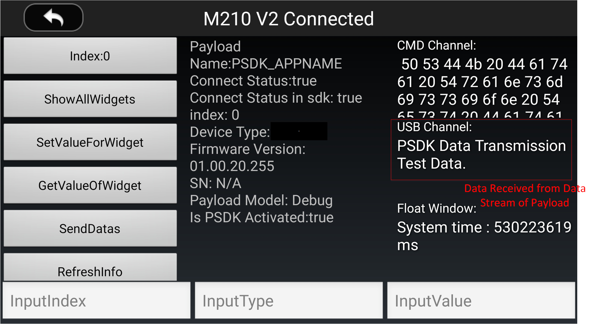
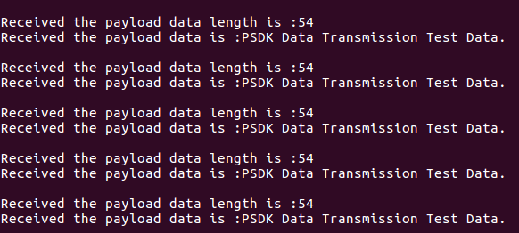

> **NOTE**
> * This article is **Machine-Translated**. If you have any questions about this article, please send an <a href="mailto:dev@dji.com">E-mail </a>to DJI, we will correct it in time. DJI appreciates your support and attention.
> * The Mobile APP is DJI Pilot or a Mobile APP developed by MSDK.
> * The Payload is a device developed by PSDK.
> * The onboard computer is a computing device, such as Manifold, running a drone control program based on OSDK.

## Overview
The Payload and the drone use the data transmission module to transmit control instructions between PSDK, MSDK, and OSDK. On the command transmission channel to transfer the control command; on the high-speed data transmission channel to transfer the data information and user-defined data. Using the data transmission function, you can set the proportion of different types of data occupying the bandwidth of the high-speed data transmission channel, also could view the status of different data transmission channels.

>**NOTE** The data transmission support users design the protocol.

## Concepts
### Types of channel
PSDK's data transmission channels can be divided into command transmission channel and high-speed data transmission channel, as shown in Figure 1.
* Command transmission channel: Strong reliability, dedicated to transmitting signals with high-reliability requirements, such as control instructions and status information.
* High-speed data transmission channel: Large bandwidth, mainly used to transmit data with a large amount of data and high real-time requirements, such as radar signals and point cloud data.

<div>
<div style="text-align: center"><p>Figure 1 Command transmission channel   </p>
</div>
<div style="text-align: center"><p><span>
      </span></p>
</div></div>

### Channel bandwidth
* Channel bandwidth: The amount of data that a data channel can transmit in a theoretical state.
* Real-time bandwidth: The theoretical amount of data that a data channel can transmit under operating conditions
* Actual bandwidth: The amount of data actually transmitted by the data channel.

#### Channel bandwidth limitation
The bandwidth limitation of the data transmission channel refers to the maximum amount of data (byte/s) that can be transmitted by the channel in a unit time .
The physical characteristics of the interface components and the actual use environment, the bandwidth of the command transmission channel and high-speed data transmission channel can be divided into **Static Bandwidth Limitation** and **Dynamic Bandwidth Limitation**.

#### Static bandwidth limit  
The static bandwidth limitation refers to the fixed bandwidth of the command transmission channel, which cannot be changed because of the physical characteristics and inherent electrical characteristics of the material. For details please see Table 1.

Table 1 Static bandwidth limit  
<table id=1>
  <thead>
    <tr>
      <th>Type</th>
      <th>Direction</th>
      <th>M200 V2</th>
      <th>M210 V2</th>
      <th>M210 RTK V2</th>
    </tr>
  </thead>
  <tbody>
    <tr>
      <td rowspan="4">Command signal transmission channel	</td>
      <td>Mobile APP ➟ Payload</td>
      <td colspan="3" rowspan="4" style="text-align:center" >4KB/s</td>
    </tr>
    <tr>
      <td>Payload ➟ Mobile APP</td>
    </tr>
    <tr>
      <td>Onboard Computer ➟ Payload</td>
    </tr>
    <tr>
      <td>Payload ➟ Onboard Computer</td>
    </tr>
    <tr>
      <td>High-speed data transmission channel	</td>
      <td>Payload ➟ Mobile APP</td>
      <td>8Mbps</td>
      <td colspan=2 style="text-align:center">4Mbps</td>
    </tr>
  </tbody>
</table>

#### Dynamic bandwidth limit  
The dynamic bandwidth limit is the **high-speed data transmission channel**, due to the electromagnetic environment and link status, the maximum amount of the channel data that could change dynamically, therefore, the actual bandwidth of high-speed data transmission channel is lower than real-time bandwidth.

##### Set the usage proportion of bandwidth 
PSDK supports users to set **high-speed data transmission channels** bandwidth usage proportion for different data types to achieve precise control of bandwidth occupation of high-speed data transmission channels.
The **actual bandwidth** of a type of data = the dynamic bandwidth of high-speed data transmission channels ✕ bandwidth allocation proportion.

>**NOTE:** The dynamic bandwidth limit of the command transmission channel is equal to the static bandwidth limit.

### Traffic control
Figure 2 shows that the method that the "traffic control" uses the thresholds and buffers to control the traffic of payload when transferring the data to Mobile APP or Onboard computer.

The workflow of the PSDK's traffic control:
1. The payload transmits data information to the on-board computer or Mobile APP through the data channel;
2. When the data sent by the payload is greater than the threshold of the flow control function, the flow control function temporarily stores data exceeding the flow threshold into the buffer;
3. When the buffer is full of data, the data sent by the payload that exceeds the traffic threshold will be discarded;
4. When the data channel is idle, the flow control module will send the data temporarily stored in the buffer.

>**NOTE:** The period of traffic control is 1s. In each control period, the amount of data transmitted by the payload should be less than the **flow threshold** that set by the user.  

<div>
<div style="text-align: center"><p>Figure 2 Traffic control  </p>
</div>
<div style="text-align: center"><p><span>
      </span></p>
</div></div>

### Channel status

The status of the payload is as follows:
* The actual bandwidth of the information data transmission channel **before** the user uses the flow control function;
* The actual bandwidth of the information data transmission channel **after** the user uses the flow control function;
* Channel busy status: When the data of the corresponding channel is *stored* in the buffer or *discarded*, the channel status of the data transmission module is "busy".

## Develop with the Data Transmission  
Developed the data transmission, the developer needs to create the project file and complete the PSDK initialization at first, then initialize the data transmission module, set the proportion of different types of data occupying the high-speed data transmission channel; then implement the data transmission function and monitor the status of the data channel.

### 1. Initialization
Before using the "Data Transmission" function, the developer needs to initialize the data transmission function module with the following code to ensure that the payload could transmit the data normally.

```c
psdkStat = PsdkDataTransmission_Init();
if (psdkStat != PSDK_RETURN_CODE_OK) {
    PsdkLogger_UserLogError("init data transmission module error.");
    return PSDK_RETURN_CODE_ERR_UNKNOWN;
}
```

### 2. Set the bandwidth occupation proportion
After setting the proportion of different types of data occupying the bandwidth of the high-speed data transmission channel by Mobile APP or onboard computer, call `PsdkDataChannel_SetBandwidthProportionForHighspeedChannel` could set the proportion of bandwidth of the high-speed data transmission channel.

```
psdkStat = PsdkDataChannel_SetBandwidthProportionForHighspeedChannel(bandwidthProportion);
if (psdkStat != PSDK_RETURN_CODE_OK) {
    PsdkLogger_UserLogError("set bandwidth proportion for high-speed channel error.");
    return PSDK_RETURN_CODE_ERR_UNKNOWN;
}
```

>**NOTE** 
> * Only Linux support the function, which is "Set the bandwidth occupation proportion";
> * The default channel bandwidth of the high-speed data transmission is 33%, 33%, and 34% for video streams、data streams and download streams.

### 3. Developed the data sending function
The Payload developed by PSDK sends test data to Mobile APP or onboard computer based on the command transmission channel and high-speed data transmission channel.

* Send the command to the Mobile APP.      
Figure 3 shows the Mobile APP received the command, which sent by the payload on the command channel.

```c
psdkStat = PsdkDataTransmission_SendDataToMobile(dataToBeSent, sizeof(dataToBeSent));
if (psdkStat != PSDK_RETURN_CODE_OK)
    PsdkLogger_UserLogError("send data to mobile error.");
```
<div>
<div style="text-align: center"><p>Figure 3 Mobile APP received the command </p>
</div>
<div style="text-align: center"><p><span>
      </span></p>
</div></div>
     
* Send the data to the Mobile APP.     
Figure 4 shows the Mobile APP received the data, which sent by the payload on the high-speed data transmission channel.    

```c
psdkStat = PsdkDataTransmission_SendDataStream(dataToBeSent, sizeof(dataToBeSent));
if (psdkStat != PSDK_RETURN_CODE_OK)
    PsdkLogger_UserLogError("send data to data stream error.");
```

<div>
<div style="text-align: center"><p>Figure 4 Mobile APP received the data </p>
</div>
<div style="text-align: center"><p><span>
      </span></p>
</div></div>

* Send the command to the onboard computer.      
Figure 4 shows the onboard received the command, which sent by the payload on the command channel.    

```c
psdkStat = PsdkDataTransmission_SendDataToOsdk(dataToBeSent, sizeof(dataToBeSent));
if (psdkStat != PSDK_RETURN_CODE_OK)
    PsdkLogger_UserLogError("send data to onboard computer error.");
```

<div>
<div style="text-align: center"><p>Figure 5 Onboard computer received the command </p>
</div>
<div style="text-align: center"><p><span>
      </span></p>
</div></div>

### 4. Developed the data receive function
After registered the data receive function, the payload can receive the commands, which sent by the Mobile APP or the onboard computer on the command transmission channel.

##### 1. Create the callback function
Create the callback function to receive the command from the Mobile APP or onboard computer.

```c
static T_PsdkReturnCode ReceiveDataFromMobile(const uint8_t *data, uint16_t len)
{
    static char printData[PSDK_DATA_TRANSMISSION_DATA_RECEIVE_FROM_MOBILE_MAX_LEN + 1];

    USER_UTIL_UNUSED(len);

    strncpy(printData, (const char *) data, len);
    printData[len] = '\0';
    PsdkLogger_UserLogDebug("receive data from mobile: %s.", printData);

    return PSDK_RETURN_CODE_OK;
}

static T_PsdkReturnCode ReceiveDataFromOnboardComputer(const uint8_t *data, uint16_t len)
{
    static char printData[PSDK_DATA_TRANSMISSION_DATA_RECEIVE_FROM_ONBOARD_COMPUTER_MAX_LEN + 1];
    USER_UTIL_UNUSED(len);
    strncpy(printData, (const char *) data, len);
    printData[len] = '\0';
    PsdkLogger_UserLogDebug("receive data from onboard computer: %s.", printData);
    return PSDK_RETURN_CODE_OK;
}
```

##### 2. Register the callback function
Figure 6 shows that after register the callback function, the payload could receive the command from Mobile APP or onboard computer.

```c
psdkStat = PsdkDataTransmission_RegReceiveDataFromMobileCallback(ReceiveDataFromMobile);
if (psdkStat != PSDK_RETURN_CODE_OK) {
    PsdkLogger_UserLogError("register receive data from mobile error.");
    return PSDK_RETURN_CODE_ERR_UNKNOWN;
}

psdkStat = PsdkDataTransmission_RegReceiveDataFromOsdkCallback(ReceiveDataFromOnboardComputer);
if (psdkStat != PSDK_RETURN_CODE_OK) {
    PsdkLogger_UserLogError("register receive data from onboard coputer error.");
    return PSDK_RETURN_CODE_ERR_UNKNOWN;
}
```

<div>
<div style="text-align: center"><p>Figure 6 Payload received the command </p>
</div>
<div style="text-align: center"><p><span>
      </span></p>
</div></div>

### 5. Monitor the status of the data transmission channel
Get the status of the data channel in the data transfer thread and print it to the terminal.

* Get status information of command transmission channel

```
psdkStat = PsdkDataTransmission_GetSendToMobileState(&state);
if (psdkStat == PSDK_RETURN_CODE_OK) {
    PsdkLogger_UserLogDebug(
        "send to mobile state: realtimeBandwidthBeforeFlowController: %d, realtimeBandwidthAfterFlowController: %d, busyState: %d.",
        state.realtimeBandwidthBeforeFlowController, state.realtimeBandwidthAfterFlowController,
        state.busyState);
} else {
    PsdkLogger_UserLogError("get send to mobile channel state error.");
}

psdkStat = PsdkDataTransmission_GetSendToOsdkState(&state);
if (psdkStat == PSDK_RETURN_CODE_OK) {
    PsdkLogger_UserLogDebug(
        "send to onboard computer state: realtimeBandwidthBeforeFlowController: %d, realtimeBandwidthAfterFlowController: %d, busyState: %d.",
        state.realtimeBandwidthBeforeFlowController, state.realtimeBandwidthAfterFlowController,
        state.busyState);
} else {
    PsdkLogger_UserLogError("get send to onboard computer channel state error.");
}
```

* Get status information of high-speed data transmission channels

>**NOTE:** The Payload only developed based on Linux can obtain the status information of high-speed data transmission channels.

```c
psdkStat = PsdkDataTransmission_GetDataStreamState(&state);
if (psdkStat == PSDK_RETURN_CODE_OK) {
    PsdkLogger_UserLogDebug(
        "data stream state: realtimeBandwidthLimit: %d, realtimeBandwidthBeforeFlowController: %d, busyState: %d.",
        state.realtimeBandwidthLimit, state.realtimeBandwidthBeforeFlowController, state.busyState);
} else {
    PsdkLogger_UserLogError("get data stream state error.");
}
```

Figure 7 shows the state of the high-speed data transmission channel.

> **NOTE:** The period of real-time bandwidth statistics is 1s.

<div>
<div style="text-align: center"><p>Figure 7 Data transmission </p>
</div>
<div style="text-align: center"><p><span>
      
      </span></p>
</div></div>
